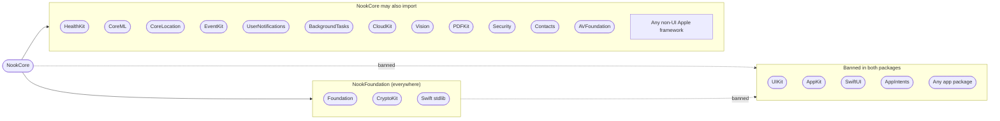
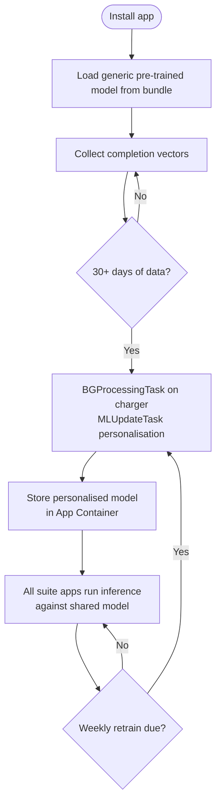

# Nook Suite — Architecture

**Maintained by the Open Nook Foundation** (nonprofit; revenue funds developers and server costs).

This document defines the monorepo structure, package boundaries, shared infrastructure, and cross-app integration model for the Nook suite. It is the **single canonical reference** for suite architecture: where any other document (including `habitkit-design-doc.md`) conflicts with this one, this document wins. Suite-architecture content must not be duplicated elsewhere — other docs link here. See `DECISIONS.md` for the decision record behind this document.

The HabitNook design doc (`habitnook-design-doc.md`) covers HabitNook-specific features. This document covers the infrastructure that all suite apps share.

---

## Table of Contents

1. [Monorepo Structure](#1-monorepo-structure)
2. [NookCore Package](#2-nookcore-package)
3. [App Package Boundaries](#3-app-package-boundaries)
4. [Shared App Group](#4-shared-app-group)
5. [HealthKit Integration Model](#5-healthkit-integration-model)
6. [NookInsights — Cross-App CoreML](#6-nookinsights--cross-app-coreml)
7. [Context Provider System](#7-context-provider-system)
8. [Design System](#8-design-system)
9. [CI and Tooling](#9-ci-and-tooling)
10. [Build Configuration](#10-build-configuration)

---

## 1. Monorepo Structure

The entire Nook suite lives in a single repository. All apps, all shared packages, all tooling.

```
nook/
├── Apps/
│   ├── HabitNook/
│   │   ├── HabitNook.xcodeproj
│   │   ├── Sources/
│   │   │   ├── App/                    # @main entry point, root environment setup
│   │   │   ├── Today/                  # Today tab views and view models
│   │   │   ├── Analytics/              # Analytics tab
│   │   │   ├── Settings/               # Settings tab
│   │   │   └── Widgets/                # WidgetKit extension target
│   │   ├── Tests/
│   │   └── HabitNook.entitlements
│   ├── NutriNook/
│   ├── SleepNook/
│   ├── SymptomNook/
│   ├── SyncNook/
│   ├── BodyNook/
│   ├── MedNook/
│   ├── CycleNook/
│   ├── AcademicNook/
│   ├── RecoveryNook/
│   ├── HomeNook/
│   ├── MindNook/
│   ├── VisionNook/
│   ├── SoundNook/
│   ├── PainNook/
│   ├── LegalNook/
│   ├── CareNook/
│   ├── PregnancyNook/
│   ├── ContactNook/
│   ├── FinanceNook/                    # Incubating — see §1.1
│   ├── ApptNook/                       # Incubating — see §1.1
│   ├── ProjectNook/                    # Incubating — see §1.1
│   ├── MailNook/                       # Incubating — see §1.1
│   └── WatchNook/                      # Incubating — see §1.1
├── Packages/
│   ├── NookCore/                       # Shared infrastructure — all apps depend on this
│   │   ├── Package.swift
│   │   └── Sources/
│   │       ├── NookCore/
│   │       │   ├── DesignSystem/       # NookFont, NookAnimation, NookSpacing, NookColour (no SwiftUI)
│   │       │   ├── HealthKit/          # Shared HealthKit layer, ContextProvider protocol
│   │       │   ├── AppGroup/           # Typed App Group reads/writes
│   │       │   ├── Scheduling/         # ScheduleFrequency, HabitPeriod, Weekday
│   │       │   ├── ML/                 # NookCompletionFeatureVector, FeatureVectorImputer
│   │       │   │   └── NookInsights/   # Cross-app CoreML model management
│   │       │   ├── Milestones/         # MilestoneDetector, shared MilestoneType
│   │       │   ├── Backfill/           # HistoricalContextBackfiller
│   │       │   └── ImportSupport/      # ImportSource enum, shared import types
│   │       └── NookCoreTests/
│   ├── HabitNookCore/                  # HabitNook-specific business logic
│   │   ├── Package.swift
│   │   └── Sources/
│   │       ├── HabitNookCore/
│   │       │   ├── Models/             # SwiftData models (Habit, HabitCompletion, etc.)
│   │       │   ├── Repositories/       # HabitRepository protocol + SwiftData impl
│   │       │   ├── Services/           # HealthKit sync, CloudKit, notification scheduling
│   │       │   └── Importers/          # Not Boring, Habitify, Productive, Streaks importers
│   │       └── HabitNookCoreTests/
│   ├── HabitNookUI/                    # HabitNook SwiftUI component library
│   │   ├── Package.swift
│   │   └── Sources/
│   │       └── HabitNookUI/
│   │           ├── Components/         # Shared UI components
│   │           ├── Haptics/            # NookHaptics constants
│   │           └── Previews/           # Preview fixtures
│   ├── NookUI/                         # Shared SwiftUI component library
│   │   ├── Package.swift               # imports: SwiftUI, NookCore only
│   │   └── Sources/NookUI/             # NookButton, NookCard, NookToast, etc.
│   ├── NookIntents/                    # Shared AppIntents infrastructure
│   │   ├── Package.swift               # imports: AppIntents, NookCore
│   │   └── Sources/NookIntents/        # NookIntentBase, shared intent protocols
│   ├── NookFoundation/                 # Pure Swift — cross-platform core
│   │   ├── Package.swift               # NO Apple-specific framework imports
│   │   └── Sources/NookFoundation/     # Becomes NookCore.wasm
│   └── HabitNookIntents/               # AppIntents for HabitNook
│       ├── Package.swift
│       └── Sources/
│           └── HabitNookIntents/
│               ├── GetHabitsIntent.swift
│               ├── LogHabitIntent.swift
│               ├── GetDailyHabitSummaryIntent.swift
│               └── InspectArchiveIntent.swift
├── Scripts/
│   ├── contrast-audit.js               # WCAG contrast validation — CI enforced
│   └── verify-appgroup-schema.swift    # App Group key schema validation
├── docs/
│   ├── formats/
│   │   ├── habit.md                    # .habit JSON5 format spec
│   │   ├── archive.md                  # .habitarchive format spec
│   │   ├── theme.md                    # Community theme JSON schema
│   │   └── import/
│   │       ├── not-boring.md
│   │       ├── habitify.md
│   │       ├── productive.md
│   │       └── streaks.md
│   └── community/
│       ├── fork-listing.md             # Community fork registry
│       └── issue-templates/
├── .github/
│   └── workflows/
│       ├── ci.yml                      # Main CI — swift-format, tests, contrast audit
│       ├── contrast-audit.yml
│       └── schema-validation.yml
├── ARCHITECTURE.md                     # This document
├── STYLE_GUIDE.md
├── CONTRIBUTING.md
└── README.md
```

### Why a monorepo

**Shared infrastructure stays in sync.** When `NookCore` changes — a new `ContextProvider`, an updated `ScheduleFrequency`, a new `HabitPeriod` case — all apps pick up the change in the same PR. Cross-repo dependency management for 18 apps sharing infrastructure is not viable for a small team.

**Cross-app testing is possible.** Integration tests that verify the App Group schema contract between HabitNook and NutriNook can live in a single test target that imports both packages. This is impossible across separate repos.

**CI is unified.** One CI configuration enforces style, contrast, schema validation, and test coverage for the entire suite. Individual app repos would each need their own CI maintenance.

**The design doc stays adjacent to the code.** `habitnook-design-doc.md`, `ARCHITECTURE.md`, `STYLE_GUIDE.md`, and all format specs live in the same repo as the code they describe. Design decisions and implementation stay in sync.

**Community contributions are scoped correctly.** A contributor adding a Habitify importer submits one PR to one repo. A contributor building the NutriNook importer can reference HabitNook's importers in the same repo as examples.

---

### 1.1 Canonical App Roster **[AUTHORITATIVE]**

This table is the single source of truth for the suite roster. 24 apps. Any planned-apps table elsewhere is superseded.

Status — **Active**: shipping or in build phase. **Planned**: design doc exists or phase assigned. **Incubating**: architecture notes exist (habitkit-design-doc.md or §21–§22 here) but no design doc and no phase; requires further development before entering the phase plan.

OS support tier — **Rolling**: current iOS minus one (default). **Elderly-3**: three iOS generations (apps targeting elderly users). **Org-5**: up to five iOS generations (apps sold to institutions).

| # | App | Phase | Status | OS support tier |
|---|---|---|---|---|
| 1 | HabitNook | 1 | Active | Rolling |
| 2 | NutriNook | 2 | Planned | Rolling |
| 3 | SleepNook | 3 | Planned | Rolling |
| 4 | SymptomNook | 4 | Planned | Rolling |
| 5 | SyncNook | 5 | Planned | Rolling |
| 6 | BodyNook | 6 | Planned | Rolling |
| 7 | MedNook (absorbs HygieneNook) | 7 | Planned | Elderly-3 |
| 8 | CycleNook | 8 | Planned | Rolling |
| 9 | AcademicNook | 9 | Planned | Org-5 |
| 10 | RecoveryNook | 10 | Planned | Elderly-3 |
| 11 | HomeNook | 11 | Planned | Rolling |
| 12 | MindNook | 12 | Planned | Rolling |
| 13 | VisionNook | 14 | Planned | Rolling |
| 14 | PainNook | 15 | Planned | Rolling |
| 15 | SoundNook | 16 | Planned | Rolling |
| 16 | LegalNook | 17 | Planned | Rolling |
| 17 | CareNook | 18 | Planned | Org-5 |
| 18 | PregnancyNook | 19 | Planned | Rolling |
| 19 | ContactNook | 20 | Planned | Rolling |
| 20 | FinanceNook | — | Incubating | Rolling |
| 21 | ApptNook | — | Incubating | Elderly-3 |
| 22 | ProjectNook | — | Incubating | Rolling |
| 23 | MailNook | — | Incubating | Rolling |
| 24 | WatchNook | — | Incubating | Rolling |

Android is out of scope for v1–v2 (see §15.5). Mac Catalyst is rejected; macOS presence is SwiftUI multiplatform for non-health apps and MenuBarExtra for health apps (see §15 and habitkit-design-doc.md §20.19).

---

## 2. NookCore Package

`NookCore` is the shared foundation. Every app in the suite depends on it. Nothing in `NookCore` depends on any individual app package.

### 2.1 Package split and import rules **[ENFORCED]**

The suite requires two distinct packages with different platform targets:

```
NookFoundation   Pure Swift — compiles everywhere
                 iOS, macOS, watchOS, Linux, Windows, Android, WebAssembly
                 This is what becomes NookCore.wasm
                 This is what the Linux research server imports
                 Contains: types, crypto, validation, feature math,
                           scheduling primitives, signal processing,
                           NookStandard schemas, token primitives

NookCore         Apple platforms only — depends on NookFoundation
                 iOS, iPadOS, watchOS, macOS only
                 Never compiles to Wasm, Linux, Windows, or Android
                 Contains: all Apple-framework wrappers
```



**UIKit workaround — NookDeviceStateProvider:**

`UIDevice.current.batteryLevel` is UIKit. Battery and device state
are accessed via an injected protocol:

```swift
// NookFoundation — protocol, no UIKit
public protocol NookDeviceStateProvider: Sendable {
    var batteryLevel: Float { get async }
    var isCharging: Bool { get async }
}

// NookCore (iOS) — injected at app startup via environment
import UIKit
public struct UIKitDeviceStateProvider: NookDeviceStateProvider {
    public var batteryLevel: Float {
        get async {
            await MainActor.run {
                UIDevice.current.isBatteryMonitoringEnabled = true
                return UIDevice.current.batteryLevel
            }
        }
    }
    public var isCharging: Bool {
        get async {
            await MainActor.run {
                let s = UIDevice.current.batteryState
                return s == .charging || s == .full
            }
        }
    }
}

// NookFoundation (Linux/Wasm) — stub
public struct StubDeviceStateProvider: NookDeviceStateProvider {
    public var batteryLevel: Float { get async { 1.0 } }
    public var isCharging: Bool { get async { true } }
}
```

**NookIntentBase relocation:**

`NookIntentBase` is NOT in NookCore. It lives in `NookIntents`:

```
NookIntents   imports: AppIntents, NookCore
              contains: NookIntentBase, shared intent protocols
              imported by: [App]Intents only
```

NookCore has no UI and no AppIntents dependency. It is infrastructure only.

### 2.2 Design System

**Single-responsibility constraint [ENFORCED]:** `NookCore` must not import `SwiftUI`,
`UIKit`, or any platform UI framework. `Font`, `Animation`, `Color`, and
`UIAccessibility` are all SwiftUI/UIKit types that do not compile in headless test
environments or command-line scripts. Design tokens in `NookCore` are raw
platform-agnostic primitives. Each `[App]UI` package interprets them as SwiftUI types
via extensions.

#### NookCore — raw primitives (no SwiftUI import)

```swift
// NookCore/DesignSystem/NookTokens.swift
// NO import SwiftUI anywhere in this file or package

// Typography tokens
public enum NookFont: String, CaseIterable, Sendable {
    case largeTitle, title, body, caption, footnote

    public var pointSize: CGFloat {
        switch self {
        case .largeTitle: return 34; case .title: return 22
        case .body:       return 17; case .caption: return 12
        case .footnote:   return 11
        }
    }
    public var weightName: String {  // "bold" | "semibold" | "regular"
        switch self {
        case .largeTitle, .title: return "bold"
        default: return "regular"
        }
    }
    public var designName: String {  // "rounded" | "monospaced" | "default"
        switch self {
        case .largeTitle, .title: return "rounded"
        default: return "default"
        }
    }
}

// Animation tokens -- reduceMotion check in [App]UI, NOT here
public enum NookAnimation: String, CaseIterable, Sendable {
    case standard, fast, instant

    public var durationSeconds: Double {
        switch self {
        case .standard: return 0.4; case .fast: return 0.25; case .instant: return 0.0
        }
    }
    public var isSpring: Bool { self != .instant }
    public var dampingFraction: Double {
        switch self {
        case .standard: return 0.8; case .fast: return 0.7; case .instant: return 1.0
        }
    }
}

// Spacing -- CGFloat is Foundation, not SwiftUI -- acceptable in NookCore
public enum NookSpacing: CGFloat, CaseIterable, Sendable {
    case xs = 4, sm = 8, md = 16, lg = 24, xl = 32, xxl = 48
}

// Corner radii
public enum NookRadius: CGFloat, CaseIterable, Sendable {
    case sm = 8, card = 14, lg = 20, pill = 999
}

// SF Symbol names -- plain String, no SwiftUI dependency
public enum HKSymbol: String, Sendable {
    case checkmark      = "checkmark.circle.fill"
    case checkmarkEmpty = "circle"
    case streakFire     = "flame.fill"
    case streakFrozen   = "snowflake"
    case skip           = "forward.fill"
    case settings       = "gearshape.fill"
    case analytics      = "chart.xyaxis.line"
    case habits         = "list.bullet.circle.fill"
    case nfc            = "wave.3.right.circle.fill"
    case calendar       = "calendar"
    case health         = "heart.fill"
    // full list in NookCore/DesignSystem/HKSymbol.swift
}

// Theme colour -- raw hex strings, no SwiftUI Color
public struct NookColour: Sendable {
    public let hex: String
    public let isTextSafe: Bool  // WCAG AA flag
    public let name: String
}

public struct NookColourPalette: Sendable {
    public let base, mantle, crust: NookColour
    public let surface0, surface1, surface2: NookColour
    public let text, subtext: NookColour
    public let primary, success, warning, danger: NookColour
}

public struct HKTheme: Sendable {
    public let name: String
    public let colors: NookColourPalette
}

public enum NookTheme {
    public static let latte     = HKTheme(name: "Latte",     colors: .latte)
    public static let frappe    = HKTheme(name: "Frappé",    colors: .frappe)
    public static let macchiato = HKTheme(name: "Macchiato", colors: .macchiato)
    public static let mocha     = HKTheme(name: "Mocha",     colors: .mocha)
}
```

#### [App]UI — SwiftUI interpretation (SwiftUI import permitted here only)

```swift
// HabitNookUI/DesignSystem/SwiftUITokens.swift
import SwiftUI
import NookCore  // primitive tokens only -- no SwiftUI bleeding back

public extension NookFont {
    var swiftUIFont: Font {
        let design: Font.Design = designName == "rounded"    ? .rounded
                                : designName == "monospaced" ? .monospaced : .default
        let weight: Font.Weight = weightName == "bold" ? .bold
                                : weightName == "semibold" ? .semibold : .regular
        return .system(size: pointSize, weight: weight, design: design)
    }
}

public extension NookAnimation {
    // reduceMotion check lives here -- UIAccessibility is UIKit, not NookCore
    var swiftUIAnimation: Animation {
        let reduced = UIAccessibility.isReduceMotionEnabled
        if reduced { return .linear(duration: min(durationSeconds, 0.15)) }
        guard isSpring else { return .linear(duration: durationSeconds) }
        return .spring(response: durationSeconds, dampingFraction: dampingFraction)
    }
}

public extension NookColour {
    var swiftUIColor: Color { Color(hex: hex) }
}
```

**Migration note:** All legacy `HK`-prefixed token names (HKFont, HKFontToken,
HKSpacing, HKSpacingToken, HKAnimation, HKAnimationToken, HKRadius, HKRadiusToken,
HKColourToken, HKColourPalette) must be updated to `NookFont`, `NookSpacing`,
`NookAnimation`, `NookRadius`, `NookColour`, `NookColourPalette` respectively — the
`HK` prefix predates the suite (HabitNook-era naming) and collides with HealthKit. `.swiftUIFont`,
`.swiftUIAnimation` are called at the
`[App]UI` layer. CI will enforce no SwiftUI imports in `NookCore` via a package
dependency graph check.

### 2.3 Scheduling types

Shared across all apps — HabitNook uses them for habit scheduling, SleepNook for sleep schedule configuration, RecoveryNook for PT session scheduling:

```swift
public struct ScheduleFrequency: Codable, Sendable {
    public var unit: FrequencyUnit
    public var interval: Int
    public var daysOfWeek: [Weekday]?
    public var daysOfMonth: [Int]?
    // Static presets, EKRecurrenceRule conversion -- see design doc §7.2
}

public enum FrequencyUnit: String, Codable, Sendable {
    case day, week, month
}

public enum HabitPeriod: String, Codable, Sendable {
    case day, week, month
}

public enum Weekday: String, Codable, CaseIterable, Sendable {
    case monday, tuesday, wednesday, thursday, friday, saturday, sunday
}
```

### 2.4 Import provenance

```swift
public enum ImportSource: String, Codable, Sendable {
    case notBoringHabits
    case habitify
    case productive
    case streaks
    case habitArchive
    // Future apps add their own cases
}
```

---

## 3. App Package Boundaries

Each app produces three Swift packages following the same pattern as HabitNook:

```
[AppName]Core    — business logic, SwiftData models, repositories, services
[AppName]UI      — SwiftUI component library for this app
[AppName]Intents — AppIntents, Focus Filters, Shortcuts integration
```

**Import rules per layer:**

| Package | May import | May NOT import |
|---|---|---|
| `[App]Core` | `NookCore`, Foundation, HealthKit, CloudKit | SwiftUI, `[App]UI`, `[App]Intents` |
| `[App]UI` | SwiftUI, `NookCore`, `[App]Core` | `[App]Intents`, HealthKit directly |
| `[App]Intents` | AppIntents, `NookIntents`, `[App]Core` | SwiftUI, `[App]UI` |
| `NookUI` | SwiftUI, `NookCore` | `[App]Core`, UIKit, AppIntents |
| `NookIntents` | AppIntents, `NookCore` | SwiftUI, UIKit |
| `NookFoundation` | Foundation, CryptoKit only | All Apple frameworks |

The main app target may import all three of its own packages and `NookCore`. It may NOT import another app's packages — cross-app communication happens exclusively through HealthKit and the shared App Group.

**Cross-app imports are banned. [ENFORCED]**

HabitNookCore may not import NutriNookCore. NutriNookUI may not import HabitNookUI. If shared logic is needed between apps it belongs in NookCore. If an app needs data from another app it reads from HealthKit or the App Group.

---

## 4. Shared App Group

**Identifier:** `group.app.nook.suite`

All apps in the suite declare this App Group entitlement. The App Group is the real-time fast path — data written here is immediately visible to all other running apps without waiting for HealthKit observer query delivery.

### 4.1 Usage rules

- **Write:** only write data your app owns. HabitNook writes `nook.habits.*`. NutriNook writes `nook.nutrition.*`. Never write to another app's namespace.
- **Read:** reads are scoped per namespace by an adjacency allowlist **[ENFORCED]**. Only apps whose domain is adjacent to a namespace may read it; the allowlist is a checked-in matrix (`Scripts/appgroup-adjacency.json`) validated by CI against each app's package dependency graph. Sensitive namespaces (`nook.cycle.*`, `nook.symptoms.*`, `nook.mind.*`) have the narrowest allowlists. **AcademicNook is write-only to the App Group** — it writes `nook.academic.*` and reads no health namespace; the same write-only rule applies to any app whose data is shared with institutional roles. Enforcement mechanism: per-namespace read/write accessor modules in NookCore (`NookAppGroupCycle`, `NookAppGroupSymptoms`, …) with read and write accessors in separate targets, so Package.swift dependencies *are* the allowlist; a SwiftLint rule bans `UserDefaults(suiteName:)` outside NookCore as the backstop.
- **Staleness:** always check `*.lastUpdated` before using a value. Data staleness is handled per domain:
- **HealthKit-backed dimensions:** older than 4 hours → re-query HealthKit directly
- **Task/calendar data (SyncNook):** stale → treat as absent, trigger SyncNook refresh  
- **Home sensor data (HomeNook):** stale → treat as absent, re-query Home Assistant
- **Academic data (AcademicNook):** stale → treat as absent, re-query LMS adapter
- **Financial data (FinanceNook):** older than 24 hours → treat as absent
- No non-HealthKit domain falls back to HealthKit. If a domain has no HealthKit
  backing, stale data is treated as absent until the originating app refreshes it.
- **Schema version:** always check `nook.schema.version` before reading. If the version is higher than your app knows about, ignore unknown keys gracefully.

### 4.2 Typed access layer (NookCore)

Never read/write raw `UserDefaults` keys in app code. The canonical typed accessor is the `NookAppGroup` **enum** defined in §14.21 — Codable context blobs per namespace, one key per context type. There is exactly one `NookAppGroup` declaration in the codebase (§14.21); an earlier per-field class-based accessor is retired.

The schema is a hybrid **[ENFORCED]**:

- **Codable context blobs** are canonical. Each namespace writes one JSON-encoded context struct (`NutritionContext`, `SleepContext`, …) under a single key (`nook.nutrition.context`, …). Atomic, versioned via the struct's own `schemaVersion` field, one write per update.
- **Flat primitive keys** exist only for extension consumers — Spotlight index extensions and ManagedSettings shield extensions that must do cheap reads under a 6MB memory cap without JSONDecoder. The flat key set is small, closed, and listed at the end of §4.3. No app-to-app data flows through flat keys.

### 4.3 Full schema

Each namespace below is serialised as a single Codable context blob under `nook.<namespace>.context` (§14.21). The field lists that follow document the payload of each context struct — they are struct fields, not individual UserDefaults keys.

```
nook.schema.version                    Int      (current: 2 — hybrid schema)

// HabitNook writes
nook.habits.completionRateToday        Double   (0.0–1.0)
nook.habits.longestStreakToday         Int
nook.habits.lastUpdated                TimeInterval

// NutriNook writes
nook.nutrition.calories.today          Double   kcal
nook.nutrition.protein.today           Double   g
nook.nutrition.carbs.today             Double   g
nook.nutrition.fat.today               Double   g
nook.nutrition.sodium.today            Double   mg
nook.nutrition.water.today             Double   L
nook.nutrition.caffeine.today          Double   mg
nook.nutrition.fiber.today             Double   g
nook.nutrition.mealCount.today         Int
nook.nutrition.lastUpdated             TimeInterval

// SleepNook writes
nook.sleep.duration.lastNight          Double   hours
nook.sleep.hrv.lastNight               Double   ms
nook.sleep.efficiency.lastNight        Double   0.0–1.0
nook.sleep.onset.lastNight             Double   minutes
nook.sleep.remPercent.lastNight        Double   0.0–1.0
nook.sleep.deepPercent.lastNight       Double   0.0–1.0
nook.sleep.lastUpdated                 TimeInterval

// SymptomNook writes
nook.symptoms.count.today              Int      0–39
nook.symptoms.maxSeverity.today        Float    0.0–3.0
nook.symptoms.fatigue.today            Float    0.0–3.0
nook.symptoms.headache.today           Float    0.0–3.0
nook.symptoms.moodChange.today         Float    0.0–3.0
nook.symptoms.lastUpdated              TimeInterval

// CycleNook writes
nook.cycle.daysToNextPeriod            Int
nook.cycle.daysSinceLastPeriod         Int
nook.cycle.phase                       Double   0.0–1.0
nook.cycle.lastUpdated                 TimeInterval

// SyncNook writes
nook.tasks.openCount                   Int
nook.tasks.deadlineThisWeek            Int
nook.tasks.completionRateToday         Double   0.0–1.0
nook.tasks.lastUpdated                 TimeInterval

// HomeNook writes
nook.home.co2ppm                       Double
nook.home.humidity                     Double   %
nook.home.temperatureCelsius           Double
nook.home.ambientLightLux              Double
nook.home.lastUpdated                  TimeInterval
```

**Flat extension keys (closed set — extension consumers only):**

```
nook.schema.version                     Int
nook.legalnook.upcomingDeadlines        Data (Codable [DeadlineSummary]) — Spotlight indexer
nook.legalnook.healthcareProxies        Data (Codable [ProxySummary])    — CareNook setup check
nook.carenook.fallDetected              TimeInterval                     — fall event fast path
nook.carenook.restrictedBundleIDs       [String]                         — shield extension
nook.habits.completionRateToday         Double                           — widget/shield fast path
```

Additions to this list require a PR touching this section and CI schema validation. Schema changes require a `nook.schema.version` increment. Apps must handle unknown keys and unknown context fields gracefully — never crash on an unrecognised value from a newer app version.

---

## 5. HealthKit Integration Model

### 5.1 The rule

> Build where HealthKit is empty. Read where HealthKit is full.

Apps that already write proper HealthKit data — Strava, Garmin, Apple Fitness, Apple Watch — are upstream data contributors to the Nook suite. The suite reads their output and adds correlation value. It never competes with them.

### 5.2 Suite HealthKit ownership

Each HealthKit type has exactly one **primary** writer. **Secondary** writers are permitted only where declared in the table below; every writer — primary or secondary — declares the `com.apple.developer.healthkit` entitlement on its own app target, ships its own usage-description strings, and requests write authorization from the user itself. Frameworks do not carry entitlements or authorization across bundle boundaries; "writes via X's shared framework" is not an authorization model. Samples carry the actual writing app as `HKSource`; NookInsights provenance keys on `HKSource`, never on an assumed type→app mapping.

Declared secondary writers:

| Type family | Primary | Secondary | Scope of secondary writes |
|---|---|---|---|
| Dietary quantity types | NutriNook | AcademicNook | Confirmed school-lunch items only (§9.3 of the AcademicNook design doc) |
| `stateOfMind` | MindNook | CareNook | Care-recipient wellbeing check-ins only |
| Medication dose events | MedNook | CareNook | Adherence confirmations only. **[MUST VERIFY]** third-party dose-event *writability* under the iOS 26 Medications API before phases 7/18 — see habitkit-design-doc.md §8.26; if writes are impossible, this row and CareNook §7 need redesign around Health-app-logged doses. |

Primary ownership:

| App | Owns (writes) | Reads |
|---|---|---|
| HabitNook | Behaviour context (as HKWorkout metadata) | All types for CoreML context |
| NutriNook | All 39 `HKQuantityTypeIdentifier` dietary types (full micronutrient spectrum) | Body mass for nutrition correlation |
| SleepNook | Sleep analysis enrichment metadata | HRV, heart rate from Watch |
| SymptomNook | All 39 `HKCategoryTypeIdentifier` symptom types + extended in metadata | Sleep, nutrition for correlation |
| BodyNook | Body mass, body fat %, lean mass, waist circumference + extended metadata | Nutrition, activity for context |
| MedNook | `HKUserAnnotatedMedicationType` (WWDC 2025 API), `toothbrushingEvent`, `handwashingEvent` (absorbed from HygieneNook) | Medication records, dose events |
| CycleNook | All 16 reproductive health `HKCategoryTypeIdentifier` types | Symptoms, sleep, body metrics |
| RecoveryNook | Recovery session metadata | All 8 mobility quantity types (passive from Watch/iPhone) |
| MindNook | `mindfulSession`, `stateOfMind`, `depressionRisk` (PHQ-9), `anxietyRisk` (GAD-7) | HRV, sleep for correlation |
| SoundNook | `HKAudiogramSampleType` | `headphoneAudioExposure`, `headphoneAudioExposureEvent` |
| VisionNook | No native HealthKit type — SwiftData + FHIR export via LOINC | None |

### 5.3 Reading other apps' HealthKit data

Every suite app requests read access to the types it needs for correlation — not to display, but to feed the `NookInsights` feature vector. A user who has Strava installed gives HabitNook workout completion context for free. A user who has a smart scale that writes body composition gives BodyNook and the correlation engine richer data.

### 5.4 Privacy — the critical constraint

No HealthKit data ever leaves the device. The `NookInsights` CoreML model runs on-device. The App Group never syncs to iCloud (it is not backed up by default). The `.habitarchive` is the only mechanism by which health-adjacent data moves — and only when the user explicitly initiates an export.

---

## 6. NookInsights — Cross-App CoreML

`NookInsights` lives in `NookCore` and manages the single cross-app behavioural clustering model shared by all suite apps.

### 6.0 Correlation surfacing gate **[ENFORCED]**

A correlation finding may be surfaced to the user only if **all** of the following hold. This gate carries the same enforcement weight as the no-diagnosis constraint (§20): the gate controls *when* a finding may surface; §20 controls *what it is allowed to say*.

```
Data sufficiency
  minDaysPerDimension        = 45      // days of non-imputed data in each
                                       // dimension of the candidate pair
  minPairedObservations      = 20      // days where BOTH dimensions have
                                       // non-imputed values
  maxImputedShare            = 0.30    // findings never rest on majority-
                                       // imputed dimensions
  minEventCount              = 5       // event-type dimensions (court dates,
                                       // disputes, menstrual events): no
                                       // finding from fewer than 5 events

Statistical validity
  fdrProcedure               = Benjamini–Hochberg
  fdrAlpha                   = 0.05    // applied across ALL pairs tested in
                                       // a training run, not per pair
  minEffectSize              = |r| >= 0.3 (or model-class equivalent)
  minQualityWeightedSupport  = 0.60    // mean data-quality score of
                                       // contributing samples (NutriNook §3.3
                                       // scale)

Stability
  persistenceWindows         = 2       // finding must reappear in two
                                       // consecutive retraining runs before
                                       // first surfacing
  minConfidence              = 0.70

Presentation throttle
  maxNewFindingsPerWeek      = 1
  maxActiveFindings          = 3       // older findings retire first
  cooldownAfterDismissal     = 90 days // a user-dismissed finding cannot
                                       // resurface for one quarter
```

`RecoveryMode` (§20.1) suppresses findings as well as tracking: a user who has disabled body or dietary tracking must never receive a finding — including a retroactive one — derived from body or dietary data, historical or current.

### 6.1 Responsibility

- Assembles `NookCompletionFeatureVector` (~75 dimensions (suite-wide)) from HealthKit + App Group + individual app data
- Runs `FeatureVectorImputer` with domain-aware strategies before training or inference
- Trains K-Means clustering model via `MLUpdateTask` in `BGProcessingTask` (charger-only, requires external power)
- Stores the trained model in the shared App Group so all apps can run inference against it
- Surfaces correlation hypotheses through a shared `NookInsightResult` type

### 6.2 Feature vector assembly

```swift
public final class NookInsightsEngine {

    /// Assemble a feature vector from all available suite data sources.
    /// Reads App Group for real-time context, HealthKit for historical data.
    /// Missing dimensions are handled by FeatureVectorImputer -- never 0.0.
    public func assembleVector(
        for completion: CompletionContext,
        on date: Date
    ) async -> NookCompletionFeatureVector {
        var raw = NookCompletionFeatureVector()

        // Temporal -- cyclical encoding
        let calendar = Calendar.current
        let hour = Float(calendar.component(.hour, from: date))
            + Float(calendar.component(.minute, from: date)) / 60.0
        let day = Float(calendar.component(.weekday, from: date) - 1)

        (raw.hourSin, raw.hourCos)         = Float.cyclical(hour, period: 24)
        (raw.dayOfWeekSin, raw.dayOfWeekCos) = Float.cyclical(day, period: 7)

        // Habit state
        raw.streakLengthAtTime = Float(completion.streakAtTime)
        raw.completionValue    = completion.completionValue
        raw.amountProgress     = completion.amountProgress

        // App Group fast path -- recent data from companion apps
        let group = NookAppGroup.self
        raw.sleepDurationHours = group.sleepDurationLastNight.map { Float($0) }
        raw.sodiumMg           = group.nutritionSodiumToday.map { Float($0) }
        raw.fatigueScore       = group.symptomFatigueToday
        raw.headacheScore      = group.symptomHeadacheToday
        raw.openTaskCount      = group.tasksOpenCount.map { Float($0) }
        // ... all App Group reads

        // HealthKit -- fill gaps not in App Group
        // IMPORTANT: During BGProcessingTask overnight retraining the device is
        // typically charging and locked. HealthKit stores protected with
        // NSFileProtectionComplete return nil for queries issued while locked.
        // Never pass these nils directly to CoreML -- use FeatureVectorCache
        // rolling means to prevent K-Means drift into hallucinated weight sets.
        let fetchedHRV = await fetchHKHRV(for: date)
        if let hrv = fetchedHRV {
            raw.hrvMorning = hrv
            cache.updateRollingMean(key: "hrvMorning", value: hrv)
        } else {
            raw.hrvMorning = cache.rollingMean(key: "hrvMorning")
        }

        let fetchedAsymmetry = await fetchHKWalkingAsymmetry(for: date)
        if let asymmetry = fetchedAsymmetry {
            raw.walkingAsymmetryPercent = asymmetry
            cache.updateRollingMean(key: "walkingAsymmetry", value: asymmetry)
        } else {
            raw.walkingAsymmetryPercent = cache.rollingMean(key: "walkingAsymmetry")
        }

        // Context quality flags -- hasHealthContext drops if cache is stale (>48h)
        raw.hasWeatherContext  = raw.temperatureCelsius != nil ? 1.0 : 0.0
        raw.hasHealthContext   = (raw.hrvMorning != nil && cache.isFresh(key: "hrvMorning", maxAgeHours: 48)) ? 1.0 : 0.0
        raw.hasCalendarContext = raw.calendarEventCount != nil ? 1.0 : 0.0
        raw.hasCycleContext    = group.cycleDaysToNextPeriod != nil ? 1.0 : 0.0
        raw.hasMobilityContext = raw.walkingAsymmetryPercent != nil ? 1.0 : 0.0

        // Impute -- never pass raw optionals to CoreML
        return imputer.impute(raw)
    }
}
```

### 6.2a NookInsights Trainer — Optional Component

The trainer is an optional component of the `NookInsights` package rather
than a responsibility assigned to a specific app. Training logic lives where
the model lives — in the package — not in an app that happens to be the
most frequently opened.

**Why optional component rather than designated app:**

A designated app creates an invisible coupling in documentation that is not
legible in code. A contributor reading NutriNook has no reason to know that
NutriNook must not schedule NookInsights training — the constraint lives in
a document, not in the architecture. The optional component pattern makes
the rule legible at the call site: `NookInsights.trainer` is `nil` unless
`NookInsights.enableTraining()` has been called by this process. watchOS
and extensions never call it. The package excludes the trainer entirely from
those targets via Package.swift platform conditions.

**The component structure:**

```swift
// NookCore/Sources/NookInsights/NookInsights.swift
// The package entry point -- always available

public enum NookInsights {

    // Inference -- always available in all targets
    public static let reader = NookInsightsReader.shared

    // Trainer -- optional, nil unless enableTraining() called
    // nil in: watchOS builds, widget/intent extensions, Wasm, Linux
    // Convention: HabitNook calls enableTraining() at startup
    // Any full iOS app may call it -- but only one should register
    // the BGProcessingTask identifier (see below)
    public private(set) static var trainer: NookInsightsTrainer? = nil

    // Lease-based election: first caller wins.
    // Convention (HabitNook calls at startup) is the fast path.
    // The lease makes the contract runtime-enforceable, not documentary.
    @discardableResult
    public static func enableTraining(
        appGroupIdentifier: String = "group.app.nook.suite"
    ) async -> Bool {
        let lease = NookInsightsTrainerLease(
            appGroupIdentifier: appGroupIdentifier
        )
        guard await lease.claim() else {
            // Another process holds a live lease -- no-op
            return false
        }
        trainer = NookInsightsTrainer(
            appGroupIdentifier: appGroupIdentifier,
            lease: lease
        )
        return true
    }
}

// App Group lease -- prevents two processes from becoming trainers.
// Stale lease (heartbeat older than leaseTTL) is reclaimable.
// This solves the "HabitNook uninstalled" case: any app that calls
// enableTraining() can claim the lease once the stale window expires.
public final class NookInsightsTrainerLease: Sendable {

    // 14 days, not 7.
    // BGProcessingTask is discretionary and charger-only. iOS routinely
    // skips it for a week-plus on devices that don't charge overnight or
    // have exhausted their background budget. 7 days risks falsely
    // expiring a live lease purely through scheduler stinginess.
    // The uninstalled-app case tolerates 14 days equally well;
    // the falsely-reclaimed case does not tolerate 7.
    public static let leaseTTL: TimeInterval = 14 * 24 * 3600  // 14 days

    private let leaseKey      = "nookinsights.trainer.leaseOwner"
    private let heartbeatKey  = "nookinsights.trainer.heartbeat"
    private let defaults: UserDefaults
    private let bundleID: String

    // NookInsightsModelLock is reused here to make claim() atomic.
    // UserDefaults has no compare-and-swap; two apps cold-launching
    // simultaneously can both read "no owner" and both believe they
    // claimed the lease. The file lock serialises the read-check-write
    // without building anything new.
    private let lock: NookInsightsModelLock

    public init(appGroupIdentifier: String) {
        self.defaults = UserDefaults(suiteName: appGroupIdentifier) ?? .standard
        self.bundleID = Bundle.main.bundleIdentifier ?? "unknown"
        self.lock     = NookInsightsModelLock(appGroupIdentifier: appGroupIdentifier)
    }

    // Returns true if this process successfully claims or renews the lease.
    // The entire read-check-write is serialised through NookInsightsModelLock.
    public func claim() async -> Bool {
        await lock.withLeaseLock {
            let now       = Date.now.timeIntervalSince1970
            let owner     = self.defaults.string(forKey: self.leaseKey)
            let heartbeat = self.defaults.double(forKey: self.heartbeatKey)
            let leaseAge  = now - heartbeat

            let canClaim = owner == nil
                        || owner == self.bundleID
                        || leaseAge > Self.leaseTTL

            if canClaim {
                self.defaults.set(self.bundleID, forKey: self.leaseKey)
                self.defaults.set(now,           forKey: self.heartbeatKey)
            }
            return canClaim
        }
    }

    // Renew the heartbeat timestamp.
    //
    // Two call sites, two roles:
    //   BGProcessingTask handler  — the belt.  Fires on charger, scheduler's
    //                               discretion. Can be skipped for weeks on
    //                               travel or daytime-charging devices.
    //   scenePhase == .active     — the suspenders. Fires whenever the user
    //                               opens HabitNook. Decouples lease health
    //                               from scheduler behaviour entirely. A user
    //                               who opens HabitNook once a fortnight
    //                               never causes trainer flapping.
    //
    // Debounced to once per day: App Group UserDefaults writes are cheap but
    // not free, and scenePhase fires on every window activation including
    // transient ones (system alerts, multitasking). Writing at most once per
    // 86 400 seconds amortises the cost to nothing while keeping the lease
    // comfortably inside the 14-day TTL.
    private static let renewalDebounceInterval: TimeInterval = 86_400  // 1 day

    public func renew() async {
        await lock.withLeaseLock {
            // Read-check-write inside the lock for the same reason as claim():
            // UserDefaults has no compare-and-swap. Without the lock, a stale
            // HabitNook whose TTL just expired could race with the new owner's
            // first heartbeat -- both read, both write, stale owner wins.
            // The lock makes the ownership check and the heartbeat write atomic.
            guard self.defaults.string(forKey: self.leaseKey) == self.bundleID else {
                return  // another app legitimately claimed the lease -- do not touch it
            }
            let now       = Date.now.timeIntervalSince1970
            let lastWrite = self.defaults.double(forKey: self.heartbeatKey)
            guard now - lastWrite >= Self.renewalDebounceInterval else { return }
            self.defaults.set(now, forKey: self.heartbeatKey)
        }
    }
}
```

```swift
// NookCore/Sources/NookInsights/Trainer/NookInsightsTrainer.swift
// Excluded from watchOS, widget extensions, intent extensions
// via Package.swift platform conditions

#if canImport(BackgroundTasks)
public actor NookInsightsTrainer {

    // Stable identifier -- defined in the package, not in any app
    // Only one app should register this identifier with BGTaskScheduler
    // Convention: HabitNook. Changing the scheduling app is a
    // one-line change in the new app's startup code.
    public static let taskIdentifier =
        "org.opennookfoundation.nookinsights.training"

    private let modelLock: NookInsightsModelLock
    private let cache: FeatureVectorCache

    public init(appGroupIdentifier: String) {
        self.modelLock = NookInsightsModelLock(
            appGroupIdentifier: appGroupIdentifier
        )
        self.cache = FeatureVectorCache(suiteName: appGroupIdentifier)
    }

    // Called by the BGProcessingTask handler in the scheduling app
    public func train() async throws {
        let conditions = await deviceConditions()
        guard conditions.isCharging || conditions.batteryLevel > 0.8 else {
            throw NookInsightsTrainerError.insufficientPower
        }

        try await modelLock.withModelWriteLock {
            let vectors = await cache.allVectors()
            guard vectors.count >= minimumTrainingSamples else {
                throw NookInsightsTrainerError.insufficientData(
                    have: vectors.count,
                    need: minimumTrainingSamples
                )
            }
            try await runTrainingPass(on: vectors)
        }
    }
}
#endif
```

**The model write lock — prevents concurrent training and serialises lease claims:**

```swift
// NookCore/Sources/NookInsights/Trainer/NookInsightsModelLock.swift
// Two responsibilities:
//   withModelWriteLock -- serialises model file writes during training
//   withLeaseLock      -- serialises the lease read-check-write in claim()
// Both use the same underlying App Group UserDefaults key as a mutex.
// NookInsightsTrainerLease reuses this type -- no new locking mechanism needed.

actor NookInsightsModelLock {
    private let modelLockKey = "nookinsights.modelLock"
    private let leaseLockKey = "nookinsights.leaseLock"
    private let defaults: UserDefaults

    init(appGroupIdentifier: String) {
        self.defaults = UserDefaults(suiteName: appGroupIdentifier)
            ?? .standard
    }

    func withModelWriteLock<T>(
        operation: () async throws -> T
    ) async throws -> T {
        let token = ProcessInfo.processInfo.processIdentifier
        defaults.set(token, forKey: modelLockKey)
        defer { defaults.removeObject(forKey: modelLockKey) }
        return try await operation()
    }

    // Used by NookInsightsTrainerLease.claim() to make the
    // read-check-write atomic. Same pattern, separate key.
    func withLeaseLock<T>(
        operation: () -> T
    ) async -> T {
        let token = ProcessInfo.processInfo.processIdentifier
        defaults.set(token, forKey: leaseLockKey)
        defer { defaults.removeObject(forKey: leaseLockKey) }
        return operation()
    }
}
```

**HabitNook's role — scheduling convention, not ownership:**

```swift
// HabitNook/Sources/App/HabitNookApp.swift

@main
struct HabitNookApp: App {
    var body: some Scene {
        WindowGroup {
            ContentView()
        }
        .onChange(of: scenePhase) { _, phase in
            if phase == .active {
                // Suspenders: foreground renewal decouples lease health from
                // scheduler behaviour. renew() is debounced to once per day
                // internally and atomic -- safe to call on every scene activation.
                Task { await NookInsights.trainer?.renewLease() }
            }
        }
    }

    init() {
        // Claim the trainer lease at startup.
        // async -- runs in a detached Task so init() stays synchronous.
        // BGTaskScheduler registration must happen before the app finishes
        // launching, so it is registered unconditionally; the task handler
        // no-ops safely if the lease was not claimed.
        Task {
            await NookInsights.enableTraining()
        }

        BGTaskScheduler.shared.register(
            forTaskWithIdentifier: NookInsightsTrainer.taskIdentifier,
            using: nil
        ) { task in
            guard let task = task as? BGProcessingTask else { return }
            Task {
                do {
                    // Belt: BGProcessingTask renewal fires on charger at
                    // scheduler's discretion. Debounce in renew() is a no-op
                    // here since task intervals are already days apart.
                    await NookInsights.trainer?.renewLease()
                    try await NookInsights.trainer?.train()
                    task.setTaskCompleted(success: true)
                } catch {
                    task.setTaskCompleted(success: false)
                }
            }
        }
    }
}
```

**Target inclusion matrix:**

```
Target                      NookInsights    Trainer component
─────────────────────────────────────────────────────────────────
HabitNook (iOS)             ✓ included      ✓ included + enabled
NutriNook (iOS)             ✓ included      ○ included, not enabled
SleepNook (iOS)             ✓ included      ○ included, not enabled
[All other iOS apps]        ✓ included      ○ included, not enabled
HabitNook (watchOS)         ✓ included      ✗ excluded by Package.swift
Widget extensions           ✓ included      ✗ excluded by Package.swift
Intent extensions           ✓ included      ✗ excluded by Package.swift
NookCore.wasm               ✓ inference     ✗ excluded by Package.swift
Linux research server       ✓ inference     ✗ excluded by Package.swift
```

**Other apps are read-only consumers:**

```swift
// Any app or extension -- inference only, never training
let insights = await NookInsights.reader.currentInsights()
// NookInsightsReader reads from App Group
// Never writes to the model file
// Available on all targets including watchOS and extensions
```

### 6.2b FeatureVectorCache — Rolling Mean Cache

Maintains per-dimension rolling means updated from the foreground. Read by
`BGProcessingTask` when HealthKit queries return `nil` due to device lock.
Lives in `NookCore` — no SwiftUI dependency, safe for headless testing.

```swift
// NookCore -- no SwiftUI import
public final class FeatureVectorCache {

    private let defaults: UserDefaults

    public init(suiteName: String = "group.app.nook.suite") {
        defaults = UserDefaults(suiteName: suiteName)!
    }

    public func updateRollingMean(key: String, value: Float) {
        var stats = loadStats(key: key) ?? DimensionStats(mean: value, sampleCount: 0)
        stats.update(with: value)
        saveStats(key: key, stats: stats)
    }

    public func rollingMean(key: String) -> Float? {
        loadStats(key: key)?.mean
    }

    public func isFresh(key: String, maxAgeHours: Double) -> Bool {
        guard let stats = loadStats(key: key) else { return false }
        return Date().timeIntervalSince1970 - stats.lastUpdated < maxAgeHours * 3600
    }

    /// Guard for BGProcessingTask -- defer retraining if too many stale dimensions
    public func isSufficientForTraining(
        criticalKeys: [String],
        maxStaleAgeHours: Double = 72
    ) -> Bool {
        let staleCount = criticalKeys.filter {
            !isFresh(key: $0, maxAgeHours: maxStaleAgeHours)
        }.count
        return staleCount < criticalKeys.count / 2
    }

    private struct DimensionStats: Codable {
        var mean: Float
        var sampleCount: Int
        var lastUpdated: TimeInterval = 0

        mutating func update(with value: Float) {
            sampleCount += 1
            mean += (value - mean) / Float(sampleCount)  // Welford's online algorithm
            lastUpdated = Date().timeIntervalSince1970
        }
    }

    private func loadStats(key: String) -> DimensionStats? {
        guard let data = defaults.data(forKey: "fvc.\(key)") else { return nil }
        return try? JSONDecoder().decode(DimensionStats.self, from: data)
    }

    private func saveStats(key: String, stats: DimensionStats) {
        guard let data = try? JSONEncoder().encode(stats) else { return }
        defaults.set(data, forKey: "fvc.\(key)")
    }
}
```

**Critical dimensions requiring fresh cache before BGProcessingTask training:**

```swift
let criticalCacheKeys = [
    "hrvMorning", "restingHeartRate", "sleepDuration",
    "sleepEfficiency", "walkingAsymmetry", "walkingSpeed",
]

// In BGProcessingTask handler -- defer if insufficient cache coverage
if !cache.isSufficientForTraining(criticalKeys: criticalCacheKeys) {
    scheduleNextTrainingRun()
    return
}
```



### 6.3 Insight delivery

Apps pull insights relevant to their domain from `NookInsights`:

```swift
public struct NookInsightResult: Sendable {
    public let habitID: UUID?            // nil for cross-habit insights
    public let confidence: Float         // 0.0–1.0
    public let patternDescription: String // Foundation Models generated
    public let supportingDataPoints: Int  // how many observations back this
    public let domains: [InsightDomain]  // which apps' data contributed
}

public enum InsightDomain: String, Sendable {
    case habits, nutrition, sleep, symptoms, cycle, medication, tasks, mobility, body
}
```

---


### 6.4 New App Dimensions Registry

Dimensions registered by apps added since v1.9:

```swift
// NutriNook
fastingWindowDuration       // hours of daily eating window
artificialSweetenerPresence // fraction of meals containing artificial sweeteners
addedSugarPresence          // fraction of meals with added sugars
novaProcLevel               // average NOVA processing level of logged foods

// BodyNook
weightMovingAverage7d       // kg, rolling 7-day average
bodyFatPercentage           // percentage (if measured)

// MedNook
prnUsageRate.<medID>        // units per day for each PRN medication

// FinanceNook
monthlySpend                // total monthly spend
healthRelatedSpend          // monthly health-category spend
impulsePurchaseRate         // fraction of purchases marked impulse

// ApptNook
appointmentBurden           // appointments per 4-week period
medicalAppointmentBurden    // medical appointments per 4-week period
preAppointmentFastingDays   // days with active fasting requirement

// ProjectNook
projectSessionDuration.<id> // minutes per session per project
    projectProgressRate.<id>    // % completion per session per project

    // MailNook
    mailnook.daily.count             // daily email volume (count)
    mailnook.unread.count            // unread email count at day end
    mailnook.latenight.activity      // emails received or sent 10pm-2am
    mailnook.subscriptions.fraction  // fraction of inbox that is subscription/marketing

    // WatchNook
    watchnook.daily.minutes              // total daily watch time (minutes)
    watchnook.latenight.minutes          // watch time 10pm-2am
    watchnook.morning.minutes            // watch time 6am-noon
    watchnook.daily.sessions             // distinct viewing sessions
    watchnook.session.averageMinutes     // average session length
    watchnook.engagement.completionRate  // fraction of videos watched to end
    watchnook.genre.educational          // fraction of daily watch per genre
    watchnook.genre.gaming
    watchnook.genre.news
    watchnook.genre.music
    watchnook.genre.relaxation
    watchnook.genre.entertainment
    watchnook.genre.sports
    watchnook.genre.shortForm
    watchnook.genre.documentary
    watchnook.genre.other
```
All dimensions are read by NookInsights correlation engine only.
No app reads another app's dimensions directly.

## 7. Context Provider System

The `ContextProvider` protocol (defined in `NookCore`) is the extension point for new data sources. Any new data source — a new HealthKit type, a new HomeKit sensor category, a future API — implements `ContextProvider` and is automatically included in `HistoricalContextBackfiller` without touching core logic.

```swift
public protocol ContextProvider: Sendable {
    var displayName: String { get }
    var supportsHistoricalDates: Bool { get }
    func context(for date: Date) async throws -> CompletionContext?
}
```

Built-in providers in `NookCore`:

| Provider | Historical | Notes |
|---|---|---|
| `EventKitContextProvider` | ✅ | Full calendar history |
| `HealthKitContextProvider` | ✅ | From when HealthKit was enabled |
| `WeatherKitContextProvider` | ❌ | Forecast only — future dates |
| `HomeKitContextProvider` | ❌ | Current state only |

New providers added by registering in `HistoricalContextBackfiller.init()`:

```swift
// In NookCore -- add new providers here
public final class HistoricalContextBackfiller {
    private let providers: [ContextProvider]

    public init(additionalProviders: [ContextProvider] = []) {
        self.providers = [
            EventKitContextProvider(),
            HealthKitContextProvider(),
            WeatherKitContextProvider(),
            HomeKitContextProvider(),
        ] + additionalProviders
    }
}
```

---

## 8. Design System

### 8.1 Catppuccin themes

All four Catppuccin flavors ship in `NookCore`. Community themes are distributed as JSON files validated against the theme schema (`docs/formats/theme.md`).

**WCAG AA compliance is CI-enforced.** The `Scripts/contrast-audit.js` script runs on every PR that touches theme files. Adjusted surface values for Latte and Frappé are documented deviations from upstream Catppuccin — intentional, not errors.

Adjusted values:

| Theme | Token | Upstream | HabitNook adjusted | Reason |
|---|---|---|---|---|
| Latte | `surface0` | #ccd0da | #d8dce6 | `subtext` contrast below AA |
| Latte | `surface1` | #bcc0cc | #dde0e8 | `text` and `subtext` below AA |
| Frappé | `surface1` | #51576d | unchanged | `subtext` exempt — see §16.6 |

### 8.2 `isTextSafe` flags

`HKColorSet` carries boolean flags for semantic colors that fail WCAG AA as text in certain themes:

```swift
// In NookCore
public struct HKColorSet {
    // Color tokens...
    public var successIsTextSafe: Bool  // false in Latte (#40a02b fails AA as text)
    public var warningIsTextSafe: Bool  // false in Latte (#fe640b fails AA as text)
    public var dangerIsTextSafe: Bool
    public var primaryIsTextSafe: Bool
}
```

Components check this flag before rendering semantic colors as foreground text. If `false`, use the semantic color for icon fill only alongside a `theme.colors.text`-colored label.

---

### 8.3 Cross-Suite App Group Integration Flows

New data flows between apps via the shared App Group. All are read-only
from the consumer side -- only the producing app writes.

```
Producer          Key prefix                Consumer(s)
────────────────────────────────────────────────────────────────────
ApptNook          appt.upcoming.*           NutriNook (fasting context)
                                            MedNook (medication check flag)
                                            HabitNook (recovery window)
                                            SleepNook (pre-appointment alarm)

LegalNook         finance.obligations       FinanceNook (fixed outgoings)

AcademicNook      finance.schoolcosts       FinanceNook (education spending)

MedNook           appt.requested.refill.*   ApptNook (refill appointment)

ProjectNook       project.session.*         HabitNook (session logged signal)
                                            NookInsights (session dimension)

LegalNook/        privacy.pendingRemovals   PrivacyNook module in LegalNook
PrivacyNook
MailNook          mailnook.insights.today   NookInsights (read-only)
                                            counts/fractions only, no content
WatchNook         watchnook.insights.today  NookInsights (read-only)
                                            numbers only, no content identifiers
```

All consumers check for stale data using the per-domain staleness rules
defined in §4.1. None of these keys contain HealthKit-backed data --
all use the "treat as absent" staleness fallback.

## 9. CI and Tooling

### Affected target detection — mandatory before adding a third app

Running `xcodebuild build + test` for all 19 apps on every PR exceeds
one hour wall time. Affected target detection is required.

**Path filter rules:**

```yaml
# .github/workflows/pr.yml
jobs:
  detect-targets:
    outputs:
      targets: ${{ steps.detect.outputs.targets }}
    steps:
      - id: detect
        run: |
          python3 scripts/detect_affected_targets.py             --changed-files "$(git diff --name-only origin/main)"             --output json

  build-affected:
    needs: detect-targets
    strategy:
      matrix:
        target: ${{ fromJson(needs.detect-targets.outputs.targets) }}
    steps:
      - run: xcodebuild test -scheme ${{ matrix.target }}
```

**Detection rules:**
- Changes in `Packages/NookFoundation/` → build all targets
- Changes in `Packages/NookCore/` → build all Apple-platform targets
- Changes in `Packages/NookUI/` → build all app targets
- Changes in `Apps/HabitNook/` → build HabitNook only
- Changes in `Apps/NutriNook/` → build NutriNook only
- etc.

**Full suite build:** nightly on `main`, on release branches, and on
any PR that touches NookFoundation or NookCore.
**Single app build:** on PRs that touch only that app's sources.


### 9.1 CI checks on every PR **[ENFORCED]**

Two linting tools run on every PR with distinct responsibilities — swift-format for formatting, SwiftLint for static analysis and custom suite rules. Neither substitutes for the other.

| Check | Tool | Fails on |
|---|---|---|
| Swift formatting | `swift-format lint --recursive .` | Any formatting diff |
| Static analysis (default rules) | `swiftlint lint --strict` | Any SwiftLint error or warning |
| No SwiftUI/UIKit in NookCore | SwiftLint custom rule | `import SwiftUI` or `import UIKit` in `Packages/NookCore/
│   ├── NookUI/` |
| `nonisolated(unsafe)` without comment | SwiftLint custom rule | Missing explanatory comment |
| No banner comments | SwiftLint custom rule | `// ───`, `// ===`, `// ---`, `// ***` patterns |
| No emoji in code comments | SwiftLint custom rule | Emoji characters in `//` comments |
| Contrast audit | `node Scripts/contrast-audit.js --ci` | Any non-exempt AA failure |
| Build (all targets) | `xcodebuild build` | Any compile error |
| Test suite | `xcodebuild test` | Any test failure |
| Coverage minimums | `xcodebuild test -enableCodeCoverage YES` | Below threshold per package |
| Accessibility audit | `performAccessibilityAudit()` in UI tests | Unlabelled interactive elements |
| Package import boundaries | Custom `PackageGraph` check | Cross-app package imports |
| App Group schema | `Scripts/verify-appgroup-schema.swift` | Undocumented keys, missing version bump |

### 9.2 Coverage minimums

| Package | Minimum |
|---|---|
| `NookCore` | 85% |
| `[App]Core` | 80% |
| `[App]UI` | 60% (view models only) |
| `[App]Intents` | 70% |

### 9.3 swift-format configuration

`.swift-format` at repo root applies to all Swift source files across all packages and apps. Configuration enforces import ordering, line length, and blank line rules. See `STYLE_GUIDE.md` §1 for the complete rules.

---

## 10. Build Configuration

### 10.1 Minimum deployment target — tiered policy

The rolling minimum (current iOS minus one) is the default, not a suite-wide absolute. Support tiers are assigned per app in the roster (§1.1):

- **Rolling** (default): when iOS 28 ships, iOS 27 becomes the minimum. Older devices retain the last compatible build via App Store version gating.
- **Elderly-3** (apps targeting elderly users — MedNook, RecoveryNook, ApptNook): three iOS generations supported.
- **Org-5** (apps sold to institutions — AcademicNook, CareNook): up to five iOS generations supported.

Consequences accepted for the long-tail tiers: `#available` guards accumulate across their support window, the CI matrix for those apps tests every supported OS target, and capability-gated features (Foundation Models, AlarmKit) must define degraded modes on older OSes rather than relying on the "no watered-down features" rule that applies to Rolling-tier apps.

Current minimum (Rolling tier): **iOS 26**
Next raise: when iOS 27 reaches ~50% adoption (typically 60–90 days post-release)

### 10.2 Swift concurrency

All targets compile with `SWIFT_STRICT_CONCURRENCY = complete`. No exceptions. PRs that add `nonisolated(unsafe)` without a maintainer-approved comment explaining the invariant will be rejected.

### 10.3 Bundle ID structure

```
app.habitnook          — HabitNook main app
app.habitnook.widgets  — HabitNook widget extension
app.habitnook.intents  — HabitNook intents extension
app.habitnook.backpass — HabitNook BackgroundAssets extension

app.nutrinook          — NutriNook
app.sleepnook          — SleepNook
app.symptomnook        — SymptomNook
app.syncnook           — SyncNook
app.bodynook           — BodyNook
app.mednook            — MedNook
app.cyclenook          — CycleNook
app.academicnook       — AcademicNook
app.legalnook          — LegalNook
app.carenook           — CareNook
app.recoverynook       — RecoveryNook
app.homenook           — HomeNook
app.mindnook           — MindNook
app.hygienenook        — MedNook (absorbs HygieneNook)
app.visionnook         — VisionNook
app.soundnook          — SoundNook
app.painnook           — PainNook
```

### 10.4 Entitlements by app

Entitlements that require Apple approval are applied for early — months before development begins:

| Entitlement | Apps | Lead time |
|---|---|---|
| `com.apple.developer.healthkit` | All health apps | Standard — App Store review |
| `com.apple.developer.healthkit.background-delivery` | All health apps | Standard |
| FamilyControls (Screen Time) | HabitNook | 2–4 weeks |
| CarPlay | HabitNook | 4–8 weeks, outcome not guaranteed |
| SensorKit | SymptomNook | 4–8 weeks, specific use case required |
| `com.apple.developer.nfc.readersession.formats` | HabitNook | Standard |
| `com.apple.developer.energykit` | HabitNook | Standard |
| `com.apple.developer.shared-with-you` | HabitNook | Standard |
| `com.apple.developer.IdentityLookup` | HabitNook | Standard |
| ClassKit | AcademicNook | Standard, education account preferred |
| `com.apple.developer.assistive-access` | CareNook | Standard |
| `com.apple.developer.healthkit.background-delivery` | All health apps | Standard |
| `com.apple.developer.fall-detection` | RecoveryNook | Apply early — obscure entitlement |

---

## 11. Apple API Surface Per App

Each app's planned Apple API usage. Apps without a dedicated design doc record their API surface here. Once a design doc is written, the API surface moves there and is referenced from this table.

### HabitNook
ActivityKit, AlarmKit, AppIntents, WidgetKit, HealthKit, EventKit, FamilyControls, DeviceActivity, ManagedSettings, CoreLocation/CLMonitor, Foundation Models, TipKit, CoreHaptics, BGContinuedProcessingTask, BGProcessingTask, BackgroundAssets, NSFilePresenter, CloudKit/CKShare, MultipeerConnectivity, SensitiveContentAnalysis, SharedWithYou, IdentityLookup, CoreNFC, LocalAuthentication/SecureEnclave, CoreML/MLUpdateTask, WeatherKit, CoreMIDI, CMHeadphoneMotionManager, EnergyKit, LinkPresentation, PaperKit, CarPlay (entitlement), PassKit, MetricKit, JournalingSuggestions, Translation, UserNotifications, AVSpeechSynthesizer, CoreSpotlight, StoreKit/ExternalPurchaseLink

### NutriNook
HealthKit (all 39 dietary types), Foundation Models, Vision/VNRecognizeTextRequest, Vision/VNClassifyImageRequest, ARKit/ARFaceTrackingConfiguration, CoreLocation/CLVisit, MapKit/MKLocalSearch, SFSpeechRecognizer, AVSpeechSynthesizer, AVAudioEngine, BackgroundAssets, BGProcessingTask, URLSession (OFF API), CryptoKit, SQLite3/FMDB, PhotosUI, AVFoundation/AVCaptureSession, HealthKit/HKClinicalRecord (allergyRecord), PassKit, UserNotifications, MetricKit, AppIntents, WidgetKit

### SleepNook
HealthKit (sleepAnalysis, HRV, heartRate, sleepApneaEvent, respiratoryRate), AlarmKit, Foundation Models, CoreML, BGProcessingTask, UserNotifications, CoreHaptics, AVFoundation, SFSpeechRecognizer, WidgetKit, AppIntents, PassKit, MetricKit, HomeKit (optional)

### SymptomNook
HealthKit (all 39 symptom types + HKCategorySample metadata for extended), HealthKit/HKClinicalRecord (FHIR export), Foundation Models, CoreML, AppIntents, WidgetKit (interactive Lock Screen), UserNotifications, CoreHaptics, CoreTelephony/UIApplication.open (emergency call), BGProcessingTask, PassKit, MetricKit

### SyncNook
EventKit, CNContactStore, AuthenticationServices (OAuth), URLSession (Google Tasks API, Microsoft Graph), MSAL, BGProcessingTask, UserNotifications, AppIntents, WidgetKit, Keychain, Network framework, MetricKit

### BodyNook
HealthKit (bodyMass, bodyFatPercentage, leanBodyMass, waistCircumference, bodyMassIndex, bodyTemperature, extended metadata), HealthKit/HKAnchoredObjectQuery, Foundation Models, CoreML, BGProcessingTask, WidgetKit, AppIntents, MetricKit, PassKit

### MedNook
HealthKit/HKUserAnnotatedMedicationType, toothbrushingEvent, handwashingEvent (absorbs HygieneNook) (WWDC 2025), HealthKit/HKMedicationDoseEvent, HealthKit/HKMedicationConcept, HealthKit/HKUserAnnotatedMedicationQueryDescriptor, UIApplication.open (Health app deep link), Foundation Models, CoreML, UserNotifications, AlarmKit, HealthKit.fitzpatrickSkinType(), WeatherKit, BGProcessingTask, AppIntents, WidgetKit, MetricKit

### CycleNook
HealthKit (all 16 reproductive health types), HealthKit/HKClinicalRecord (FHIR), Foundation Models, CoreML, UserNotifications, AppIntents, WidgetKit, BGProcessingTask, MetricKit, PassKit

### PregnancyNook
HealthKit (HKCategoryTypeIdentifierPregnancy, HKCategoryTypeIdentifierPregnancyTestResult, HKCategoryTypeIdentifierNausea, HKQuantityTypeIdentifierBodyMass via BodyNook framework), Foundation Models, CoreML, EventKit (prenatal appointments), AppIntents, WidgetKit, UserNotifications, BGProcessingTask

### AcademicNook
HealthKit (dietary write — declared secondary writer for confirmed school-lunch items, own entitlement and authorization, §5.2), ClassKit (CLSDataStore, CLSContext, CLSActivity -- Managed Apple ID only, SwiftData fallback always), EventKit, AuthenticationServices/ASWebAuthenticationSession (OAuth flows + ASAuthorizationSingleSignOnProvider for MDM fleet), URLSession (Google Classroom, Clever, Canvas, Schoology, PowerSchool, Nutrislice APIs), Foundation Models, CoreML, UserNotifications, BGProcessingTask, AppIntents, WidgetKit, MetricKit, CloudKit/CKShare (student sharing model), Network/NWListener + NWBrowser (local OneRoster bridge + Bonjour peer discovery), PassKit, IdentityLookup/ILMessageFilterExtension (SMS categorisation -- not a focus block), CoreSpotlight/CSIndexExtensionRequestHandler, UserDefaults com.apple.configuration.managed (MDM Managed App Configuration)

### LegalNook
Vision/VNRecognizeTextRequest (document scanning), Foundation Models (document structure extraction), PDFKit (PDFDocument/PDFPage -- primary export + incoming document reading), UIPrintPageRenderer/AirPrint (physical hardcopy for evidence files), LocalAuthentication/LAContext (.biometryCurrentSet vault guard), NSFileProviderReplicatedExtension (Files app integration, see §12.4), CoreSpotlight/CSIndexExtensionRequestHandler (deadline Spotlight search), UniformTypeIdentifiers/UTType (strict document ingestion filtering), EventKit (obligation deadlines), AppIntents, WidgetKit, UserNotifications, BGProcessingTask, MetricKit, CloudKit (legal timeline export)

### CareNook
SwiftUI \.accessibilityAssistiveAccessEnabled + Assistive Access scene role (UISceneSession.role == .windowAssistiveAccessApplication) for care recipient mode detection, CMFallDetectionManager (receives Apple Watch fall detection events — healthcare entitlement required; a paired Apple Watch is a hard requirement for the fall feature), ManagedSettings/ManagedSettingsStore + FamilyControls (.individual authorization on the care recipient's own device; no parental authority over adult Apple IDs exists), HealthKit (stateOfMind and adherence writes with CareNook's own entitlement and authorization — declared secondary writer, §5.2; HKClinicalRecord FHIR CarePlan), Foundation Models, CoreML, UserNotifications, CloudKit/CKShare (care recipient sharing), AppIntents, WidgetKit, MetricKit, BGProcessingTask, EventKit (appointment calendar), UserDefaults com.apple.configuration.managed (facility fleet deployment)

### RecoveryNook
HealthKit (all 8 mobility types), WorkoutKit, HealthKit/HKClinicalRecord (FHIR), CMFallDetectionManager (Apple Watch fall events — entitlement; Watch required), Foundation Models, CoreML, UserNotifications, SFSpeechRecognizer, AVSpeechSynthesizer, AppIntents, WidgetKit, BGProcessingTask, MetricKit

### HomeNook
Home Assistant REST API + WebSocket (long-lived access token via NookKeychain, local network connection), HomeKit/HMHomeManager (parallel source), Network framework, Foundation Models, CoreML, BGProcessingTask, UserNotifications, AppIntents, WidgetKit, MetricKit

### MindNook
HealthKit (stateOfMind, depressionRisk, anxietyRisk, mindfulSession — all WWDC 2024 third-party read/write), Foundation Models, CoreML, SFSpeechRecognizer, AVAudioEngine, CoreHaptics, UserNotifications, JournalingSuggestions, AppIntents, WidgetKit, BGProcessingTask, PassKit, MetricKit, WorkoutKit

### VisionNook
Vision/VNDetectFaceLandmarksRequest, Vision/VNRecognizeTextRequest, ARKit/ARFaceTrackingConfiguration, SFSpeechRecognizer, AVAudioEngine, AVSpeechSynthesizer, CoreHaptics, Foundation Models, CoreML, HealthKit.fitzpatrickSkinType(), CloudKit (FHIR export via iCloud Drive), UserNotifications, AppIntents, WidgetKit, MetricKit, UIScreen (DPI calibration)

### SoundNook
HealthKit/HKAudiogramSampleType, HealthKit/headphoneAudioExposure, HealthKit/headphoneAudioExposureEvent, AVAudioEngine, AVAudioSession, CoreHaptics, Foundation Models, CoreML, UserNotifications, AppIntents, WidgetKit, BGProcessingTask, MetricKit, PassKit

### PainNook
HealthKit (pain-adjacent symptom types), HealthKit/HKClinicalRecord (FHIR via LOINC), Foundation Models, CoreML, CoreHaptics, UserNotifications, AppIntents, WidgetKit, BGProcessingTask, MetricKit, ARKit (optional body map overlay)

### ContactNook
CNContactStore, Contacts framework, MapKit/MKLocalSearchCompleter, MapKit/MKLocalSearch, MapKit/MKReverseGeocodingRequest (iOS 26), MapKit/MKGeocodingRequest (iOS 26), MapKit/MKAddressRepresentations (iOS 26), CoreLocation, Foundation Models, URLSession (USPS Address API v3), AppIntents, WidgetKit, SafariServices/SFSafariViewController (USPS OAuth), Keychain/SecItem (USPS OAuth token + session cookies)

### FinanceNook
FinanceKit (iOS 17+), CloudKit/CKShare (financial advisor sharing), Foundation Models (statement scanning, conflict checking), URLSession (Open Banking FHIR/PSD2, Plaid), EventKit, AppIntents, WidgetKit, BGProcessingTask, MetricKit

### ApptNook
EventKit, CoreLocation, Foundation Models (letter extraction), CloudKit, URLSession (NHS DHOS v3, NPPES NPI, KBV Arztsuche, Annuaire Santé FHIR, Healthdirect, FHIR R4 PractitionerRole), HealthKit (read — fasting context), AppIntents, WidgetKit, UserNotifications, MetricKit

### ProjectNook
CloudKit, AVFoundation/AVCaptureSession (workshop camera), Foundation Models, URLSession (GitHub Actions artifacts, Xcode Cloud, Figma REST, Ravelry OAuth), AppIntents, WidgetKit, BGProcessingTask, MetricKit, SafariServices (Ravelry OAuth)

### MailNook
AuthenticationServices/ASWebAuthenticationSession (OAuth 2.0 for all providers), URLSession (Gmail API v1, Microsoft Graph /me/messages, IMAP/SMTP), Foundation Models (subject/sender classification only -- no email body), AppIntents, WidgetKit, UserNotifications, BGProcessingTask, Keychain/SecItem (OAuth tokens), MetricKit
Google OAuth scopes: gmail.readonly, gmail.modify, gmail.settings.basic
Microsoft OAuth scopes: Mail.Read, Mail.ReadWrite, MailboxSettings.Read

### WatchNook
AVFoundation/AVPlayer, AVFoundation/AVAssetDownloadURLSession, AVFoundation/AVContentKeySession (FairPlay), AVKit/AVPictureInPictureController, AVRoutePickerView (AirPlay), ActivityKit, MediaPlayer/MPRemoteCommandCenter, MediaPlayer/MPNowPlayingInfoCenter, SafariServices (extension host), AppKit/NSScriptCommand + sdef (macOS scripting dictionary), URLSession (YouTube Data API v3, Twitch Helix, Vimeo API, Kick API, SponsorBlock, DeArrow, Return YouTube Dislikes), BackgroundTasks, UserNotifications, AppIntents, WidgetKit, MetricKit
Dependency: b5i/YouTubeKit v2.7.0+ (InnerTube, SPM, MIT licensed)

---

### 9.4 SwiftLint Configuration (full ruleset — placed after §11 for historical reasons)

The `.swiftlint.yml` at the repo root is the authoritative SwiftLint configuration. It must not be modified without updating this document. Key configuration decisions:

- `force_unwrapping` severity: **error** (fails CI)
- `no_swiftui_in_nookcore`, `no_uikit_in_nookcore` severity: **error** (fails CI)
- `nonisolated_unsafe_requires_comment` severity: **error** (fails CI)
- `no_banner_comments`, `no_emoji_in_comments` severity: **warning** (does not fail CI but blocks merge)
- Broad `# swiftlint:disable` annotations require maintainer approval and an issue reference
- File-level disables are never permitted

| Check | Tool | Fails on |
|---|---|---|
| No SwiftUI in NookCore | SwiftLint custom rule | Any SwiftUI import in `Packages/NookCore/` |
| No UIKit in NookCore | SwiftLint custom rule | Any UIKit import in `Packages/NookCore/` |
| No cross-app package imports | Custom PackageGraph check | Any `[App]Core` importing another `[App]Core` |
| FeatureVectorCache keys documented | Schema validation script | Undocumented cache keys |

**App Group schema resolution (audit fix):**

The flat typed keys (e.g. `nook.nutrition.calories.today` as raw `Double`)
and the JSON Codable context blobs cover the same data through different
mechanisms. **Codable contexts win.** Flat typed keys are removed.

The `fvc.*` prefix used by `FeatureVectorCache` is registered in the schema:

```
fvc.<dimensionKey>    Data    FeatureVectorCache rolling mean cache
appt.upcoming.preparation    Data    [UpcomingAppointmentContext] — written by ApptNook
                                      read by NutriNook, MedNook, HabitNook, SleepNook
appt.requested.refill.<uuid> Data    ApptNookRequest from MedNook refill predictor
finance.obligations          Data    [LegalFinancialObligation] — written by LegalNook
                                      read by FinanceNook
finance.schoolcosts          Data    [SchoolCost] — written by AcademicNook
                                      read by FinanceNook
project.session.<uuid>       Data    ProjectSessionSignal — written by ProjectNook
                                      read by HabitNook, NookInsights
mailnook.insights.today      Data    [String: Double] dimension values written by MailNook
                                      read by NookInsights only
                                      counts and fractions only -- no sender names or subjects
watchnook.insights.today     Data    [String: Double] dimension values written by WatchNook
                                      read by NookInsights only
                                      contains numbers only -- no video titles or IDs
privacy.pendingRemovals      Data    [DataBrokerRemovalRequest] — written by LegalNook/PrivacyNook
                                      read only by the same app
                              Written by HabitNook BGProcessingTask only
                              Read by all apps for NookInsights context
```

The CI schema validation script is updated to whitelist `fvc.*` as a
registered prefix rather than flagging it as undocumented.

---

## 12. Advanced Framework Patterns

### 12.1 SensorKit (SRSensorReader)

#### What it provides

SensorKit exposes low-level device analytics unavailable through standard CoreMotion or HealthKit: ambient light sensor patterns, keyboard tap-pacing variability (mental fatigue proxy), wrist motion metrics, speech audio characteristics (on-device only), device usage timing, and high-frequency photoplethysmogram data. These feed directly into the `NookCompletionFeatureVector` — specifically the cognitive load and context dimensions that SyncNook's task completion rate currently proxies imperfectly.

The clinical validation exists. Published IRB-approved research at the University of Michigan has used SensorKit's keyboard usage sensor to correlate typing pacing variability with physician fatigue states — precisely the mental fatigue correlation SymptomNook and MindNook need objective passive signals for.

#### The entitlement reality — IRB required

SensorKit is intended only for use in ethics board approved health and wellness research. It is not available for general purpose and commercial apps.

The entitlement process requires a formal research proposal submitted to `sensorkitrequest@apple.com`, IRB (or comparable ethics board) approval, and separate development and distribution entitlements. The distribution entitlement is only granted after IRB approval. The app still has to pass standard App Store review — being granted the SensorKit entitlement does not imply other necessary approvals have been granted.

This means SensorKit cannot be used in SymptomNook or MindNook as general consumer features. The correct path is a formal research partnership:

1. Collaborate with a university health research institution with IRB infrastructure
2. Structure SymptomNook symptom correlation and MindNook mental fatigue detection as a formal research study
3. Submit the research proposal and obtain the entitlement through the research channel
4. Distribute as a research study build alongside the standard App Store build

This is a post-v1 research track, not a day-one feature. Document as deferred pending IRB partnership.

#### Memory pressure warning

Accelerometer data alone can exceed 3 GB of uncompressed data per day for a single participant. Raw SensorKit data processing must be isolated inside `@globalActor`-isolated background actors — never on the main actor. The `BGProcessingTask` handler for SensorKit data must implement explicit memory pressure monitoring via `ProcessInfo.processInfo.thermalState` and bail gracefully under `.serious` or `.critical` thermal states.

```swift
// NookCore -- SensorKit actor (future, IRB-gated)
// Only compiled when SENSORKIT_ENABLED build flag is set
#if SENSORKIT_ENABLED
import SensorKit

@globalActor
actor SensorKitProcessingActor {
    static let shared = SensorKitProcessingActor()
}

final class SensorKitFeatureContributor: SRSensorReaderDelegate {

    private let reader: SRSensorReader

    // Keyboard pacing variance -- cognitive load proxy
    // Mental fatigue indicator validated in published research
    @SensorKitProcessingActor
    func processTapSamples(_ samples: [SRKeyboardMetrics]) -> Float? {
        guard ProcessInfo.processInfo.thermalState < .serious else {
            return nil  // bail under thermal pressure
        }
        let intervals = samples.flatMap { $0.keyboardMetrics }.map { $0.typingSpeed }
        guard intervals.count >= 10 else { return nil }
        // Coefficient of variation -- higher = more inconsistent = more fatigued
        let mean = intervals.reduce(0, +) / Double(intervals.count)
        let variance = intervals.map { pow($0 - mean, 2) }.reduce(0, +) / Double(intervals.count)
        return Float(sqrt(variance) / mean)
    }
}
#endif
```

---

### 12.2 SwiftData External Binary Storage

#### Why it matters across suite apps

With 18 apps simultaneously writing binary blobs — NutriNook meal scan photos, VisionNook optical tracking artifacts, SymptomNook completion photos, RecoveryNook session photos — without explicit external storage configuration the primary SQLite stores accumulate binary data inline. This produces three compounding problems: cross-app query indexing slows as the stores grow, iCloud sync phases transfer the entire inflated store rather than just structural changes, and memory-mapped SQLite reads pull image data into the virtual address space unnecessarily.

SwiftData's `@Attribute(.externalStorage)` decorator (already used in HabitNook for `HabitCompletion.photo` and `paperMarkup`) routes binary data to sandboxed sidecar files outside the primary SQLite tables. This is already in the design doc — this section documents the cross-app consistency requirement and the specific failure mode to guard against.

#### The broken file pointer failure mode

When `NSPersistentCloudKitContainer` sync replicates a structural model entity but fails before downloading the associated external binary sidecar — network degradation, quota exceeded, power loss — the application container registers a broken file pointer: the SwiftData record exists but `@Attribute(.externalStorage)` data is `nil` rather than absent. The record appears valid but the binary payload is missing.

```swift
// All binary attachments in NookCore models must handle nil gracefully
// Never force-unwrap @Attribute(.externalStorage) properties

// WRONG
let photo = completion.photo!  // crashes on broken pointer

// CORRECT
guard let photo = completion.photo else {
    // Render placeholder, queue re-download if available from source
    return placeholderImage
}
```

#### Transactional consistency requirement

Binary blob writes must be committed as an atomic unit with their parent record. The pattern for all suite apps:

```swift
// In any [App]Core that writes binary attachments:
func saveCompletionWithPhoto(
    completion: HabitCompletion,
    photo: Data,
    context: ModelContext
) throws {
    // Set both structural record and binary attachment before save
    completion.photo = photo
    // Single save -- both go into the store together
    // If the save fails, neither is committed
    try context.save()
    // Do NOT save structural record first then binary separately --
    // a crash between the two saves produces exactly the broken pointer failure mode
}
```

File coordination for iCloud Drive `.habitarchive` exports (NSFilePresenter, already §8.29) must use `NSFileCoordinator.coordinate(writingItemAt:options:error:)` wrapping the entire archive write — the BGProcessingTask deadlock caveat already documented in §8.29 applies here as well.

---

### 12.3 GroupActivities (SharePlay)

#### The serverless collaborative sync use case

The suite's architecture bans servers in the health data path. No health data from any user touches a server the foundation operates. The Linux Hummingbird research server and Cloudflare Workers handle institutional configuration, authentication, and IRB-approved anonymised research exports only. Health data never reaches either. The constraint is: no health-data servers. Configuration and authentication servers are acceptable. GroupActivities provides a secure peer-to-peer synchronisation layer over FaceTime or iMessage using Apple's end-to-end encrypted real-time infrastructure. This enables collaborative workflows without any Nook backend:

- NutriNook: couple aligning meal plans, shared recipe synchronisation
- SyncNook: roommates syncing task lists in real time
- RecoveryNook: PT practitioner and patient synchronising exercise programme modifications
- HabitNook: accountability partner sharing live completion state during a FaceTime call (extends the CKShare accountability zone with a real-time overlay)

```swift
import GroupActivities

// NutriNook example -- shared meal plan synchronisation
struct SharedMealPlanActivity: GroupActivity {
    static let activityIdentifier = "app.nutrinook.shared-meal-plan"

    var metadata: GroupActivityMetadata {
        var meta = GroupActivityMetadata()
        meta.title = "Meal Planning"
        meta.type = .generic
        return meta
    }
}

// Session state -- transmitted to all participants
struct MealPlanState: Codable {
    var recipes: [RecipeID]
    var plannedMeals: [PlannedMeal]
    var lastModifiedBy: String   // participant identifier only -- no PII
    var vectorClock: [String: Int]  // conflict resolution
}
```

#### Conflict resolution requirement

GroupActivities does not provide conflict resolution — it delivers messages in order within a session but cannot resolve divergent state mutations from peers who were briefly offline. The shared state must implement either:

**Vector clocks** for state that can be merged field-by-field (meal plans, task lists, exercise programmes — last-write-wins per field with peer identity tracked).

**Operational transformation** for state that cannot be merged trivially (structured documents, ordered lists where insertions interact).

For the suite's use cases (meal plans, task lists, exercise programmes), vector clocks with last-write-wins per field are sufficient and implementable without external libraries.

```swift
extension MealPlanState {
    // Merge two diverged states using vector clocks
    func merged(with remote: MealPlanState) -> MealPlanState {
        var result = self
        for recipeID in remote.recipes {
            if !result.recipes.contains(recipeID) {
                result.recipes.append(recipeID)
            }
        }
        // Merge vector clocks -- take max of each peer's counter
        for (peer, counter) in remote.vectorClock {
            result.vectorClock[peer] = max(result.vectorClock[peer] ?? 0, counter)
        }
        return result
    }
}
```

#### Session lifecycle constraint

GroupActivities requires an active user-initiated FaceTime call or Messages thread to establish the session. A peer locking their device suspends the host app and throws a synchronisation error. The suite's handling:

- Synchronisation errors are caught and queued as pending mutations
- On peer reconnection the queued mutations replay through the merge algorithm
- Persistent state remains in CloudKit CKShare (HabitNook) or local SwiftData — GroupActivities is the real-time overlay, not the primary store
- If the GroupActivities session drops entirely, the apps continue functioning normally using their persistent stores

---

### 12.4 FileProvider (NSFileProviderReplicatedExtension)

#### The Files app integration use case

A replicated FileProvider extension maps the Nook suite's file structures as a first-class network directory inside the iOS Files app. This enables:

- Users editing `.habitarchive` files or recipe JSON on Mac or iPad via Files
- `NSFilePresenter` catching structural file changes across all suite apps instantly
- Custom configuration files (community themes, import format specs) editable in any text editor
- AcademicNook assignment exports visible and accessible in Files without a document picker

The extension lives in `NookCore` and is declared by the main HabitNook app target. It uses `NSFileProviderReplicatedExtension` (iOS 16+) rather than the deprecated `NSFileProviderExtension`.

#### The data race liability

The most severe failure mode: `HabitNookCore` initiating an automated nightly `.habitarchive` backup while `SyncNook` simultaneously writes a task state mutation into the same root container folder. Without explicit coordination the file engine produces broken file instances or redundant files (e.g., `"Backup 2.habitarchive"`).

All file system operations across the suite must route through a serial coordination queue:

```swift
// NookCore -- single serial queue for all file operations across all apps
// Shared via App Group to coordinate across processes

actor NookFileCoordinator {
    static let shared = NookFileCoordinator()

    private let coordinator = NSFileCoordinator()

    func write(
        to url: URL,
        contents: Data,
        options: NSFileCoordinator.WritingOptions = []
    ) async throws {
        try await withCheckedThrowingContinuation { continuation in
            var error: NSError?
            coordinator.coordinate(writingItemAt: url, options: options, error: &error) { coordinatedURL in
                do {
                    try contents.write(to: coordinatedURL, options: .atomic)
                    continuation.resume()
                } catch {
                    continuation.resume(throwing: error)
                }
            }
            if let error {
                continuation.resume(throwing: error)
            }
        }
    }

    func read(from url: URL) async throws -> Data {
        try await withCheckedThrowingContinuation { continuation in
            var error: NSError?
            coordinator.coordinate(readingItemAt: url, options: [], error: &error) { coordinatedURL in
                do {
                    let data = try Data(contentsOf: coordinatedURL)
                    continuation.resume(returning: data)
                } catch {
                    continuation.resume(throwing: error)
                }
            }
            if let error {
                continuation.resume(throwing: error)
            }
        }
    }
}
```

The `actor` isolation guarantees serial execution across all callers within a single process. For cross-process coordination (HabitNookCore and SyncNook running simultaneously), `NSFileCoordinator` provides the inter-process lock — the actor provides the intra-process serial queue. Both layers are required.

#### BGProcessingTask deadlock interaction

The BGProcessingTask deadlock caveat already documented in §8.29 of the HabitNook design doc applies here directly. A `BGProcessingTask` running a nightly backup while an active `NSFileCoordinator` block holds a lock on the same directory will block indefinitely until the system watchdog terminates the background task. The mitigation documented in §8.29 -- checking for active coordinator locks before beginning background file operations -- must be implemented consistently across all suite apps that use the FileProvider extension.

---

## 13. NookUI Package

`Packages/NookUI/` is the shared SwiftUI component library for all 18 suite apps. It sits between NookCore (platform-agnostic design tokens) and the individual `[App]UI` packages (app-specific views).

```
NookCore (no SwiftUI -- design tokens as primitives)
    ↓
NookUI (SwiftUI -- shared components, views, and interaction patterns)
    ↓
[App]UI (SwiftUI -- app-specific views composed from NookUI)
    ↓
[App] target
```

NookUI imports SwiftUI. NookCore does not. The existing `no_swiftui_in_nookcore` SwiftLint rule enforces this boundary. NookUI must not import any `[App]Core` package -- it receives data through generic parameters and protocols, never through app-specific types.

### 13.1 Design token SwiftUI extensions

NookCore defines `NookFont`, `NookColour`, `NookSpacing`, `NookAnimation`, and `NookRadius` as platform-agnostic primitives. NookUI adds the SwiftUI interpretations:

```swift
extension NookFont   { public var swiftUIFont: Font { ... } }
extension NookColour { public var swiftUIColor: Color { ... } }
extension NookSpacing { public var value: CGFloat { ... } }
extension NookAnimation { public var swiftUIAnimation: Animation { ... } }
extension NookRadius { public var value: CGFloat { ... } }
```

### 13.2 Package structure

```
Packages/NookUI/Sources/NookUI/
  Tokens/               Design token SwiftUI extensions
  Atomic/               Buttons, cards, chips, fields, badges, dividers
  Layout/               Page headers, scroll containers, stat cards, timeline rows
  Interaction/
    Toast/              Toast system -- all variants, queue, stacking
    Modal/              Confirmation, form, detail, emergency modals
    Sheet/              Bottom sheets -- action, picker, context
    Alert/              Standard and emergency alert wrappers
    Tooltip/            Inline help, popover, coach mark, glossary
  Loading/              Full-page, inline, skeleton, button states
  Empty/                No data, no results, error, offline, HealthKit denied
  Onboarding/           Step indicator, progress bar, permission request
  Search/               Search bar, filter chips, sort picker
  Pickers/              Date, time, date range, relative time, recurring schedule
  Insights/             NookInsights finding card, detail sheet, trend indicator
  Clinical/             Escalation view, monitor alert, severity picker
  Accessibility/        Assistive Access tile variants
Tests/NookUITests/      Snapshot, accessibility audit, Dark Mode, Dynamic Type tests
```

### 13.3 Toast system

Toasts are used by all 18 apps. A shared `ToastQueue` observable that any view writes to, rendered by a `NookToastContainer` overlay added once at app root:

```swift
// Any view anywhere in the hierarchy
@Environment(ToastQueue.self) var toasts

Button("Save") {
    do {
        try await save()
        toasts.show(.success("Saved"))
    } catch {
        toasts.show(.error("Could not save", retry: { try await save() }))
    }
}
```

Five variants: `.success`, `.error` (with optional retry action), `.info`, `.warning`, `.persistent` (requires explicit dismiss). Stacks up to 3 visible simultaneously. Auto-dismiss timing: success 3s, error 5s, info 4s, warning 5s. Transitions use `NookAnimation.standard`.

### 13.4 Modal system

Four variants unified under consistent presentation:

**`NookConfirmationModal`** -- destructive or neutral confirmation. Used by every app for delete and irreversible actions.

**`NookFormModal<Content>`** -- create or edit with save/cancel. Generic over form content. Includes loading state during async save.

**`NookDetailModal<Content>`** -- view-only, dismissible by swipe. Generic over content.

**`NookEmergencyModal`** -- cannot be dismissed by swipe or tapping outside (`interactiveDismissDisabled(true)`). Used only by SymptomNook escalation and CareNook critical alerts. Structurally enforces action-only language -- no field exists for condition names or diagnostic terminology.

```swift
// Convenience modifier pattern used across all apps
.nookConfirmation(
    isPresented: $showDeleteConfirmation,
    title: "Delete habit",
    message: "This cannot be undone.",
    confirmLabel: "Delete",
    role: .destructive
) {
    await viewModel.deleteHabit(habit)
}
```

### 13.5 Bottom sheets

**`NookActionSheet`** -- choose from a list of labelled actions with optional SF Symbol icons and button roles.

**`NookPickerSheet<Item>`** -- select a single value. Generic over item type. Consistent drag indicator and detents.

**`NookContextSheet<Content>`** -- additional information without leaving current view. `.presentationDetents([.medium, .large])`, drag indicator always visible.

All sheets use consistent detent sizing and drag indicator placement. An app cannot accidentally show a sheet without a drag indicator.

### 13.6 Onboarding and permission flow

All 18 apps have first-launch onboarding. `NookOnboardingFlow` provides the step indicator, tab-based step navigation, and back/continue/get-started button logic. Individual apps supply the step content as views.

`NookHealthPermissionView` is a specific onboarding screen used by every health app. It explains what HealthKit types are requested, why each is used, and provides a direct path to System Settings if the user previously denied permission. Every health app shows this once. The wording is standardised -- "to find connections between your [domain] and your other health data" not a legal disclaimer.

`NookStepIndicator` -- animated dot strip with capsule-shaped active indicator. Width animates between 8pt (inactive) and 20pt (active) using `NookAnimation.standard`.

### 13.7 Skeleton loading

```swift
// Shimmer modifier -- applies to any view shape
extension View {
    public func nookSkeleton(isLoading: Bool) -> some View {
        self.redacted(reason: isLoading ? .placeholder : [])
            .shimmering(active: isLoading)
    }
}

// Pre-built skeletons matching common layout shapes
public struct NookCardSkeleton: View { ... }
public struct NookRowSkeleton: View { ... }
public struct NookStatSkeleton: View { ... }
public struct NookTimelineSkeleton: View { ... }
```

### 13.8 NookInsights finding card

Every app surfaces NookInsights findings through an identical card. Confidence is never shown as a percentage -- it maps to plain language descriptions that reflect data completeness and consistency:

```swift
public struct NookInsightCard: View {
    let finding: InsightFinding
    let onExpand: () -> Void
    let onDismiss: (() -> Void)?

    public struct InsightFinding: Identifiable {
        public let id: UUID
        public let headline: String          // one sentence, plain English
        public let detail: String            // expanded explanation
        public let confidence: Float         // 0.0-1.0 -- displayed as text, not number
        public let dataQuality: Float        // 0.0-1.0
        public let relatedApps: [String]     // "Sleep + Habits + Nutrition"
        public let actionSuggestion: String?
        public let dismissible: Bool
    }
}

// Confidence maps to language, never to a percentage
// 0.8+ quality data: "Based on consistent data over several weeks"
// 0.6+ quality data: "Early pattern -- needs more data to confirm"
// below 0.6:         "Tentative -- log more to strengthen this finding"
```

### 13.9 Recurring schedule picker

Needed by HabitNook, MedNook, and CareNook. One shared implementation handles daily, weekly, monthly, and custom frequencies including day-of-week selection and time-of-day:

```swift
public struct NookRecurringSchedulePicker: View {
    @Binding var schedule: NookRecurringSchedule
}

public struct NookRecurringSchedule: Codable, Sendable {
    public var frequency: Frequency      // daily, weekly, monthly, custom
    public var days: Set<Weekday>         // for weekly -- Mon/Wed/Fri etc
    public var time: Date                 // time of day component only
    public var startDate: Date

    // Serialises to/from EventKit recurrence rules and
    // HabitNook's HabitSchedule type via a shared mapping
}
```

### 13.10 Search and filter chips

`NookSearchBar` -- debounced text input with clear button and optional submit action.

`NookFilterChips<Filter>` -- scrollable horizontal row of active filters as dismissible capsule pills. "Clear all" button appears when more than one filter is active. Each chip shows the filter label and an × to remove it individually.

### 13.11 Empty states

`NookEmptyState` is extended with a `.healthKitDenied(types:)` variant that is the most critical empty state in the suite. It deep-links to `Settings > Privacy & Security > Health > [App]` and explains what each denied type is used for. Every health app that reads HealthKit shows this when permission is denied rather than silently showing no data.

### 13.12 SwiftLint enforcement

```yaml
no_direct_color_literals_in_appui:
  name: "Use NookUI colour tokens not literal colours"
  regex: "Color\\.(red|blue|green|yellow|orange|purple|pink|white|black|gray)(?![A-Za-z])"
  included: "Packages/.*UI/.*\\.swift"
  message: "Use NookColour.x.swiftUIColor. See STYLE_GUIDE.md §1."
  severity: warning

no_custom_toast_in_appui:
  name: "Use NookUI ToastQueue not custom alert implementations"
  regex: "\.alert\\(.*isPresented|SnackBar|Snackbar|CustomToast"
  included: "Apps/.*\\.swift|Packages/.*AppUI/.*\\.swift"
  message: "Use ToastQueue.show() from NookUI. See STYLE_GUIDE.md §1."
  severity: warning
```

---

## 14. Shared API Infrastructure

Every API used by three or more suite apps has shared infrastructure in NookCore. APIs used by only one app live in that app's Core package. APIs with UI dependency live in NookUI. This section documents the shared wrappers -- what each provides, what problem it solves, and where it lives.

### 14.1 Classification

**NookCore** -- platform-agnostic shared infrastructure. No SwiftUI. No UIKit. Used by every app via the shared Swift package.

**NookUI** -- shared infrastructure with SwiftUI or UIKit dependency. ActivityKit, WidgetKit, DataScannerViewController.

**[App]Core** -- APIs used by exactly one app. ClassKit in AcademicNookCore. CMFallDetectionManager in CareNookCore. AlarmKit in SleepNookCore. HomeKit in HomeNookCore. WorkoutKit in RecoveryNookCore. JournalingSuggestions in MindNookCore. ARKit in VisionNookCore (primary). SensorKit in a conditional package gated by `SENSORKIT_ENABLED`.

Already in NookCore and correct: CoreML/NookInsightsEngine, NSFileCoordinator/NookFileCoordinator, Foundation Models session infrastructure.

### 14.2 HealthKit infrastructure (NookCore)

`Packages/NookCore/Sources/HealthKit/`

Every health app repeats the same HealthKit patterns. The shared infrastructure eliminates this:

```swift
// NookHealthStore -- single shared wrapper used by all health apps

public actor NookHealthStore {

    public static let shared = NookHealthStore()
    private let store = HKHealthStore()

    // MARK: -- Permission

    // Request permission for a set of types
    // All 18 apps call this -- the system deduplicates requests
    // for types already granted
    public func requestPermission(
        toRead: Set<HKObjectType>,
        toWrite: Set<HKSampleType>
    ) async throws {
        guard HKHealthStore.isHealthDataAvailable() else {
            throw NookHealthError.notAvailable
        }
        try await store.requestAuthorization(
            toShare: toWrite,
            read: toRead
        )
    }

    // MARK: -- Write

    // Write samples with consistent source attribution
    // All samples written by suite apps include bundle ID and app version
    // so the Health app shows "Written by HabitNook v1.2" not just "HabitNook"
    public func save(_ samples: [HKSample]) async throws {
        try await store.save(samples)
    }

    public func save(_ sample: HKSample) async throws {
        try await store.save(sample)
    }

    // MARK: -- Read

    // Convenience query for recent samples of a single type
    public func recentSamples(
        ofType type: HKSampleType,
        limit: Int = HKObjectQueryNoLimit,
        predicate: NSPredicate? = nil
    ) async throws -> [HKSample] {
        try await withCheckedThrowingContinuation { continuation in
            let query = HKSampleQuery(
                sampleType: type,
                predicate: predicate ?? HKQuery.predicateForSamples(
                    withStart: .distantPast,
                    end: .now,
                    options: .strictEndDate
                ),
                limit: limit,
                sortDescriptors: [NSSortDescriptor(key: HKSampleSortIdentifierEndDate, ascending: false)]
            ) { _, samples, error in
                if let error { continuation.resume(throwing: error); return }
                continuation.resume(returning: samples ?? [])
            }
            store.execute(query)
        }
    }

    // MARK: -- Background delivery

    // Enable background delivery for a type
    // Called once per type per app -- idempotent
    public func enableBackgroundDelivery(
        for type: HKObjectType,
        frequency: HKUpdateFrequency
    ) async throws {
        try await store.enableBackgroundDelivery(for: type, frequency: frequency)
    }
}

public enum NookHealthError: Error, Sendable {
    case notAvailable         // iPad pre-iOS 17, Mac
    case permissionDenied(type: String)
    case queryFailed(underlying: Error)
}
```

The locked-device read pattern (BGProcessingTask HealthKit access) is already in NookCore via `FeatureVectorCache`. `NookHealthStore` is the app-facing query layer that sits above it.

### 14.3 SwiftData infrastructure (NookCore)

`Packages/NookCore/Sources/Storage/`

Every app creates a `ModelContainer`. The shared factory ensures consistent configuration:

```swift
public enum NookModelContainerFactory {

    // CRITICAL: Each app gets its own store file.
    // Never share a store file across apps -- different schemas
    // cause migration crashes or silent corruption.
    //
    // The App Group container is used ONLY when a widget or
    // intent extension needs direct read access to the store.
    // Otherwise the store lives in the app's own sandbox.

    public static func makeContainer(
        for appID: NookAppID,
        schema: Schema,
        useAppGroup: Bool = false,       // true only for widget/intent extensions
        appGroupIdentifier: String = "group.app.nook.suite",
        inMemory: Bool = false
    ) throws -> ModelContainer {

        let storeURL: URL = {
            if inMemory { return URL(fileURLWithPath: "/dev/null") }
            if useAppGroup {
                return containerURL(
                    appGroup: appGroupIdentifier,
                    appID: appID
                )
            }
            // Default: app sandbox -- safest, no cross-app interference
            return sandboxURL(appID: appID)
        }()

        let config = ModelConfiguration(
            appID.storeFileName,         // per-app filename -- never shared
            schema: schema,
            url: storeURL,
            allowsSave: true
        )

        return try ModelContainer(for: schema, configurations: [config])
    }

    // App sandbox URL -- used unless widget/intent access is needed
    private static func sandboxURL(appID: NookAppID) -> URL {
        FileManager.default
            .urls(for: .applicationSupportDirectory, in: .userDomainMask)
            .first!
            .appending(path: appID.storeFileName)
    }

    // App Group URL -- only when extension access is required
    private static func containerURL(
        appGroup: String,
        appID: NookAppID
    ) -> URL {
        FileManager.default
            .containerURL(forSecurityApplicationGroupIdentifier: appGroup)!
            .appending(path: appID.storeFileName)
    }
}

// Per-app store file names -- never "NookData.store"
// Changing these after first launch requires a migration
public enum NookAppID: String {
    case habitNook      = "HabitNook"
    case nutriNook      = "NutriNook"
    case sleepNook      = "SleepNook"
    case symptomNook    = "SymptomNook"
    case syncNook       = "SyncNook"
    case bodyNook       = "BodyNook"
    case medNook        = "MedNook"
    case cycleNook      = "CycleNook"
    case academicNook   = "AcademicNook"
    case recoveryNook   = "RecoveryNook"
    case homeNook       = "HomeNook"
    case mindNook       = "MindNook"
    case visionNook     = "VisionNook"
    case soundNook      = "SoundNook"
    case painNook       = "PainNook"
    case legalNook      = "LegalNook"
    case careNook       = "CareNook"
    case contactNook    = "ContactNook"
    case pregnancyNook  = "PregnancyNook"
    case financeNook    = "FinanceNook"
    case cameraNook     = "CameraNook"
    case watchNook      = "WatchNook"
    case mailNook       = "MailNook"
    case financeNook    = "FinanceNook"
    case apptNook       = "ApptNook"
    case privacyNook    = "PrivacyNook"
    case projectNook    = "ProjectNook" 

    var storeFileName: String { "\(rawValue).store" }
}```

### 14.4 Background task infrastructure (NookCore)

`Packages/NookCore/Sources/BackgroundTask/`

The safety guards that every background task should apply but currently must be reimplemented per app:

```swift
public struct NookBackgroundTaskGuard {

    // Returns false if the device conditions are unsuitable for heavy processing
    // Apps check this before beginning expensive background work
    public static var isSuitableForHeavyProcessing: Bool {
        let thermal = ProcessInfo.processInfo.thermalState
        // UIDevice is UIKit -- NookBackgroundTaskGuard lives in NookCore
        // which bans UIKit. Battery state is injected via NookDeviceStateProvider.
        // See the import boundary section for the protocol definition.
        let battery = await deviceStateProvider.batteryLevel
        let isCharging = await deviceStateProvider.isCharging

        // Block under serious thermal pressure regardless of charging
        guard thermal < .serious else { return false }

        // Block if battery is low and not charging
        guard battery > 0.20 || isCharging else { return false }

        return true
    }

    // Wraps a BGProcessingTask handler with:
    // -- Thermal and battery guard
    // -- Expiry handler that cancels the task cleanly
    // -- Completion token called exactly once
    public static func perform(
        task: BGProcessingTask,
        work: @escaping () async throws -> Void
    ) async {
        guard isSuitableForHeavyProcessing else {
            task.setTaskCompleted(success: false)
            return
        }

        let workTask = Task {
            do {
                try await work()
                task.setTaskCompleted(success: true)
            } catch {
                logger.error("BGProcessingTask failed: \(error)")
                task.setTaskCompleted(success: false)
            }
        }

        task.expirationHandler = {
            workTask.cancel()
            task.setTaskCompleted(success: false)
        }

        await workTask.value
    }
}
```

### 14.5 UserNotifications infrastructure (NookCore)

`Packages/NookCore/Sources/Notifications/`

```swift
public actor NookNotificationCenter {

    public static let shared = NookNotificationCenter()

    // Request permission once -- idempotent, safe to call from multiple apps
    public func requestPermission() async throws -> Bool {
        let settings = await UNUserNotificationCenter.current().notificationSettings()
        if settings.authorizationStatus == .authorized { return true }
        return try await UNUserNotificationCenter.current().requestAuthorization(
            options: [.alert, .badge, .sound]
        )
    }

    // Schedule a notification with consistent formatting and grouping
    // threadIdentifier groups notifications by app in Notification Centre
    public func schedule(
        _ notification: NookNotification
    ) async throws {
        let content = UNMutableNotificationContent()
        content.title = notification.title
        content.body = notification.body
        content.sound = notification.sound ?? .default
        content.threadIdentifier = notification.appIdentifier
        content.categoryIdentifier = notification.category.rawValue
        if let badge = notification.badge {
            content.badge = NSNumber(value: badge)
        }

        let trigger = notification.trigger.unTrigger
        let request = UNNotificationRequest(
            identifier: notification.id,
            content: content,
            trigger: trigger
        )
        try await UNUserNotificationCenter.current().add(request)
    }

    public func cancel(ids: [String]) {
        UNUserNotificationCenter.current().removePendingNotificationRequests(withIdentifiers: ids)
    }

    public func cancelAll(for appIdentifier: String) async {
        let pending = await UNUserNotificationCenter.current().pendingNotificationRequests()
        let ids = pending
            .filter { $0.content.threadIdentifier == appIdentifier }
            .map { $0.identifier }
        UNUserNotificationCenter.current().removePendingNotificationRequests(withIdentifiers: ids)
    }
}

public struct NookNotification: Sendable {
    public let id: String
    public let appIdentifier: String   // threadIdentifier -- groups in Notification Centre
    public let title: String
    public let body: String
    public let category: NookNotificationCategory
    public let trigger: NookNotificationTrigger
    public let sound: UNNotificationSound?
    public let badge: Int?
}

public enum NookNotificationCategory: String, Sendable {
    case habitReminder       = "HABIT_REMINDER"
    case medicationDue       = "MEDICATION_DUE"
    case symptomCheckIn      = "SYMPTOM_CHECKIN"
    case academicDeadline    = "ACADEMIC_DEADLINE"
    case careWellbeing       = "CARE_WELLBEING"
    case legalDeadline       = "LEGAL_DEADLINE"
    case sleepWindow         = "SLEEP_WINDOW"
    case insightAvailable    = "INSIGHT_AVAILABLE"
}

public enum NookNotificationTrigger: Sendable {
    case timeInterval(TimeInterval, repeats: Bool)
    case calendar(DateComponents, repeats: Bool)
    case location(CLRegion, repeats: Bool)

    var unTrigger: UNNotificationTrigger? {
        switch self {
        case .timeInterval(let interval, let repeats):
            return UNTimeIntervalNotificationTrigger(timeInterval: interval, repeats: repeats)
        case .calendar(let components, let repeats):
            return UNCalendarNotificationTrigger(dateMatching: components, repeats: repeats)
        case .location(let region, let repeats):
            return UNLocationNotificationTrigger(region: region, repeats: repeats)
        }
    }
}
```

### 14.6 EventKit infrastructure (NookCore)

`Packages/NookCore/Sources/EventKit/`

```swift
public actor NookEventKitBridge {

    public static let shared = NookEventKitBridge()
    private let store = EKEventStore()

    // One calendar per suite app -- created on first use, retrieved subsequently
    public func calendar(
        for appName: String,
        colour: CGColor
    ) async throws -> EKCalendar {
        // Check existing calendars first -- never create duplicates
        if let existing = store.calendars(for: .event)
            .first(where: { $0.title == "NookLabs: \(appName)" }) {
            return existing
        }
        let calendar = EKCalendar(for: .event, eventStore: store)
        calendar.title = "NookLabs: \(appName)"
        calendar.cgColor = colour
        calendar.source = store.defaultCalendarForNewEvents?.source
        try store.saveCalendar(calendar, commit: true)
        return calendar
    }

    // Write an event -- checks for duplicate before writing
    public func writeEvent(
        _ event: NookCalendarEvent,
        to calendar: EKCalendar
    ) async throws {
        // Deduplicate by external identifier stored in notes field
        let existing = store.events(
            matching: store.predicateForEvents(
                withStart: event.startDate.addingTimeInterval(-60),
                end: event.startDate.addingTimeInterval(60),
                calendars: [calendar]
            )
        ).first { $0.notes?.contains(event.externalID) == true }

        let ekEvent = existing ?? EKEvent(eventStore: store)
        ekEvent.title = event.title
        ekEvent.startDate = event.startDate
        ekEvent.endDate = event.endDate
        ekEvent.notes = event.externalID  // deduplication key
        ekEvent.calendar = calendar
        event.alarms.forEach { ekEvent.addAlarm(EKAlarm(relativeOffset: -$0)) }
        try store.save(ekEvent, span: .thisEvent)
    }
}

public struct NookCalendarEvent: Sendable {
    public let externalID: String   // unique ID from the originating system
    public let title: String
    public let startDate: Date
    public let endDate: Date
    public let alarms: [TimeInterval]  // seconds before event
}
```

### 14.7 Foundation Models infrastructure (NookCore)

`Packages/NookCore/Sources/FoundationModels/`

```swift
import FoundationModels

public actor NookFoundationModelsSession {

    public static let shared = NookFoundationModelsSession()

    // Single session reused across calls per Foundation Models guidance.
    // Sessions are invalidated on backgrounding -- nil-on-catch handles this.
    private var session: LanguageModelSession?

    // Availability check using the correct API surface (iOS 26+).
    // SystemLanguageModel.default.availability returns a LanguageModelAvailability
    // value: .available, .downloadable, .downloading, or .unavailable
    public static func checkAvailability() async -> LanguageModelAvailability {
        await SystemLanguageModel.default.availability
    }

    private func getSession(
        instructions: String? = nil
    ) -> LanguageModelSession {
        if let existing = session { return existing }
        let new = instructions.map {
            LanguageModelSession(instructions: $0)
        } ?? LanguageModelSession()
        session = new
        return new
    }

    // Structured output -- the primary call pattern throughout the suite.
    // Uses @Generable types exclusively; no JSON parsing, no string extraction.
    public func generate<T: Generable>(
        _ type: T.Type,
        instructions: String? = nil,
        prompt: String
    ) async throws -> T {
        guard await Self.checkAvailability() == .available else {
            throw NookFoundationModelsError.modelUnavailable
        }
        do {
            return try await getSession(instructions: instructions)
                .respond(to: prompt, generating: type)
                .content
        } catch {
            // Session invalid after backgrounding -- recreate once
            session = nil
            return try await getSession(instructions: instructions)
                .respond(to: prompt, generating: type)
                .content
        }
    }

    // Multimodal variant -- image input confirmed in iOS 27 PSotU.
    // Result builder pattern: { "prompt text"; Attachment(image) }
    // Exact overload signature: verify against iOS 27 beta SDK headers.
    public func generate<T: Generable>(
        _ type: T.Type,
        instructions: String? = nil,
        @LanguageModelSession.PromptBuilder prompt: () -> LanguageModelSession.Prompt
    ) async throws -> T {
        guard await Self.checkAvailability() == .available else {
            throw NookFoundationModelsError.modelUnavailable
        }
        do {
            return try await getSession(instructions: instructions)
                .respond(generating: type, prompt: prompt)  // verify parameter label against SDK
                .content
        } catch {
            session = nil
            return try await getSession(instructions: instructions)
                .respond(generating: type, prompt: prompt)
                .content
        }
    }

    // Token counting -- actual API, not a char/4 approximation.
    public func countTokens(
        for prompt: String,
        instructions: String? = nil
    ) async throws -> Int {
        try await getSession(instructions: instructions)
            .countPromptTokens(prompt)
    }

    // Chunk long text to fit within context window.
    // Use countTokens() to find the actual limit; 6000 is conservative.
    public func chunk(
        _ text: String,
        maxTokens: Int = 6000,
        overlapTokens: Int = 100,
        instructions: String? = nil
    ) -> [String] {
        // Approximate at 4 chars/token pending actual tokeniser access.
        // Replace with real token counts when countTokens() is cheap enough
        // to call in a chunking loop -- verify performance against SDK.
        let maxChars     = maxTokens * 4
        let overlapChars = overlapTokens * 4
        var chunks: [String] = []
        var start = text.startIndex
        while start < text.endIndex {
            let end = text.index(
                start, offsetBy: maxChars,
                limitedBy: text.endIndex
            ) ?? text.endIndex
            chunks.append(String(text[start..<end]))
            guard end < text.endIndex else { break }
            start = text.index(
                end, offsetBy: -overlapChars,
                limitedBy: text.startIndex
            ) ?? end
        }
        return chunks
    }
}

public enum NookFoundationModelsError: Error, Sendable {
    case modelUnavailable   // device too old, model downloading, or EU exclusion
    case contextOverflow    // text exceeds context window after chunking
    case generationFailed(underlying: Error)
}
```

### 14.8 CoreSpotlight infrastructure (NookCore)

`Packages/NookCore/Sources/Spotlight/`

```swift
public actor NookSpotlightIndex {

    public static let shared = NookSpotlightIndex()
    private let index = CSSearchableIndex.default()

    // Batch index update -- never index items one at a time
    public func update(_ items: [CSSearchableItem]) async throws {
        try await index.indexSearchableItems(items)
    }

    // Deindex by domain -- called when data is deleted
    public func deindex(domainIdentifier: String) async throws {
        try await index.deleteSearchableItems(
            withDomainIdentifiers: [domainIdentifier]
        )
    }

    // Domain identifier scheme enforced here
    // "app.habitnook.habits", "app.legalnook.deadlines" etc
    public static func domainIdentifier(
        app: String,
        type: String
    ) -> String {
        "app.\(app).\(type)"
    }
}
```

### 14.9 Vision OCR infrastructure (NookCore)

`Packages/NookCore/Sources/OCR/`

Shared by LegalNook, NutriNook, and AcademicNook:

```swift
public struct NookOCRPipeline {

    // Extract text from image with reading-order preservation
    public static func extractText(
        from image: CGImage,
        recognitionLevel: VNRequestTextRecognitionLevel = .accurate
    ) async throws -> String {
        try await withCheckedThrowingContinuation { continuation in
            let request = VNRecognizeTextRequest { request, error in
                if let error { continuation.resume(throwing: error); return }
                let observations = (request.results ?? []) as [VNRecognizedTextObservation]
                // Sort by reading order: top-to-bottom, left-to-right within band
                let sorted = observations.sorted { a, b in
                    let bandThreshold: CGFloat = 0.02
                    if abs(a.boundingBox.midY - b.boundingBox.midY) > bandThreshold {
                        return a.boundingBox.midY > b.boundingBox.midY
                    }
                    return a.boundingBox.minX < b.boundingBox.minX
                }
                let text = sorted
                    .compactMap { $0.topCandidates(1).first?.string }
                    .joined(separator: "\n")
                continuation.resume(returning: text)
            }
            request.recognitionLevel = recognitionLevel
            request.usesLanguageCorrection = true
            request.revision = VNRecognizeTextRequestRevision3
            let handler = VNImageRequestHandler(cgImage: image, options: [:])
            do { try handler.perform([request]) }
            catch { continuation.resume(throwing: error) }
        }
    }

    // Extract text from PDF -- text layer first, OCR fallback
    public static func extractText(
        from pdfDocument: PDFDocument
    ) async throws -> [String] {
        var pageTexts: [String] = []
        for i in 0..<pdfDocument.pageCount {
            guard let page = pdfDocument.page(at: i) else { continue }
            let text = page.string ?? ""
            let avgCharsPerPage = Double(text.count)
            if avgCharsPerPage < 50 {
                // Scanned page -- rasterise and OCR
                let size = page.bounds(for: .mediaBox).size
                let scale: CGFloat = 2.0
                let renderer = UIGraphicsImageRenderer(
                    size: CGSize(width: size.width * scale, height: size.height * scale)
                )
                let image = renderer.image { ctx in
                    UIColor.white.setFill()
                    ctx.fill(CGRect(origin: .zero, size: CGSize(width: size.width * scale, height: size.height * scale)))
                    ctx.cgContext.scaleBy(x: scale, y: scale)
                    page.draw(with: .mediaBox, to: ctx.cgContext)
                }
                pageTexts.append(try await extractText(from: image.cgImage!))
            } else {
                pageTexts.append(text)
            }
        }
        return pageTexts
    }
}
```

### 14.10 CoreBluetooth infrastructure (NookCore)

`Packages/NookCore/Sources/Bluetooth/`

Shared by CareNook (buttons, monitors), BodyNook (smart scales), SoundNook (hearing aids):

```swift
// Base GATT peripheral manager with connection state machine
public actor NookGATTManager {

    public enum ConnectionState: Sendable {
        case disconnected
        case scanning
        case connecting(peripheral: CBPeripheral)
        case connected(peripheral: CBPeripheral)
        case failed(error: Error)
    }

    public var connectionState: ConnectionState = .disconnected
    private var centralManager: CBCentralManager?
    private var reconnectAttempts = 0
    private let maxReconnectAttempts = 5

    // Apps subclass or compose this for their specific GATT profiles
    // Base handles: scanning, connection, disconnection, reconnection backoff

    public func connect(
        toServiceUUID serviceUUID: CBUUID,
        knownPeripheralID: UUID? = nil
    ) async throws -> CBPeripheral { ... }

    public func disconnect() async { ... }

    // Exponential backoff reconnection
    // Called automatically on unexpected disconnection
    private func scheduleReconnect(serviceUUID: CBUUID) async {
        guard reconnectAttempts < maxReconnectAttempts else {
            connectionState = .failed(error: NookBluetoothError.maxReconnectAttemptsExceeded)
            return
        }
        let delay = pow(2.0, Double(reconnectAttempts))  // 1, 2, 4, 8, 16 seconds
        reconnectAttempts += 1
        try? await Task.sleep(for: .seconds(delay))
        try? await connect(toServiceUUID: serviceUUID)
    }
}
```

### 14.11 LocalAuthentication infrastructure (NookCore)

`Packages/NookCore/Sources/Security/`

The LAContext actor already designed for LegalNook generalises to any app that protects sensitive data:

```swift
// Shared by LegalNook (document vault), AcademicNook (StudentVue credentials),
// CareNook (sensitive care data)
public actor NookBiometricGate {

    public static let shared = NookBiometricGate()
    private var isEvaluating = false
    private var lastKnownBiometryState: Data?

    public func requireAuthentication(reason: String) async throws {
        guard !isEvaluating else { return }
        isEvaluating = true
        defer { isEvaluating = false }

        let context = LAContext()
        var error: NSError?
        guard context.canEvaluatePolicy(.deviceOwnerAuthenticationWithBiometrics, error: &error) else {
            throw NookSecurityError.biometryUnavailable(error)
        }

        if let known = lastKnownBiometryState,
           context.evaluatedPolicyDomainState != known {
            throw NookSecurityError.biometryEnrollmentChanged
        }

        try await context.evaluatePolicy(
            .deviceOwnerAuthenticationWithBiometrics,
            localizedReason: reason
        )
        lastKnownBiometryState = context.evaluatedPolicyDomainState
    }
}

public enum NookSecurityError: Error, Sendable {
    case biometryUnavailable(NSError?)
    case biometryEnrollmentChanged  // new fingerprint/face enrolled -- lock vault
    case authenticationFailed
}
```

### 14.12 CoreNFC infrastructure (NookCore)

`Packages/NookCore/Sources/NFC/`

Shared by AcademicNook (config scanning), CareNook (button tags), MedNook (absorbs HygieneNook) (potential):

```swift
public struct NookNFCPayload: Sendable {
    public let url: URL
    public let scheme: String  // "academicnook", "carenook"
    public let action: String  // "configure", "care-action"
    public let parameters: [String: String]
}

public final class NookNFCReader: NSObject, NFCNDEFReaderSessionDelegate {

    public var onPayload: ((NookNFCPayload) -> Void)?
    private var session: NFCNDEFReaderSession?

    public func startReading(invalidateAfterFirstRead: Bool = true) {
        session = NFCNDEFReaderSession(
            delegate: self,
            queue: nil,
            invalidateAfterFirstRead: invalidateAfterFirstRead
        )
        session?.begin()
    }

    // Write a NookNFCPayload to a writable tag
    public func writePayload(_ payload: NookNFCPayload) { ... }

    // NDEF delegate -- parses URL payload and routes to handler
    public func readerSession(
        _ session: NFCNDEFReaderSession,
        didDetectNDEFs messages: [NFCNDEFMessage]
    ) {
        for message in messages {
            for record in message.records {
                guard record.typeNameFormat == .nfcWellKnown,
                      let url = record.wellKnownTypeURIPayload(),
                      let payload = NookNFCPayload(url: url) else { continue }
                onPayload?(payload)
                return
            }
        }
    }
}
```

### 14.13 PDFKit infrastructure (NookCore)

`Packages/NookCore/Sources/PDF/`

Shared by LegalNook, AcademicNook, RecoveryNook, CareNook:

```swift
public struct NookPDFBuilder {

    // Build a structured PDF document from sections
    // Handles page breaks, headers, footers, consistent typography
    public static func build(
        title: String,
        subtitle: String?,
        sections: [PDFSection],
        generatedBy appName: String
    ) -> PDFDocument {
        // CoreText-based layout
        // Consistent typography using NookCore font scale values
        // Page numbers, date generated, app attribution in footer
        ...
    }

    public struct PDFSection {
        public let heading: String?
        public let body: String
        public let items: [String]  // bulleted items
        public let tableData: [[String]]?  // optional table
    }
}
```

### 14.14 MDM Managed App Configuration (NookCore)

`Packages/NookCore/Sources/AppGroup/NookAppGroup+Enterprise.swift` -- already designed in §20.11. Centralised here for reference.

Both AcademicNook and CareNook read from `com.apple.configuration.managed`. The shared `ManagedConfiguration` struct is already in NookCore. No additional work needed.

### 14.15 Single-app APIs summary

These APIs stay in their respective app Core packages. No shared infrastructure needed because only one app uses each:

| API | App | Package location |
|---|---|---|
| ClassKit | AcademicNook | `AcademicNookCore/Sources/ClassKit/` |
| CMFallDetectionManager | CareNook | `CareNookCore/Sources/Trauma/` |
| ManagedSettings / FamilyControls | CareNook | `CareNookCore/Sources/ScreenTime/` |
| HomeKit | HomeNook | `HomeNookCore/Sources/HomeKit/` |
| AlarmKit | SleepNook | `SleepNookCore/Sources/AlarmKit/` |
| SensorKit | Research track | `Packages/SensorKitBridge/` (SENSORKIT_ENABLED flag) |
| WorkoutKit | RecoveryNook | `RecoveryNookCore/Sources/WorkoutKit/` |
| JournalingSuggestions | MindNook | `MindNookCore/Sources/Journaling/` |
| WeatherKit | HomeNook | `HomeNookCore/Sources/WeatherKit/` |
| ARKit | VisionNook | `VisionNookCore/Sources/ARKit/` |

### 14.16 NookUI-resident APIs

**DataScannerViewController** (`NookUI/Sources/Scanner/NookDocumentScanner.swift`):

Used by NutriNook (barcode), VisionNook (acuity chart), AcademicNook (QR code). Shares configuration and result handling:

```swift
public struct NookDocumentScanner: UIViewControllerRepresentable {
    public enum Mode {
        case barcode(symbologies: [VNBarcodeSymbology])
        case qrCode
        case document  // for acuity charts, forms
    }
    let mode: Mode
    let onResult: (ScanResult) -> Void
}
```

**ActivityKit / WidgetKit** -- already documented in §13 NookUI.

### 14.17 Updated NookCore package structure

```
Packages/NookCore/Sources/
  AppGroup/            App Group schema, ManagedConfiguration
  Authentication/      NookBiometricGate (LAContext actor)
  BackgroundTask/      NookBackgroundTaskGuard
  Bluetooth/           NookGATTManager (GATT base)
  ContextProvider/     HomeNook environment context protocol
  EventKit/            NookEventKitBridge
  FeatureVector/       NookCompletionFeatureVector, FeatureVectorCache
  FHIRExport/          FHIRExportProvider protocol, quality tiers
  FoundationModels/    NookFoundationModelsSession
  HealthKit/           NookHealthStore
  Importer/            NookImporter protocol (cross-suite migration)
  LMSAdapter/          LMSAdapter protocol, LMSEndpoints, LMSAdapterStatus
  NFC/                 NookNFCReader, NookNFCPayload
  Network/             NookFileCoordinator (existing), NWListener/NWBrowser base
  Notifications/       NookNotificationCenter
  OCR/                 NookOCRPipeline (Vision + PDFKit)
  PDF/                 NookPDFBuilder
  Security/            NookBiometricGate
  Spotlight/           NookSpotlightIndex
  Storage/             NookModelContainerFactory, SwiftData configuration
  Tokens/              NookFont, NookColour, NookSpacing, NookAnimation, NookRadius
  NookInsights/        NookInsightsEngine, FeatureVectorImputer (existing)
```

---


### 14.18 Keychain infrastructure (NookCore)

`Packages/NookCore/Sources/Security/NookKeychain.swift`

Every adapter and credential handler currently calls raw `SecItem` functions. A typed wrapper eliminates unsafe pointer arithmetic and ensures consistent accessibility flags across all suite apps.

**Accessibility rule [ENFORCED]:** the `kSecAttrAccessibleWhenUnlocked` default is correct only for credentials read during foreground use. Any credential read by background execution while the device may be locked — SyncNook/HomeNook/MailNook OAuth refresh tokens, adapter tokens used in `BGProcessingTask` or `BGAppRefreshTask` — MUST be saved with `kSecAttrAccessibleAfterFirstUnlockThisDeviceOnly`, or the background read fails silently whenever the device locks. Biometric-gated items (`.userPresence`) can never be read in the background and must not be referenced from background paths.

```swift
public enum NookKeychain {

    // MARK: -- Generic password (credentials, tokens)

    public static func save<T: Codable>(
        _ value: T,
        key: String,
        accessibility: CFString = kSecAttrAccessibleWhenUnlocked,
        requiresBiometry: Bool = false
    ) throws {
        let data = try JSONEncoder().encode(value)
        var query: [String: Any] = [
            kSecClass as String:          kSecClassGenericPassword,
            kSecAttrAccount as String:    key,
            kSecAttrAccessible as String: accessibility,
            kSecValueData as String:      data,
        ]
        if requiresBiometry {
            let access = SecAccessControlCreateWithFlags(
                nil, kSecAttrAccessibleWhenUnlockedThisDeviceOnly,
                .userPresence, nil
            )
            query[kSecAttrAccessControl as String] = access as Any
        }
        SecItemDelete(query as CFDictionary)
        let status = SecItemAdd(query as CFDictionary, nil)
        guard status == errSecSuccess else {
            throw NookKeychainError.saveFailed(status)
        }
    }

    public static func load<T: Codable>(_ type: T.Type, key: String) throws -> T? {
        let query: [String: Any] = [
            kSecClass as String:       kSecClassGenericPassword,
            kSecAttrAccount as String: key,
            kSecReturnData as String:  true,
            kSecMatchLimit as String:  kSecMatchLimitOne,
        ]
        var result: AnyObject?
        let status = SecItemCopyMatching(query as CFDictionary, &result)
        guard status == errSecSuccess else {
            if status == errSecItemNotFound { return nil }
            throw NookKeychainError.loadFailed(status)
        }
        guard let data = result as? Data else { return nil }
        return try JSONDecoder().decode(type, from: data)
    }

    public static func delete(key: String) {
        let query: [String: Any] = [
            kSecClass as String:       kSecClassGenericPassword,
            kSecAttrAccount as String: key,
        ]
        SecItemDelete(query as CFDictionary)
    }

    // MARK: -- Convenience for OAuth tokens

    public static func saveToken(_ token: OAuthToken, adapterID: String, institutionID: String) throws {
        try save(token, key: "nook.token.\(adapterID).\(institutionID)")
    }

    public static func loadToken(adapterID: String, institutionID: String) throws -> OAuthToken? {
        try load(OAuthToken.self, key: "nook.token.\(adapterID).\(institutionID)")
    }
}

public enum NookKeychainError: Error, Sendable {
    case saveFailed(OSStatus)
    case loadFailed(OSStatus)
}
```

### 14.19 URLSession infrastructure (NookCore)

`Packages/NookCore/Sources/Network/NookURLSession.swift`

All adapter network calls route through this wrapper. It enforces domain allowlists, adds consistent retry logic, and ensures debug logging never leaks PII:

```swift
public actor NookURLSession {

    public let allowedDomains: Set<String>
    private let session: URLSession
    private let maxRetries: Int
    private let logger = NookLogger.network

    public init(allowedDomains: Set<String>, timeoutInterval: TimeInterval = 30, maxRetries: Int = 3) {
        self.allowedDomains = allowedDomains
        self.maxRetries = maxRetries
        let config = URLSessionConfiguration.default
        config.timeoutIntervalForRequest = timeoutInterval
        config.httpAdditionalHeaders = ["Accept": "application/json"]
        self.session = URLSession(configuration: config)
    }

    public func data(for request: URLRequest) async throws -> (Data, HTTPURLResponse) {
        // Domain allowlist enforcement -- prevents adapters calling arbitrary endpoints
        guard let host = request.url?.host,
              allowedDomains.contains(host) || allowedDomains.contains(where: { host.hasSuffix($0) }) else {
            throw NookNetworkError.domainNotAllowed(request.url?.host ?? "unknown")
        }

        // Retry with exponential backoff for transient failures
        var lastError: Error?
        for attempt in 0..<maxRetries {
            do {
                let (data, response) = try await session.data(for: request)
                guard let httpResponse = response as? HTTPURLResponse else {
                    throw NookNetworkError.invalidResponse
                }
                // Rate limit handling
                if httpResponse.statusCode == 429 {
                    let retryAfter = httpResponse.value(forHTTPHeaderField: "Retry-After")
                        .flatMap(Double.init) ?? pow(2.0, Double(attempt))
                    try await Task.sleep(for: .seconds(retryAfter))
                    continue
                }
                // Debug logging -- URL only, no request body or auth headers
                logger.debug("\(request.httpMethod ?? "GET") \(request.url?.path ?? "") → \(httpResponse.statusCode)")
                return (data, httpResponse)
            } catch {
                lastError = error
                if attempt < maxRetries - 1 {
                    try await Task.sleep(for: .seconds(pow(2.0, Double(attempt))))
                }
            }
        }
        throw lastError ?? NookNetworkError.maxRetriesExceeded
    }

    // JSON decode convenience
    public func decode<T: Decodable>(_ type: T.Type, from request: URLRequest) async throws -> T {
        let (data, response) = try await data(for: request)
        guard (200..<300).contains(response.statusCode) else {
            throw NookNetworkError.httpError(response.statusCode, data)
        }
        return try JSONDecoder.nook.decode(type, from: data)
    }
}

// Shared JSONDecoder with consistent date strategy
extension JSONDecoder {
    public static let nook: JSONDecoder = {
        let d = JSONDecoder()
        d.dateDecodingStrategy = .iso8601
        d.keyDecodingStrategy = .convertFromSnakeCase
        return d
    }()
}

public enum NookNetworkError: Error, Sendable {
    case domainNotAllowed(String)
    case invalidResponse
    case httpError(Int, Data)
    case maxRetriesExceeded
}
```

### 14.20 Logger infrastructure (NookCore)

`Packages/NookCore/Sources/Logging/NookLogger.swift`

Consistent subsystem/category scheme across all apps. PII annotation enforced at the call site via the wrapper:

```swift
public struct NookLogger {
    private let logger: Logger

    // Pre-configured loggers for common subsystems
    public static let healthKit    = NookLogger(app: "nook", category: "healthkit")
    public static let network      = NookLogger(app: "nook", category: "network")
    public static let swiftData    = NookLogger(app: "nook", category: "swiftdata")
    public static let background   = NookLogger(app: "nook", category: "background")
    public static let liveActivity = NookLogger(app: "nook", category: "liveactivity")
    public static let insights     = NookLogger(app: "nook", category: "insights")

    // App-specific logger -- each app creates its own
    // e.g. NookLogger(app: "habitnook", category: "habits")
    public init(app: String, category: String) {
        logger = Logger(subsystem: "app.\(app)", category: category)
    }

    public func debug(_ message: String) { logger.debug("\(message)") }
    public func info(_ message: String)  { logger.info("\(message)") }
    public func warning(_ message: String) { logger.warning("\(message)") }
    public func error(_ message: String) { logger.error("\(message)") }

    // PII-safe logging -- value is redacted in production, visible in debug
    public func debug(_ message: String, private value: any CustomStringConvertible) {
        logger.debug("\(message): \(value, privacy: .private)")
    }
}
```

### 14.21 AppGroup typed wrapper (NookCore)

`Packages/NookCore/Sources/AppGroup/NookAppGroup+Typed.swift`

The canonical typed App Group accessor for the schema in §4 (this declaration supersedes any earlier class-based accessor — there is exactly one `NookAppGroup` in the codebase). Codable context blobs are the primary interface; the closed flat-key set for extension consumers (§4.3) is exposed as typed primitive accessors alongside it. Eliminates raw string key access throughout the suite:

```swift
// Typed namespace for all App Group keys
// Reading the wrong type returns nil rather than crashing
public enum NookAppGroup {

    private static let defaults = UserDefaults(suiteName: "group.app.nook.suite")!

    // MARK: -- Schema version

    public static var schemaVersion: Int {
        get { defaults.integer(forKey: "nook.schema.version") }
        set { defaults.set(newValue, forKey: "nook.schema.version") }
    }

    // MARK: -- Codable read/write for structured types

    public static func write<T: Codable>(_ value: T, key: String) {
        guard let data = try? JSONEncoder().encode(value) else { return }
        defaults.set(data, forKey: key)
    }

    public static func read<T: Codable>(_ type: T.Type, key: String) -> T? {
        guard let data = defaults.data(forKey: key) else { return nil }
        return try? JSONDecoder().decode(type, from: data)
    }

    // MARK: -- NookInsights context (written by each app, read by NookInsights)

    public static var habitContext: HabitContext? {
        get { read(HabitContext.self, key: "nook.habit.context") }
        set { newValue.map { write($0, key: "nook.habit.context") } }
    }

    public static var nutritionContext: NutritionContext? {
        get { read(NutritionContext.self, key: "nook.nutrition.context") }
        set { newValue.map { write($0, key: "nook.nutrition.context") } }
    }

    public static var sleepContext: SleepContext? {
        get { read(SleepContext.self, key: "nook.sleep.context") }
        set { newValue.map { write($0, key: "nook.sleep.context") } }
    }

    public static var academicContext: AcademicContext? {
        get { read(AcademicContext.self, key: "nook.academic.context") }
        set { newValue.map { write($0, key: "nook.academic.context") } }
    }

    // ... all context types follow the same pattern

    // MARK: -- Invalidation

    // Called when a context type's schema changes
    // Clears the stale value so NookInsights re-reads fresh data
    public static func invalidate(key: String) {
        defaults.removeObject(forKey: key)
    }
}
```

### 14.22 CryptoKit infrastructure (NookCore)

`Packages/NookCore/Sources/Security/NookCrypto.swift`

QR payload signature verification, JWT decode, and hash utilities without external dependencies:

```swift
public enum NookCrypto {

    // MARK: -- QR/NFC payload signature verification
    // Payloads are signed by the institution's private key
    // Verified against the institution's public key stored in the integration registry

    public static func verify(
        payload: Data,
        signature: Data,
        publicKey: P256.Signing.PublicKey
    ) -> Bool {
        guard let sig = try? P256.Signing.ECDSASignature(rawRepresentation: signature) else {
            return false
        }
        return publicKey.isValidSignature(sig, for: SHA256.hash(data: payload))
    }

    // MARK: -- JWT decode (no external dependency)
    // Stateless JWT verification for proxy session tokens

    public struct JWTPayload: Codable, Sendable {
        public let sub: String        // student ID
        public let iss: String        // proxy issuer
        public let exp: TimeInterval  // expiry timestamp
        public let iat: TimeInterval  // issued at
        public let institutionID: String
        public let dataScopes: [String]
    }

    public static func decodeJWT(_ token: String) throws -> JWTPayload {
        let parts = token.split(separator: ".").map(String.init)
        guard parts.count == 3 else { throw NookCryptoError.malformedJWT }
        // Base64URL decode the payload (middle part)
        var base64 = parts[1]
            .replacingOccurrences(of: "-", with: "+")
            .replacingOccurrences(of: "_", with: "/")
        while base64.count % 4 != 0 { base64 += "=" }
        guard let data = Data(base64Encoded: base64) else {
            throw NookCryptoError.malformedJWT
        }
        let payload = try JSONDecoder().decode(JWTPayload.self, from: data)
        guard payload.exp > Date().timeIntervalSince1970 else {
            throw NookCryptoError.tokenExpired
        }
        return payload
    }

    // MARK: -- Hash utilities

    public static func sha256(_ data: Data) -> String {
        SHA256.hash(data: data).map { String(format: "%02x", $0) }.joined()
    }
}

public enum NookCryptoError: Error, Sendable {
    case malformedJWT
    case tokenExpired
    case signatureInvalid
}
```

### 14.23 Archive infrastructure (NookCore)

`Packages/NookCore/Sources/Archive/NookArchive.swift`

Used by HabitNook (.habitarchive), LegalNook (dispute package), AcademicNook (data export):

```swift
public enum NookArchive {

    // Create a ZIP archive from a directory or set of files
    public static func create(
        from sourceURL: URL,
        destinationURL: URL,
        compressionLevel: Int = 6  // 1-9, 6 is good balance
    ) async throws {
        try await Task.detached(priority: .utility) {
            // Uses built-in ZIPFoundation-compatible approach via FileManager
            // or Apple's own compression framework (Compression.framework)
            let coordinator = NSFileCoordinator()
            var error: NSError?
            coordinator.coordinate(
                readingItemAt: sourceURL,
                options: .forUploading,
                error: &error
            ) { zippedURL in
                try? FileManager.default.copyItem(at: zippedURL, to: destinationURL)
            }
            if let error { throw error }
        }.value
    }

    // Extract a ZIP archive
    public static func extract(
        from sourceURL: URL,
        to destinationURL: URL
    ) async throws {
        try await Task.detached(priority: .utility) {
            try FileManager.default.createDirectory(at: destinationURL, withIntermediateDirectories: true)
            // FileManager unzip via coordinator
        }.value
    }

    // The .habitarchive format: ZIP containing SwiftData export + metadata.json
    public static func habitArchiveExtension: String { "habitarchive" }
}
```

### 14.24 Audio session infrastructure (NookCore)

`Packages/NookCore/Sources/Audio/NookAudioSession.swift`

Used by SoundNook (pure tone test), MindNook (breathwork audio), VisionNook (voice-activated test):

```swift
public actor NookAudioSession {

    public static let shared = NookAudioSession()

    public enum Mode: Sendable {
        case measurement   // SoundNook pure tone test -- requires exact frequency reproduction
        case playback      // MindNook ambient audio
        case voicePrompt   // VisionNook spoken instructions
        case spokenAudio   // MindNook guided breathing narration
    }

    public func configure(for mode: Mode) throws {
        let session = AVAudioSession.sharedInstance()
        switch mode {
        case .measurement:
            // Highest quality -- disables all audio processing
            try session.setCategory(.playback, mode: .measurement, options: [])
        case .playback:
            try session.setCategory(.playback, mode: .default, options: [.mixWithOthers])
        case .voicePrompt:
            try session.setCategory(.playback, mode: .voicePrompt, options: [])
        case .spokenAudio:
            try session.setCategory(.playback, mode: .spokenAudio, options: [.duckOthers])
        }
        try session.setActive(true)
    }

    public func deactivate() {
        try? AVAudioSession.sharedInstance().setActive(false, options: .notifyOthersOnDeactivation)
    }

    // Interruption handling -- phone call during SoundNook audiogram test
    // Subscribes to AVAudioSession.interruptionNotification
    public var interruptions: AsyncStream<AVAudioSession.InterruptionType> {
        AsyncStream { continuation in
            NotificationCenter.default.addObserver(
                forName: AVAudioSession.interruptionNotification,
                object: nil, queue: nil
            ) { notification in
                guard let typeValue = notification.userInfo?[AVAudioSessionInterruptionTypeKey] as? UInt,
                      let type = AVAudioSession.InterruptionType(rawValue: typeValue) else { return }
                continuation.yield(type)
            }
        }
    }
}
```

### 14.25 CoreLocation infrastructure (NookCore)

`Packages/NookCore/Sources/Location/NookLocationManager.swift`

Privacy-preserving location access for GPS check-in and geofenced alerts:

```swift
public actor NookLocationManager {

    public static let shared = NookLocationManager()
    private let manager = CLLocationManager()

    // Single location fetch -- does not start continuous updates
    public func requestSingleLocation(accuracy: CLLocationAccuracy = kCLLocationAccuracyHundredMeters) async throws -> CLLocation {
        guard CLLocationManager.locationServicesEnabled() else {
            throw NookLocationError.servicesDisabled
        }
        // Request when-in-use only -- not always-on
        // AcademicNook GPS check-in and CareNook geofencing both use when-in-use
        manager.requestWhenInUseAuthorization()
        return try await withCheckedThrowingContinuation { continuation in
            manager.desiredAccuracy = accuracy
            // One-shot location via delegate continuation
        }
    }

    // Register a geofence -- CareNook family arrival alerts
    public func registerGeofence(
        center: CLLocationCoordinate2D,
        radius: CLLocationDistance = 100,
        identifier: String
    ) throws {
        guard CLLocationManager.isMonitoringAvailable(for: CLCircularRegion.self) else {
            throw NookLocationError.geofencingUnavailable
        }
        let region = CLCircularRegion(center: center, radius: radius, identifier: identifier)
        region.notifyOnEntry = true
        region.notifyOnExit = false
        manager.startMonitoring(for: region)
    }

    // Fuzzy location for non-safety uses (MedNook (absorbs HygieneNook) location reminders)
    // Reduces to city-level accuracy to preserve privacy
    public func requestApproximateLocation() async throws -> CLLocation {
        try await requestSingleLocation(accuracy: kCLLocationAccuracyKilometer)
    }
}

public enum NookLocationError: Error, Sendable {
    case servicesDisabled
    case permissionDenied
    case geofencingUnavailable
}
```

### 14.26 HealthKit Clinical Records (NookCore)

`Packages/NookCore/Sources/HealthKit/NookHealthRecords.swift`

FHIR inbound from Apple Health Records. Used by MedNook, SymptomNook, CycleNook, RecoveryNook:

```swift
public actor NookHealthRecords {

    public static let shared = NookHealthRecords()
    private let store = HKHealthStore()

    // Request permission for clinical record types
    // Separate from general HealthKit permission -- requires explicit user choice
    public func requestPermission(for types: [HKClinicalTypeIdentifier]) async throws {
        let clinicalTypes = try types.map { identifier -> HKClinicalType in
            guard let type = HKClinicalType.clinicalType(forIdentifier: identifier) else {
                throw NookHealthRecordsError.typeUnavailable(identifier.rawValue)
            }
            return type
        }
        try await store.requestAuthorization(toShare: [], read: Set(clinicalTypes))
    }

    // Fetch FHIR records of a specific type
    public func fetch(
        type identifier: HKClinicalTypeIdentifier
    ) async throws -> [HKClinicalRecord] {
        guard let clinicalType = HKClinicalType.clinicalType(forIdentifier: identifier) else {
            throw NookHealthRecordsError.typeUnavailable(identifier.rawValue)
        }
        return try await withCheckedThrowingContinuation { continuation in
            let query = HKSampleQuery(
                sampleType: clinicalType,
                predicate: nil,
                limit: HKObjectQueryNoLimit,
                sortDescriptors: [NSSortDescriptor(key: HKSampleSortIdentifierEndDate, ascending: false)]
            ) { _, samples, error in
                if let error { continuation.resume(throwing: error); return }
                continuation.resume(returning: (samples as? [HKClinicalRecord]) ?? [])
            }
            store.execute(query)
        }
    }

    // Parse FHIR JSON from a clinical record
    public func parseFHIR(from record: HKClinicalRecord) throws -> [String: Any] {
        guard let resource = record.fhirResource,
              let json = try? JSONSerialization.jsonObject(with: resource.data) as? [String: Any] else {
            throw NookHealthRecordsError.parseFailed
        }
        return json
    }
}

public enum NookHealthRecordsError: Error, Sendable {
    case typeUnavailable(String)
    case parseFailed
}
```

### 14.27 Signal processing infrastructure (NookCore)

`Packages/NookCore/Sources/Signal/NookSignalProcessing.swift`

Swift-friendly wrappers over vDSP for NookInsights, SleepNook HRV, and SoundNook audiogram:

```swift
public enum NookSignalProcessing {

    // RMSSD -- root mean square of successive differences
    // Standard HRV metric computed from RR interval data
    public static func rmssd(rrIntervals: [Double]) -> Double {
        guard rrIntervals.count > 1 else { return 0 }
        var successiveDiffs = [Double]()
        for i in 1..<rrIntervals.count {
            successiveDiffs.append(rrIntervals[i] - rrIntervals[i-1])
        }
        var squaredDiffs = successiveDiffs.map { $0 * $0 }
        var meanSquared = 0.0
        vDSP_meanvD(squaredDiffs, 1, &meanSquared, vDSP_Length(squaredDiffs.count))
        return sqrt(meanSquared)
    }

    // Rolling mean with Welford's online algorithm
    // Already used in FeatureVectorCache -- exposed here for other consumers
    public static func welfordUpdate(
        existingMean: Double,
        existingCount: Int,
        newValue: Double
    ) -> (mean: Double, count: Int) {
        let count = existingCount + 1
        let mean = existingMean + (newValue - existingMean) / Double(count)
        return (mean, count)
    }

    // Audiogram curve fitting -- smooth raw threshold measurements
    // for SoundNook hearing test display
    public static func smoothAudiogram(
        frequencies: [Double],
        thresholds: [Double],
        outputPoints: Int = 100
    ) -> [(frequency: Double, threshold: Double)] {
        // Linear interpolation between measured points
        // Sufficient for display purposes -- clinical audiogram uses more sophisticated fitting
        guard frequencies.count == thresholds.count, frequencies.count > 1 else { return [] }
        var result: [(Double, Double)] = []
        let logMin = log10(frequencies.first!)
        let logMax = log10(frequencies.last!)
        let step = (logMax - logMin) / Double(outputPoints - 1)
        for i in 0..<outputPoints {
            let logFreq = logMin + step * Double(i)
            let freq = pow(10, logFreq)
            // Find surrounding measured points and interpolate
            let threshold = interpolate(freq, frequencies: frequencies, thresholds: thresholds)
            result.append((freq, threshold))
        }
        return result
    }

    private static func interpolate(_ freq: Double, frequencies: [Double], thresholds: [Double]) -> Double {
        guard let upperIndex = frequencies.firstIndex(where: { $0 >= freq }), upperIndex > 0 else {
            return thresholds.last ?? 0
        }
        let lowerIndex = upperIndex - 1
        let t = (freq - frequencies[lowerIndex]) / (frequencies[upperIndex] - frequencies[lowerIndex])
        return thresholds[lowerIndex] + t * (thresholds[upperIndex] - thresholds[lowerIndex])
    }
}
```

### 14.28 Contacts infrastructure (NookCore)

`Packages/NookCore/Sources/Contacts/NookContactsStore.swift`

```swift
public actor NookContactsStore {

    public static let shared = NookContactsStore()
    private let store = CNContactStore()

    public func requestPermission() async throws -> Bool {
        try await store.requestAccess(for: .contacts)
    }

    public func fetch(nameContaining query: String) async throws -> [CNContact] {
        let keys = [CNContactGivenNameKey, CNContactFamilyNameKey,
                    CNContactPhoneNumbersKey, CNContactEmailAddressesKey] as [CNKeyDescriptor]
        let request = CNContactFetchRequest(keysToFetch: keys)
        request.predicate = CNContact.predicateForContacts(matchingName: query)
        var contacts: [CNContact] = []
        try store.enumerateContacts(with: request) { contact, _ in
            contacts.append(contact)
        }
        return contacts
    }

    public func fetch(phoneNumber: String) async throws -> CNContact? {
        let keys = [CNContactGivenNameKey, CNContactFamilyNameKey,
                    CNContactPhoneNumbersKey] as [CNKeyDescriptor]
        let predicate = CNContact.predicateForContacts(matching: CNPhoneNumber(stringValue: phoneNumber))
        return try store.unifiedContacts(matching: predicate, keysToFetch: keys).first
    }
}
```

### 14.29 Telephony infrastructure (NookCore)

`Packages/NookCore/Sources/Telephony/NookTelephony.swift`

```swift
public enum NookTelephony {

    // Check if the device can make phone calls
    // Some iPads and Macs do not have cellular
    public static var canMakePhoneCalls: Bool {
        UIApplication.shared.canOpenURL(URL(string: "tel://")!)
    }

    // Initiate a phone call
    public static func call(_ phoneNumber: String) {
        guard canMakePhoneCalls else { return }
        // Sanitise: strip non-numeric except + and -
        let sanitised = phoneNumber.components(separatedBy: CharacterSet.decimalDigits.union(CharacterSet(charactersIn: "+-")).inverted).joined()
        guard let url = URL(string: "tel://\(sanitised)") else { return }
        UIApplication.shared.open(url)
    }

    // Format emergency number for region
    // CareNook uses this for the "call emergency services" button
    // CORRECTED v2.1: earlier table sent AU/NZ/IN to 999, which is wrong and
    // dangerous. AU = 000, NZ = 111, IN = 112. Table must be verified against
    // an authoritative source (ITU / national telecom regulators) before any
    // app that dials it ships, and covered by a unit test.
    public static func emergencyNumber(for locale: Locale = .current) -> String {
        switch locale.region?.identifier {
        case "GB", "IE": return "999"
        case "AU": return "000"
        case "NZ": return "111"
        case "US", "CA", "MX": return "911"
        case "IN",
             "DE", "FR", "ES", "IT", "NL", "BE", "AT", "CH",
             "SE", "NO", "DK", "FI", "PL", "PT": return "112"
        default: return "112"  // EU standard; redirection elsewhere is
                               // carrier-dependent -- do NOT assume global
        }
    }
}
```

### 14.30 NookUI wrappers

#### NookOAuthSession (NookUI)

`Packages/NookUI/Sources/Auth/NookOAuthSession.swift`

PKCE flow, token storage, and refresh for all LMS and SIS adapters:

```swift
@MainActor
public final class NookOAuthSession {

    // Complete PKCE OAuth flow using ASWebAuthenticationSession
    public static func authenticate(
        authorizationURL: URL,
        redirectScheme: String,
        clientID: String,
        scopes: [String]
    ) async throws -> OAuthToken {
        // Generate PKCE verifier and challenge
        let verifier = generateCodeVerifier()
        let challenge = generateCodeChallenge(from: verifier)

        var components = URLComponents(url: authorizationURL, resolvingAgainstBaseURL: false)!
        components.queryItems = [
            URLQueryItem(name: "response_type", value: "code"),
            URLQueryItem(name: "client_id", value: clientID),
            URLQueryItem(name: "scope", value: scopes.joined(separator: " ")),
            URLQueryItem(name: "code_challenge", value: challenge),
            URLQueryItem(name: "code_challenge_method", value: "S256"),
            URLQueryItem(name: "redirect_uri", value: "\(redirectScheme)://callback"),
        ]

        let callbackURL = try await withCheckedThrowingContinuation { continuation in
            let session = ASWebAuthenticationSession(
                url: components.url!,
                callbackURLScheme: redirectScheme
            ) { url, error in
                if let error { continuation.resume(throwing: error); return }
                guard let url else { continuation.resume(throwing: NookOAuthError.noCallback); return }
                continuation.resume(returning: url)
            }
            session.prefersEphemeralWebBrowserSession = false  // reuse Safari session
            session.start()
        }

        guard let code = URLComponents(url: callbackURL, resolvingAgainstBaseURL: false)?
            .queryItems?.first(where: { $0.name == "code" })?.value else {
            throw NookOAuthError.noAuthCode
        }

        // Token exchange handled by NookURLSession (domain-restricted)
        // Verifier included for PKCE
        return OAuthToken(code: code, verifier: verifier, clientID: clientID)
    }

    private static func generateCodeVerifier() -> String {
        var bytes = [UInt8](repeating: 0, count: 32)
        SecRandomCopyBytes(kSecRandomDefault, bytes.count, &bytes)
        return Data(bytes).base64EncodedString()
            .replacingOccurrences(of: "+", with: "-")
            .replacingOccurrences(of: "/", with: "_")
            .replacingOccurrences(of: "=", with: "")
    }

    private static func generateCodeChallenge(from verifier: String) -> String {
        let data = Data(verifier.utf8)
        let hash = SHA256.hash(data: data)
        return Data(hash).base64EncodedString()
            .replacingOccurrences(of: "+", with: "-")
            .replacingOccurrences(of: "/", with: "_")
            .replacingOccurrences(of: "=", with: "")
    }
}

public enum NookOAuthError: Error, Sendable {
    case noCallback
    case noAuthCode
    case tokenExchangeFailed(underlying: Error)
}
```

#### NookShareSheet (NookUI)

`Packages/NookUI/Sources/Share/NookShareSheet.swift`

```swift
public struct NookShareSheet: ViewModifier {
    let items: [Any]
    let subject: String?
    @Binding var isPresented: Bool

    public func body(content: Content) -> some View {
        content.sheet(isPresented: $isPresented) {
            ActivityView(activityItems: items, applicationActivities: nil)
                .presentationDetents([.medium, .large])
        }
    }
}

extension View {
    public func nookShareSheet(
        isPresented: Binding<Bool>,
        items: [Any],
        subject: String? = nil
    ) -> some View {
        modifier(NookShareSheet(items: items, subject: subject, isPresented: isPresented))
    }
}
```

#### NookDocumentPicker (NookUI)

`Packages/NookUI/Sources/Documents/NookDocumentPicker.swift`

```swift
public struct NookDocumentPicker: UIViewControllerRepresentable {
    public enum Mode {
        case `import`(contentTypes: [UTType])
        case export(urls: [URL])
        case open(contentTypes: [UTType])
    }

    let mode: Mode
    let onResult: (Result<[URL], Error>) -> Void

    public func makeUIViewController(context: Context) -> UIDocumentPickerViewController {
        let picker: UIDocumentPickerViewController
        switch mode {
        case .import(let types):
            picker = UIDocumentPickerViewController(forOpeningContentTypes: types, asCopy: true)
        case .export(let urls):
            picker = UIDocumentPickerViewController(forExporting: urls, asCopy: false)
        case .open(let types):
            picker = UIDocumentPickerViewController(forOpeningContentTypes: types)
        }
        picker.delegate = context.coordinator
        // Copy to app container immediately -- security-scoped resource lifetime management
        picker.shouldShowFileExtensions = true
        return picker
    }
}
```

#### NookSafariPresenter, NookMapPresenter, NookPassPresenter (NookUI)

`Packages/NookUI/Sources/External/`

```swift
// Safari -- consistent reader mode and content blocker preferences
public struct NookSafariPresenter: ViewModifier {
    let url: URL
    @Binding var isPresented: Bool

    public func body(content: Content) -> some View {
        content.sheet(isPresented: $isPresented) {
            SafariView(url: url)
                .ignoresSafeArea()
        }
    }
}

// Maps -- open address or coordinate in Maps app
public enum NookMapPresenter {
    public static func openDirections(to address: String) {
        let encoded = address.addingPercentEncoding(withAllowedCharacters: .urlQueryAllowed) ?? ""
        UIApplication.shared.open(URL(string: "maps://?daddr=\(encoded)")!)
    }

    public static func openLocation(coordinate: CLLocationCoordinate2D, label: String) {
        let url = URL(string: "maps://?ll=\(coordinate.latitude),\(coordinate.longitude)&q=\(label)")!
        UIApplication.shared.open(url)
    }
}

// PassKit -- add to Wallet
public struct NookPassPresenter {
    public static func addToWallet(pass: PKPass) async throws {
        guard PKPassLibrary.isPassLibraryAvailable() else {
            throw NookPassError.notAvailable
        }
        try await PKPassLibrary().addPasses([pass])
    }
}

// Deferred wrappers (design recorded, build deferred):
// NookStoreKit -- professional tier IAP when introduced
// NookMusicSession -- MusicKit for MindNook ambient audio
```

### 14.31 Updated complete package structure

```
Packages/
  NookCore/Sources/
    AppGroup/          NookAppGroup (typed), ManagedConfiguration
    Archive/           NookArchive
    Audio/             NookAudioSession
    Authentication/    NookBiometricGate (LAContext actor)
    BackgroundTask/    NookBackgroundTaskGuard
    Bluetooth/         NookGATTManager
    Contacts/          NookContactsStore
    ContextProvider/   HomeNook environment context protocol
    Crypto/            NookCrypto (signatures, JWT, hashes)
    EventKit/          NookEventKitBridge
    FeatureVector/     NookCompletionFeatureVector, FeatureVectorCache
    FHIRExport/        FHIRExportProvider protocol, quality tiers
    FoundationModels/  NookFoundationModelsSession
    HealthKit/         NookHealthStore, NookHealthRecords
    Importer/          NookImporter protocol
    LMSAdapter/        LMSAdapter protocol, LMSEndpoints
    Location/          NookLocationManager
    Logging/           NookLogger
    NFC/               NookNFCReader, NookNFCPayload
    Network/           NookURLSession, NookFileCoordinator
    Notifications/     NookNotificationCenter
    OCR/               NookOCRPipeline
    PDF/               NookPDFBuilder
    Security/          NookBiometricGate, NookKeychain
    Signal/            NookSignalProcessing
    Spotlight/         NookSpotlightIndex
    Storage/           NookModelContainerFactory
    Telephony/         NookTelephony
    Tokens/            NookFont, NookColour, NookSpacing,
                       NookAnimation, NookRadius
    NookInsights/      NookInsightsEngine, FeatureVectorImputer

  NookUI/Sources/
    Tokens/            Design token SwiftUI extensions
    Atomic/            Buttons, cards, chips, fields, badges
    Layout/            Page headers, scroll containers, stat cards
    Interaction/       Toast, Modal, Sheet, Alert, Tooltip
    Loading/           Skeleton, full-page, inline
    Empty/             No data, no results, HealthKit denied
    Onboarding/        NookOnboardingFlow, NookStepIndicator
    Search/            NookSearchBar, NookFilterChips
    Pickers/           Date, time, recurring schedule
    Insights/          NookInsightCard
    Clinical/          NookEscalationView, NookMonitorAlertCard
    Accessibility/     NookAssistiveTile
    LiveActivity/      NookLiveActivityManager
    Auth/              NookOAuthSession (ASWebAuthenticationSession + PKCE)
    Share/             NookShareSheet
    Documents/         NookDocumentPicker, NookDocumentScanner
    External/          NookSafariPresenter, NookMapPresenter, NookPassPresenter
    Scanner/           NookDocumentScanner (DataScannerViewController)

---

### 14.32 BGAppRefreshTask guard extension (NookCore)

`Packages/NookCore/Sources/BackgroundTask/NookBackgroundTaskGuard+AppRefresh.swift`

`NookBackgroundTaskGuard` covers `BGProcessingTask`. `BGAppRefreshTask` is short-lived (~30s), opportunistic, no charger requirement, different constraints:

```swift
extension NookBackgroundTaskGuard {

    public static func performRefresh(
        task: BGAppRefreshTask,
        work: @escaping () async throws -> Void
    ) async {
        let workTask = Task {
            do { try await work(); task.setTaskCompleted(success: true) }
            catch { logger.error("BGAppRefreshTask failed: \(error)"); task.setTaskCompleted(success: false) }
        }
        task.expirationHandler = { workTask.cancel(); task.setTaskCompleted(success: false) }
        await workTask.value
    }

    // Schedule with jitter -- prevents all apps firing simultaneously
    public static func scheduleProcessingTask(identifier: String, earliestBeginDate: Date) {
        let request = BGProcessingTaskRequest(identifier: identifier)
        request.requiresExternalPower = true
        request.earliestBeginDate = earliestBeginDate.addingTimeInterval(Double.random(in: 0...300))
        try? BGTaskScheduler.shared.submit(request)
    }

    public static func scheduleRefreshTask(identifier: String, earliestBeginDate: Date) {
        let request = BGAppRefreshTaskRequest(identifier: identifier)
        request.earliestBeginDate = earliestBeginDate.addingTimeInterval(Double.random(in: 0...60))
        try? BGTaskScheduler.shared.submit(request)
    }
}
```

### 14.33 CloudKit share infrastructure (NookCore)

`Packages/NookCore/Sources/CloudKit/NookCloudShare.swift`

Used by HabitNook (accountability), AcademicNook (counsellor), CareNook (care recipient), LegalNook (timeline sharing).

```swift
import CloudKit

public actor NookCloudShare {
    public static let shared = NookCloudShare()
    private let container = CKContainer.default()

    public func isAvailable() async -> Bool {
        (try? await container.accountStatus()) == .available
    }

    // Create a share for a record. Saves both the record and the share
    // in a single modifyRecords call -- the only supported way to persist a share.
    public func createShare(
        for record: CKRecord,
        publicPermission: CKShare.Participant.Permission = .none
    ) async throws -> (CKRecord, CKShare) {
        let share = CKShare(rootRecord: record)
        share.publicPermission = publicPermission
        let (saveResults, _) = try await container.privateCloudDatabase
            .modifyRecords(saving: [record, share], deleting: [])
        // Extract the saved share from results
        let savedShare = saveResults.values
            .compactMap { try? $0.get() }
            .compactMap { $0 as? CKShare }
            .first ?? share
        return (record, savedShare)
    }

    // Add a participant by looking up their CKUserIdentity via email.
    // CKShare.Participant has no public initialiser -- participants are
    // obtained exclusively through CKFetchShareParticipantsOperation.
    public func addParticipant(
        email: String,
        to share: CKShare,
        permission: CKShare.Participant.Permission = .readOnly
    ) async throws {
        // Fetch the participant record via the correct operation
        let lookupInfo = CKUserIdentity.LookupInfo(emailAddress: email)
        let participants = try await fetchParticipants(
            matching: [lookupInfo]
        )
        guard let participant = participants.first else {
            throw NookCloudShareError.participantNotFound(email: email)
        }
        participant.permission = permission
        participant.role = .privateUser
        share.addParticipant(participant)
        try await container.privateCloudDatabase.save(share)
    }

    public func removeParticipant(
        _ participant: CKShare.Participant,
        from share: CKShare
    ) async throws {
        share.removeParticipant(participant)
        try await container.privateCloudDatabase.save(share)
    }

    // CKFetchShareParticipantsOperation -- the only way to get CKShare.Participant
    private func fetchParticipants(
        matching lookupInfos: [CKUserIdentity.LookupInfo]
    ) async throws -> [CKShare.Participant] {
        try await withCheckedThrowingContinuation { continuation in
            var participants: [CKShare.Participant] = []
            let op = CKFetchShareParticipantsOperation(
                userIdentityLookupInfos: lookupInfos
            )
            op.shareParticipantFetchedBlock = { participant in
                participants.append(participant)
            }
            op.fetchShareParticipantsCompletionBlock = { error in
                if let error {
                    continuation.resume(throwing: error)
                } else {
                    continuation.resume(returning: participants)
                }
            }
            container.add(op)
        }
    }

    // Last-write-wins conflict resolution
    public func resolve(local: CKRecord, remote: CKRecord) -> CKRecord {
        guard let localDate  = local.modificationDate,
              let remoteDate = remote.modificationDate else { return remote }
        return localDate > remoteDate ? local : remote
    }
}

public enum NookCloudShareError: Error {
    case participantNotFound(email: String)
}
```

### 14.34 NSUserActivity / Handoff (NookCore)

`Packages/NookCore/Sources/Handoff/NookHandoff.swift`

Mac MenuBarExtra advertises a Handoff activity. iPhone picks it up and opens the correct screen:

```swift
public enum NookHandoff {
    public static func activityType(app: String, screen: String) -> String { "app.\(app).handoff.\(screen)" }

    public static func advertise(app: String, screen: String, userInfo: [String: Any] = [:]) -> NSUserActivity {
        let activity = NSUserActivity(activityType: activityType(app: app, screen: screen))
        activity.isEligibleForHandoff = true
        activity.title = screen
        var info = userInfo
        info["nook.handoff.source"] = "menubar"
        activity.userInfo = info
        activity.becomeCurrent()
        return activity
    }

    public static func handle(_ activity: NSUserActivity, routingHandler: (String, [String: Any]) -> Void) {
        guard let screen = activity.activityType.split(separator: ".").last.map(String.init) else { return }
        routingHandler(screen, activity.userInfo as? [String: Any] ?? [:])
    }
}
```

### 14.35 AppIntents common base (NookCore)

`Packages/NookCore/Sources/AppIntents/NookIntentBase.swift`

```swift
public enum NookIntentError: Error, LocalizedError, Sendable {
    case healthKitUnavailable
    case dataNotFound(entity: String)
    case permissionRequired(permission: String)
    case networkUnavailable
    case unknown(underlying: Error)

    public var errorDescription: String? {
        switch self {
        case .healthKitUnavailable:           return "Health data is not available on this device."
        case .dataNotFound(let entity):       return "\(entity) not found."
        case .permissionRequired(let perm):   return "\(perm) permission is required."
        case .networkUnavailable:             return "Network connection is not available."
        case .unknown(let error):             return error.localizedDescription
        }
    }
}

public protocol NookIntent: AppIntent {
    var logger: NookLogger { get }
}

extension NookIntent {
    // Intent handlers run in a separate process -- SwiftData not available
    // App Group UserDefaults is the correct IPC mechanism
    public func readContext<T: Codable>(_ type: T.Type, key: String) -> T? {
        NookAppGroup.read(type, key: key)
    }
}
```

### 14.36 WidgetKit provider base (NookUI)

`Packages/NookUI/Sources/LiveActivity/NookWidgetProvider.swift`

```swift
public protocol NookWidgetEntry: TimelineEntry {
    static var placeholder: Self { get }
}

public protocol NookWidgetProvider: TimelineProvider where Entry: NookWidgetEntry {
    var appGroupKey: String { get }
    var refreshInterval: TimeInterval { get }
    var activityType: NookLiveActivityType { get }
}

extension NookWidgetProvider {
    public func placeholder(in context: Context) -> Entry { Entry.placeholder }

    public func getTimeline(in context: Context, completion: @escaping (Timeline<Entry>) -> Void) {
        Task {
            let entry = await snapshot(in: context)
            let nextRefresh = Date().addingTimeInterval(refreshInterval)
            completion(Timeline(entries: [entry], policy: .after(nextRefresh)))
        }
    }
}
```

### 14.37 Print presenter (NookUI)

`Packages/NookUI/Sources/External/NookPrintPresenter.swift`

AirPrint flow for LegalNook and CareNook shift handover. Enforces background queue for renderer:

```swift
@MainActor
public struct NookPrintPresenter {

    public static func print(pdfData: Data, jobName: String) {
        let printInfo = UIPrintInfo(dictionary: nil)
        printInfo.jobName = jobName
        printInfo.outputType = .general
        let controller = UIPrintInteractionController.shared
        controller.printInfo = printInfo
        controller.printingItem = pdfData
        controller.present(animated: true)
    }
}
```

### 14.38 Camera scanner (NookUI)

`Packages/NookUI/Sources/Scanner/NookCameraScanner.swift`

Multi-page physical document capture via `VNDocumentCameraViewController`. Distinct from `NookDocumentScanner` (live barcode/QR). Output feeds `NookOCRPipeline`:

```swift
@MainActor
public struct NookCameraScanner: UIViewControllerRepresentable {
    public let onCapture: ([CGImage]) -> Void
    public let onCancel: () -> Void

    public func makeUIViewController(context: Context) -> VNDocumentCameraViewController {
        let scanner = VNDocumentCameraViewController()
        scanner.delegate = context.coordinator
        return scanner
    }
    public func makeCoordinator() -> Coordinator { Coordinator(onCapture: onCapture, onCancel: onCancel) }
    public func updateUIViewController(_ uiViewController: VNDocumentCameraViewController, context: Context) {}

    public final class Coordinator: NSObject, VNDocumentCameraViewControllerDelegate {
        let onCapture: ([CGImage]) -> Void
        let onCancel: () -> Void
        init(onCapture: @escaping ([CGImage]) -> Void, onCancel: @escaping () -> Void) {
            self.onCapture = onCapture; self.onCancel = onCancel
        }
        public func documentCameraViewController(_ controller: VNDocumentCameraViewController, didFinishWith scan: VNDocumentCameraScan) {
            let images = (0..<scan.pageCount).compactMap { scan.imageOfPage(at: $0).cgImage }
            controller.dismiss(animated: true)
            onCapture(images)
        }
        public func documentCameraViewControllerDidCancel(_ controller: VNDocumentCameraViewController) {
            controller.dismiss(animated: true); onCancel()
        }
        public func documentCameraViewController(_ controller: VNDocumentCameraViewController, didFailWithError error: Error) {
            controller.dismiss(animated: true); onCancel()
        }
    }
}
```

### 14.39 Single-app wrappers

#### ClassKitSessionRecorder (AcademicNookCore)

```swift
final class ClassKitSessionRecorder {
    func recordSession(assignment: LMSAssignment, duration: TimeInterval, completionRate: Double) async {
        // Always write to SwiftData first -- Managed Apple ID not required
        await SwiftDataRepository.shared.recordSession(assignmentID: assignment.id, duration: duration, completionRate: completionRate)
        // ClassKit -- silent no-op on personal Apple ID
        guard let context = CLSDataStore.shared.mainAppContext?.descendant(matching: assignment.classKitIdentifier) else { return }
        let activity = context.createNewActivity()
        activity.start(); activity.addProgressRange(fromStart: 0, toEnd: completionRate); activity.stop()
        CLSDataStore.shared.save { error in
            if let error { NookLogger(app: "academicnook", category: "classkit").error("CLSDataStore save: \(error)") }
        }
    }
}
```

#### CareNookFallDetectionHandler (CareNookCore)

```swift
actor CareNookFallDetectionHandler: CMFallDetectionDelegate {
    func fallDetectionManager(_ manager: CMFallDetectionManager, didDetect event: CMFallDetectionEvent, completionHandler handler: @escaping () -> Void) {
        // Lightweight App Group write BEFORE calling handler()
        NookAppGroup.write(FallEvent(timestamp: event.date, resolved: false), key: "carenook.latestFallEvent")
        handler()  // MUST be called immediately -- watchdog kills process otherwise
        Task { await notifyCaregiver(event: event) }
    }
}
```

#### CareNookScreenTimeManager (CareNookCore)

```swift
// Shield Extension -- 6MB memory cap. Never instantiate SwiftData here.
final class CareNookScreenTimeManager {
    func applyRestrictions() {
        // Read App Group primitive only -- no SwiftData in extension
        guard let ids = UserDefaults(suiteName: "group.app.nook.suite")?.stringArray(forKey: "carenook.blockedBundleIDs") else { return }
        ManagedSettingsStore().application.blockedApplications = Set(ids.map { Application(bundleIdentifier: $0) })
    }
}
```

#### HomeNookBridge (HomeNookCore)

Subscribes to HomeKit sensor characteristics and writes values to App Group with privacy-preserving rounding (CO2 to nearest 10ppm, temperature to nearest 0.5C). Other apps read from App Group -- never from HomeKit directly.

#### HomeNookWeatherFallback (HomeNookCore)

Fetches WeatherKit outdoor conditions and writes to App Group with quality score 0.20 annotation. NookInsights weights this lower than real indoor sensor data (0.85).

#### SleepNookAlarmScheduler (SleepNookCore)

Configures AlarmKit wake window (earliest/latest DateComponents). Persists window to App Group for recovery after restart. Cancellation is always safe even if no window is scheduled.

#### RecoveryNookWorkoutManager (RecoveryNookCore)

Manages HKWorkoutSession lifecycle (start, collect, end, finish). Bridges WorkoutKit custom workout plan scheduling to PT-prescribed exercise programmes.

#### MindNookJournalingBridge (MindNookCore)

Fetches JournalingSuggestions only after explicit opt-in check. Filters to health and activity-relevant suggestions. Excludes location-based suggestions. Opt-in requested only from onboarding, never silently.

```swift
actor MindNookJournalingBridge {
    func fetchSuggestions() async throws -> [JournalingSuggestion] {
        guard await JSuggestionsManager.shared.isAuthorized else {
            throw MindNookJournalingError.notAuthorized
        }
        return try await JSuggestionsManager.shared.suggestions(for: .today).filter { suggestion in
            switch suggestion.content {
            case .workout, .mindfulSession, .contact, .significantEvent: return true
            case .location: return false  // excluded for privacy
            default: return true
            }
        }
    }
    var isOptedIn: Bool { get async { await JSuggestionsManager.shared.isAuthorized } }
    func requestOptIn() async throws { try await JSuggestionsManager.shared.requestAuthorization() }
}
```

#### VisionNookARSession (VisionNookCore)

Manages ARFaceTrackingConfiguration lifecycle for squinting detection. Measures viewing distance from ARFaceAnchor z-coordinate. Checks support before starting.

```swift
actor VisionNookARSession {
    static var isFaceTrackingSupported: Bool { ARFaceTrackingConfiguration.isSupported }

    func startSquintingDetection() async throws -> AsyncStream<SquintingEvent> {
        guard Self.isFaceTrackingSupported else { throw VisionNookARError.faceTrackingUnsupported }
        let session = ARSession()
        session.run(ARFaceTrackingConfiguration())
        return AsyncStream { continuation in
            // eyeSquintLeft/Right blend shape > 0.4 = squinting
        }
    }

    func measureViewingDistance() async -> Float? {
        // ARFaceAnchor.transform.columns.3.z gives face-to-camera distance
        nil  // implementation reads from active session frame
    }
}

struct SquintingEvent: Sendable {
    let timestamp: Date
    let leftEyeSquint: Float
    let rightEyeSquint: Float
    var isSquinting: Bool { leftEyeSquint > 0.4 || rightEyeSquint > 0.4 }
}
```

#### AcademicNookFocusManager (AcademicNookCore)

Wraps ManagedSettings for exam-window focus. Parent or district MDM initiates -- never student self-initiated. Writes blocked app list to App Group primitive before applying (Shield Extension reads App Group, not SwiftData).

#### NookSensorKitBridge (Conditional package, SENSORKIT_ENABLED)

IRB approval and participant consent both verified from Keychain before any SensorKit access. Timestamp rounding for anonymisation. Never compiled into production builds.

```swift
#if SENSORKIT_ENABLED
public actor NookSensorKitBridge {
    private func verifyIRBApproval() throws {
        guard let approval = try? NookKeychain.load(IRBApproval.self, key: "nook.research.irbApproval"),
              approval.expiryDate > Date() else { throw SensorKitError.irbApprovalRequired }
    }
    public func fetch(sensor: SRSensor, dateInterval: DateInterval) async throws -> [SRFetchResult<Any>] {
        try verifyIRBApproval()
        return try await SRSensorReader(sensor: sensor).fetch(interval: dateInterval)
    }
}
#endif
```

#### NookStoreKit (NookCore, deferred)

StoreKit 2 product fetch, purchase verification, and entitlement check for the professional tier. Build deferred until professional tier subscription is introduced. Design recorded to prevent ad-hoc StoreKit calls.

```swift
// Deferred -- professional tier subscription not yet introduced
public actor NookStoreKit {
    public static let shared = NookStoreKit()
    public func fetchProducts() async throws -> [Product] {
        try await Product.products(for: ["app.nook.professional.monthly", "app.nook.professional.annual"])
    }
    public var isProfessional: Bool {
        get async {
            for await verification in Transaction.currentEntitlements {
                if case .verified(let t) = verification, t.productID.contains("professional") { return true }
            }
            return false
        }
    }
}
```

#### NookMusicSession (NookCore, deferred)

MusicKit ambient playlist playback, sleep timer with gradual fade and stop for MindNook and SleepNook. Build deferred until MindNook ambient audio feature is designed.

```swift
// Deferred -- MindNook ambient audio feature not yet designed
public actor NookMusicSession {
    public static let shared = NookMusicSession()
    public func playAmbient(playlistID: MusicItemID) async throws {
        let request = MusicCatalogResourceRequest<Playlist>(matching: \.id, equalTo: playlistID)
        guard let playlist = try await request.response().items.first else { throw NookMusicError.playlistNotFound }
        ApplicationMusicPlayer.shared.queue = [playlist]
        try await ApplicationMusicPlayer.shared.play()
    }
    public func fadeAndStop(over duration: TimeInterval = 30) async {
        let player = ApplicationMusicPlayer.shared
        let startVolume = player.volume
        for step in 0..<30 {
            player.volume = max(0, startVolume - startVolume * Float(step) / 30)
            try? await Task.sleep(for: .seconds(duration / 30))
        }
        player.stop()
        player.volume = startVolume
    }
    public func stopAfter(minutes: Double) {
        Task { try? await Task.sleep(for: .seconds(minutes * 60)); await fadeAndStop() }
    }
}
```

### 14.40 Complete wrapper inventory

Every API used by the suite has a specified wrapper. No raw framework calls in app code.

**Status column:**
- `Specified` — interface and behaviour defined in this document; not yet compiled
- `Existing`  — CoreML-backed engine already present from initial NookInsights work
- `Deferred`  — deliberately out of scope for the current build phase; do not create
- `Built`     — compiling code exists in the repository (no entries currently)

An agent working from this document must create `Specified` wrappers;
it must not attempt to import them as if they already exist.

| Wrapper | Framework | Home | Status |
|---|---|---|---|
| NookHealthStore | HealthKit | NookCore | Specified |
| NookHealthRecords | HealthKit Clinical Records | NookCore | Specified |
| NookModelContainerFactory | SwiftData | NookCore | Specified |
| NookBackgroundTaskGuard | BGProcessingTask + BGAppRefreshTask | NookCore | Specified |
| NookNotificationCenter | UserNotifications | NookCore | Specified |
| NookEventKitBridge | EventKit | NookCore | Specified |
| NookFoundationModelsSession | Foundation Models | NookCore | Specified |
| NookSpotlightIndex | CoreSpotlight | NookCore | Specified |
| NookOCRPipeline | Vision | NookCore | Specified |
| NookGATTManager | CoreBluetooth | NookCore | Specified |
| NookBiometricGate | LocalAuthentication | NookCore | Specified |
| NookNFCReader | CoreNFC | NookCore | Specified |
| NookPDFBuilder | PDFKit | NookCore | Specified |
| NookFileCoordinator | NSFileCoordinator | NookCore | Specified |
| NookKeychain | Security (SecItem) | NookCore | Specified |
| NookURLSession | URLSession | NookCore | Specified |
| NookContactsStore | Contacts | NookCore | Specified |
| NookLocationManager | CoreLocation | NookCore | Specified |
| NookAudioSession | AVFoundation | NookCore | Specified |
| NookCrypto | CryptoKit | NookCore | Specified |
| NookArchive | Compression | NookCore | Specified |
| NookSignalProcessing | Accelerate/vDSP | NookCore | Specified |
| NookAppGroup | UserDefaults (App Group) | NookCore | Specified |
| NookLogger | OSLog | NookCore | Specified |
| NookTelephony | UIApplication (tel://) | NookCore | Specified |
| NookCloudShare | CloudKit/CKShare | NookCore | Specified |
| NookHandoff | NSUserActivity | NookCore | Specified |
| NookIntentBase | AppIntents | NookCore | Specified |
| NookInsightsEngine | CoreML | NookCore | Existing |
| NookStoreKit | StoreKit 2 | NookCore | Deferred |
| NookMusicSession | MusicKit | NookCore | Deferred |
| NookLiveActivityManager | ActivityKit | NookUI | Specified |
| NookWidgetProvider | WidgetKit | NookUI | Specified |
| NookDocumentScanner | DataScannerViewController | NookUI | Specified |
| NookCameraScanner | VNDocumentCameraViewController | NookUI | Specified |
| NookOAuthSession | ASWebAuthenticationSession | NookUI | Specified |
| NookShareSheet | UIActivityViewController | NookUI | Specified |
| NookDocumentPicker | UIDocumentPickerViewController | NookUI | Specified |
| NookSafariPresenter | SFSafariViewController | NookUI | Specified |
| NookMapPresenter | MapKit | NookUI | Specified |
| NookPassPresenter | PassKit | NookUI | Specified |
| NookPrintPresenter | UIPrintInteractionController | NookUI | Specified |
| ClassKitSessionRecorder | ClassKit | AcademicNookCore | Specified |
| AcademicNookFocusManager | ManagedSettings/FamilyControls | AcademicNookCore | Specified |
| CareNookFallDetectionHandler | CMFallDetectionManager | CareNookCore | Specified |
| CareNookScreenTimeManager | ManagedSettings | CareNookCore | Specified |
| HomeNookBridge | HomeKit | HomeNookCore | Specified |
| HomeNookWeatherFallback | WeatherKit | HomeNookCore | Specified |
| SleepNookAlarmScheduler | AlarmKit | SleepNookCore | Specified |
| RecoveryNookWorkoutManager | WorkoutKit | RecoveryNookCore | Specified |
| MindNookJournalingBridge | JournalingSuggestions | MindNookCore | Specified |
| VisionNookARSession | ARKit | VisionNookCore | Specified |
| NookSensorKitBridge | SensorKit | Conditional pkg | Specified |
| `FinanceKitWrapper` | NookCore | FinanceKit account/transaction read | Specified |
| `OpenBankingWrapper` | NookCore | FHIR/PSD2 Open Banking read (UK/EU) | Specified |
| `NPIRegistryClient` | NookCore | CMS NPPES public provider search (US) | Specified |
| `FHIRProviderDirectoryClient` | NookCore | Insurer FHIR R4 PractitionerRole | Specified |
| `NHSDirectoryClient` | NookCore | NHS DHOS v3 provider search (UK) | Specified |
| `KBVArztsuche` | NookCore | German Kassenarzt directory | Specified |
| `AnnuaireSanteClient` | NookCore | French Annuaire Santé FHIR | Specified |
| `HealthdirectClient` | NookCore | Australian bulk-billing provider search | Specified |
| `GitHubActionsProvider` | NookCore | CI screenshot artifact fetch | Specified |
| `XcodeCloudProvider` | NookCore | Xcode Cloud screenshot artifacts | Specified |
| `FigmaFrameClient` | NookCore | Figma REST API frame image fetch | Specified |
| `RavelryClient` | NookCore | Ravelry public pattern API | Specified |
| `GitHubCommitClient` | NookCore | GitHub commit activity metadata read | Specified |
| `YouTubeDataAPIClient` | NookCore | YouTube Data API v3 official REST client | Specified |
| `YouTubeKitAdapter` | NookCore | b5i/YouTubeKit InnerTube wrapper | Specified |
| `SponsorBlockClient` | NookCore | SponsorBlock public API (YouTube only) | Specified |
| `DeArrowClient` | NookCore | DeArrow branding API (YouTube only) | Specified |
| `ReturnYouTubeDislikesClient` | NookCore | Return YouTube Dislikes archived counts | Specified |
| `TwitchHelixClient` | NookCore | Twitch Helix API official client | Specified |
| `VimeoAPIClient` | NookCore | Vimeo official API client | Specified |
| `KickAPIClient` | NookCore | Kick API v2 client | Specified |
| `YouTubeQuotaManager` | NookCore | Data API v3 10k unit/day quota tracker | Specified |
| `FairPlayContentKeyHandler` | NookCore | AVContentKeySession FairPlay delegate | Specified |
| `AVAssetDownloadManager` | NookCore | AVAssetDownloadURLSession offline HLS | Specified |
| `GmailAPIClient` | NookCore | Gmail API v1 OAuth 2.0 client | Specified |
| `MicrosoftGraphMailClient` | NookCore | Microsoft Graph /me/messages | Specified |
| `IMAPClient` | NookCore | Generic IMAP/SMTP over OAuth | Specified |
| `SubscriptionDetector` | NookCore | RFC 2369 List-Unsubscribe + FM classification | Specified |
| `MailSuiteDetector` | NookCore | Foundation Models email signal detection | Specified |

**53 wrappers. Every API used by the suite has one.**


---

## Build Order and Phase Boundaries

Agents working from this document must respect phase boundaries.
Building out of order creates dependency cycles or phantom imports.

### Phase 0 — Foundation (build first, everything depends on this)

```
NookFoundation   pure Swift package
                 no Apple framework dependencies
                 types, crypto, signal processing, validation
                 NookStandard schemas, token primitives

NookCore         Apple-platform package, depends on NookFoundation
                 all 53 specified wrappers (create them in this phase)
                 NookInsights inference layer

NookUI           SwiftUI package, depends on NookCore
                 shared components, design tokens, toast, modal systems

NookIntents      AppIntents package, depends on NookCore
                 NookIntentBase, shared intent infrastructure
```

### Phase 1 — HabitNook (reference implementation, built first)

```
HabitNookCore    business logic, SwiftData models, repositories
HabitNookUI      app-specific views composed from NookUI
HabitNookIntents AppIntents, Focus Filters, Shortcuts
HabitNook        app target

HabitNook is the trainer host -- NookInsights.enableTraining() called here.
HabitNook is the reference implementation all other apps follow.
Build HabitNook to completion before starting any other app.
```

### Phase 2 — Health layer (build after HabitNook is complete)

```
NutriNook, SleepNook, SymptomNook, BodyNook, MedNook,
CycleNook, RecoveryNook, MindNook, VisionNook, PainNook, SoundNook
```

Each follows the same three-package pattern: [App]Core, [App]UI, [App]Intents.
Build and test each app independently before starting the next.

### Phase 3 — Life administration and care

```
LegalNook, CareNook, ContactNook, PregnancyNook, AcademicNook
```

These depend on cross-suite data from Phase 2 apps via HealthKit and App Group.
Build after the health layer is stable.

LegalNook ships the data broker removal module (PrivacyNook features) as §20.x
of the LegalNook feature set, not as a standalone app, in this phase.

### Phase 4 — Integrations and infrastructure

```
HomeNook         Home Assistant WebSocket + HomeKit
SyncNook         External task platform connectors
FinanceNook      FinanceKit + Open Banking + LegalNook data feeds
CameraNook       AVFoundation ProRes/ProRes RAW
ApptNook         EventKit + healthcare provider search APIs
ProjectNook      CloudKit + CI integrations + camera capture
MailNook         Gmail API (OAuth 2.0) + Microsoft Graph + IMAP/OAuth
                 subscription detection + unsubscribe + suite integrations
WatchNook        YouTube Data API v3 + b5i/YouTubeKit (InnerTube)
                 + Twitch Helix + Vimeo API + Kick API
                 + AVFoundation native player + SponsorBlock/DeArrow
                 + Safari extension + macOS scripting API
```

### Phase 5 — Cross-platform (build after iOS reference is stable)

```
nook-web         Astro + SolidJS + NookFoundation.wasm
nook-research    Hummingbird + NookFoundation (Linux)
nook CLI         swift-argument-parser + NookFoundation
nook-android     Jetpack Compose + NookFoundation via Swift Android SDK
```

### Explicitly deferred -- do not build in any current phase

```
NookStoreKit     StoreKit 2 professional tier IAP
                 Deferred until institutional revenue tier is live

NookMusicSession MusicKit for MindNook ambient audio
                 Deferred pending MindNook Phase 2 completion

visionOS target  RealityKit spatial UI for NutriNook, HomeNook, MedNook
                 Deferred until iPhone implementations are stable

Windows          WinUI 3 professional dashboards
                 Deferred -- NookFoundation.wasm path preferred initially

nook-linux-desktop  Adwaita for Swift / GTK4
                 Deferred -- low priority vs core platform completion
```

### Dependency rule

An app in Phase N may not import a package from Phase N+1 or later.
NookCore may not import any app package.
NookFoundation may not import NookCore.
NookUI may not import any [App]Core package.
Violations are caught by the no_cross_app_imports SwiftLint rule.

---

## 21. WatchNook Architecture

Per the canonical-source rule (§ header): this document owns *suite* architecture; per-app design content lives in the design-doc layer. WatchNook's design — API layer split, quota management, feed composition, NookPlayer, SponsorBlock/DeArrow, FairPlay position, Safari extension, macOS scripting — is maintained in **habitkit-design-doc.md §34** (including its [LEGAL REVIEW REQUIRED] gate on the InnerTube and FairPlay layers) until a standalone WatchNook design doc exists. An earlier duplicate of that content lived here and had already drifted from the fuller copy; it has been removed.

## 22. MailNook Architecture

Same rule: MailNook's design — account adapters and their corrected authentication table (iCloud app-specific passwords; ProtonMail unsupported on iOS), subscription detection, unified inbox, suite integrations, privacy architecture — is maintained in **habitkit-design-doc.md §35** until a standalone MailNook design doc exists. The duplicate formerly here has been removed.

## Revision History

| Version | Date | Changes |
|---|---|---|
| 2.1 | July 2026 | Completion sweep. §14.29 emergency-number table corrected — AU→000, NZ→111, IN→112 (earlier table dialled 999 in all three; life-safety error) with verification + unit-test requirement. Numbering repaired: §6.4/§6.6→§6.3/§6.4, top-level "## 8.5"→§8.3, duplicate "## 9.2 SwiftLint"→§9.4. §21/§22 WatchNook/MailNook duplicates removed in favour of pointers to habitkit-design-doc.md §34/§35 (the fuller copies; per-app design content belongs in the design-doc layer, and the two copies had already drifted). Stale 58-dimension feature-vector references updated to ~75 (suite-wide). Catalyst comment removed from §14.29. |
| 2.0 | July 2026 | Decision-record patch (see DECISIONS.md). Declared canonical over habitkit-design-doc.md §20. Org unified to Open Nook Foundation. §1.1 authoritative 24-app roster with Incubating status and OS-support tiers; monorepo tree deduplicated and package nesting fixed. §4 hybrid App Group schema (Codable context blobs canonical, closed flat key set for extensions), per-namespace reader allowlist with CI dependency-graph enforcement, AcademicNook write-only. §5.2 primary/secondary HealthKit writer model with per-app entitlements and HKSource provenance. §6.0 correlation surfacing gate [ENFORCED] (45-day/20-pair minimums, BH-FDR 0.05, effect-size and persistence requirements, 1-finding/week throttle, 90-day dismissal cooldown); RecoveryMode suppresses findings. §10.1 tiered OS support (Rolling / Elderly-3 / Org-5). §11 CareNook/RecoveryNook/AcademicNook API entries corrected (CMFallDetectionManager receives Apple Watch events; FamilyControls .individual; invented Assistive Access API removed). §14.18 kSecAttrAccessibleAfterFirstUnlockThisDeviceOnly rule for background credentials. §14.21 declared the sole NookAppGroup and stale §20.4 cross-reference fixed. §15.5/§19 Android deferred (out of scope v1–v2). Design tokens renamed HK*→Nook*. CSIndexExtensionRequestHandler naming corrected. Reverted 1.4's incorrect CMFallDetectionManager and FamilyControls "corrections". |
| 1.0 | May 2026 | Initial architecture document — monorepo structure, NookCore, App Group schema, HealthKit ownership model, NookInsights, CI configuration |
| 1.1 | May 2026 | Issues I+II corrections: FeatureVectorCache for BGProcessingTask locked-device HealthKit access; NookCore design tokens refactored to platform-agnostic primitives (NookFont, NookAnimation etc.) with SwiftUI interpretation in [App]UI only; full API surface per app (§11); CI SwiftUI import enforcement added |
| 1.2 | May 2026 | §12 Advanced Framework Patterns: SensorKit (IRB-gated, not commercial — research track only), SwiftData external binary storage atomic consistency, GroupActivities serverless collaborative sync with vector clock conflict resolution, FileProvider replicated extension with serial coordination actor |
| 1.3 | May 2026 | StudyNook renamed AcademicNook; LegalNook and CareNook added (18 apps total); platform targets (iPad first-class, Mac Catalyst rejected, Stage Manager, MenuBarExtra); Assistive Access entitlement; AcademicNook/LegalNook/CareNook API surfaces; monorepo tree and bundle IDs updated |
| 1.9 | June 2026 | Platform support matrix (§15), web architecture with Astro/SolidJS/NookCore.wasm/Prompt API/WebMCP (§16), CLI including exit codes/signals/TUI/PowerShell (§17), accessibility WCAG/media queries/Swift APIs/keyboard/ARIA (§18), Android multi-form foldable support (§19), no diagnosis constraint (§20). |
| 1.8 | May 2026 | Design decisions: MedNook (absorbs HygieneNook) merged into MedNook, HomeNook expanded to Home Assistant client, AlarmKit 45-min wake window, CycleNook pregnancy split to PregnancyNook, BodyNook distance-from-healthy display, SyncNook connector visualisation. Suite 19 apps. MedNook API updated. PregnancyNook API added. HomeNook API updated. |
| 1.7 | May 2026 | §14.32-14.40: remaining 20 wrappers -- BGAppRefreshTask guard extension, NookCloudShare, NookHandoff, NookIntentBase, NookWidgetProvider, NookPrintPresenter, NookCameraScanner, and 10 single-app wrappers (ClassKitSessionRecorder, CareNookFallDetectionHandler, CareNookScreenTimeManager, HomeNookBridge, HomeNookWeatherFallback, SleepNookAlarmScheduler, RecoveryNookWorkoutManager, MindNookJournalingBridge, VisionNookARSession, AcademicNookFocusManager, NookSensorKitBridge). Deferred: NookStoreKit, NookMusicSession. Complete wrapper inventory table: 53 wrappers, every suite API covered. |
| 1.6 | May 2026 | §14 Shared API Infrastructure: classified 30 APIs into NookCore (17 new wrappers), NookUI (2), [App]Core (10 single-app). Added NookHealthStore, NookModelContainerFactory, NookBackgroundTaskGuard, NookNotificationCenter, NookEventKitBridge, NookFoundationModelsSession, NookSpotlightIndex, NookOCRPipeline, NookGATTManager, NookBiometricGate (shared LAContext actor), NookNFCReader, NookPDFBuilder. Updated NookCore package structure. |
| 1.5 | May 2026 | §13 NookUI package: design token SwiftUI extensions, toast system (ToastQueue + NookToastContainer), modal system (confirmation/form/detail/emergency), bottom sheets, onboarding flow + step indicator, skeleton loading, NookInsights finding card, recurring schedule picker, search + filter chips, empty states with HealthKit denied variant, SwiftLint colour literal and custom toast rules |
| 1.4 | May 2026 | API surfaces expanded: ClassKit CLSDataStore/CLSContext/CLSActivity, MDM Managed App Configuration, ASAuthorizationSingleSignOnProvider, NWBrowser Bonjour peer discovery, CSIndexExtensionRequestHandler, PDFKit + UIPrintPageRenderer split, LAContext .biometryCurrentSet, UTType declarations, accessibilityAssistiveAccessEnabled + WWDC 2025 Assistive Access Scene, CMFallDetectionManager (iPhone not Watch -- corrected), ManagedSettings FamilyControls auth requirement (corrected), ILMessageFilterExtension SMS-only scope (corrected) |

---

## 15. Platform Support

### 15.1 Philosophy

Each implementation emphasises the distinct strengths of its platform. We do not port. We implement. NookCore is written once in Swift, compiles natively for every platform with a Swift compiler, and compiles to WebAssembly for the web.

### 15.2 NookCore Compilation Matrix

| Platform | Compiler | Output | UI layer |
|---|---|---|---|
| iOS/iPadOS/watchOS/macOS | Xcode / Apple LLVM | Native ARM64/x86_64 | SwiftUI (+ AppKit on macOS) |
| Linux server | Swift OSS toolchain | Native Linux machine code | None (Hummingbird HTTP) |
| Windows | Swift OSS + swift-winrt | Native Windows machine code | WinUI 3 |
| Android | Swift Android SDK | Native ARM64 | Jetpack Compose |
| Web | Swift 6.2+ Wasm target | NookCore.wasm | Astro + SolidJS |

Mac Catalyst is explicitly rejected for macOS. The suite's macOS apps are greenfield SwiftUI applications.

### 15.3 NookCore.wasm

Swift compiles to WebAssembly via the official Swift 6.2+ toolchain. NookCore.wasm is served as a static asset and consumed by nook-web via WIT-generated TypeScript bindings. WASM-GC adoption pending Swift toolchain stabilisation.

The WIT interface definition in nook-standard/wit/nook-core.wit is the canonical typed interface. wit-bindgen generates bindings for TypeScript (web), Kotlin (Android fallback), C# (Windows fallback).

### 15.4 Linux

**Desktop (GNOME):** Adwaita for Swift (GTK4 + libadwaita). Wayland-native, XWayland automatic fallback. Flatpak via Flathub as primary distribution. No Snap (Canonical-centralised). No AppImage (no sandbox). AppImage artifact for try-before-install only.

**DE optimisation:** No per-environment app code. Portal backends handle DE differences. GNOME: native. KDE Plasma: kde-gtk-config daemon syncs appearance. Hyprland/Sway: xdg-desktop-portal-gtk alongside compositor portal for colour scheme. Published setup guides per DE, not conditional code.

**Freedesktop standards implemented:**
- `org.freedesktop.portal.Secret` — credential storage (NookKeychain on Linux)
- `org.freedesktop.portal.FileChooser` — document import
- `org.freedesktop.portal.Notification` — notifications from Flatpak sandbox
- `org.freedesktop.portal.Documents` — persistent file access
- `org.freedesktop.portal.Print` — shift handover PDF
- XDG Base Directory — `$XDG_DATA_HOME`, `$XDG_CACHE_HOME`, `$XDG_CONFIG_HOME`
- XDG Desktop Portal — all system access from Flatpak sandbox
- D-Bus — IPC between research server daemon and desktop app
- AppStream — Flathub metadata (`org.opennookfoundation.*.metainfo.xml`)
- XDG Autostart — research server daemon on institutional deployments

**Server (headless):** Hummingbird, systemd service unit, D-Bus service. Distribution: `.deb` (Ubuntu/Debian), `.rpm` (Fedora/RHEL), Docker image.

### 15.5 Android — **deferred, out of scope for v1–v2**

No Android work ships in v1 or v2. The notes below are retained as the starting position for a future evaluation only.

Swift Android SDK (preview, October 2025, Apple-backed Android Working Group). NookCore shared directly — same Swift package, same algorithms. UI layer: Jetpack Compose. Platform APIs: Health Connect, Android Keystore, WorkManager.

Wasm path (community fallback): NookCore.wasm via Wasmtime embedded in Android app. wit-bindgen Kotlin bindings. No Swift toolchain required for community contributors.

### 15.6 Windows

swift-winrt (github.com/thebrowsercompany/swift-winrt) — The Browser Company production-proven with Arc for Windows. NookCore imported as native Swift package. UI: WinUI 3. Platform: MSAL (Azure AD), Microsoft Graph, Windows App SDK.

Professional role scope only: counsellor caseload management, clinical coordinator panels, legal aid document timelines. No health tracking — no HealthKit equivalent on Windows.

---

## 16. Web Architecture (nook-web)

### 16.1 Stack

- **Astro 5** — shell, routing, documentation (0KB JS default), hybrid SSR mode
- **@astrojs/solid-js** — SolidJS island integration
- **SolidJS** — reactive UI islands, fine-grained reactivity
- **NookCore.wasm** — business logic, validation, token verification
- **Cloudflare Workers** — three thin API endpoints (auth only, no health data)
- **Cloudflare Pages/Workers** — static asset hosting + edge delivery

### 16.2 Rendering Decisions

```
Documentation pages:     export const prerender = true (default)
Portal page shells:      static, SolidJS islands handle interactivity
Dashboard shells:        static, export token data handled client-side
/api/auth/*:             export const prerender = false (Worker, KV bindings)
/api/registry/submit:    export const prerender = false (Worker)
/api/cert/submit:        export const prerender = false (Worker)
/api/registry/search:    static JSON index at build time (Fuse.js client-side)
```

### 16.3 Authentication

**Passkeys (WebAuthn via SimpleWebAuthn):** Configuration portal admin auth. Worker stores only public key + institution metadata. No IP addresses, no session records, no auth logs. Discoverable credentials — no username entry required.

**Signed export tokens:** Professional dashboard data access. iOS app generates time-limited signed JWT. Verified client-side by NookCore.wasm via Web Crypto API. No server involved. No data reaches Cloudflare.

**GitHub OAuth:** Community contribution attribution only. Stores GitHub username + contribution record.

### 16.4 Chrome Prompt API

`LanguageModel` global (not `window.ai`). Gemini Nano on-device. Four uses: meeting brief formatting, FHIR plain language preview, config classification, certification failure summarisation.

Availability states: `available`, `downloadable`, `downloading`, `unavailable`. Download requires explicit user consent. Fallback for all non-Chrome or no-Nano environments. Not available on mobile Chrome, Firefox, or Safari.

System prompt prohibits clinical interpretation. Disclosure on every AI-assisted output. Complies with Google Prohibited Use Policy for Generative AI.

### 16.5 WebMCP

Tools exposed via `LanguageModel` + mcpb-polyfill: `validateNookConfig`, `lookupNookInstitution`, `verifyNookToken`, `generateNookConfig`. Client-side only, single-tab scope. Chrome 146+ native, polyfill elsewhere. Progressive enhancement.

---

## 17. CLI (nook)

### 17.1 Structure

swift-argument-parser. Subcommands: `validate`, `config`, `cert`, `export`, `research`, `adapter`, `exitcodes`. Imports NookCore directly — same package as iOS apps.

### 17.2 Terminal Capabilities

`TerminalCapabilities.detect()` — `ColourDepth` (none/basic/colour256/trueColour), `UnicodeTier` (asciiOnly/latin/fullUnicode), `isInteractive`, `width`, `supportsHyperlinks`. Respects `NO_COLOR` standard.

### 17.3 Exit Codes

28 distinct codes. sysexits.h compatible (64-78). Nook-specific (79-113). Exit code 1 intentionally unused. `NookError` struct carries code + message + context + suggestion + docsURL. `--json` flag outputs machine-readable error JSON for CI pipelines. `nook exitcodes` subcommand for reference.

### 17.4 Signal Handling

CLI: `SIGPIPE` ignored at startup (pipe to head/grep). `SIGINT`/`SIGTERM` restore terminal state. `SIGWINCH` passes to TUIkit. `SIGTSTP`/`SIGCONT` manage TUI raw mode.

Research server (swift-service-lifecycle `ServiceGroup`): `SIGTERM`/`SIGINT` graceful shutdown with 30-second drain window. `SIGHUP` config reload. `SIGUSR1` log rotation. `SIGUSR2` debug dump. `SIGPIPE` ignored. systemd `Type=notify` with `sd_notify(READY=1)`.

### 17.5 Windows

PowerShell 7 recommended, 5.1 supported, cmd.exe works (no colour, no completion). `Register-ArgumentCompleter` for both PS versions. Distribution: winget (primary), Scoop (developer), MSI (enterprise). WSL: install Linux binary inside WSL, not Windows .exe.

### 17.6 TUI

TUIkit (macOS + Linux, not yet Windows). Three views: `CertificationView` (live test runner), `ResearchDashboardView` (server health + event log), `ConfigBuilderView` (step-by-step form). `supportsTUI`: interactive + Unicode + non-Windows. Windows falls back to rich line output.

---

## 18. Accessibility

### 18.1 WCAG 2.2

AA mandatory baseline, enforced in CI. AAA via user settings. `performAccessibilityAudit()` in XCTest. axe-core on web. Contrast checker at build time.

### 18.2 Media Queries (Web)

Complete media query integration: `prefers-color-scheme`, `prefers-contrast`, `forced-colors`, `prefers-reduced-motion`, `prefers-reduced-transparency`, `color-gamut: p3`, `pointer`, `hover`, `scripting`, `print`.

`forced-colors: active` — `forced-color-adjust: none` only on QR code. Chart series differentiated by `stroke-dasharray`. Status indicators use text symbols alongside colour. System color keywords throughout: `Canvas`, `CanvasText`, `ButtonFace`, `ButtonText`, `ButtonBorder`, `Highlight`, `HighlightText`.

### 18.3 Swift Accessibility APIs

`UIAccessibility` observation: `isDarkerSystemColorsEnabled`, `isReduceMotionEnabled` (cross-fade transitions), `isReduceTransparencyEnabled` (solid backgrounds), `isInvertColorsEnabled` (`.accessibilityIgnoresInvertColors()` on images and charts), `isDifferentiateWithoutColorEnabled` (dash pattern + point shape chart series), `isVoiceOverRunning` (post notifications for dynamic content), `isSwitchControlRunning`, `isGuidedAccessEnabled`.

SwiftUI `@Environment`: `\.accessibilityContrast`, `\.accessibilityReduceMotion`, `\.accessibilityReduceTransparency`, `\.accessibilityDifferentiateWithoutColor`, `\.dynamicTypeSize`, `\.legibilityWeight`, `\.colorScheme`.

Colour asset catalogue: four variants per colour (light/standard, light/high-contrast, dark/standard, dark/high-contrast).

### 18.4 Keyboard Navigation

**iPad/macOS:** `NookKeyboardShortcuts` centralised. ⌘N/F/,/W/↩/1-5. macOS Commands struct. ⌘-hold overlay. No override of system shortcuts.

**Web:** Modifier-key-only shortcuts (WCAG 2.1.4). Skip navigation first focusable element. `tabindex > 0` never used. `:focus-visible` throughout. `aria-keyshortcuts` on elements with shortcuts. Shortcut reference at Ctrl/Cmd+/.

### 18.5 HTML and ARIA

Semantic HTML always before ARIA. No `role="button"` on div. No `div` in `span`. No custom dropdowns — `<select>` always. `aria-controls` included for spec compliance, not relied upon (no major screen reader implements it). `aria-hidden` never on focusable elements. `aria-live="assertive"` sparingly. Live regions exist in DOM before content injection.

---

## 19. Android Multi-Form Support — **deferred, out of scope for v1–v2**

Retained for future reference only; no Android target exists in v1–v2 (§15.5).

`WindowSizeClass` (Compact/Medium/Expanded) + `FoldingFeature` (tabletop/book/isSeparating/occlusionType) + Material 3 Adaptive Scaffold (`ListDetailPaneScaffold`, `SupportingPaneScaffold`). Never hardcode dp values.

Navigation: bottom bar (Compact) → rail (Medium) → drawer (Expanded).

Tabletop posture: content above hinge, controls below. Applied in SleepNook, NutriNook, MedNook, SymptomNook, CareNook.

LG Wing: proprietary SDK not imported (LG mobile discontinued 2021, sub-1% market share). Graceful degradation to Compact/standard layout. Rule: proprietary SDK required = graceful degradation only.

---

## 20. No Diagnosis Constraint

Architectural constraint enforced at data layer, presentation layer, Foundation Models prompt layer, NookInsights output layer, and copywriting layer simultaneously. EU MDR safe harbour maintained by presenting facts only, never clinical interpretations.

Foundation Models system prompt: extract only, never infer conditions, causes, or diagnoses. PHQ-9/GAD-7 scores stored, never labelled with severity categories in UI. Escalation language: action-only, no condition named, "worth discussing with your doctor" as the standard phrase.

### 20.1 Body Composition and Dietary Goal Extension

The no-diagnosis constraint extends to body composition and dietary goals:

**BodyNook must never:**
- Apply BMI category labels (obese/overweight/normal/underweight)
- Show red/green evaluation on weight direction
- Compare the user to population norms in a way that implies a verdict
- Set numerical weight targets with a pass/fail dynamic

**NutriNook must never:**
- Show a calorie target with a deficit/surplus indicator
- Label foods as good/bad/healthy/unhealthy
- Show a daily pass/fail state for dietary goals
- Display streak-based rewards for dietary restriction

**Both apps must:**
- Frame goals as directional (increase/decrease/maintain/understand)
- Show progress as trend over time, not daily score
- Surface eating disorder resources from goal setup and progress views
- Implement `RecoveryMode` that disables body/dietary tracking features **and suppresses NookInsights findings derived from body/dietary data — including retroactive findings from historical data (§6.0)**
- Require eating disorder advocate review before shipping these features

**Language rules:**
```
✓ "Your 7-day average has been stable"
✓ "Increased by 4.2kg over 3 months"
✓ "Artificial sweeteners appeared in 4 of 7 logged days"
✗ "You are overweight"
✗ "Bad day — you exceeded your calorie goal"
✗ "You've made great progress on your weight loss"
```
