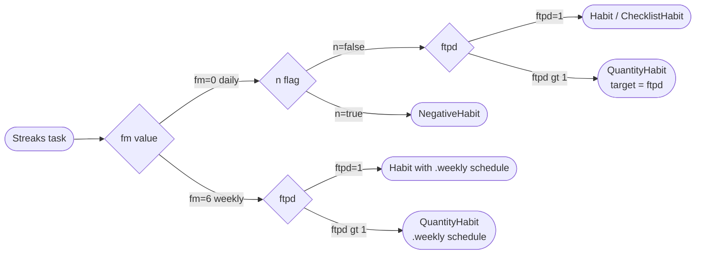
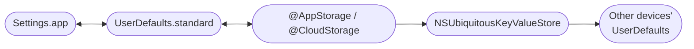
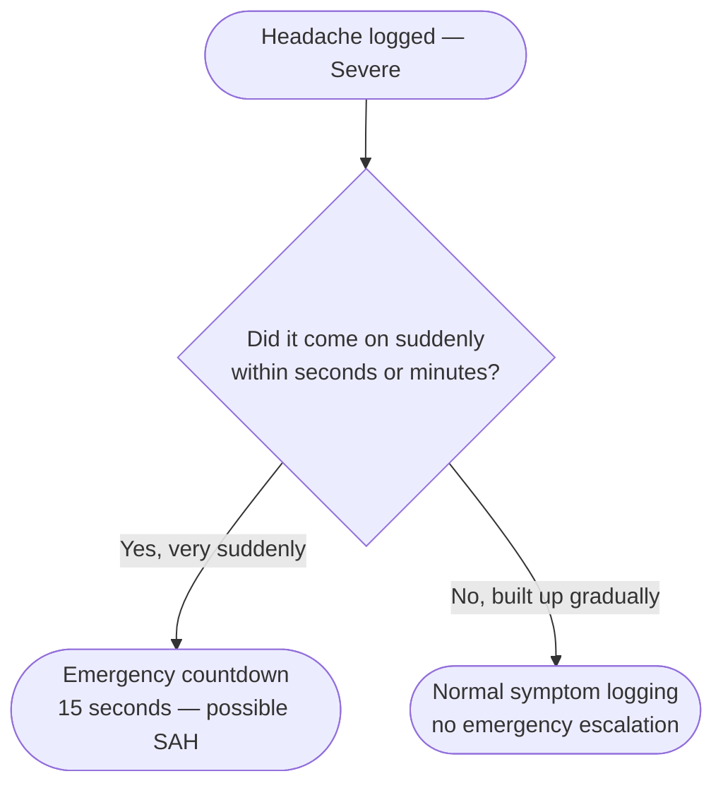

# Open Nook Foundation — Suite Design Document
**Version 1.7 · June 2026**

---

## 1. Overview

HabitNook is the Open Nook Foundation's habit tracking app — the first of 19 apps in the suite. It is a free, open-source, iOS-native habit tracker built for people who treat habits as systems, not streaks. It is the app Apple would ship if they built a habit tracker: deep OS integration, zero accounts required, full data portability, and a design system rooted in the Catppuccin palette.

The suite is free for individuals. Revenue comes from district and care facility subscriptions, professional tier access, and research partnerships. Contributors who submit merged features are credited by GitHub handle in the changelog and in App Store release notes.

---

## 2. North Star

> "What would Apple ship if they built a Habits app?"

Every feature, API choice, and scope decision is evaluated against this question. If Craig Federighi would cut it from v1, it is either scope creep or not integrated enough. If it could ship in the first version of a first-party Apple app, it belongs here.

---

## 3. Target Platform

| Attribute | Value |
|---|---|
| Minimum iOS | iOS 26 (rolling — see policy below) |
| Primary target | iPhone |
| Secondary targets | iPad, Apple Watch, Mac (SwiftUI multiplatform for non-health apps; MenuBarExtra presence for health apps — see §20.19 and ARCHITECTURE.md §15) |
| Language | Swift 6 (strict concurrency) |
| UI framework | SwiftUI |
| Toolchain | Xcode 26 |
| Architecture | No third-party analytics, no crash SDKs, no accounts |

**Rationale for iOS 26 minimum:** iOS 26 shipped September 2025; adoption at ship time should be re-measured against Apple's published App Store numbers before this rationale is cited (an earlier revision stated "75% within 90 days" without a source). AlarmKit, the Foundation Models framework, interactive App Intents snippets, and RelevanceConfiguration widgets are all iOS 26-only APIs that are core to the product. Targeting iOS 25 or below would require stripping or conditionally compiling the app's most differentiated features.

### Rolling Minimum OS Policy

HabitNook tracks the current iOS release minus one. When Apple ships a new major iOS version, the minimum deployment target advances to the previous major release on the following schedule:

| Event | Action |
|---|---|
| New iOS ships (e.g. iOS 27) | Begin progressive enhancement work targeting iOS 27 APIs |
| New iOS reaches ~50% adoption (typically 60–90 days post-release) | Raise minimum to the previous release (iOS 26) in the next minor version |
| Two major releases after a version (e.g. iOS 28 ships) | Drop support for iOS 26 entirely in the next major version |

**In practice:** when iOS 28 is the current release, iOS 27 is the minimum. iOS 26 devices can no longer install new versions but retain the last compatible build via the App Store's automatic version gating.

This policy applies to the **Rolling** tier — the suite default. It is not suite-wide: apps sold to institutions (AcademicNook, CareNook) support up to **five** iOS generations, and apps targeting elderly users (MedNook, RecoveryNook, ApptNook) support **three**, because those user populations run older devices and update least. Tier assignment per app lives in the canonical roster, ARCHITECTURE.md §1.1; the long-tail tiers accept `#available` guards, wider CI matrices, and defined degraded modes for capability-gated features across their support window.

For Rolling-tier apps the policy means:

- No `if #available(iOS 27, *)` guards accumulate in the codebase beyond one generation
- No compatibility shims for APIs superseded more than one release ago
- New APIs are adopted as first-class features, not bolted-on conditionals
- The CI matrix always tests against exactly two targets: current release and current release minus one

**Progressive enhancement** means new iOS APIs are used unconditionally on supported versions — not wrapped in availability checks that water down the feature. If an API requires iOS 27, the minimum is raised to iOS 27 before shipping that feature, not after. A feature that exists only behind `#available` is not a shipped feature — it is a preview that half your users never see.

The one exception is APIs that are device-capability-gated rather than OS-gated — Foundation Models (requires Apple Intelligence hardware), CoreHaptics (requires Taptic Engine), CMHeadphoneMotionManager (requires AirPods Pro/Max), EnergyKit (requires HomeKit + US location). These use capability checks, not OS version checks, and remain in the codebase permanently since the capability gap never closes regardless of OS version.

---

## 4. Funding & Community Model

### 4.1 Revenue

The Open Nook Foundation suite is free for individuals and families. No individual subscriptions — ever. This is a load-bearing commitment, not a marketing statement. The suite's privacy model (no servers, no data collection) makes subscription-based revenue structurally incompatible: there is no user account to bill.

Revenue comes from institutional and professional tiers:

| Revenue source | Model | Target |
|---|---|---|
| District subscriptions | $1–3 per student per year | K-12 school districts using AcademicNook |
| Care facility subscriptions | Per-resident annual fee | Residential care facilities using CareNook |
| Professional tier | Annual subscription | Counsellors, nurses, physiotherapists, legal aid workers |
| Integration verification | One-time certification fee | LMS vendors, PT platforms, food service providers seeking official tier |
| Research partnerships | Grant-funded data access agreements | IRB-approved academic and clinical research |
| Grants | RWJF, Knight, NIH SBIR, CMS | Foundation infrastructure and research platform |

No App Store individual subscriptions. No advertising. No data sales. No in-app purchases. The suite is free to install and free to use for every individual, permanently.

**App Store bundle:** A free bundle is structurally incompatible with the funding model — Apple's free bundle requires a shared auto-renewable subscription, which contradicts the no-individual-subscription commitment.

### 4.2 Open Source & Governance

The suite is licensed under MIT. The full codebase is public on GitHub at `github.com/opennookfoundation`. Every repository has its own maintainer community, release cycle, and contribution guidelines.

The Open Nook Foundation governs the nook-standard schema. Changes to the schema go through an RFC process — anyone can propose, the steering committee approves, breaking changes require a deprecation period. No single company controls the standard.

Every PR that ships in a release credits the contributor's GitHub handle in both `CHANGELOG.md` and the App Store release notes:

```
v1.3.0
- Habit streak freeze [contributed by @username, #PR42]
- Focus Filter improvements [contributed by @username, #PR38]
```

A `CONTRIBUTING.md` defines app scope rules before inbound PRs arrive. Contributions outside scope receive a written rationale for rejection. PRs that hardcode colours, skip `NookTheme` tokens, or bypass the NookUI design system are rejected regardless of feature quality.

### 4.3 Community Configuration Gallery

Community-submitted institution configurations are stored in the `nook-integrations` repository as JSON files, browsable and installable via QR code from the nook-web configuration portal. Submissions are PR-based. A CI step runs `nook validate config` against every PR — malformed or schema-invalid configurations never reach manual review.

Configurations carry a trust tier: Official (foundation-verified), Community (contributor-submitted, CI-validated), Contributed (unverified, user-submitted). The tier is displayed in the app when a configuration is installed.

---

## 5. Package Architecture

The codebase is split into three Swift packages:

```
HabitNook/
├── App/                  # Main app target (iOS, iPadOS, Watch, Mac)
├── HabitNookCore/         # Models, persistence, business logic
│   ├── Sources/
│   │   ├── Models/       # SwiftData @Model types
│   │   ├── Persistence/  # ModelContainer configuration, CloudKit setup
│   │   ├── HealthKit/    # HK read/write layer
│   │   └── Analytics/    # On-device stats, no telemetry
├── HabitNookUI/           # Design system, components, themes
│   ├── Sources/
│   │   ├── Tokens/       # NookColour, NookFont, NookSpacing (canonical names: ARCHITECTURE.md §2.2)
│   │   ├── Components/   # NookButton, NookCard, NookTextField, etc.
│   │   ├── Themes/
│   │   │   ├── Built-in/ # catppuccin.json (all four flavors)
│   │   │   └── Community/# themes.json (community submissions)
│   │   └── HabitNookUI.swift
└── HabitNookIntents/      # AppIntents, Focus Filters, Shortcuts
    └── Sources/
        └── Intents/      # LogHabitIntent, GetStreakIntent, etc.
```

**Rule:** Contributors import `HabitNookUI`. They cannot reference raw hex values or system colors directly. Any PR that does so fails CI.

---

## 6. Design System

### 6.1 Theme Architecture

HabitNook uses a JSON-driven theme engine. A theme is a named set of 11 semantic color roles. The `NookThemeManager` observable loads themes from bundled JSON at startup and makes the current theme available throughout the app via SwiftUI's `Environment`.

**Theme model:**

```swift
public struct NookTheme: Codable, Identifiable, Hashable {
    public let id: String           // "catppuccin-mocha"
    public let name: String         // "Mocha"
    public let author: String?      // nil for built-in, GitHub handle for community
    public let isDark: Bool
    public let colors: NookThemeColors
}

public struct NookThemeColors: Codable, Hashable {
    public let base: String         // page background
    public let surface0: String     // card background
    public let surface1: String     // elevated card
    public let surface2: String     // input fields
    public let overlay0: String     // disabled states
    public let text: String         // primary text
    public let subtext: String      // secondary text
    public let primary: String      // accent / interactive
    public let danger: String       // destructive actions
    public let success: String      // completion states
    public let warning: String      // missed / at-risk states
}
```

**Theme injection:**

```swift
// App entry point
ContentView()
    .environment(themeManager)

// Any component
@Environment(NookThemeManager.self) private var themes
Text("Today").foregroundStyle(themes.current.textPrimary)
```

### 6.2 Built-in Themes: Catppuccin

All four official Catppuccin flavors are bundled. Hex values are sourced from the official Catppuccin palette (catppuccin.com/palette, MIT license).

**Latte (light):**

| Role | Color Name | Hex |
|---|---|---|
| base | Base | `#eff1f5` |
| surface0 | Surface 0 | `#ccd0da` |
| surface1 | Surface 1 | `#bcc0cc` |
| surface2 | Surface 2 | `#acb0be` |
| overlay0 | Overlay 0 | `#9ca0b0` |
| text | Text | `#4c4f69` |
| subtext | Subtext 1 | `#5c5f77` |
| primary | Mauve | `#8839ef` |
| danger | Red | `#d20f39` |
| success | Green | `#40a02b` |
| warning | Peach | `#fe640b` |

**Frappé (dark):**

| Role | Color Name | Hex |
|---|---|---|
| base | Base | `#303446` |
| surface0 | Surface 0 | `#414559` |
| surface1 | Surface 1 | `#51576d` |
| surface2 | Surface 2 | `#626880` |
| overlay0 | Overlay 0 | `#737994` |
| text | Text | `#c6d0f5` |
| subtext | Subtext 1 | `#b5bfe2` |
| primary | Mauve | `#ca9ee6` |
| danger | Red | `#e78284` |
| success | Green | `#a6d189` |
| warning | Peach | `#ef9f76` |

**Macchiato (dark):**

| Role | Color Name | Hex |
|---|---|---|
| base | Base | `#24273a` |
| surface0 | Surface 0 | `#363a4f` |
| surface1 | Surface 1 | `#494d64` |
| surface2 | Surface 2 | `#5b6078` |
| overlay0 | Overlay 0 | `#6e738d` |
| text | Text | `#cad3f5` |
| subtext | Subtext 1 | `#b8c0e0` |
| primary | Mauve | `#c6a0f6` |
| danger | Red | `#ed8796` |
| success | Green | `#a6da95` |
| warning | Peach | `#f5a97f` |

**Mocha (dark, default):**

| Role | Color Name | Hex |
|---|---|---|
| base | Base | `#1e1e2e` |
| surface0 | Surface 0 | `#313244` |
| surface1 | Surface 1 | `#45475a` |
| surface2 | Surface 2 | `#585b70` |
| overlay0 | Overlay 0 | `#6c7086` |
| text | Text | `#cdd6f4` |
| subtext | Subtext 1 | `#bac2de` |
| primary | Mauve | `#cba6f7` |
| danger | Red | `#f38ba8` |
| success | Green | `#a6e3a1` |
| warning | Peach | `#fab387` |

**Default:** Mocha on first launch. Latte activates automatically when the user's system appearance is set to light mode, unless the user has manually selected a theme.

### 6.3 Community Theme Submission Format

Community themes are submitted as JSON entries in the public `themes.json` file. A JSON schema validates every PR via GitHub Actions (`ajv validate`). The `author` field is required for community submissions and must be a GitHub handle.

```json
{
  "themes": [
    {
      "id": "nord",
      "name": "Nord",
      "author": "exampleuser",
      "isDark": true,
      "colors": {
        "base":     "#2e3440",
        "surface0": "#3b4252",
        "surface1": "#434c5e",
        "surface2": "#4c566a",
        "overlay0": "#616e88",
        "text":     "#eceff4",
        "subtext":  "#d8dee9",
        "primary":  "#88c0d0",
        "danger":   "#bf616a",
        "success":  "#a3be8c",
        "warning":  "#ebcb8b"
      }
    }
  ]
}
```

### 6.4 Typography

```swift
public extension Font {
    static var hkLargeTitle: Font { .system(.largeTitle, design: .rounded, weight: .bold) }
    static var hkTitle: Font      { .system(.title2, design: .rounded, weight: .semibold) }
    static var hkHeadline: Font   { .system(.headline, design: .rounded, weight: .semibold) }
    static var hkBody: Font       { .system(.body, design: .default, weight: .regular) }
    static var hkCaption: Font    { .system(.caption, design: .default, weight: .regular) }
    static var hkMono: Font       { .system(.body, design: .monospaced, weight: .regular) }
}
```

All type scales respect Dynamic Type. No fixed font sizes anywhere in the codebase.

### 6.5 Component Library (NookButton as canonical example)

```swift
public struct NookButton: View {
    public enum Variant { case primary, secondary, danger, ghost }

    let label: String
    let variant: Variant
    let action: () -> Void

    public var body: some View {
        Button(action: action) {
            Text(label)
                .font(.hkBody)
                .foregroundStyle(foregroundColor)
                .padding(.horizontal, 16)
                .padding(.vertical, 10)
                .background(backgroundColor, in: RoundedRectangle(cornerRadius: 10))
        }
    }
}
```

Usage: `NookButton("Delete", variant: .danger) { deleteHabit() }`

All components follow this pattern. No component references raw hex or system colors.

### 6.6 Liquid Glass (iOS 26)

HabitNook adopts the iOS 26 Liquid Glass design language. The `glassEffect(_:in:isEnabled:)` modifier is used for modal surfaces, sheets, and floating panels. Recompiling with Xcode 26 applies Liquid Glass to standard SwiftUI components automatically. Custom glass surfaces use the new API explicitly.

---

## 7. Data Model

### 7.1 Persistence Layer

HabitNook uses **SwiftData** with **CloudKit** sync via `NSPersistentCloudKitContainer`. All data lives in the user's private iCloud container — no HabitNook servers ever hold user data.

CloudKit sync is opt-in. On first launch, the user is prompted. The default is local-only.

**iOS 26 note:** SwiftData in iOS 26 supports class inheritance in model graphs. HabitNook uses this for typed habit subclasses.

### 7.2 Core Models

```swift
// MARK: - Habit (base)

@Model
class Habit {
    var id: UUID
    var name: String
    var icon: String                   // SF Symbol name
    var colorHex: String               // accent override, falls back to theme primary
    var sortOrder: Int
    var createdAt: Date
    var isArchived: Bool
    var focusModeID: String?           // if set, only visible in this Focus mode

    // Free-text description of the habit itself -- not a completion note.
    // "Run at least 5km, not on rest days, aim for the park route."
    // Imported from Productive (ZHABITDESCRIPTION).
    var habitDescription: String?

    // Category grouping. Nil = uncategorised.
    // Imported from Streaks (categories) and Habitify.
    @Relationship(deleteRule: .nullify)
    var category: HabitCategory?

    // Soft time-of-day label -- display signal, not a hard reminder time.
    // Imported from Habitify (timeOfDay) and Productive (ZTIMEOFDAY).
    var timeOfDayPreference: TimeOfDayPreference?

    // Lightweight location name -- "Gym", "Home office".
    // No geofence required. Imported from Productive (ZPLACE).
    var placeLabel: String?

    // DeviceActivity Screen Time enforcement active for this habit.
    var screenTimeEnabled: Bool

    @Relationship(deleteRule: .cascade)
    var completions: [HabitCompletion]
    @Relationship(deleteRule: .cascade)
    var schedule: HabitSchedule
    @Relationship(deleteRule: .cascade)
    var progressionPlan: ProgressionPlan?
    @Relationship(deleteRule: .cascade)
    var endCondition: HabitEndCondition?  // nil = runs indefinitely
    @Relationship(deleteRule: .cascade)
    var pausePeriods: [PausePeriod]
    var visionProfile: VisionProfile?     // nil in v1
}

// MARK: - Habit subclasses (iOS 26 SwiftData class inheritance)

@Model
class TimedHabit: Habit {
    var targetDurationSeconds: Int
}

@Model
class QuantityHabit: Habit {
    var targetQuantity: Double
    var unit: String          // "pages", "glasses", "km"
}

@Model
class ChecklistHabit: Habit {
    var steps: [String]
}

@Model
class NegativeHabit: Habit {
    // Completed = "successfully avoided today"
    var avoidTarget: String
}

// MARK: - Category

@Model
class HabitCategory {
    var id: UUID
    var name: String               // "Health", "Work", "Creative"
    var colorHex: String?
    var sortOrder: Int
    @Relationship(deleteRule: .nullify)
    var habits: [Habit]
}

// MARK: - Time of day preference

enum TimeOfDayPreference: String, Codable {
    case morning    // before noon
    case afternoon  // noon-6pm
    case evening    // after 6pm
    case anytime
}

// MARK: - Schedule

/// HabitSchedule answers two independent questions:
///   WHEN:    which days/interval the habit applies  (ScheduleFrequency)
///   HOW MANY: how many completions are required     (amount + period)
///
/// These are orthogonal. "3 times per week on any weekday" is:
///   frequency: unit .week, interval 1
///   amount: 3, period: .week
///
/// "Twice on every Monday and Wednesday" is:
///   frequency: unit .week, interval 1, daysOfWeek [.mon, .wed]
///   amount: 2, period: .day
@Model
class HabitSchedule {
    // WHEN
    var frequency: ScheduleFrequency

    // HOW MANY -- defaults to 1 per day (standard single-completion habit)
    var amount: Int                    // how many completions required
    var period: HabitPeriod            // per what window

    // Reminders
    var reminderTimes: [Date]          // one per expected occurrence ideally
    var reminderTimezone: String?      // IANA identifier; nil = device timezone
    var remindersEnabled: Bool

    // ("Drink water 8x daily" → amount=8, period=.day;
    //  "Meditate 3x per week" → amount=3, period=.week)

    var habit: Habit
}

// MARK: - Completion engine (non-stored, computed)
// (HabitPeriod -- the HOW MANY window -- is declared once, below FrequencyUnit.)

extension HabitSchedule {

    /// True when enough completions exist in the current period.
    func isComplete(completions: [HabitCompletion], on date: Date) -> Bool {
        periodCompletions(completions, on: date).count >= amount
    }

    /// 0.0-1.0 progress fraction for heatmap and ring display.
    /// A water habit needing 8 glasses showing 5 completions → 0.625.
    func progressFraction(completions: [HabitCompletion], on date: Date) -> Double {
        let count = periodCompletions(completions, on: date).count
        return min(Double(count) / Double(amount), 1.0)
    }

    private func periodCompletions(
        _ completions: [HabitCompletion],
        on date: Date
    ) -> [HabitCompletion] {
        completions.filter { isWithinPeriod($0.completedAt, of: date) }
    }

    private func isWithinPeriod(_ date: Date, of reference: Date) -> Bool {
        let cal = Calendar.current
        switch period {
        case .day:   return cal.isDate(date, inSameDayAs: reference)
        case .week:  return cal.isDate(date, equalTo: reference, toGranularity: .weekOfYear)
        case .month: return cal.isDate(date, equalTo: reference, toGranularity: .month)
        }
    }
}

/// The WHEN axis -- which days the habit is scheduled.
/// Modelled after EKRecurrenceRule for direct calendar sync compatibility.
struct ScheduleFrequency: Codable {
    var unit: FrequencyUnit    // base time unit
    var interval: Int          // every N units -- default 1
    var daysOfWeek: [Weekday]? // for weekly: which days (nil = any day)
    var daysOfMonth: [Int]?    // for monthly: which dates (1-31; -1 = last day)

    // MARK: Common presets
    static let daily            = ScheduleFrequency(unit: .day,   interval: 1)
    static let weekly           = ScheduleFrequency(unit: .week,  interval: 1)
    static let monthly          = ScheduleFrequency(unit: .month, interval: 1)

    static func everyNDays(_ n: Int)               -> ScheduleFrequency { .init(unit: .day,   interval: n) }
    static func everyNWeeks(_ n: Int)              -> ScheduleFrequency { .init(unit: .week,  interval: n) }
    static func everyNMonths(_ n: Int)             -> ScheduleFrequency { .init(unit: .month, interval: n) }
    static func weekdays(_ days: [Weekday])        -> ScheduleFrequency { .init(unit: .week,  interval: 1, daysOfWeek: days) }
    static func everyOtherWeekOn(_ days: [Weekday]) -> ScheduleFrequency { .init(unit: .week, interval: 2, daysOfWeek: days) }
    static func monthlyOn(_ dates: [Int])          -> ScheduleFrequency { .init(unit: .month, interval: 1, daysOfMonth: dates) }

    // MARK: EKRecurrenceRule conversion
    var ekRecurrenceRule: EKRecurrenceRule {
        let frequency: EKRecurrenceFrequency
        switch unit {
        case .day:   frequency = .daily
        case .week:  frequency = .weekly
        case .month: frequency = .monthly
        }
        let ekDays = daysOfWeek?.map {
            EKRecurrenceDayOfWeek(EKWeekday(rawValue: $0.ekWeekdayValue)!)
        }
        return EKRecurrenceRule(
            recurrenceWith: frequency,
            interval: interval,
            daysOfTheWeek: ekDays,
            daysOfTheMonth: daysOfMonth?.map { NSNumber(value: $0) },
            monthsOfTheYear: nil,
            weeksOfTheYear: nil,
            daysOfTheYear: nil,
            setPositions: nil,
            end: nil
        )
    }
}

enum FrequencyUnit: String, Codable {
    case day
    case week
    case month
}

/// The HOW MANY axis -- within what window completions are counted.
enum HabitPeriod: String, Codable {
    case day
    case week
    case month
}

enum Weekday: String, Codable, CaseIterable {
    case monday, tuesday, wednesday, thursday, friday, saturday, sunday

    var ekWeekdayValue: Int {
        switch self {
        case .sunday: return 1; case .monday: return 2; case .tuesday: return 3
        case .wednesday: return 4; case .thursday: return 5; case .friday: return 6
        case .saturday: return 7
        }
    }

    // Habitify "regularly" field parser
    init?(habitifyName: String) {
        switch habitifyName.lowercased() {
        case "mon": self = .monday;   case "tue": self = .tuesday
        case "wed": self = .wednesday; case "thu": self = .thursday
        case "fri": self = .friday;   case "sat": self = .saturday
        case "sun": self = .sunday;   default: return nil
        }
    }
}

// MARK: - Schedule examples

/// "Every other day"
/// ScheduleFrequency.everyNDays(2), amount: 1, period: .day

/// "3 times per week, any day"
/// ScheduleFrequency.weekly, amount: 3, period: .week

/// "Twice on Mon/Wed/Fri"
/// ScheduleFrequency.weekdays([.monday, .wednesday, .friday]), amount: 2, period: .day

/// "Every other week on Monday"
/// ScheduleFrequency.everyOtherWeekOn([.monday]), amount: 1, period: .day

/// "8 glasses of water per day"
/// ScheduleFrequency.daily, amount: 8, period: .day

/// "Last day of every month"
/// ScheduleFrequency.monthlyOn([-1]), amount: 1, period: .day

/// "Twice per month, any day"
/// ScheduleFrequency.monthly, amount: 2, period: .month

// MARK: - Completion

@Model
class HabitCompletion {
    var id: UUID
    var completedAt: Date
    var value: Double?               // for quantity habits -- measured value
    var durationSeconds: Int?        // for timed habits
    var note: String?
    var importNote: String?          // importer flag e.g. "partial_import", "outcome_13"
    var importSource: ImportSource?
    var isEndConditionCompletion: Bool  // true if this completion triggered HabitEndCondition
    @Attribute(.externalStorage)
    var photo: Data?                 // raw JPEG
    @Attribute(.externalStorage)
    var paperMarkup: Data?           // PaperKit annotation
    var weatherContext: NookWeatherContext?
    var habit: Habit
}

enum ImportSource: String, Codable {
    case notBoringHabits
    case habitify
    case productive
    case streaks
    case habitArchive
}

// (Completion-engine helpers are declared once, in the extension above --
//  an earlier revision duplicated the entire extension here, which does not compile.)

// MARK: - Pause periods

/// Deliberate multi-day pause -- illness, travel, planned break.
/// Distinct from per-completion environmental misses.
/// Paused habits are visually muted in Today but not archived.
/// Streaks within a pause are frozen, not broken.
@Model
class PausePeriod {
    var id: UUID
    var start: Date
    var end: Date?                   // nil = pause still active
    var reason: PauseReason
    var note: String?
    var habit: Habit
}

enum PauseReason: String, Codable {
    case illness
    case injury
    case travel
    case plannedBreak
    case userDefined
}

// MARK: - End conditions

/// A habit that ends when a target is reached.
/// Maps to Not Boring Habits targetDays=60 and Habitify habit_end_conditions.
@Model
class HabitEndCondition {
    var id: UUID
    var type: EndConditionType
    var targetValue: Double          // e.g. 60 for 60-rep model
    var reachedAt: Date?             // nil until met
    var habit: Habit
}

enum EndConditionType: String, Codable {
    case totalCompletions   // habit ends after N completions
    case targetDate         // habit ends on a date
    case currentStreak      // habit ends after N consecutive days
}
```

After an `EndCondition` is met:
- Habit is automatically archived (`isArchived = true`)
- Milestone notification fires: "You completed your 60-rep goal for Morning Run"
- Final completion is flagged `isEndConditionCompletion: true`

#### SwiftData Schema Migration Note

All models above are part of the v1 schema definition. All optional fields default to nil. All relationships use `.nullify` or `.cascade`. No migration plan is required at v1 — everything is defined from day one.

When any field is added post-ship, implement `VersionedSchema` and `SchemaMigrationPlan` before releasing. Never add fields to a shipped SwiftData store without a migration plan.

```swift
// MARK: - Progressive Overload

@Model
class ProgressionPlan {
    var baseTarget: Double              // original target at creation
    var currentTarget: Double           // active target used for completion evaluation
    var incrementValue: Double          // step size per scheduled increase
    var incrementIntervalDays: Int      // cadence -- e.g. 28 for monthly
    var nextScheduledIncrease: Date?    // nil if no scheduled plan
    var coreMLNudgesEnabled: Bool       // opt-in per habit; default true
    var minimumTarget: Double?          // floor -- CoreML will not suggest below this
    var maximumTarget: Double?          // ceiling -- CoreML will not suggest above this
    @Relationship(deleteRule: .cascade)
    var history: [ProgressionEvent]
    var habit: Habit
}

@Model
class ProgressionEvent {
    var date: Date
    var previousTarget: Double
    var newTarget: Double
    var source: ProgressionSource
    var nudgeRationale: String?         // Foundation Models text if CoreML-driven; nil otherwise
}

enum ProgressionSource: String, Codable {
    case scheduled              // automatic increment from ProgressionPlan
    case userInitiated          // user manually changed target
    case coreMLAccepted         // user accepted a CoreML nudge suggestion
    case coreMLDismissed        // user dismissed at banner -- model learns preference
    case coreMLLoosenConfirmed  // user confirmed loosening after two-tap flow (negative habits)
    case coreMLLoosenCancelled  // user reached confirmation screen but cancelled -- stronger signal than dismissed
}

// MARK: - Negative Habit Progression

@Model
class NegativeProgressionPlan: ProgressionPlan {
    // Inherited currentTarget maps to X -- the quantity threshold (max allowed)
    var timeWindowMinutes: Int?          // Y -- nil means per-day default
    var timeWindowStart: DateComponents? // optional window start, e.g. after 6pm
    var timeWindowEnd: DateComponents?   // optional window end

    // Asymmetric CoreML confidence thresholds
    var coreMLTightenConfidence: Float   // default 0.65 -- suggest restriction readily
    var coreMLLoosenConfidence: Float    // default 0.90 -- require strong evidence to loosen

    // Loosen always requires deliberate two-tap confirmation
    // This field exists to make the requirement explicit and auditable, not configurable
    let requireConfirmationToLoosen: Bool = true
}
```

### 7.3 Progressive Overload

Progressive overload is the principle that a target should evolve as the user grows. A 5km running target that was challenging in week one is trivial in month three. Without adjustment the habit becomes a maintenance checkbox rather than a growth mechanism.

HabitNook supports two progression paths that operate independently and can be combined:

**Scheduled progression** is a commitment device. At habit creation the user defines a step size and cadence — "increase my run distance by 0.5km every 28 days." The plan executes automatically. The user made a contract with their future self at a moment of high motivation and the app honours it without requiring ongoing willpower.

**CoreML-driven nudges** are adaptive observations. The clustering model (§8.36) watches completion rate, actual completion value, and time-to-completion over a rolling 14-day window. When it detects consistent overperformance — the user averages 6.2km against a 5km target — it surfaces a suggestion. When it detects consistent underperformance it suggests lowering the target. The model observes and asks. The user always decides.

The downward nudge is as important as the upward one. A target the user consistently misses generates avoidance and anxiety. A 15-minute meditation target the user consistently hits is more valuable than a 20-minute target they consistently avoid. Suggesting a decrease is reframed as calibration, not failure.

**Conflict resolution:** if a scheduled increase is due but CoreML is detecting underperformance, HabitNook surfaces the conflict explicitly: "You planned to increase your target next week, but your recent completions suggest holding at the current level. What would you like to do?" The user is never blindsided by an automatic change in either direction.

**The `ProgressionEvent` log** makes the entire history transparent and auditable. A chart of target values over two years — growing through scheduled increments and accepted nudges, dipping during illness, recovering — is a meaningful record of genuine development. It belongs in the Analytics tab as a dedicated progression timeline view.

**`coreMLDismissed` source** is stored deliberately. When a user dismisses a CoreML suggestion, the model learns that this user's threshold for accepting nudges is different from the default. Over time the model calibrates its suggestion sensitivity to the individual user's preferences — it becomes less likely to suggest changes the user has historically rejected.

#### Negative Habit Progression — Asymmetric Mechanics

Negative habits (tracking avoidance — screen time, alcohol, junk food) use progression mechanics that are structurally inverted from positive habits and deliberately asymmetric in how they handle loosening vs. tightening.

**The target is a tolerance threshold, not a goal.** For a negative habit, `currentTarget` represents the maximum allowed — the ceiling below which the day counts as a success. Progression always moves toward restriction: the ceiling lowers over time. There is no scenario where the correct long-term outcome is "allowed to do more of the bad thing."

**Progression operates on two independent axes:**

- **X** — the quantity threshold (number of drinks, minutes of screen time, number of social media opens)
- **Y** — the time window (per day, per sitting, after a specific hour)

Both can decrease independently. A user reducing social media use might progress from "30 minutes per day" to "20 minutes per day" (X decreases, Y unchanged), or to "30 minutes but only after 6pm" (X unchanged, Y window shrinks), or both simultaneously. The `NegativeProgressionPlan` stores both dimensions.

**Asymmetric CoreML confidence thresholds:**

| Suggestion direction | Positive habit | Negative habit |
|---|---|---|
| Tighten (restrict more) | 0.70 | 0.65 — suggest readily |
| Loosen (allow more) | 0.70 | 0.90 — require strong sustained evidence |

The higher bar for loosening a negative habit threshold reflects the asymmetric relapse risk. A person who has reduced alcohol intake from 4 drinks to 1 drink nightly has built genuine momentum. The reward circuitry that made the habit sticky doesn't disappear — it's dormant. Loosening the threshold can reactivate it faster than the restriction took to achieve. The model must see an extended, unambiguous pattern of sustained success before suggesting any relaxation.

**The loosen confirmation flow:**

When the model reaches 0.90 confidence for a loosen suggestion, the UI does not show a banner. It presents a full sheet:

```
Title: "You've made real progress"

Body: "You've stayed under your 1-drink limit for 47 consecutive days.
Your data suggests your threshold could move to 2 drinks.

This is your choice. Many people find maintaining a tight
threshold protects progress they've worked hard to build."

Primary action:   "Keep my current limit"   ← prominent
Secondary action: "Raise to 2 drinks"        ← requires a second confirmation tap
```

The copy presents the option without recommending it. The default action maintains the restriction. The user must actively choose to loosen, twice. `coreMLLoosenCancelled` is stored when the user reaches the second confirmation tap and backs out — this is a stronger preference signal than dismissing the initial sheet, and the model treats repeated cancellations as strong evidence not to suggest loosening again for at least 90 days.

**Scheduled tightening for negative habits:**

The scheduled progression path works the same as positive habits but in the restrictive direction. A user can commit at creation: "reduce my screen time limit by 10 minutes every 4 weeks." This is a particularly useful commitment device for negative habits because the user makes the decision to restrict at a moment of high motivation — when they're setting up the habit — rather than requiring willpower at each step.

**What Foundation Models generates for negative habit nudges:**

Tighten rationale: "You've stayed under your limit consistently for two weeks. Ready to make it a little harder?"

Loosen rationale: "Your data shows sustained success over 47 days. You could raise your threshold, though many people choose to keep their limit where it is."

The framing never implies the user should loosen. It presents it as an option the data supports, with the weight of the sentence construction on maintaining the restriction.

Any habit configuration can be exported as a `.habit` file — a JSON document registered as a custom UTType. Users share these via AirDrop, Files app, or the community GitHub repo. Importing a `.habit` file triggers a native share sheet prompt.

```json
{
  "version": 1,
  "name": "Morning Run",
  "icon": "figure.run",
  "type": "timed",
  "targetDurationSeconds": 1800,
  "schedule": {
    "frequency": "daily",
    "reminderTimes": ["07:00"]
  }
}
```

UTType registration in `Info.plist`:
```xml
<key>UTExportedTypeDeclarations</key>
<array>
  <dict>
    <key>UTTypeIdentifier</key>
    <string>com.habitnook.habit</string>
    <key>UTTypeTagSpecification</key>
    <dict>
      <key>public.filename-extension</key>
      <array><string>habit</string></array>
    </dict>
  </dict>
</array>
```

### 7.4 Streaks `.streaks` Import

Streaks by Crunchy Bagel exports a `.streaks` file — a JSON document. The format was reverse-engineered from community analysis and a published skill document; it is not officially documented by Crunchy Bagel. Export appeared in version 11.2.0 via the "Export Data" screen.

#### Top-Level Structure

```json
{
  "app": "...",
  "version": "...",
  "type": "...",
  "desc": "...",
  "timestamp": "...",
  "categories": [...],
  "tasks": [...]
}
```

`tasks` is the only array that matters for import. All other top-level fields are metadata.

#### Task Fields

| Field | Type | Meaning |
|---|---|---|
| `t` | String | **Task title** — do not confuse with log-level `t` |
| `st` | String | Status — `"N"` = current, `"A"` = archived |
| `pg` | Int | Screen grouping (0–3) — no HabitNook equivalent, discard |
| `n` | Bool | `true` = avoidance/negative habit |
| `fm` | Int | Cadence — `0` = daily, `6` = weekly |
| `ftpd` | Int | Target count per period — `1` = binary, `>1` = count-based |

#### Log Fields (nested inside each task)

| Field | Type | Meaning |
|---|---|---|
| `t` | Int | **Outcome code** — integer, not a title string |
| `ps` | Date | Period start |
| `pe` | Date | Period end |
| `pt` | String | Period type — `"w"` = weekly |

**Critical:** `t` means completely different things at task level (string title) vs log level (integer outcome code). A parser that reads `t` without checking context will silently misclassify everything.

#### Outcome Code Map

| Code | Meaning | Import action |
|---|---|---|
| `1` | Success / target hit | `HabitCompletion` |
| `2` | Good day (avoidance — did NOT do bad habit) | `HabitCompletion` (negative habit) |
| `4` | Partial progress | `HabitCompletion` with `value < target` |
| `5` | Missed | No completion, record as skipped |
| `6` | Partial progress (weekly) | `HabitCompletion` with `value < target` |
| `7` | Failed day (avoidance — DID do bad habit) | No completion, record as negative failure |
| `13` | Unknown/special status | Import as skipped with `importNote: "outcome_13"` |

#### Cadence Combinations



#### Swift Decoder

```swift
import Foundation

struct StreaksExport: Decodable {
    let version: String?
    let timestamp: String?
    let categories: [StreaksCategory]?
    let tasks: [StreaksTask]
}

struct StreaksCategory: Decodable {
    let id: String?
    let name: String?
}

struct StreaksTask: Decodable {
    let t: String           // task TITLE -- string
    let st: String          // status: "N" or "A"
    let pg: Int?            // screen page -- discard
    let n: Bool?            // true = avoidance/negative
    let fm: Int?            // cadence family: 0=daily, 6=weekly
    let ftpd: Int?          // target per period
    let logs: [StreaksLog]? // completion history

    var isActive: Bool    { st == "N" }
    var isArchived: Bool  { st == "A" }
    var isNegative: Bool  { n == true }
    var isWeekly: Bool    { fm == 6 }
    var isCountBased: Bool { (ftpd ?? 1) > 1 }
}

struct StreaksLog: Decodable {
    let t: Int              // outcome CODE -- integer, NOT a title
    let ps: String?         // period start
    let pe: String?         // period end
    let pt: String?         // period type: "w" = weekly
}

final class StreaksImporter {

    func `import`(from url: URL) throws -> [Habit] {
        let data = try Data(contentsOf: url)
        let export = try JSONDecoder().decode(StreaksExport.self, from: data)
        return export.tasks.map { importTask($0) }
    }

    private func importTask(_ task: StreaksTask) -> Habit {
        let habit: Habit

        if task.isNegative {
            habit = NegativeHabit(
                id: UUID(),
                name: task.t,
                isArchived: task.isArchived,
                importSource: .streaks
            )
        } else if task.isCountBased {
            habit = QuantityHabit(
                id: UUID(),
                name: task.t,
                targetQuantity: Double(task.ftpd ?? 1),
                unit: "times",
                isArchived: task.isArchived,
                importSource: .streaks
            )
        } else {
            habit = Habit(
                id: UUID(),
                name: task.t,
                isArchived: task.isArchived,
                importSource: .streaks
            )
        }

        // Schedule
        habit.schedule = HabitSchedule(
            frequency: task.isWeekly ? .weekly : .daily
        )

        // Completions
        habit.completions = importCompletions(from: task)
        return habit
    }

    private func importCompletions(from task: StreaksTask) -> [HabitCompletion] {
        guard let logs = task.logs else { return [] }
        var completions: [HabitCompletion] = []

        if task.isWeekly {
            // Weekly tasks: score by period (ps/pe), not by raw log count
            // Group logs by period start to avoid double-counting
            let grouped = Dictionary(grouping: logs) { $0.ps ?? "" }
            for (_, periodLogs) in grouped {
                // Best outcome code wins for the period
                let best = periodLogs.min(by: { outcomeRank($0.t) < outcomeRank($1.t) })
                guard let log = best else { continue }
                if let completion = completion(from: log, periodStart: log.ps, isNegative: task.isNegative) {
                    completions.append(completion)
                }
            }
        } else {
            // Daily tasks: one completion attempt per log
            for log in logs {
                if let completion = completion(from: log, periodStart: log.ps, isNegative: task.isNegative) {
                    completions.append(completion)
                }
            }
        }

        return completions
    }

    private func completion(from log: StreaksLog, periodStart: String?, isNegative: Bool) -> HabitCompletion? {
        let date = periodStart.flatMap { parseDate($0) } ?? Date()

        switch log.t {
        case 1:  // success
            return HabitCompletion(id: UUID(), completedAt: date, value: 1.0, importSource: .streaks)
        case 2 where isNegative:  // avoidance success
            return HabitCompletion(id: UUID(), completedAt: date, value: 1.0, importSource: .streaks)
        case 4, 6:  // partial
            return HabitCompletion(id: UUID(), completedAt: date, value: 0.5, importNote: "partial_import", importSource: .streaks)
        case 5, 7:  // missed or avoidance failure
            return nil  // no completion record
        case 13:  // unknown
            return nil  // treat as skipped, log for review
        default:
            return nil
        }
    }

    // Lower rank = better outcome (used to pick best weekly outcome)
    private func outcomeRank(_ code: Int) -> Int {
        switch code {
        case 1: return 0   // success
        case 2: return 1   // avoidance success
        case 6: return 2   // partial weekly
        case 4: return 3   // partial daily
        case 5: return 4   // missed
        case 7: return 5   // avoidance failure
        default: return 6
        }
    }

    private func parseDate(_ str: String) -> Date? {
        ISO8601DateFormatter().date(from: str)
    }
}
```

#### What Transfers and What Doesn't

| Data | Transfers | Notes |
|---|---|---|
| Task name | ✅ | `task.t` string |
| Active/archived status | ✅ | `st="N"` / `st="A"` |
| Negative/avoidance habit | ✅ | `n=true` → `NegativeHabit` |
| Daily vs weekly cadence | ✅ | `fm=0` / `fm=6` |
| Count-based target | ✅ | `ftpd > 1` → `QuantityHabit.targetQuantity` |
| Completion history | ✅ | Outcome codes 1, 2 → `HabitCompletion` |
| Partial completions | ⚠️ | Outcome 4/6 → completion with `value=0.5`, flagged |
| Categories | ✅ | Top-level `categories` array |
| Weekly period dates | ✅ | `ps`/`pe` used for weekly scoring |
| Screen grouping (`pg`) | ❌ | No HabitNook equivalent |
| Icon, color | ❌ | Not in confirmed schema |
| Reminders | ❌ | Not in confirmed schema |
| Notes | ❌ | Streaks added note export in 11.2.0 — may be in `logs` as an additional field; not yet confirmed |
| Streak counts | ❌ | Recalculated by HabitNook from completion history |

#### Streaks Note Export (11.2.0+)

Streaks 11.2.0 release notes state "Export task notes from the Export Data screen." Whether notes appear as a field inside each task, inside each log entry, or as a separate top-level array is not yet confirmed from a real export sample. When a real `.streaks` file with notes is submitted to the community repo, update this section with the confirmed structure and add note import to the decoder.


HabitNook imports `habits.json` exports from [(Not Boring) Habits](https://notbor.ing/product/habits) by Andy Works. This gives users who are graduating from Not Boring's 60-rep model a frictionless migration path into HabitNook's richer system — their full completion history comes with them.

#### Schema (version 2)

The format is straightforward. All timestamps use **Apple Reference Date** (seconds since January 1, 2001) — not Unix epoch. Conversion: `unixTimestamp = appleTimestamp + 978_307_200`.

```
habits.json
├── version: "2"
├── lastModified: Double (Apple Reference Date)
└── items: [{
    ├── identifier: String (UUID)
    ├── title: String (NOT BORING exports in ALL CAPS)
    ├── createdOn: Double (Apple Reference Date)
    ├── lastModified: Double
    ├── archivedOn: Double? (present if habit was archived)
    ├── targetDays: Int (always 60 — Not Boring's 60-rep model)
    ├── goal: { amount: Int, unit: "times" }
    ├── events: {
    │   └── sortedItems: [{ date: Double }]  ← exact tap timestamps
    │   }
    └── reminders: [{
        ├── identifier: String (UUID)
        ├── isEnabled: Bool
        ├── lastEnabled: Double
        ├── showOnBadge: Bool
        └── fireOn: {
            ├── hour: Int
            ├── minute: Int
            └── timeZone: { identifier: String }  ← IANA timezone
            }
        }]
    }]
```

**Key observations from a real export:**
- All event timestamps have sub-second precision — they are exact tap times, not midnight-normalised dates
- `targetDays` is always 60 — Not Boring's core model is 60 repetitions to form a habit
- Titles are ALL CAPS — convert to title case on import
- `archivedOn` is absent for active habits, present for archived ones
- `goal.unit` is always `"times"` — Not Boring only supports binary daily completions
- Reminders may have `isEnabled: false` — import the time but leave disabled unless the user re-enables

#### Swift Decoder

```swift
import Foundation

// MARK: - Decoder types

struct NotBoringExport: Decodable {
    let version: String
    let items: [NotBoringHabit]
    let lastModified: Double
}

struct NotBoringHabit: Decodable {
    let identifier: String
    let title: String
    let createdOn: Double
    let lastModified: Double
    let archivedOn: Double?
    let targetDays: Int
    let goal: NotBoringGoal
    let events: NotBoringEvents
    let reminders: [NotBoringReminder]
}

struct NotBoringGoal: Decodable {
    let amount: Int
    let unit: String
}

struct NotBoringEvents: Decodable {
    let sortedItems: [NotBoringEvent]
}

struct NotBoringEvent: Decodable {
    let date: Double  // Apple Reference Date
}

struct NotBoringReminder: Decodable {
    let identifier: String
    let isEnabled: Bool
    let showOnBadge: Bool
    let fireOn: NotBoringFireOn
}

struct NotBoringFireOn: Decodable {
    let hour: Int
    let minute: Int
    let timeZone: NotBoringTimeZone
}

struct NotBoringTimeZone: Decodable {
    let identifier: String
}

// MARK: - Timestamp conversion

extension Double {
    /// Converts an Apple Reference Date timestamp (seconds since Jan 1, 2001)
    /// to a Swift Date.
    var fromAppleReferenceDate: Date {
        Date(timeIntervalSinceReferenceDate: self)
    }
}

// MARK: - Import mapping

final class NotBoringImporter {

    func `import`(from url: URL) throws -> [Habit] {
        let data = try Data(contentsOf: url)
        let export = try JSONDecoder().decode(NotBoringExport.self, from: data)

        guard export.version == "2" else {
            throw ImportError.unsupportedVersion(export.version)
        }

        return export.items.map { importHabit($0) }
    }

    private func importHabit(_ source: NotBoringHabit) -> Habit {
        // Title: Not Boring exports in ALL CAPS -- convert to title case
        let title = source.title
            .split(separator: " ")
            .map { word -> String in
                let w = word.lowercased()
                return w.prefix(1).uppercased() + w.dropFirst()
            }
            .joined(separator: " ")

        // Map to HabitNook's ChecklistHabit (binary daily completion)
        // Not Boring only tracks "did it / didn't" -- no quantities or durations
        let habit = Habit(
            id: UUID(uuidString: source.identifier) ?? UUID(),
            name: title,
            createdAt: source.createdOn.fromAppleReferenceDate,
            isArchived: source.archivedOn != nil,
            importSource: .notBoringHabits
        )

        // Completions -- all events map directly
        habit.completions = source.events.sortedItems.map { event in
            HabitCompletion(
                id: UUID(),
                completedAt: event.date.fromAppleReferenceDate,
                value: 1.0,
                note: nil,
                importSource: .notBoringHabits
            )
        }

        // Schedule -- import reminder time if present
        if let reminder = source.reminders.first {
            var components = DateComponents()
            components.hour = reminder.fireOn.hour
            components.minute = reminder.fireOn.minute
            let timezone = TimeZone(identifier: reminder.fireOn.timeZone.identifier)
                ?? TimeZone.current

            habit.schedule = HabitSchedule(
                frequency: .daily,
                reminderTimes: [
                    Calendar.current.nextDate(
                        after: Date(),
                        matching: components,
                        matchingPolicy: .nextTime,
                        direction: .forward
                    ) ?? Date()
                ],
                reminderTimezone: timezone,
                remindersEnabled: reminder.isEnabled
            )
        }

        return habit
    }
}

enum ImportError: Error {
    case unsupportedVersion(String)
    case unreadableFile
}
```

#### Post-Import Prompt

After importing, HabitNook presents a one-time setup sheet for each imported habit. Not Boring Habits stores only the minimum — name, completion history, and reminder time. HabitNook needs more:

```
"Code For Half An Hour" was imported with 92 completions.

To get the most from HabitNook, set this habit up fully:

[ ] Completion type: Timed ›      ← was just binary in Not Boring
[ ] Target duration: 30 min ›     ← inferred from title
[ ] Add location trigger ›
[ ] Link to HealthKit ›
[ ] Set up progression plan ›

[ Skip — keep as simple daily habit ]
```

The title parsing hint is cosmetic — "CODE FOR HALF AN HOUR" and "OPTIMIZE WORKSPACE 1:30" both contain duration information in plain English. HabitNook can offer a Foundation Models-powered suggestion for the completion type based on the title, but the user always confirms.

#### What transfers and what doesn't

| Data | Transfers | Notes |
|---|---|---|
| Habit name | ✅ | Converted from ALL CAPS to title case |
| Completion history | ✅ | All timestamps with full precision |
| Created date | ✅ | Preserved exactly |
| Archived status | ✅ | Archived habits imported as archived |
| Reminder time | ✅ | Imported with enabled/disabled state preserved |
| Reminder timezone | ✅ | IANA timezone identifier preserved |
| 60-rep progress | ✅ | Derivable from completion count vs targetDays |
| Completion type | ❌ | Not Boring is binary only — user sets in post-import prompt |
| Target value | ❌ | Not in Not Boring's model |
| Notes | ❌ | Not Boring doesn't support completion notes |
| Photos | ❌ | Not Boring doesn't support completion photos |
| Skins/themes | ❌ | Not Boring-specific UI — no equivalent |

#### File Registration

`habits.json` is a generic filename that conflicts with other apps. HabitNook does not register `.json` as a document type globally. The import is triggered only through:

1. Files app share sheet → HabitNook (the file must be named `habits.json` exactly)
2. Settings → Import → (Not Boring) Habits → file picker

The importer validates `version == "2"` and the presence of `items` before attempting to parse. An unrecognised JSON file dropped via the share sheet that fails validation is rejected with a clear error rather than a silent failure.

### 7.5 Habitify SQLite Import

Habitify exports a `.sqlite` file containing 19 tables. The schema is significantly richer than (Not Boring) Habits — Habitify supports quantity habits, checklist habits, geofence triggers, habit stacking, mood tracking, and session logs with start/end times. Most of this maps directly to HabitNook's data model.

#### Schema Overview

Habitify's SQLite has two distinct completion systems that must both be imported:

- **`habit_checkins`** — boolean daily completions (did it / didn't). ISO date string in `day` column, integer `status`.
- **`habit_logs`** — rich session records with `start_at`, `end_at`, `value`, `unit_symbol`, `type`. Used for timed and quantity habits.

Import both. Prefer `habit_logs` when both exist for the same habit on the same day — it contains more information.

#### Confirmed `root_data` Schema

`habits.root_data` is a Firebase Realtime Database JSON payload. All keys confirmed from real export:

```json
{
  "name": "Make my bed",
  "habitType": 1,
  "iconNamed": "ic_area_bed",
  "accentColor": "2A67F4",
  "isArchived": false,
  "startDate": 1777262400,
  "createdAt": "2026-04-27T18:31:17.007Z",
  "regularly": "weekDays-fri,thu,wed,tue,mon",
  "timeOfDay": 7,
  "timeOfDays": {
    "morning": { "priority": "m", "timeOfDayId": "morning" },
    "afternoon": { "priority": "m", "timeOfDayId": "afternoon" },
    "evening": { "priority": "m", "timeOfDayId": "evening" }
  },
  "goals": {
    "UUID": {
      "createdAt": "ISO string",
      "periodicity": "daily",
      "unit": { "symbol": "rep" },
      "value": 1
    }
  },
  "remind": {
    "timeTriggers": { "5:55": true },
    "overwrittenTimeTriggers": { "5:55": { "showLiveActivity": true } },
    "soundName": ""
  },
  "logInfo": { "type": "manual" },
  "screenTimeConfiguration": { "isEnabled": false, "includeEntireCategory": false },
  "templateIdentifier": "limitMasturbation",
  "shareLink": "https://share.habitify.me/...",
  "priority": -9.5e+29,
  "checkins": { "27042026": 2 },
  "localLastModifiedDate": 1777334246676.947,
  "serverLastModifiedDate": 1777334195120
}
```

`habit_notes.root_data` confirmed schema — **this is a mood rating, not a text note:**

```json
{
  "createdAt": "2026-04-27T23:56:02.829Z",
  "value": 3
}
```

Habitify does not store free-text completion notes. The `habit_notes` table stores mood ratings (integer `value`, likely 1–5). Import these as mood tags on the nearest `HabitCompletion` record for that day, not as note text.

#### Key Parsing Rules

**`habitType` enum:**
- `1` = positive habit → maps to `Habit` (or typed subclass based on goal unit)
- `2` = negative habit to reduce → maps to `NegativeHabit`

**`accentColor` normalisation:**
The field is inconsistently formatted — sometimes `"2A67F4"` (no hash), sometimes `"#2A67F4"` (with hash). Always normalise by stripping the leading `#`:

```swift
let hex = root["accentColor"] as? String ?? "FFFFFF"
let normalised = hex.hasPrefix("#") ? String(hex.dropFirst()) : hex
```

**Checkin date key format — `DDMMYYYY`:**
Keys in the `checkins` dictionary use `DDMMYYYY` format, not ISO 8601. `"27042026"` = April 27, 2026:

```swift
func parseCheckinDate(_ key: String) -> Date? {
    guard key.count == 8 else { return nil }
    let day   = key.prefix(2)
    let month = key.dropFirst(2).prefix(2)
    let year  = key.dropFirst(4)
    var components = DateComponents()
    components.day   = Int(day)
    components.month = Int(month)
    components.year  = Int(year)
    return Calendar.current.date(from: components)
}
```

**Checkin status values:**
- `3` = completed → import as `HabitCompletion`
- `2` = skipped → import as skipped day (no `HabitCompletion` record, but note the skip)
- Other values → ignore

Note: the `checkins` dictionary inside `root_data` appears to duplicate the `habit_checkins` SQLite table. Use the SQLite table as authoritative — it has a proper schema with indexes. Ignore `checkins` inside `root_data`.

**`regularly` schedule parsing:**

```swift
func parseSchedule(_ regularly: String?) -> ScheduleFrequency {
    guard let r = regularly else { return .daily }
    if r == "daily" { return .daily }
    if r.hasPrefix("weekDays-") {
        let days = r.dropFirst("weekDays-".count)
            .split(separator: ",")
            .compactMap { Weekday(habitifyName: String($0)) }
        return .weekdays(days)
    }
    if r.hasPrefix("interval-") {
        let n = Int(r.dropFirst("interval-".count)) ?? 1
        return .everyNDays(n)
    }
    return .daily
}
```

**`startDate` is Unix timestamp (seconds)** — confirmed. `Date(timeIntervalSince1970: startDate)`.

**`remind` in `root_data` vs `time_trigger_habit_reminds` table:**
Both encode reminder times. Use the SQLite `time_trigger_habit_reminds` table as authoritative — it has the proper relational structure. Ignore `remind` in `root_data` to avoid double-importing reminders.

**`screenTimeConfiguration`** — Habitify has a Screen Time integration. When `isEnabled: true`, the habit is linked to Screen Time. Import the habit normally but note in the post-import prompt that Screen Time enforcement is not automatically carried over — the user can configure it in HabitNook's DeviceActivity settings.

#### Table Mapping

| Habitify table | HabitNook equivalent | Notes |
|---|---|---|
| `habits` | `Habit` | `root_data` JSON contains name, icon, type, schedule |
| `habit_checkins` | `HabitCompletion` | `day` is ISO date string, `status` int (1 = complete) |
| `habit_logs` | `HabitCompletion` | `start_at`/`end_at` → `durationSeconds`, `value` → completion value |
| `habit_goals` | `QuantityHabit.targetQuantity` | `value`, `unit_symbol`, `periodicity` |
| `habit_checklist` | `ChecklistHabit.steps` | `title`, `sort_order` |
| `habit_checklist_logs` | `HabitCompletion` (checklist) | `is_completed`, `tracked_date` |
| `time_trigger_habit_reminds` | `HabitSchedule.reminderTimes` | `trigger_time` TEXT, `week_days` JSON array |
| `location_trigger_habit_reminds` | `HabitSchedule` geofence | `latitude`, `longitude`, `radius`, `transition_type` |
| `habit_notes` | `HabitCompletion.note` | `root_data` JSON — extract note text |
| `user_off_modes` | Environmental miss tag | Days user opted out — import as `.userOptedOut` miss reason |
| `user_settings` | App settings | `first_day_of_week` |
| `habit_current_streaks` | Derived — recalculate | Import `length` for display during migration only |
| `habit_stacks` | **Not imported** | No HabitNook v1 equivalent |
| `habit_log_calculations` | **Not imported** | Computed aggregates — HabitNook recalculates |
| `habit_progresses` | **Not imported** | Derived — HabitNook recalculates from completions |
| `user_moods` | **Not imported** | Habitify mood system has no direct equivalent; CoreML derives mood from completion notes |
| `habit_milestones` | **Not imported** | No v1 equivalent |
| `backup_metadata` | Validation only | Verify `data_hash` before import |

#### Swift Implementation

```swift
import Foundation
import SQLite3

final class HabitifyImporter {

    private var db: OpaquePointer?

    func `import`(from url: URL) throws -> HabitifyImportResult {
        // Verify integrity first
        try verifyBackupIntegrity(at: url)

        guard sqlite3_open(url.path, &db) == SQLITE_OK else {
            throw ImportError.unreadableFile
        }
        defer { sqlite3_close(db) }

        // Resolve user_id -- single user export, take the first user_id found
        let userID = try resolveUserID()

        let habits        = try importHabits(userID: userID)
        let goals         = try importGoals(userID: userID)
        let checklist     = try importChecklist(userID: userID)
        let checkins      = try importCheckins(userID: userID)
        let logs          = try importLogs(userID: userID)
        let notes         = try importNotes(userID: userID)
        let reminders     = try importTimeReminders(userID: userID)
        let geofences     = try importLocationReminders(userID: userID)
        let offModes      = try importOffModes(userID: userID)
        let settings      = try importSettings(userID: userID)

        return buildHabitNookHabits(
            habits: habits,
            goals: goals,
            checklist: checklist,
            checkins: checkins,
            logs: logs,
            notes: notes,
            reminders: reminders,
            geofences: geofences,
            offModes: offModes,
            settings: settings
        )
    }

    // MARK: - Integrity verification

    private func verifyBackupIntegrity(at url: URL) throws {
        // Read backup_metadata.data_hash and verify against file contents
        // If hash doesn't match, warn the user but don't block import
        // A corrupted partial export is still worth importing
    }

    // MARK: - Resolve user_id

    private func resolveUserID() throws -> String {
        // SELECT user_id FROM user_settings LIMIT 1
        // Falls back to SELECT user_id FROM habits LIMIT 1
        // Habitify exports are single-user; the user_id column exists for
        // their server-side multi-user architecture, not for per-user exports
        var stmt: OpaquePointer?
        defer { sqlite3_finalize(stmt) }

        sqlite3_prepare_v2(db, "SELECT user_id FROM user_settings LIMIT 1", -1, &stmt, nil)
        guard sqlite3_step(stmt) == SQLITE_ROW,
              let ptr = sqlite3_column_text(stmt, 0) else {
            throw ImportError.missingUserID
        }
        return String(cString: ptr)
    }

    // MARK: - Habits

    private func importHabits(userID: String) throws -> [HabitifyHabit] {
        var results: [HabitifyHabit] = []
        var stmt: OpaquePointer?
        defer { sqlite3_finalize(stmt) }

        let query = """
            SELECT id, root_data, start_date, log_type, recurring_pattern_id
            FROM habits WHERE user_id = ?
        """
        sqlite3_prepare_v2(db, query, -1, &stmt, nil)
        sqlite3_bind_text(stmt, 1, userID, -1, nil)

        while sqlite3_step(stmt) == SQLITE_ROW {
            guard
                let idPtr = sqlite3_column_text(stmt, 0),
                let rootPtr = sqlite3_column_text(stmt, 1)
            else { continue }

            let id = String(cString: idPtr)
            let rootJSON = String(cString: rootPtr)
            let startDate = sqlite3_column_double(stmt, 2)
            let logType = sqlite3_column_text(stmt, 3).map { String(cString: $0) }

            // root_data is a Firebase JSON blob -- parse defensively
            guard let data = rootJSON.data(using: .utf8),
                  let root = try? JSONSerialization.jsonObject(with: data) as? [String: Any]
            else { continue }

            results.append(HabitifyHabit(
                id: id,
                name: root["name"] as? String ?? "Untitled Habit",
                iconName: root["icon"] as? String,
                colorHex: root["color"] as? String,
                startDate: startDate > 0 ? Date(timeIntervalSince1970: startDate) : nil,
                logType: logType,
                isArchived: root["isArchived"] as? Bool ?? false,
                rootData: root
            ))
        }
        return results
    }

    // MARK: - Completions (checkins + logs merged)

    private func mergeCompletions(
        checkins: [HabitifyCheckin],
        logs: [HabitifyLog],
        notes: [String: String]  // habitID+day → note text
    ) -> [HabitCompletion] {
        var completions: [HabitCompletion] = []

        // Group logs by habitID + day
        var logsByHabitDay: [String: [HabitifyLog]] = [:]
        for log in logs {
            let key = "\(log.habitID)|\(log.startDay)"
            logsByHabitDay[key, default: []].append(log)
        }

        // Process logs first -- richer data
        for (key, dayLogs) in logsByHabitDay {
            for log in dayLogs {
                let duration = log.endAt.map {
                    Int($0.timeIntervalSince(log.startAt))
                }
                completions.append(HabitCompletion(
                    id: UUID(),
                    completedAt: log.startAt,
                    value: log.value,
                    durationSeconds: duration,
                    note: notes[key],
                    importSource: .habitify
                ))
            }
        }

        // Add checkins that don't have a corresponding log
        for checkin in checkins where checkin.status == 1 {
            let key = "\(checkin.habitID)|\(checkin.day)"
            if logsByHabitDay[key] == nil {
                // No rich log for this day -- use checkin date at midnight
                let date = ISO8601DateFormatter().date(from: checkin.day + "T00:00:00Z")
                    ?? Date()
                completions.append(HabitCompletion(
                    id: UUID(),
                    completedAt: date,
                    value: 1.0,
                    durationSeconds: nil,
                    note: notes[key],
                    importSource: .habitify
                ))
            }
        }

        return completions
    }
}
```

#### Duration Calculation

`habit_logs` records with both `start_at` and `end_at` produce a duration:

```swift
let duration = Int(endAt.timeIntervalSince(startAt))
// Maps to HabitCompletion.durationSeconds
```

Records with only `start_at` (no `end_at`) are treated as instant completions — duration is nil.

#### Geofence Import

`location_trigger_habit_reminds` maps directly to HabitNook's `CLMonitor` geofence configuration:

```swift
// transition_type: 1 = enter, 2 = exit, 3 = both
// Maps to CLMonitor condition: .entry / .exit
let condition: CLMonitor.CircularGeographicCondition = CLMonitor.CircularGeographicCondition(
    center: CLLocationCoordinate2D(
        latitude: row.latitude,
        longitude: row.longitude
    ),
    radius: row.radius
)
```

#### What Transfers and What Doesn't

| Data | Transfers | Notes |
|---|---|---|
| Habit name | ✅ | From `root_data` JSON |
| Completion history (boolean) | ✅ | From `habit_checkins` |
| Completion history (timed/quantity) | ✅ | From `habit_logs` with duration |
| Completion notes | ✅ | From `habit_notes.root_data` JSON |
| Target values and units | ✅ | From `habit_goals` |
| Checklist items | ✅ | From `habit_checklist` + `habit_checklist_logs` |
| Time-based reminders | ✅ | From `time_trigger_habit_reminds` |
| Location triggers | ✅ | From `location_trigger_habit_reminds` |
| Off mode days | ✅ | Imported as environmental miss type `.userOptedOut` |
| Week start preference | ✅ | From `user_settings.first_day_of_week` |
| Current streak | ⚠️ | Imported for display only — HabitNook recalculates from completions |
| Habit stacking rules | ❌ | No HabitNook v1 equivalent |
| Mood logs | ❌ | Habitify moods are separate from completion notes; no direct equivalent |
| Milestones | ❌ | No v1 equivalent |
| Computed progress aggregates | ❌ | Recalculated by HabitNook from raw completions |
| Completion notes | ❌ | Habitify does not store free-text notes — `habit_notes.root_data` is a mood rating (integer value), not text |
| Mood ratings | ⚠️ | Imported as mood tags on nearest completion record — integer value 1–5 mapped to HabitNook mood enum |
| Icon and color | ✅ | `iconNamed` and `accentColor` confirmed in `root_data` — color normalised from optional `#` prefix |
| Schedule (regularly) | ✅ | `regularly` field parsed — `daily`, `weekDays-mon,tue,...`, `interval-N` formats confirmed |
| Screen Time link | ⚠️ | `screenTimeConfiguration` noted in post-import prompt — user must reconfigure in HabitNook settings |

#### The `root_data` Fields Are Now Confirmed

All key names inside `habits.root_data` are confirmed from real export data. The importer does not need defensive nil-fallback guessing for the primary fields — `name`, `habitType`, `iconNamed`, `accentColor`, `isArchived`, `startDate`, `regularly`, `goals`, `remind`, and `screenTimeConfiguration` are all stable keys.

Fields still treated defensively (present in some habits, absent in others):
- `templateIdentifier` — only present for habits created from Habitify's template library
- `timeOfDay` / `timeOfDays` — only present when the user set a time-of-day preference
- `regularly` — absent for simple daily habits (default is daily when missing)
- `shareLink` — never imported, always ignored

### 7.6 Productive SQLite Import

Productive exports a CoreData SQLite file. The `Z_` prefix on every table and column is Apple's CoreData naming convention — this is a direct CoreData store dump, not a custom schema.

#### Key Structural Differences from Habitify

**No `root_data` blobs.** Productive's schema is clean relational throughout — every field is a proper column. There are no opaque Firebase JSON payloads to parse.

**Apple Reference Date timestamps.** All `TIMESTAMP` columns use CoreData's epoch — seconds since January 1, 2001. Same conversion as Not Boring Habits: `Date(timeIntervalSinceReferenceDate: value)`.

**Time-of-day is first-class.** Productive splits completions into four time windows — morning, afternoon, evening, anytime. `ZACTIONRECORD` has separate `ZDONEMORNING`, `ZDONEAFTERNOON`, `ZDONEEVENING`, `ZDONEANYTIME` timestamp columns. A habit completed in the morning and again in the evening produces two non-nil timestamps in the same row.

**Real free-text notes.** `ZNOTE.ZBODY` is a `VARCHAR` field containing actual user-written text. Unlike Habitify (which only has mood ratings), Productive users can attach free-text notes to habit completions. These map directly to `HabitCompletion.note`.

**Reminder time as minutes since midnight.** `ZPERHABITREMINDER.ZMINUTEOFDAY` is an integer: 360 = 6:00am, 780 = 1:00pm, 1260 = 9:00pm. Convert to a `Date` by constructing `DateComponents` with `hour = value / 60`, `minute = value % 60`.

#### Table Reference

| Table | Purpose | Import action |
|---|---|---|
| `ZHABIT` | Habit definitions | ✅ Core import |
| `ZACTIONRECORD` | Daily completion records | ✅ Core import — 4 time-of-day completion columns |
| `ZNOTE` | Free-text completion notes | ✅ `ZBODY` → `HabitCompletion.note` |
| `ZPERHABITREMINDER` | Time + location reminders | ✅ `ZMINUTEOFDAY` + location columns |
| `ZPAUSEPERIOD` | Paused date ranges | ✅ → environmental miss / off mode |
| `ZUNITRECORD` | Quantity log entries | ✅ `ZVALUE` → `HabitCompletion.value` |
| `ZDAYRECORD` | Daily summary aggregates | ❌ Recalculate from `ZACTIONRECORD` |
| `ZCHALLENGE` | 30/60/90 day challenges | ❌ No v1 equivalent |
| `ZSUGGESTION` | System suggestions | ❌ Productive internal |
| `ZCHALLENGERECORD` | Challenge history | ❌ No v1 equivalent |
| `ZPROGRAMRECORD` | Program/plan records | ❌ No v1 equivalent |

#### Swift Implementation

```swift
import Foundation
import SQLite3

final class ProductiveImporter {

    private var db: OpaquePointer?

    func `import`(from url: URL) throws -> [Habit] {
        guard sqlite3_open(url.path, &db) == SQLITE_OK else {
            throw ImportError.unreadableFile
        }
        defer { sqlite3_close(db) }

        let habits      = try importHabits()
        let actions     = try importActionRecords()
        let notes       = try importNotes()
        let reminders   = try importReminders()
        let pauses      = try importPausePeriods()
        let unitRecords = try importUnitRecords()

        return buildHabitNookHabits(
            habits: habits,
            actions: actions,
            notes: notes,
            reminders: reminders,
            pauses: pauses,
            unitRecords: unitRecords
        )
    }

    // MARK: - Habits

    private func importHabits() throws -> [ProductiveHabit] {
        var results: [ProductiveHabit] = []
        var stmt: OpaquePointer?
        defer { sqlite3_finalize(stmt) }

        let query = """
            SELECT Z_PK, ZUNIQID, ZNAME, ZICONNAME, ZICONCOLOR,
                   ZHABITDESCRIPTION, ZSCHEDULE, ZPERIOD,
                   ZDOANYTIME, ZDOINMORNING, ZDOINAFTERNOON, ZDOINEVENING,
                   ZUNITSENABLED, ZUNITSMEASUREMENT, ZUNITSTARGET,
                   ZCREATEDAT, ZREALCREATEDAT, ZPLACE, ZAFTERI,
                   ZPRESETIDENTIFIER
            FROM ZHABIT
        """
        sqlite3_prepare_v2(db, query, -1, &stmt, nil)

        while sqlite3_step(stmt) == SQLITE_ROW {
            let pk       = sqlite3_column_int(stmt, 0)
            let uniqID   = sqlite3_column_text(stmt, 1).map { String(cString: $0) } ?? UUID().uuidString
            let name     = sqlite3_column_text(stmt, 2).map { String(cString: $0) } ?? "Untitled"
            let iconName = sqlite3_column_text(stmt, 3).map { String(cString: $0) }
            let color    = sqlite3_column_text(stmt, 4).map { String(cString: $0) }
            let desc     = sqlite3_column_text(stmt, 5).map { String(cString: $0) }
            let schedule = sqlite3_column_int(stmt, 6)
            let period   = sqlite3_column_int(stmt, 7)
            let doAnytime   = sqlite3_column_int(stmt, 8) != 0
            let doMorning   = sqlite3_column_int(stmt, 9) != 0
            let doAfternoon = sqlite3_column_int(stmt, 10) != 0
            let doEvening   = sqlite3_column_int(stmt, 11) != 0
            let unitsEnabled = sqlite3_column_int(stmt, 12) != 0
            let unitsMeasure = sqlite3_column_text(stmt, 13).map { String(cString: $0) }
            let unitsTarget  = sqlite3_column_double(stmt, 14)
            let createdAt    = sqlite3_column_double(stmt, 15)
            let place        = sqlite3_column_text(stmt, 17).map { String(cString: $0) }

            results.append(ProductiveHabit(
                pk: Int(pk),
                uniqID: uniqID,
                name: name,
                iconName: iconName,
                colorHex: color,
                description: desc,
                scheduleEnum: Int(schedule),
                periodEnum: Int(period),
                timeOfDay: ProductiveTimeOfDay(
                    anytime: doAnytime,
                    morning: doMorning,
                    afternoon: doAfternoon,
                    evening: doEvening
                ),
                unitsEnabled: unitsEnabled,
                unitsMeasurement: unitsMeasure,
                unitsTarget: unitsTarget,
                createdAt: Date(timeIntervalSinceReferenceDate: createdAt),
                place: place
            ))
        }
        return results
    }

    // MARK: - Action records → completions

    private func importActionRecords() throws -> [ProductiveActionRecord] {
        var results: [ProductiveActionRecord] = []
        var stmt: OpaquePointer?
        defer { sqlite3_finalize(stmt) }

        let query = """
            SELECT Z_PK, ZHABIT, ZDATE,
                   ZDONEMORNING, ZDONEAFTERNOON, ZDONEEVENING, ZDONEANYTIME,
                   ZSKIPPEDMORNING, ZSKIPPEDAFTERNOON, ZSKIPPEDEVENING, ZSKIPPEDANYTIME,
                   ZSTARTEDMORNING, ZSTARTEDAFTERNOON, ZSTARTEDEVENING, ZSTARTEDANYTIME,
                   ZUNITSLASTMEASUREMENT
            FROM ZACTIONRECORD
        """
        sqlite3_prepare_v2(db, query, -1, &stmt, nil)

        while sqlite3_step(stmt) == SQLITE_ROW {
            let pk      = Int(sqlite3_column_int(stmt, 0))
            let habitFK = Int(sqlite3_column_int(stmt, 1))
            let date    = sqlite3_column_double(stmt, 2)

            // Each time-of-day slot has a non-nil timestamp if completed
            func ts(_ col: Int32) -> Date? {
                let v = sqlite3_column_double(stmt, col)
                return v > 0 ? Date(timeIntervalSinceReferenceDate: v) : nil
            }

            results.append(ProductiveActionRecord(
                pk: pk,
                habitFK: habitFK,
                date: Date(timeIntervalSinceReferenceDate: date),
                doneMorning:    ts(3),
                doneAfternoon:  ts(4),
                doneEvening:    ts(5),
                doneAnytime:    ts(6),
                skippedMorning:    ts(7),
                skippedAfternoon:  ts(8),
                skippedEvening:    ts(9),
                skippedAnytime:    ts(10),
                unitsLastMeasurement: sqlite3_column_text(stmt, 15).map { String(cString: $0) }
            ))
        }
        return results
    }

    // MARK: - Reminder time conversion

    func reminderTime(minuteOfDay: Int) -> DateComponents {
        var components = DateComponents()
        components.hour   = minuteOfDay / 60
        components.minute = minuteOfDay % 60
        return components
        // e.g. 360 → 6:00am, 780 → 1:00pm, 1260 → 9:00pm
    }
}
```

#### Time-of-Day Completion Mapping

Each `ZACTIONRECORD` row can have up to four completions — one per time window. Each non-nil `ZDONE*` timestamp becomes a separate `HabitCompletion`:

```swift
func completions(from record: ProductiveActionRecord, note: String?) -> [HabitCompletion] {
    var result: [HabitCompletion] = []
    for doneAt in [record.doneMorning, record.doneAfternoon,
                   record.doneEvening, record.doneAnytime].compactMap({ $0 }) {
        result.append(HabitCompletion(
            id: UUID(),
            completedAt: doneAt,
            value: 1.0,
            note: note,
            importSource: .productive
        ))
    }
    return result
}
```

#### Unknown Integer Enums

`ZHABIT.ZSCHEDULE` and `ZHABIT.ZPERIOD` are integer enums whose values are not confirmed without sample data. Run these queries against a real export to decode them:

```sql
SELECT DISTINCT ZSCHEDULE, ZPERIOD, ZNAME FROM ZHABIT ORDER BY ZSCHEDULE, ZPERIOD;
```

The values almost certainly encode frequency (daily=0, weekly=1, monthly=2) and schedule type (fixed days, X times per week, etc.). Once confirmed from a real export, add them to the spec and harden the importer. Until then, default unrecognised values to `ScheduleFrequency.daily`.

#### What Transfers and What Doesn't

| Data | Transfers | Notes |
|---|---|---|
| Habit name | ✅ | `ZNAME` |
| Icon name | ✅ | `ZICONNAME` |
| Color | ✅ | `ZICONCOLOR` |
| Description | ✅ | `ZHABITDESCRIPTION` |
| Completion history | ✅ | All four time-of-day slots from `ZACTIONRECORD` |
| Skipped days | ✅ | `ZSKIPPED*` columns |
| Free-text notes | ✅ | `ZNOTE.ZBODY` — real text, not mood ratings |
| Time-based reminders | ✅ | `ZMINUTEOFDAY` converted to `DateComponents` |
| Location reminders | ✅ | `ZLOCATIONLATITUDE/LONGITUDE/RADIUSM/DIRECTION` |
| Pause periods | ✅ | `ZPAUSEPERIOD.ZSTART/ZEND` → off mode ranges |
| Quantity values | ✅ | `ZUNITRECORD.ZVALUE` |
| Schedule / frequency | ⚠️ | Integer enums — values not yet confirmed |
| Challenges | ❌ | No v1 equivalent |
| Programs / plans | ❌ | No v1 equivalent |
| Habit stacking (`ZAFTERI`) | ❌ | No v1 equivalent |
| Day record aggregates | ❌ | Recalculated by HabitNook |
| Suggestions | ❌ | Productive internal |

---

### 7.7 Historical Context Backfill

When a user imports data from any external app, their completion history arrives without the environmental context HabitNook collects natively — no WeatherKit data, no EventKit busy day scores, no HealthKit biometrics. Without this context the CoreML behavioural model treats historical completions as context-free events, reducing the quality of correlation insights.

The Historical Context Backfill runs once after every import, and on demand when a user connects a new data source to their existing history. It retroactively attaches available environmental data to historical completion records using a provider protocol that supports any data source — present or future.

#### Data Source Availability

| Source | Historical reach | Notes |
|---|---|---|
| **EventKit** | Full — all past events still in calendar | iCloud calendar history persists as long as events weren't deleted. Highly recoverable. |
| **HealthKit** | From when HealthKit was enabled | Covers years of data if the user had iPhone or Apple Watch. Sleep, HRV, step count, workouts all available. |
| **WeatherKit** | None — forecast API only | WeatherKit does not provide historical weather data. Cannot be backfilled. |
| **CoreLocation** | None for historical dates | Location data not stored by the OS for arbitrary past dates. |
| **CoreMotion** | None for historical dates | Activity data not retained by the OS beyond a short window. |

**WeatherKit is the only significant gap.** For imported completions, `weatherContext` remains nil. The CoreML model downweights weather-dependent correlations for completion windows without weather data rather than treating nil as "clear day."

#### Architecture — Extensible Provider Protocol

The backfiller accepts new context sources without modifying the core logic. Any new data source added to HabitNook in future versions — SensorKit, third-party integrations, additional HealthKit types — registers as a `ContextProvider` and is automatically included in both import backfills and in-app backfills triggered by new data source connections.

```swift
// MARK: - Provider protocol

protocol ContextProvider: Sendable {
    var displayName: String { get }
    var supportsHistoricalDates: Bool { get }
    func context(for date: Date) async throws -> CompletionContext?
}

// MARK: - Context value type -- new providers add fields here

struct CompletionContext {
    var calendarBusyScore: Float?
    var isCalendarBusy: Bool?
    var sleepDurationHours: Float?
    var hrvMorning: Float?
    var restingHeartRate: Float?
    var stepCount: Int?
    var hadWorkout: Bool?
    var workoutCalories: Double?
    var weatherCondition: String?
    var temperatureCelsius: Float?
    var isEnvironmentalMiss: Bool?
    // Future providers extend this struct -- no breaking changes
}

final class EventKitContextProvider: ContextProvider {
    let displayName = "Calendar"
    let supportsHistoricalDates = true

    func context(for date: Date) async throws -> CompletionContext? {
        let start = Calendar.current.startOfDay(for: date)
        let end   = Calendar.current.date(byAdding: .day, value: 1, to: start)!
        let events = store.events(matching:
            store.predicateForEvents(withStart: start, end: end, calendars: nil)
        ).filter { !$0.isAllDay }
        guard !events.isEmpty else { return nil }
        var ctx = CompletionContext()
        ctx.calendarBusyScore = Float(events.count)
        ctx.isCalendarBusy = events.count >= busyDayThreshold
        return ctx
    }
}

final class HealthKitContextProvider: ContextProvider {
    let displayName = "Health"
    let supportsHistoricalDates = true

    func context(for date: Date) async throws -> CompletionContext? {
        async let sleep   = fetchSleep(for: date)
        async let hrv     = fetchHRV(for: date)
        async let steps   = fetchSteps(for: date)
        async let workout = fetchWorkout(for: date)
        var ctx = CompletionContext()
        ctx.sleepDurationHours = try await sleep
        ctx.hrvMorning         = try await hrv
        ctx.stepCount          = try await steps
        ctx.hadWorkout         = try await workout
        return ctx
    }
}

final class WeatherKitContextProvider: ContextProvider {
    let displayName = "Weather"
    let supportsHistoricalDates = false  // forecast-only API

    func context(for date: Date) async throws -> CompletionContext? {
        guard date > Date(),
              date < Date().addingTimeInterval(10 * 86400) else { return nil }
        return nil  // placeholder -- see §8.37 for full WeatherKit implementation
    }
}
```

#### Backfill Engine

```swift
@MainActor
final class HistoricalContextBackfiller: Observable {

    private let providers: [ContextProvider]
    var progress: BackfillProgress = .idle

    init() {
        self.providers = [
            EventKitContextProvider(),
            HealthKitContextProvider(),
            WeatherKitContextProvider(),
            // Future: SensorKitContextProvider(), etc.
        ]
    }

    /// Called automatically after importing from any external app.
    func backfillImportedCompletions(_ completions: [HabitCompletion]) async {
        let historical = providers.filter { $0.supportsHistoricalDates }
        let total = completions.count
        var done = 0

        progress = .running(
            message: "Enriching \(total) imported completions…",
            providerNames: historical.map { $0.displayName },
            percent: 0
        )

        for batch in completions.chunked(into: 50) {
            await withTaskGroup(of: Void.self) { group in
                for completion in batch {
                    group.addTask {
                        await self.backfillSingle(completion, providers: historical)
                    }
                }
            }
            done += batch.count
            progress = .running(
                message: "Enriching imported completions…",
                providerNames: historical.map { $0.displayName },
                percent: Float(done) / Float(total)
            )
        }

        progress = .complete(
            enriched: completions.filter { $0.hasContextData }.count,
            total: total,
            weatherSkipped: completions.count
        )
    }

    /// Called when user grants a new permission (HealthKit, Calendar, etc.).
    /// Only backfills completions missing this provider's data.
    func backfillForNewDataSource(
        _ provider: ContextProvider,
        existingCompletions: [HabitCompletion]
    ) async {
        guard provider.supportsHistoricalDates else { return }
        let needsBackfill = existingCompletions.filter {
            $0.contextMissingFor(providerType: type(of: provider))
        }
        guard !needsBackfill.isEmpty else { return }

        for (i, completion) in needsBackfill.enumerated() {
            await backfillSingle(completion, providers: [provider])
            progress = .running(
                message: "Updating history with \(provider.displayName) data…",
                providerNames: [provider.displayName],
                percent: Float(i + 1) / Float(needsBackfill.count)
            )
        }
        progress = .complete(
            enriched: needsBackfill.count,
            total: needsBackfill.count,
            weatherSkipped: 0
        )
    }

    private func backfillSingle(
        _ completion: HabitCompletion,
        providers: [ContextProvider]
    ) async {
        for provider in providers {
            guard let ctx = try? await provider.context(for: completion.completedAt) else { continue }
            completion.mergeContext(ctx)
        }
    }
}

enum BackfillProgress {
    case idle
    case running(message: String, providerNames: [String], percent: Float)
    case complete(enriched: Int, total: Int, weatherSkipped: Int)
}
```

#### User-Facing Progress UI

Backfill runs after import completes — import is fast, backfill is background. Non-blocking progress indicator in the Today tab:

```
Enriching your import history…
████████████░░░░░░░░  60%
Calendar   Health   Weather (not available for past dates)
```

On completion: *"Import complete. 847 completions enriched with calendar and health context. HabitNook will begin finding patterns in your history."*

#### In-App Trigger

When a user enables a new data source — grants HealthKit permission, enables calendar integration — HabitNook automatically calls `backfillForNewDataSource` for that provider against all existing completions missing its context. No user action required beyond granting the permission. Shown as a subtle banner: *"Updating your habit history with Health data…"*

#### CoreML Model Awareness

The CoreML feature vector includes `hasWeatherContext: Bool`, `hasHealthContext: Bool`, and `hasCalendarContext: Bool` per completion. The model downweights patterns relying on missing context rather than treating nil as neutral. Foundation Models-generated insights reflect coverage:

*"On days you skip meditation, screen time tends to spike — based on 847 completions with calendar data. Weather patterns are less certain for your historical data."*

As WeatherKit data accumulates for natively tracked completions going forward, weather-based insights strengthen automatically.

---

## 8. iOS System Integration

### 8.0 Integration Tiers **[v1 scope ruling]**

The subsections below are tiered by the North Star test (§2), using add order as the priority signal — the section list was frontloaded with the integrations that are obviously core. This ruling is binding for v1 scope (see DECISIONS.md):

| Tier | Sections | Ships |
|---|---|---|
| **v1 — core** | §8.1–§8.18, §8.21 (CKShare — the accountability feature depends on it) | v1 |
| **v1 — promoted** | §8.23 CryptoKit (encrypted archive is a v1 format), §8.27 MetricKit, §8.35 LocalAuthentication (sensitive-entry lock), §8.36 CoreML (NookInsights is load-bearing) | v1 |
| **Post-v1** | Everything else: §8.19–§8.20, §8.22, §8.24–§8.26, §8.28–§8.34, §8.37–§8.44 | Only after v1 ships and only if it still passes the §2 test |

Post-v1 sections remain in this document as designs, not commitments. Marketing material (including the narrative doc) must not depict post-v1 integrations.

### 8.1 ActivityKit — Live Activities

Timed habits launch a Live Activity when started. The activity shows a countdown on the Lock Screen, Dynamic Island, StandBy, Apple Watch, and CarPlay (iOS 26).

```swift
struct HabitLiveActivityAttributes: ActivityAttributes {
    struct ContentState: Codable, Hashable {
        var remainingSeconds: Int
        var habitName: String
        var isComplete: Bool
    }
    var habitID: UUID
    var habitName: String
    var targetSeconds: Int
}
```

The Dynamic Island compact view shows the habit icon, habit name, and a circular progress ring. The expanded view adds the timer and a "Complete" button backed by an `AppIntent`.

### 8.2 AlarmKit — Habit Alarms (iOS 26)

Users can set any habit as an AlarmKit alarm. This breaks through silent mode and Focus filters — reserved for habits the user explicitly marks as critical (e.g., morning medication, scheduled workout).

The alarm presents on Lock Screen, Dynamic Island, StandBy, and Apple Watch with custom "Complete Habit" and "Snooze" buttons backed by `AppIntents`. The `NSAlarmKitUsageDescription` key is set in `Info.plist`.

Authorization is requested lazily on first alarm creation, not at app launch.

### 8.3 AppIntents — Shortcuts, Siri, Spotlight, Visual Intelligence

HabitNook implements the following intents in `HabitNookIntents`:

| Intent | Surface | Return value |
|---|---|---|
| `LogHabitIntent` | Shortcuts, Siri, Control Center | Confirmation dialog + snippet |
| `SkipHabitIntent` | Shortcuts, Siri | Confirmation |
| `GetStreakIntent` | Shortcuts, Siri | `Int` (usable in multi-step shortcuts) |
| `GetTodayProgressIntent` | Spotlight, Siri | Completion percentage |
| `GetHabitsIntent` | Shortcuts, Siri | `[HabitEntity]` — replaces `ListIncompleteHabitsIntent`; configurable filters including completion state, partial completion threshold, visibility, category, and schedule |
| `StartTimerIntent` | Shortcuts, Action Button | Starts Live Activity |
| `FocusFilterIntent` | Focus setup | Filters visible habits by Focus mode |
| `GetDailyHabitSummaryIntent` | Shortcuts | `HabitSummaryResult` — used by Accountability Check-In Shortcut (§17.2) |
| `InspectArchiveIntent` | Shortcuts | Archive manifest summary — used by Archive Inspector Shortcut (§17.1) |

**Interactive Snippets (iOS 26):** `LogHabitIntent` returns a SwiftUI snippet with a "Mark Complete" button. When invoked from Spotlight, the snippet appears inline — the user logs a habit without opening the app.

**Visual Intelligence (iOS 26):** HabitNook registers a `semanticContentSearch` query. Pointing the camera at running shoes, a yoga mat, or a medication bottle can surface the relevant habit via Visual Intelligence.

**App Shortcuts phrases:**
```swift
AppShortcut(
    intent: LogHabitIntent(),
    phrases: [
        "Log \(\.$habit) in \(.applicationName)",
        "Mark \(\.$habit) done in \(.applicationName)"
    ],
    shortTitle: "Log Habit",
    systemImageName: "checkmark.circle"
)
```

**`GetHabitsIntent` — unified habit query:**

Replaces the narrower `ListIncompleteHabitsIntent` with a single flexible intent configurable entirely within Shortcuts. All parameters are optional — the intent returns all habits when called with defaults.

```swift
import AppIntents

struct GetHabitsIntent: AppIntent {
    static var title: LocalizedStringResource = "Get Habits"
    static var description = IntentDescription(
        "Returns habits matching the specified filters. Use in Shortcuts to build custom automations, reports, and accountability flows."
    )

    // MARK: - Completion state filter
    @Parameter(
        title: "Filter by completion",
        description: "When enabled, only returns habits matching the completion state below.",
        default: false
    )
    var filterByCompletion: Bool

    @Parameter(
        title: "Completion state",
        description: "Which habits to return based on today's completion state.",
        default: .incomplete
    )
    var completionState: HabitCompletionStateFilter

    // MARK: - Partial completion threshold
    @Parameter(
        title: "Partial completion threshold (%)",
        description: "Only used when completion state is 'Partial or below'. Returns quantity and timed habits completed below this percentage of their target. Range 1-99.",
        default: 50,
        inclusiveRange: (1, 99)
    )
    var partialCompletionThreshold: Int

    // MARK: - Visibility filter
    @Parameter(
        title: "Visibility",
        description: "Controls whether sensitive habits are included.",
        default: .nonSensitive
    )
    var visibility: HabitVisibilityFilter

    // MARK: - Category filter
    @Parameter(
        title: "Category",
        description: "Only return habits in this category. Leave empty to return all categories.",
        optionsProvider: HabitCategoryOptionsProvider()
    )
    var category: HabitCategoryEntity?

    // MARK: - Habit type filter
    @Parameter(
        title: "Habit type",
        description: "Filter by habit type.",
        default: .all
    )
    var habitType: HabitTypeFilter

    // MARK: - Schedule filter
    @Parameter(
        title: "Scheduled today only",
        description: "When enabled, only returns habits scheduled for today. Excludes habits on rest days or non-scheduled days.",
        default: true
    )
    var scheduledTodayOnly: Bool

    // MARK: - Sort order
    @Parameter(
        title: "Sort by",
        default: .userOrder
    )
    var sortBy: HabitSortOrder

    func perform() async throws -> some ReturnsValue<[HabitEntity]> {
        var habits = await HabitRepository.shared.allHabits()

        if scheduledTodayOnly {
            habits = habits.filter { $0.isScheduledToday }
        }

        if filterByCompletion {
            habits = habits.filter { habit in
                switch completionState {
                case .complete:
                    return habit.isCompletedToday
                case .incomplete:
                    return !habit.isCompletedToday
                case .partialOrBelow:
                    // Only meaningful for quantity/timed habits
                    // Boolean habits are either complete or not -- excluded from partial filter
                    guard let progress = habit.todayProgressPercentage else { return false }
                    return progress < Float(partialCompletionThreshold)
                case .skipped:
                    return habit.isSkippedToday
                case .environmentalMiss:
                    return habit.todayIsEnvironmentalMiss
                }
            }
        }

        habits = habits.filter { $0.isVisible(for: visibility) }

        if let category {
            habits = habits.filter { $0.categoryID == category.id }
        }

        if habitType != .all {
            habits = habits.filter { $0.matchesTypeFilter(habitType) }
        }

        habits = habits.sorted(by: sortBy)

        return .result(value: habits.map { HabitEntity(from: $0) })
    }
}

// MARK: - Supporting enums

enum HabitCompletionStateFilter: String, AppEnum {
    case complete         // fully completed today
    case incomplete       // not yet completed, not skipped
    case partialOrBelow   // quantity/timed habits below threshold % -- uses partialCompletionThreshold
    case skipped          // explicitly skipped
    case environmentalMiss // missed due to weather, busy day, etc.

    static var typeDisplayRepresentation = TypeDisplayRepresentation(name: "Completion State")
    static var caseDisplayRepresentations: [Self: DisplayRepresentation] = [
        .complete:          "Complete",
        .incomplete:        "Incomplete",
        .partialOrBelow:    "Partial or below threshold",
        .skipped:           "Skipped",
        .environmentalMiss: "Environmental miss"
    ]
}

enum HabitVisibilityFilter: String, AppEnum {
    case all              // all habits including sensitive
    case nonSensitive     // exclude sensitive habits (default)
    case sensitiveOnly    // only sensitive habits

    static var typeDisplayRepresentation = TypeDisplayRepresentation(name: "Visibility")
    static var caseDisplayRepresentations: [Self: DisplayRepresentation] = [
        .all:           "All habits",
        .nonSensitive:  "Non-sensitive only",
        .sensitiveOnly: "Sensitive only"
    ]
}

enum HabitTypeFilter: String, AppEnum {
    case all, timed, quantity, checklist, negative

    static var typeDisplayRepresentation = TypeDisplayRepresentation(name: "Habit Type")
    static var caseDisplayRepresentations: [Self: DisplayRepresentation] = [
        .all:       "All types",
        .timed:     "Timed",
        .quantity:  "Quantity",
        .checklist: "Checklist",
        .negative:  "Negative (avoidance)"
    ]
}

enum HabitSortOrder: String, AppEnum {
    case userOrder      // respects user's sort order in app
    case alphabetical
    case streakDesc     // longest streak first
    case streakAsc      // shortest streak first
    case completionTime // time of today's completion, incomplete last

    static var typeDisplayRepresentation = TypeDisplayRepresentation(name: "Sort By")
    static var caseDisplayRepresentations: [Self: DisplayRepresentation] = [
        .userOrder:      "App order",
        .alphabetical:   "Alphabetical",
        .streakDesc:     "Longest streak first",
        .streakAsc:      "Shortest streak first",
        .completionTime: "Completion time"
    ]
}
```

The `partialCompletionThreshold` slider only has meaning when `completionState` is `.partialOrBelow`. Shortcuts hides it automatically when other completion states are selected via `@Parameter` conditional display — no custom UI logic needed. The `1–99` inclusive range prevents the degenerate cases of 0% (everything) and 100% (same as incomplete).

The `HabitEntity` returned per habit contains enough data for downstream Shortcuts steps — name, streak, completion state, today's value vs target, category, and schedule description — without exposing internal model details.

### 8.4 WidgetKit — Widget Composer

HabitNook ships a **widget composer** rather than a fixed set of widgets. The user configures which habits to display, what data to show, and what layout to use. All configurations use `AppIntentConfiguration` so the picker is Siri-aware.

| Widget family | Content |
|---|---|
| `systemSmall` | Today's completion ring |
| `systemMedium` | Ring + next 3 incomplete habits |
| `systemLarge` | Full today view with all habits |
| `lockScreenCircular` | Completion ring |
| `lockScreenRectangular` | "N of M habits done" |
| `accessoryInline` | Next incomplete habit name |
| `standBySmall` | Large ring, current streak |

**Relevance widgets (watchOS 26):** `RelevanceConfiguration` surfaces the habit widget at the right time of day automatically via the Smart Stack — morning habit widget appears in the morning, workout widget when the user arrives at the gym.

**CarPlay:** whether the habit progress widget renders on the CarPlay Dashboard for a non-CarPlay-entitled app is an **unverified platform claim** — same caveat as §8.43; confirm against current Apple documentation before treating this as the v1 CarPlay story.

**iOS 26 glass rendering:** Widgets adopt the accented rendering mode for glass and tinted home screen appearances without code changes.

### 8.5 Focus Filters

HabitNook registers a `FocusFilterIntent`. In the Focus setup screen, users configure which habits are visible in each Focus mode. During Work Focus, only work-tagged habits appear in widgets, notifications, and Live Activities. During Sleep Focus, only wind-down habits appear.

This uses `SetFocusFilterIntent` from `AppIntents`. The filter stores the selected habit IDs for each Focus mode in `UserDefaults` via app group, shared with the widget and intent extensions.

### 8.6 HealthKit

HabitNook requests read/write access to HealthKit on a per-habit basis, never at launch. The permission prompt is contextual — it appears when the user creates or configures a habit that maps to a HealthKit type.

**Write mappings (habit completion → HealthKit):**

| Habit type | HK write type |
|---|---|
| Meditation (timed) | `HKCategoryTypeIdentifierMindfulSession` |
| Workout (timed) | `HKWorkoutActivityType` + `HKWorkout` |
| Water intake (quantity) | `HKQuantityTypeIdentifierDietaryWater` |
| Sleep (checklist) | Writes notes; reads `HKCategoryTypeIdentifierSleepAnalysis` |
| Standing (quantity) | Reads `HKCategoryTypeIdentifierAppleStandHour` |

**Read mappings (HealthKit → auto-completion):**

| HK data | Auto-completes habit |
|---|---|
| Step count ≥ target | Step goal habit |
| Stand hours ≥ target | Stand habit |
| Mindful minutes ≥ target | Meditation habit |
| Workout recorded | Matching workout habit |

Auto-completion via HealthKit runs in a `BGProcessingTask` when the device is charging and idle.

HabitNook appears as a data source inside the iOS Health app for every type it writes.

### 8.7 CoreMotion

`CMMotionActivityManager` detects walking/running/cycling. When detected, the matching habit type's timer is offered as a Live Activity suggestion via a `UNNotificationAction` — not forced, offered.

`CMPedometer` provides real-time step count for step-goal habit auto-completion without requiring a full `BGTask` cycle.

### 8.8 CoreLocation — Geofencing

Users can attach a location to a habit. Two distinct mechanisms, chosen per need: the reminder itself uses `UNLocationNotificationTrigger` (the notification fires system-side without waking the app); when in-app state must update on arrival (auto-start a timer, log a check-in), `CLMonitor` delivers region entry/exit events to the app. No background polling in either case.

Examples:
- Gym arrival → "Start workout" notification
- Home arrival → "Wind-down routine" notification
- Office departure → "Commute habit" notification

### 8.9 Screen Time API

HabitNook uses `DeviceActivity`, `FamilyControls`, and `ManagedSettings` for two self-directed habits:

**"Decrease Screen Time" habit:** User selects apps via `FamilyActivityPicker`. `DeviceActivity` monitors daily usage. When the user's usage of selected apps exceeds the threshold, `DeviceActivityMonitor` marks the habit as missed.

**"Distraction Block" habit:** When a timed habit session starts, `ManagedSettings` shields the user's selected distraction apps for the duration. The shield is removed when the habit completes or the timer expires.

**Implementation notes:**
- The `FamilyControls` entitlement (`com.apple.developer.family-controls`) must be requested from Apple before TestFlight or App Store submission. Apply using `.individual` authorization scope, framed as self-directed digital wellness.
- The `DeviceActivityMonitor` extension runs in a separate process with a 6MB memory limit. All inter-process state is exchanged via the suite App Group (`group.app.nook.suite` — ARCHITECTURE.md §4).
- Application tokens from `FamilyControls` are not guaranteed stable across OS updates. The extension re-validates tokens on each interval start.
- Screen Time thresholds have had reliability issues in iOS 26 betas. This feature is implemented as a non-critical enhancement. The habit system functions fully without it.

### 8.10 Foundation Models (iOS 26) — Guided Generation Architecture

HabitNook uses Apple's on-device Foundation Models framework with the full guided generation pipeline. All inference runs on-device, on the Neural Engine, at zero cost per request. No data leaves the device. Features degrade gracefully on non-Apple-Intelligence devices.

#### Availability guard

Every model access is gated behind an availability check. This is not optional — calling `LanguageModelSession` on an unsupported device crashes:

```swift
guard case .available = SystemLanguageModel.default.availability else {
    showNonAIFallback()
    return
}
```

Supported devices: iPhone 15 Pro and later, any iPhone 16 or later. All other devices see the fallback UI silently — no error message, no explanation. The feature simply isn't present.

#### Prewarm — critical for perceived performance

`LanguageModelSession` has significant initialization overhead on first use. Call `prewarm()` during idle states before the user reaches any AI-powered screen — specifically when they enter the habit creation flow or open the Analytics tab:

```swift
// In HabitCreationViewModel.onAppear -- prewarm() is an instance method:
// create the session that will serve the flow, prewarm it, and keep it.
Task.detached(priority: .background) {
    await self.suggestionSession.prewarm()   // suggestionSession: LanguageModelSession
}
```

Without prewarming, the first inference call has a noticeable 1–3 second delay before the first token appears. With prewarming, the response feels near-instant. This is the difference between a feature that feels native and one that feels bolted on.

#### Feature 1 — Habit suggestion from goal (Guided Generation)

The user describes a vague wellness goal in natural language. The model returns a strongly-typed `NookHabitSuggestion` array — not free text that requires downstream parsing.

The `@Generable` macro enforces the schema at the compiler level. The model cannot return malformed output:

```swift
import FoundationModels

@Generable
struct NookHabitSuggestion {
    @Guide("Short habit name, 2-4 words") var name: String
    @Guide("How often to do it") var frequency: HabitFrequency
    @Guide("Best time of day") var preferredTime: HabitTimeOfDay
    @Guide("Why this habit addresses the goal") var rationale: String
}

@Generable
enum HabitFrequency: String {
    case daily, weekdays, weekends, threeTimesWeek, weekly
}

@Generable
enum HabitTimeOfDay: String {
    case morning, afternoon, evening, anytime
}

// Usage
func suggestHabits(from goal: String) async throws -> [NookHabitSuggestion] {
    let session = LanguageModelSession(
        instructions: """
        You are a habit coach. Given a user's wellness goal, suggest 2-4 specific, \
        actionable habits. Be concrete and realistic. Never suggest habits that require \
        spending money or specialized equipment unless the user mentions they have access.
        """
    )

    let response = try await session.respond(
        to: "My goal: \(goal)",
        generating: [NookHabitSuggestion].self
    )
    return response.content
}
```

#### Feature 2 — Completion note tagging (Content Tagging Adapter)

When a user adds a free-text note to a completion, the content-tagging adapter extracts structured semantic tags. These tags feed the analytics correlation engine — finding patterns like "mood: low correlates with skipped warm-up on days with 5+ calendar events."

```swift
@Generable
struct NookCompletionTags {
    @Guide("User's apparent mood, if discernible") var mood: MoodTag?
    @Guide("Parts of the habit that were skipped or modified") var skipped: [String]
    @Guide("External factors mentioned") var factors: [String]
    @Guide("Overall sentiment of the note") var sentiment: SentimentTag
}

@Generable enum MoodTag: String { case high, neutral, low, unknown }
@Generable enum SentimentTag: String { case positive, neutral, negative }

func tagCompletionNote(_ note: String) async throws -> NookCompletionTags {
    let session = LanguageModelSession(
        instructions: "Extract structured tags from a habit completion note. Be conservative — only tag what is clearly stated."
    )
    let response = try await session.respond(
        to: note,
        generating: NookCompletionTags.self
    )
    return response.content
}
```

#### Feature 3 — Weekly natural language summary

On Sunday evening, the model generates a plain-language summary of the week's habit data. Incorporates completion rates, streak changes, busy-day correlations, and mood tag patterns from completion notes. Cached in SwiftData as a `WeeklySummary` record. Never regenerated unless the user explicitly requests a refresh.

```swift
func generateWeeklySummary(data: WeeklyHabitData) async throws -> String {
    let session = LanguageModelSession(
        instructions: """
        You are a supportive habit coach writing a brief (3-4 sentence) weekly summary. \
        Be encouraging but honest. Focus on patterns, not just counts. \
        Never use generic phrases like 'great job' or 'keep it up'.
        """
    )
    let prompt = data.summaryPrompt  // structured string built from SwiftData query results
    let response = try await session.respond(to: prompt)
    return response.content
}
```

#### Refusal handling

When the user's input is outside the app's capability or triggers a content safety refusal, `LanguageModelSession` throws `LanguageModelSession.GenerationError.refusal`. Catch it explicitly and show a specific, non-technical message — never let it surface as a generic error:

```swift
do {
    let suggestions = try await suggestHabits(from: goalText)
    showSuggestions(suggestions)
} catch LanguageModelSession.GenerationError.refusal(let reason) {
    // The model declined -- show the reason if it's user-readable, otherwise a generic message
    showRefusalMessage(reason ?? "Try describing your goal differently.")
} catch {
    // Model unavailable or out of memory -- show non-AI fallback
    showNonAIFallback()
}
```

The refusal path is not an error state — it is a normal operating condition. Some user inputs will be refused. The UI must handle it gracefully without alarming the user.

#### Memory pressure degradation

If the device is under memory pressure during inference, the model may return degraded output or throw a resource exhaustion error. This is more common on 8GB devices running multiple demanding apps concurrently. The app never retries automatically — it shows the non-AI fallback silently. The user can try again manually.

All AI-powered UI surfaces have fully functional non-AI equivalents. The habit suggestion screen shows a manual category picker and template library when Foundation Models is unavailable. The weekly summary screen shows a structured data table. The note tagging pipeline simply stores the raw note without tags. No feature is AI-only.

### 8.11 Handoff & Continuity

`NSUserActivity` with the type `com.habitnook.review` is donated when the user opens the habit detail view. Handoff allows picking up on iPad or Mac without re-navigating.

Universal Clipboard: copying a `.habit` template on Mac allows pasting on iPhone to import.

AirDrop: `.habit` files can be dropped to any device running HabitNook. The receiving device shows a native import confirmation sheet.

### 8.12 Apple Watch

The Watch app is fully independent. Habit logging does not require the phone to be present. Data syncs to the phone via `WatchConnectivity` when in range.

- **Complications:** Available in all complication families (Modular, Infograph, corners, Siri face)
- **Double tap (Series 9+):** Logs the next incomplete habit with no screen interaction required
- **Smart Stack widget:** Uses WidgetKit `RelevanceConfiguration` (watchOS 26 — same mechanism as §8.4) to surface at the contextually correct time of day; the legacy `INRelevantShortcut` API is not used
- **Workout integration:** Starting a workout in Apple's Workout app prompts to also start the matching HabitNook habit timer

### 8.13 Notifications

All notifications follow Apple's own patterns — one notification at the right moment, never a stream.

- **Grouping:** All HabitNook notifications thread under one group per day
- **Actions:** "Complete" and "Skip" buttons on every reminder; no app open required (`UNNotificationAction`)
- **Time-sensitive:** Only habits the user explicitly marks critical use `UNNotificationInterruptionLevel.timeSensitive`
- **Location-triggered:** Geofence habits use `UNLocationNotificationTrigger`
- **Focus-aware:** Notifications respect the active Focus mode via `FocusFilterIntent`

### 8.14 Spotlight & CoreSpotlight

Every habit and habit completion is indexed as a `CSSearchableItem`. Searching "meditation streak" in Spotlight opens HabitNook directly to the meditation habit's analytics view. Searching "log workout" surfaces the `LogHabitIntent` interactive snippet inline.

#### In-app indexing

```swift
import CoreSpotlight

func indexHabit(_ habit: Habit) {
    let attributes = CSSearchableItemAttributeSet(contentType: .item)
    attributes.title = habit.name
    attributes.contentDescription = "\(habit.streak)-day streak · \(habit.schedule.frequencyDescription)"
    attributes.keywords = [habit.name, "habit", "streak", habit.completionType.rawValue]
    attributes.thumbnailData = UIImage(systemName: habit.icon)?.pngData()  // icon is an SF Symbol name

    let item = CSSearchableItem(
        uniqueIdentifier: "habit-\(habit.id)",
        domainIdentifier: "com.habitnook.habits",
        attributeSet: attributes
    )
    item.expirationDate = .distantFuture  // habits don't expire from the index

    CSSearchableIndex.default().indexSearchableItems([item]) { error in
        if let error { logger.error("Spotlight index failed: \(error)") }
    }
}
```

Delete the index entry when a habit is deleted:

```swift
CSSearchableIndex.default().deleteSearchableItems(
    withIdentifiers: ["habit-\(habit.id)"]
) { _ in }
```

#### CSIndexExtensionRequestHandler — background re-indexing

Standard in-app indexing only runs when the app is open. When a new habit is added on another device via CloudKit sync, the local Spotlight index is stale until the app next launches. `CSIndexExtensionRequestHandler` solves this: the OS wakes a separate extension process to re-index without requiring the app to be running.

Create a separate extension target `HabitNookSpotlightExtension`:

```swift
import CoreSpotlight

@objc(HabitNookIndexExtension)
final class HabitNookIndexExtension: CSIndexExtensionRequestHandler {

    override func searchableIndex(
        _ searchableIndex: CSSearchableIndex,
        reindexAllSearchableItemsWithAcknowledgementHandler acknowledgementHandler: @escaping () -> Void
    ) {
        Task {
            // Open a read-only ModelContainer -- no writes in the extension
            let container = try ModelContainer(for: Habit.self, configurations: .init(isStoredInMemoryOnly: false))
            let context = ModelContext(container)
            let habits = try context.fetch(FetchDescriptor<Habit>())

            let items = habits.map { habit -> CSSearchableItem in
                let attributes = CSSearchableItemAttributeSet(contentType: .item)
                attributes.title = habit.name
                attributes.contentDescription = "\(habit.streak)-day streak"
                attributes.keywords = [habit.name, "habit", habit.completionType.rawValue]
                return CSSearchableItem(
                    uniqueIdentifier: "habit-\(habit.id)",
                    domainIdentifier: "com.habitnook.habits",
                    attributeSet: attributes
                )
            }

            searchableIndex.indexSearchableItems(items) { _ in
                acknowledgementHandler()
            }
        }
    }

    override func searchableIndex(
        _ searchableIndex: CSSearchableIndex,
        reindexSearchableItemsWithIdentifiers identifiers: [String],
        acknowledgementHandler: @escaping () -> Void
    ) {
        // Partial re-index for specific identifiers -- same pattern, filtered fetch
        acknowledgementHandler()
    }
}
```

#### File-lock race condition

If the main app is committing a SwiftData transaction to the underlying SQLite database at the exact moment the extension attempts to open a `ModelContainer` on the same store file, the extension will fail to open the container. The extension must handle this gracefully:

```swift
// In the extension -- wrap the ModelContainer init in a retry loop
func openContainerWithRetry(attempts: Int = 3) async throws -> ModelContainer {
    for attempt in 1...attempts {
        do {
            return try ModelContainer(for: Habit.self)
        } catch {
            if attempt == attempts { throw error }
            try await Task.sleep(for: .milliseconds(200 * attempt))
        }
    }
    fatalError("unreachable")
}
```

Three attempts with exponential backoff handles the transient lock window. If all three fail, `acknowledgementHandler()` is called without indexing — the OS will retry on its next scheduled wake. Never let the extension hang indefinitely: the OS has a strict time budget for extension execution and will kill a hung extension, which degrades future scheduling priority.

#### Extension memory constraint

The `CSIndexExtensionRequestHandler` extension has a strict memory limit. The extension must not load completion photos, binary attachments, or anything beyond the minimal `Habit` model fields needed for the index. Configure the `ModelContainer` in the extension with a read-only, lightweight configuration that excludes large binary data relationships.

### 8.15 Files App Integration

HabitNook declares a document provider. The app's container is accessible from the Files app. Users can:
- Browse and open `.habit` template files
- Export habit history as JSON or CSV
- Back up the full archive as `.habitarchive` (a ZIP bundle containing history, metadata, and completion photos)
- Import templates from any Files-accessible location (iCloud Drive, local storage, third-party providers)

### 8.16 EventKit — Calendar Integration

HabitNook integrates with EventKit for both reading and writing calendar events. This enables scheduled habits — habits with a fixed time window like "Gym: 5:30–6:00am" — to live in the user's calendar as first-class events, and for changes made in Calendar to propagate back to HabitNook. The integration is additive: habits do not require a calendar event, and the feature is opt-in per habit.

HabitNook is not a calendar app. Calendar events are a scheduling surface for habits, not a replacement for habit-native scheduling.

#### Authorization

Full calendar access is requested lazily — only when the user first enables calendar integration on a specific habit. It is never requested at app launch.

```swift
let store = EKEventStore()
let granted = try await store.requestFullAccessToEvents()
```

`NSCalendarsFullAccessUsageDescription` in `Info.plist`:

> "HabitNook can add your scheduled habits to your calendar and keep them in sync. You choose which habits appear in your calendar — HabitNook never creates events without your approval."

App Store Review will scrutinise this entitlement. Every event creation must be explicitly user-initiated. Automatic event creation in the background without a visible user action will result in rejection.

#### Data Model Changes

```swift
@Model
class HabitSchedule {
    // ...existing fields...

    // Calendar integration
    var calendarEventIdentifier: String?   // EKEvent.eventIdentifier for the managed event
    var calendarItemIdentifier: String?    // EKEvent.calendarItemIdentifier (stable across devices)
    var linkedCalendarID: String?          // EKCalendar.calendarIdentifier user chose to write to
    var timeBlockStart: DateComponents?    // e.g. hour: 5, minute: 30
    var timeBlockEnd: DateComponents?      // e.g. hour: 6, minute: 0
    var busyDayThreshold: Int             // events/day to qualify as busy; 0 = feature off
    var excludeBusyDaysFromStreak: Bool
    var lastKnownEventStart: Date?        // reconciliation baseline (read by reconcileCalendarEvents)
    var lastKnownEventEnd: Date?
}
```

`calendarItemIdentifier` is the cross-device stable identifier. `eventIdentifier` is local-device only and must be re-fetched after a sync. Store both. Prefer `calendarItemIdentifier` for lookups; fall back to `eventIdentifier` on devices where iCloud Calendar is disabled.

#### Features

**1. Time Block Events (Write)**

Any habit with a fixed time window can be pushed to the user's calendar as an `EKEvent`. The user taps "Add to Calendar" in the habit settings sheet, picks a target calendar from a native `EKCalendarChooser`, and confirms. HabitNook creates the event with:

- **Title:** habit name
- **Start/end:** the habit's configured time window
- **Notes:** "Managed by HabitNook · habitnook://habit/\(habit.id)"
- **Recurrence:** an `EKRecurrenceRule` matching the habit's `ScheduleFrequency` (daily, weekly on specific days, or a custom interval)
- **Alarm:** an `EKAlarm` offset of -5 minutes, replacing the `UserNotifications` reminder for days when the calendar event is present (avoids duplicate alerts)
- **Calendar:** the calendar the user selected

```swift
func createCalendarEvent(for habit: Habit, in calendar: EKCalendar) throws -> EKEvent {
    let event = EKEvent(eventStore: store)
    event.title = habit.name
    event.calendar = calendar
    event.startDate = todayAt(habit.schedule.timeBlockStart!)
    event.endDate = todayAt(habit.schedule.timeBlockEnd!)
    event.notes = "Managed by HabitNook · habitnook://habit/\(habit.id)"
    event.addAlarm(EKAlarm(relativeOffset: -5 * 60))

    // Use the full ScheduleFrequency converter (§7.2) -- it carries
    // daysOfWeek/daysOfMonth. Building a bare rule here would silently
    // drop "weekly on Mon/Wed/Fri" down to plain weekly.
    event.addRecurrenceRule(habit.schedule.frequency.ekRecurrenceRule)

    try store.save(event, span: .futureEvents)
    return event
}
```

After saving, store `event.eventIdentifier` and `event.calendarItemIdentifier` on `HabitSchedule`. These are used to update or delete the event if the habit changes.

**2. Two-Way Sync**

This is the complex part. When the user moves, resizes, or deletes the calendar event from the Calendar app, HabitNook needs to react. This is implemented via `EKEventStore.default` change notifications combined with a `BGAppRefreshTask`.

**Change detection:**

```swift
NotificationCenter.default.addObserver(
    forName: .EKEventStoreChanged,
    object: store,
    queue: .main
) { [weak self] _ in
    self?.reconcileCalendarEvents()
}
```

`EKEventStoreChanged` fires whenever Calendar data changes — including changes made by other apps, iCloud sync, and the user directly. The observer is registered in `sceneDidBecomeActive` and removed in `sceneDidEnterBackground`. A `BGAppRefreshTask` handles the background case.

**Reconciliation logic:**

```swift
func reconcileCalendarEvents() {
    for schedule in habitSchedules where schedule.calendarItemIdentifier != nil {
        guard let event = store.calendarItem(
            withIdentifier: schedule.calendarItemIdentifier!
        ) as? EKEvent else {
            // Event was deleted from Calendar
            handleDeletedEvent(schedule: schedule)
            continue
        }

        let startChanged = event.startDate != schedule.lastKnownEventStart
        let endChanged = event.endDate != schedule.lastKnownEventEnd

        if startChanged || endChanged {
            handleMovedEvent(schedule: schedule, event: event)
        }
    }
}
```

**When the user moves the event:**
HabitNook detects the new start/end time and presents a non-modal banner: "Your Gym event was moved to 6:00–6:30am. Update habit reminder to match?" The user accepts or dismisses. HabitNook never silently reshuffles its own data.

**When the user deletes the event:**
HabitNook does not delete the habit. It presents a sheet: "Your Gym calendar event was removed. Keep the habit with its original reminder time, or remove calendar integration?" The habit persists regardless of the user's choice — only the calendar linkage is severed.

**Conflict rule:** Calendar is the source of truth for *time*. HabitNook is the source of truth for *completion*. If there is a conflict, HabitNook proposes the calendar's time and asks for confirmation. It never auto-applies.

**3. Busy Day Detection (Read)**

When a day has more calendar events than the per-habit `busyDayThreshold` (default: 3), HabitNook marks it a "busy day." Streak calculations optionally exclude busy days from the missed-habit count — a user who had four back-to-back meetings and skipped their reading habit does not break a 60-day streak unless they opt into strict mode.

```swift
func isBusyDay(_ date: Date, threshold: Int) -> Bool {
    let start = Calendar.current.startOfDay(for: date)
    let end = Calendar.current.date(byAdding: .day, value: 1, to: start)!
    let predicate = store.predicateForEvents(withStart: start, end: end, calendars: nil)
    let events = store.events(matching: predicate)
    return events.filter { !$0.isAllDay }.count >= threshold
}
```

**4. Smart Reminder Shifting (Read)**

When a habit's reminder time conflicts with an existing calendar event, HabitNook offers to shift the reminder to the next free 15-minute gap in the user's preferred window (morning/afternoon/evening, configurable per habit). This is a one-time suggestion — not automatic. The user always approves before any reschedule occurs.

**5. Calendar Heatmap Overlay (Read)**

In the Analytics tab, the heatmap calendar overlays busy days with a subtle indicator (`theme.colors.overlay0` dot beneath the completion cell). The weekly Foundation Models summary incorporates busy-day data — "You missed Wednesday's run, but your calendar had six events that day" — providing context rather than guilt.

#### Known Complexity and Risks

**`EKEventStoreChanged` is noisy.** It fires for every calendar change on the device, including unrelated apps' events. The reconciliation function must be fast and must only fetch events it owns. Index HabitNook-managed events by `calendarItemIdentifier` and do not iterate the full calendar.

**Recurring event identity is subtle.** `EKEvent.eventIdentifier` changes per-occurrence for a recurring event when modified with `.thisEvent` span. Always use `calendarItemIdentifier` for persistent storage and `EKEvent.calendarItemExternalIdentifier` for cross-store lookups. When the user modifies a single occurrence (`span: .thisEvent`), a detached event with a new identifier is created — the original recurrence rule remains. Handle both the detached occurrence and the series.

**iCloud Calendar sync latency.** Changes made on one device may take 30–90 seconds to appear via `EKEventStoreChanged` on another device. Do not assume immediate consistency. Show the last-reconciled timestamp in the habit settings sheet so the user knows when sync last ran.

**Calendar deletion vs. habit deletion.** These are independent. A clear visual distinction in the habit settings sheet is required: "Remove from Calendar" (severs linkage, habit remains) vs. "Delete Habit" (removes everything, also removes calendar event). Do not conflate these actions.

**Background reconciliation budget.** `BGAppRefreshTask` gives approximately 30 seconds of CPU time. Reconciliation must complete within this budget. If the user has many calendar-linked habits, batch the reconciliation and defer non-urgent conflicts to the next foreground session.

#### Privacy Label Impact

| Data type | Collected | Linked to identity | Used for tracking |
|---|---|---|---|
| Calendar events (read) | No — read locally, never stored beyond last-known timestamps | No | No |
| Calendar events (write) | User-initiated only; stored in user's own calendar | No | No |

On iOS 17+ the usage keys are `NSCalendarsFullAccessUsageDescription` (read + write — the key HabitNook needs) and `NSCalendarsWriteOnlyAccessUsageDescription` (write-only, not applicable here). The pre-iOS-17 `NSCalendarsUsageDescription` key is deprecated and only needed if a lower deployment target ever applied — it does not under the Rolling tier.

Privacy Manifest note: EventKit is **not** a required-reason API — there is no calendar category in `PrivacyInfo.xcprivacy`, and an earlier revision's `NSPrivacyAccessedAPICategoryCalendar` entries with reason codes were fabricated and have been removed. Calendar access is governed by the usage-description keys above and the privacy nutrition label. The manifest's actual declarations for this feature are limited to `NSPrivacyAccessedAPICategoryUserDefaults` (reason `CA92.1`) for the App Group reads the widgets perform.

App Store Review will ask for a demo of the write flow. Have a clear, user-initiated "Add to Calendar" path ready for the review video.

### 8.17 TipKit — Feature Discovery

TipKit is Apple's standard framework for surfacing first-run tips and feature discovery callouts. HabitNook uses it for onboarding new users to non-obvious features — not as a tutorial system, but as contextual hints that appear exactly once at the right moment.

#### What HabitNook tips cover

Tips appear for features that are genuinely discoverable but not self-evident from the UI:

| Feature | Trigger condition | Tip style |
|---|---|---|
| Swipe-to-complete gesture | User has tapped complete 3 times but never swiped | Popover on habit row |
| Long-press for quick skip | User has opened habit detail 5 times | Popover on habit row |
| Time block calendar linking | User has set a time-window habit | Inline in habit settings |
| Foundation Models weekly summary | First time Analytics tab is opened | Inline below heatmap |
| Widget setup | User has 3+ habits and no widget installed | Inline on Today tab |
| Live Activity | User completes a timed habit for the first time | Popover on completion ring |

Tips never appear on first launch. All tips have eligibility rules requiring the user to have interacted with the app in a meaningful way before the tip fires.

#### Implementation

```swift
import TipKit

struct SwipeToCompleteTip: Tip {
    var title: Text { Text("Swipe to complete") }
    var message: Text? { Text("Swipe right on any habit to log it instantly.") }
    var image: Image? { Image(systemName: NookSymbol.swipeRight) }

    // Only show after 3 tap completions
    @Parameter static var tapCompletionCount: Int = 0

    var rules: [Rule] {
        #Rule(Self.$tapCompletionCount) { $0 >= 3 }
    }

    var options: [Option] {
        MaxDisplayCount(1)  // show exactly once
    }
}
```

Tips sync status across the user's devices via CloudKit — a tip dismissed on iPhone will not reappear on iPad. Configure this at app startup:

```swift
try? Tips.configure([
    .datastoreLocation(.applicationDefault),
    .displayFrequency(.immediate)
])
```

#### Known iOS 26 regression

There is a confirmed iOS 26 beta regression where `popoverTip` reappears on every tab switch in a `TabView`. File a Feedback report if this is not resolved in the release build. As a workaround, attach popover tips to views inside the tab content, not to the tab bar itself, and use `MaxDisplayCount(1)` explicitly on all tips.

#### What HabitNook tips never do

- Never show tips in the first session
- Never show more than one tip at a time (use `TipGroup` with `.ordered` priority)
- Never use tips for marketing, ratings prompts, or subscription upsells
- Never re-show a dismissed tip

---

### 8.18 CoreHaptics — Custom Haptic Feedback

Haptic feedback is a first-class signal in the habit completion interaction. The tactile response when a user marks a habit complete communicates success as directly as the visual animation. CoreHaptics provides custom, composable haptic patterns that go far beyond the three `UIImpactFeedbackGenerator` presets.

#### Completion haptic pattern

The habit completion haptic is a two-phase pattern: a sharp transient impact (the "mark") followed by a gentle continuous rumble that fades out (the "confirmation"). This mimics the feel of a satisfying physical click.

```swift
import CoreHaptics

func playCompletionHaptic(engine: CHHapticEngine) throws {
    // Phase 1: sharp transient -- the moment of completion
    let impact = CHHapticEvent(
        eventType: .hapticTransient,
        parameters: [
            CHHapticEventParameter(parameterID: .hapticIntensity, value: 0.9),
            CHHapticEventParameter(parameterID: .hapticSharpness, value: 0.8),
        ],
        relativeTime: 0
    )

    // Phase 2: soft continuous fade -- the feeling of the streak continuing
    let sustain = CHHapticEvent(
        eventType: .hapticContinuous,
        parameters: [
            CHHapticEventParameter(parameterID: .hapticIntensity, value: 0.3),
            CHHapticEventParameter(parameterID: .hapticSharpness, value: 0.1),
        ],
        relativeTime: 0.05,
        duration: 0.25
    )

    let pattern = try CHHapticPattern(events: [impact, sustain], parameters: [])
    let player = try engine.makePlayer(with: pattern)
    try player.start(atTime: CHHapticTimeImmediate)
}
```

#### Haptic patterns by event type

| Event | Pattern | Rationale |
|---|---|---|
| Habit completed | Sharp transient + soft fade | Success, finality |
| Streak milestone (7, 30, 100 days) | Three ascending transients | Celebration, escalation |
| Habit skipped | Single soft transient, low sharpness | Neutral acknowledgement |
| Destructive action confirm | Two sharp transients, 0.1s apart | Warning, deliberateness |
| Swipe-to-complete threshold reached | Continuous rumble while held | Active feedback during gesture |
| AlarmKit alarm dismissed | Single medium transient | Acknowledgement |

All haptic patterns are defined as constants in `NookHaptics` in `HabitNookUI`. Views never construct `CHHapticEvent` values inline.

#### Engine lifecycle

`CHHapticEngine` requires careful lifecycle management — it stops when the app backgrounds and must be restarted on foreground:

```swift
@MainActor
final class HapticEngine: Observable {
    private var engine: CHHapticEngine?

    func start() {
        guard CHHapticEngine.capabilitiesForHardware().supportsHaptics else { return }
        do {
            engine = try CHHapticEngine()
            engine?.stoppedHandler = { [weak self] _ in self?.engine = nil }
            try engine?.start()
        } catch {
            logger.warning("Haptic engine failed to start: \(error)")
        }
    }
}
```

Always check `CHHapticEngine.capabilitiesForHardware().supportsHaptics` before using CoreHaptics. iPhone 8 and later support haptics; older devices and all simulators do not. Fall back to `UIImpactFeedbackGenerator` silently when haptics are unavailable.

#### Accessibility

When `accessibilityReduceMotion` is true, haptic patterns are not suppressed — haptics are a separate sensory channel and are not affected by the reduce motion setting. However, if the user has disabled system haptics entirely in Settings → Sounds & Haptics, `CHHapticEngine` will return an error on start — handle this gracefully with the silent fallback above.

---

### 8.19 BGContinuedProcessingTask — Foreground-to-Background Tasks (iOS 26)

iOS 26 introduces `BGContinuedProcessingTask`, a new background task type for user-initiated work that starts in the foreground and needs to continue after the app is backgrounded. This is distinct from `BGProcessingTask` (which starts from scratch in the background) — it specifically handles the transition case.

HabitNook uses this for two features:

**1. Habit archive export**

When the user exports a `.habitarchive` file, the export may take several seconds for large datasets (thousands of completions, photos, notes). If the user backgrounds the app during the export, `BGContinuedProcessingTask` allows the export to complete with system-managed progress UI.

**2. HealthKit historical backfill**

When the user first enables HealthKit integration and chooses to import historical data, the backfill operation reads months or years of HealthKit records. This is a user-initiated, long-running operation that must survive backgrounding.

#### Implementation

```swift
import BackgroundTasks

// Register in AppDelegate / App entry point
BGTaskScheduler.shared.register(
    forTaskWithIdentifier: "com.habitnook.export.*",
    using: nil
) { task in
    guard let task = task as? BGContinuedProcessingTask else { return }
    Task { await handleExport(task: task) }
}

// Submit when user taps Export
func startExport() async throws {
    let request = BGContinuedProcessingTaskRequest(
        identifier: "com.habitnook.export.\(UUID().uuidString)",
        localizedTitle: "Exporting Habits",
        localizedSubtitle: "Preparing your archive…"
    )
    request.submissionStrategy = .failIfNotRunImmediately
    try BGTaskScheduler.shared.submit(request)
}

// Task handler with progress reporting
func handleExport(task: BGContinuedProcessingTask) async {
    let progress = Progress(totalUnitCount: 100)
    task.expirationHandler = { progress.cancel() }

    for await update in exportStream() {
        guard !progress.isCancelled else { break }
        progress.completedUnitCount = update.percentComplete
    }

    task.setTaskCompleted(success: !progress.isCancelled)
}
```

The wildcard identifier suffix (`com.habitnook.export.*`) allows one registration to handle multiple concurrent exports with unique IDs.

Use `.failIfNotRunImmediately` for exports — an export that can't start immediately is a broken user experience. Let the UI handle the failure gracefully rather than queuing silently.

---

### 8.20 Translation API — Live Habit Note Translation (iOS 26)

iOS 26 introduces a `Call Translation API` via CallKit, but more relevant to HabitNook is the existing `Translation` framework (introduced iOS 17.4) which received expanded capabilities in iOS 26. HabitNook uses it for translating habit completion notes when the app is used across multiple languages.

This is a narrow feature: when a user writes completion notes in one language and shares a `.habit` template or `.habitarchive` with another user in a different locale, the receiving user sees the notes in their language.

#### Usage

```swift
import Translation
import SwiftUI

// TranslationSession has no public initializer -- sessions are vended by the
// .translationTask view modifier. The view holds a configuration; the
// framework hands the session to the closure when translation should run.
struct CompletionNoteView: View {
    @State private var config: TranslationSession.Configuration?
    let note: String

    var body: some View {
        Text(note)
            .translationTask(config) { session in
                let response = try? await session.translate(note)
                // display response?.targetText
            }
    }
}

// Trigger: config = .init(source: nil, target: targetLanguage)
```

`source: nil` allows the framework to auto-detect the source language — correct for user-generated notes which may be in any language.

Translation requests run on-device when the language pair is available locally, falling back to a network request only when the local model isn't installed. HabitNook never forces translation — it offers it as an opt-in action ("Translate note") with a button in the completion detail view.

**Privacy:** Translation requests that fall back to network use Apple's servers with no data retention per Apple's privacy policy. HabitNook does not log or store translated text — it is display-only.

---

### 8.21 AuthenticationServices + CKShare — Collaborative Habit Sharing

HabitNook's zero-account architecture does not preclude multi-user collaboration. Using `CloudKit`'s `CKShare` primitive and `AuthenticationServices` for participant validation, users can share a habit configuration or a shared completion log with specific people using their Apple ID — without any HabitNook backend.

Use cases: couples tracking a shared fitness habit, family chore routines, accountability partners sharing streak visibility.

#### Architecture

HabitNook operates across three concurrent CloudKit zones:

| Zone | Description |
|---|---|
| Private zone | User's own habits and completions — current default |
| Shared zone | Habits and completions shared to the user by others |
| Public zone | Not used — no anonymous public data |

A `Habit` or `HabitCollection` record becomes shareable when the owner explicitly creates a `CKShare` for it. Shared records live in the owner's private database but become accessible to participants via the shared database. **[MUST VERIFY]** whether SwiftData natively supports CKShare on the deployment target: historically SwiftData has not exposed sharing, and the working path is Core Data coexistence with `NSPersistentCloudKitContainer` — whose `share(_:to:)` method (on the *container*, not on `CKDatabase`, which has no such API) creates the share:

```swift
// Create a share for a habit collection
// NSPersistentCloudKitContainer.share(_:to:) -- the container API, not CKDatabase
func shareHabitCollection(_ collection: HabitCollection) async throws -> CKShare {
    let (_, share, _) = try await persistentContainer.share(
        [collection.managedObject],
        to: nil  // nil = create new share
    )
    share[CKShare.SystemFieldKey.title] = collection.name
    share.publicPermission = .none  // invite-only, never public
    return share
}

// Present the CloudKit sharing UI
func presentShareController(for share: CKShare, in viewController: UIViewController) {
    let sharingController = UICloudSharingController(share: share, container: .default())
    sharingController.availablePermissions = [.allowReadWrite, .allowReadOnly]
    viewController.present(sharingController, animated: true)
}
```

#### Dual-state data model

`HabitCollection` gains two new fields:

```swift
@Model
class HabitCollection {
    var name: String
    var habits: [Habit]
    var shareURL: URL?          // CKShare URL, nil if not shared
    var shareRole: ShareRole    // .owner, .participant, .none
    var isReadOnly: Bool        // true when user is a participant without write permission
}

enum ShareRole { case owner, participant, none }
```

Views check `isReadOnly` before showing edit controls. A participant viewing a shared habit sees the owner's configuration but cannot modify it unless the owner granted write permission.

#### Concurrency conflicts

When a participant modifies a shared habit concurrently with the owner, CloudKit's conflict resolution fires. SwiftData surfaces this via `NSManagedObjectContext` merge conflicts. Handle them in the `HabitRepository` layer — never on the main actor:

```swift
// In HabitRepository -- runs on ModelActor, not MainActor
func handleMergeConflict(_ conflict: NSMergeConflict) {
    // For completion logs: last-write-wins (timestamp comparison)
    // For habit configuration: owner-wins (role comparison)
    // Never silently discard either side -- log conflicts for debugging
}
```

#### Participant revocation and account deletion

When a participant revokes access or deletes their iCloud account, their `CKShare.Participant` entry transitions to `.removed`. HabitNook detects this during the next CloudKit sync and:

- Stops syncing the shared zone for that participant
- Converts any locally cached shared completions to a read-only local archive snapshot
- Notifies the user once: "Shared access to [Name]'s habit collection was removed. Your history has been saved locally."

Never silently delete cached shared data — the user may want to keep their participation history even after losing access.

#### Graceful degradation

`CKShare` requires participants to have iCloud enabled. Users who have disabled iCloud see the share button but receive a clear explanation: "Habit sharing requires iCloud. Enable iCloud Drive in Settings to share with others." The habit works normally in their private zone — sharing is purely additive.

---

### 8.22 ShazamKit — Acoustic Habit Validation

ShazamKit enables a narrow but powerful automation path: validating audio-bound habits without manual logging. A user whose morning habit is "Listen to my daily news podcast" can register that podcast's intro signature — HabitNook detects it passively via the microphone and auto-completes the habit.

**Scope is deliberately narrow.** ShazamKit is applied only to user-defined custom acoustic signatures (`SHCustomCatalog`). HabitNook does not attempt to use ShazamKit's commercial music catalog, does not attempt to recognise instrument practice by pitch pattern, and does not run ambient audio monitoring continuously in the background. The feature is opt-in per habit.

#### Custom catalog workflow

1. User creates an "Audio match" habit completion type
2. User taps "Record reference audio" — records 5–15 seconds of the target audio (podcast intro, alarm tone, meditation bell, etc.)
3. HabitNook generates a `SHSignature` from the recording and stores it in a `SHCustomCatalog` on-device
4. When the user manually triggers "Listen for match," HabitNook opens a foreground audio session, runs `SHSession`, and auto-completes the habit on a confident match

```swift
import ShazamKit

// Generate and store a reference signature
func recordReferenceSignature(from audioBuffer: AVAudioPCMBuffer) async throws -> SHSignature {
    let signatureGenerator = SHSignatureGenerator()
    try signatureGenerator.append(audioBuffer, at: nil)
    return signatureGenerator.signature()
}

// Match against the user's custom catalog
func matchAudio(catalog: SHCustomCatalog) async throws -> Bool {
    let session = SHSession(catalog: catalog)
    return await withCheckedContinuation { continuation in
        session.delegate = MatchDelegate { result in
            continuation.resume(returning: result == .match)
        }
        // Audio feed provided by foreground AVAudioEngine session
    }
}
```

#### Why background audio monitoring is not supported

Background audio recording requires the `audio` background mode entitlement and triggers the persistent orange microphone indicator. This creates two problems: users will see the indicator and distrust the app, and App Store Review may reject a habit tracker claiming continuous background audio recording. The feature is foreground-only — the user explicitly opens the listen session. This is not a limitation of ShazamKit; it is a deliberate design decision.

#### Accuracy expectations

Custom catalog matching is reliable when:
- The reference audio is recorded in a similar acoustic environment to the matching environment
- The target audio has a distinctive signature (a specific piece of music, a unique bell tone, a podcast with a consistent intro)

It is unreliable for:
- Instrument practice (pitch and timing vary too much between sessions)
- Voice detection (too many acoustic variables)
- Any audio under 5 seconds (insufficient signature data)

Document these constraints in the habit creation UI. Users who attempt to use ShazamKit for unsupported patterns will see low match rates — be honest about this upfront rather than letting them discover it through failure.

---

### 8.23 CryptoKit — Encrypted Archive Export

The `.habitarchive` format currently exports unencrypted. Archives contain timestamped location markers, completion photos, personal notes, and streak history — sensitive personal data that deserves protection when it leaves the app sandbox via AirDrop, Files, or external storage.

CryptoKit provides Secure Enclave-backed symmetric encryption for archives. Encryption is opt-in per export — the default export is unencrypted for simplicity. When enabled, archives are encrypted with a user-controlled passphrase-derived key or a Secure Enclave-bound hardware key.

#### Encryption modes

**Mode 1: Passphrase-derived (portable)**
The user sets a passphrase. **HKDF alone is cryptographically wrong here** — HKDF assumes high-entropy input key material, and a human passphrase is low-entropy, leaving the archive open to fast brute-force. The key must first pass through a deliberately slow, salted password KDF — PBKDF2 via CommonCrypto's `CCKeyDerivationPBKDF` (calibrated ≥ 500ms on-device) or Argon2id — and only then, optionally, HKDF for domain separation. The archive can be decrypted on any device with the passphrase. This is the correct choice for archives shared across devices or stored externally.

**Mode 2: Secure Enclave-bound (device-local)**
A P256 private key is generated in the Secure Enclave and never leaves the device's hardware. The archive can only be decrypted on the originating device. Suitable for local backup snapshots. If the device is wiped, the archive is permanently unrecoverable — this must be communicated clearly before the user chooses this mode.

```swift
import CryptoKit

// Mode 1: Passphrase-derived symmetric encryption
func encryptArchive(_ data: Data, passphrase: String) throws -> Data {
    let salt = Data((0..<16).map { _ in UInt8.random(in: 0...255) })
    // Slow, salted password KDF first -- HKDF is NOT a password KDF
    let stretched = try pbkdf2SHA256(passphrase: passphrase, salt: salt,
                                     iterations: calibratedIterations)  // CommonCrypto
    let derivedKey = HKDF<SHA256>.deriveKey(
        inputKeyMaterial: SymmetricKey(data: stretched),
        salt: salt,
        outputByteCount: 32
    )
    let sealed = try AES.GCM.seal(data, using: derivedKey)
    guard let combined = sealed.combined else { throw CryptoError.sealFailed }
    // Prepend salt (and iteration count) to the sealed box for decryption
    return salt + combined
}

// Mode 2: Secure Enclave P256 key generation
func generateSecureEnclaveKey() throws -> SecureEnclave.P256.KeyAgreement.PrivateKey {
    return try SecureEnclave.P256.KeyAgreement.PrivateKey()
}
```

#### Key recovery

The key recovery problem is the hardest part of client-side cryptography. HabitNook handles it as follows:

- **Passphrase mode:** User is shown their passphrase once during export and required to confirm they have stored it. No recovery path exists beyond the passphrase. A lost passphrase means a permanently unreadable archive. This is stated explicitly — not buried in fine print.
- **Secure Enclave mode:** User is warned before export that this archive can only be read on this specific device. A "Recovery key" option generates a passphrase-derived fallback key that the user can export separately.

No backend, no escrow, no "forgot passphrase" flow. This is a deliberate consequence of the zero-account architecture and is consistent with HabitNook's privacy commitments.

#### Memory safety for large archives

Archives with completion photos can be hundreds of megabytes. Encrypt in streaming chunks to avoid loading the entire archive into memory:

```swift
// Chunk-based encryption to avoid memory pressure
func encryptLargeArchive(at url: URL, passphrase: String) async throws -> URL {
    let chunkSize = 4 * 1024 * 1024  // 4MB chunks
    let inputStream = InputStream(url: url)!
    let outputURL = URL.temporaryFile(extension: "habitarchive.enc")
    // Stream chunks through AES-GCM, writing to output
    // Each chunk is independently sealed with a counter-based nonce
    return outputURL
}
```

Background extensions (Share Extension, Widget Extension) must never perform archive encryption — the 6MB memory limit makes it impossible for large archives. Encryption always runs in the main app target.

#### Privacy Manifest

Add `NSPrivacyAccessedAPICategoryEncryption` to `PrivacyInfo.xcprivacy` with reason `CR15.1` (user-controlled encryption of user-generated data).

---

### 8.24 Vision — On-Device Photo Completion Validation (Post-v1)

**Status: Deferred to post-v1. Do not implement in the initial release.**

The Vision framework enables on-device image classification to validate photo-based habit completions. Examples: detecting a pill bottle in a "Take vitamins" completion photo, recognising a made bed in a "Make bed" habit, parsing text via OCR for a "Read 20 pages" habit.

#### Why it is deferred

A habit tracker that rejects a genuine completion because the lighting was poor or the camera angle was wrong is worse than one that trusts the user. False rejections break streaks and destroy trust. The accuracy bar required to make Vision-based validation net-positive rather than net-negative is high, and getting there requires:

- A curated training dataset per habit category
- Threshold tuning that varies by environment (home, office, gym, outdoors)
- A graceful fallback when confidence is below threshold ("Couldn't verify — mark complete anyway?")
- Extensive real-world testing across diverse lighting and camera hardware

None of this is feasible in v1 with a small team and no ML infrastructure.

#### Architecture for when it is implemented

Vision processing runs exclusively in the main app target — never in extensions (6MB memory limit). The processing pipeline:

1. User submits a completion photo
2. `VNImageRequestHandler` runs `VNClassifyImageRequest` and `VNRecognizeTextRequest` in parallel on a background `Task`
3. Results are compared against the habit's registered `VisionProfile` (a set of expected labels and confidence thresholds)
4. If confidence exceeds threshold → auto-complete; below threshold → prompt user to confirm

```swift
import Vision

func validateCompletionPhoto(_ image: CGImage, for habit: Habit) async -> VisionValidationResult {
    guard let profile = habit.visionProfile else { return .notConfigured }

    return await withCheckedContinuation { continuation in
        let handler = VNImageRequestHandler(cgImage: image)
        let classifyRequest = VNClassifyImageRequest { request, _ in
            let observations = request.results as? [VNClassificationObservation] ?? []
            let matched = observations.contains {
                profile.expectedLabels.contains($0.identifier) && $0.confidence >= profile.threshold
            }
            continuation.resume(returning: matched ? .validated : .belowThreshold)
        }
        do {
            try handler.perform([classifyRequest])
        } catch {
            // perform() threw before the request callback -- the continuation
            // must still resume or this Task leaks forever
            continuation.resume(returning: .analysisFailed)
        }
    }
}
```

#### Data model placeholder

`Habit` gains a nullable `visionProfile` field now, even though it is not used in v1. This avoids a SwiftData schema migration when Vision is added post-v1:

```swift
@Model
class Habit {
    // ...existing fields...
    var visionProfile: VisionProfile?  // nil in v1; populated when user configures Vision validation
}

@Model
class VisionProfile {
    var expectedLabels: [String]       // VNClassificationObservation identifiers
    var threshold: Float               // minimum confidence, e.g. 0.7
    var useOCR: Bool                   // whether to also run VNRecognizeTextRequest
    var expectedText: String?          // text to match if useOCR is true
}
```

Adding the model now ensures the SwiftData schema version includes these fields from day one. When Vision is shipped in a later version, no migration plan is needed for the model layer — only the UI and Vision processing pipeline need to be added.

---

### 8.25 JournalingSuggestions — Reflection Prompts After Completion

The `JournalingSuggestions` framework (introduced iOS 17.2) allows third-party apps to request a system-curated suggestions sheet that surfaces ambient context from the user's day — recent workouts, significant locations, photos, music. HabitNook uses this to prompt a reflection note immediately after a meaningful habit completion.

This integration makes HabitNook feel deeply woven into the user's life without HabitNook ever accessing raw personal data. The system provides what it has. HabitNook receives only what the user explicitly selects from the sheet.

#### When the prompt fires

The suggestion sheet is offered after:

- A streak milestone completion (7, 30, 100 days)
- A completion the user marked as a personal best (`TimedHabit` or `QuantityHabit` exceeding their previous record)
- Any completion where the user added a note in the previous 3 consecutive days (signals a journaling user who would likely want the context)

It never fires after a routine completion with no note history. Over-triggering destroys the value of the prompt.

#### Implementation

```swift
import JournalingSuggestions
import SwiftUI

// JournalingSuggestionsPicker is a SwiftUI *view*, not an awaitable modal --
// an earlier revision invented a `.present()` API and a `suggestion.content`
// enum; the real surface is the picker view plus typed content requests.
struct MilestoneReflectionButton: View {
    let completion: HabitCompletion

    var body: some View {
        JournalingSuggestionsPicker("Add a reflection to this milestone?") { suggestion in
            await attach(suggestion, to: completion)
        }
    }
}

// Attach selected suggestion assets to the completion note.
// Content is requested per type via content(forType:), not switched over an enum.
func attach(_ suggestion: JournalingSuggestion, to completion: HabitCompletion) async {
    if let workouts = try? await suggestion.content(forType: JournalingSuggestion.Workout.self),
       let workout = workouts.first {
        completion.linkedWorkoutID = workout.id
    }
    if let photos = try? await suggestion.content(forType: JournalingSuggestion.Photo.self),
       let photo = photos.first {
        completion.suggestionPhotoBookmark = try? photo.photo.bookmarkData()
    }
    // Other content types (.location, .song, .contact, .podcast) not used in v1
}
```

#### Privacy model

HabitNook never reads ambient data directly. The system sheet is the only access point. The user sees exactly what the system would offer to a journal app — workouts from HealthKit, location visits, photos from that time window — and explicitly selects what to attach. Nothing is attached without a user tap.

This is structurally different from HealthKit or CoreLocation access. No entitlement request is made. The system mediates all data access. HabitNook's Privacy Nutrition Label does not need a new data category for this feature.

#### CloudKit sync consideration

`JournalingSuggestion` assets (workout identifiers, photo bookmarks) are device-local references. They cannot be synced to other devices via CloudKit as-is. Store only the identifier and asset type — on another device, the linked asset will simply not resolve and the note remains without the attachment. Never crash or show an error when a suggestion asset doesn't resolve — treat it as missing silently.

---

### 8.26 HealthKit — Medication Tracking

HealthKit includes a dedicated medication tracking data type via `HKMedicationDoseEvent` and related query types. For users whose most critical daily habits are medication routines, HabitNook can observe HealthKit medication dose events and auto-complete corresponding habits — eliminating duplicate logging between the Health app and HabitNook.

**Architectural constraint — [MUST VERIFY BEFORE PHASE 7]:** an earlier revision asserted, citing a DTS forum answer, that medication data is **read-only** for third-party apps. That answer almost certainly predates the iOS 26 Medications API (WWDC 2025) — before iOS 26 there was *no* third-party medication API at all, which is what DTS was describing. Whether third-party apps can **write** dose events under the iOS 26 API must be verified against current HealthKit documentation, because the suite depends on the answer: ARCHITECTURE.md §5.2 declares MedNook the primary writer of medication dose events and CareNook a secondary writer of adherence confirmations. If dose-event writes are genuinely impossible, MedNook's §11 API surface and CareNook §7 need redesign around Health-app-logged doses. For HabitNook itself, read-only observation is the design either way.

HabitNook is therefore a **correlation and insight layer**, not a medication logging layer. The user logs medications in the Health app. HabitNook reads the results via `HKObserverQuery` and correlates them against habit completion, sleep, and symptom data. This is the correct design — the Health app is the medication management system, HabitNook is the intelligence layer on top of it.

To direct users to log a dose, use a deep link:
```swift
// Opens Health app -- user logs the dose there
// HabitNook reads the result back via HKObserverQuery
if let url = URL(string: "x-apple-health://") {
    UIApplication.shared.open(url)
}
```

#### Authorization

Medication data requires read-only HealthKit authorization — `toShare` must be empty:

Note the earlier revision conflated two unrelated systems here: `HKClinicalTypeIdentifier.medicationRecord` is a **FHIR clinical record** type (provider-sourced records via Health Records), not the iOS 26 user-medication API (`HKUserAnnotatedMedication` / dose events), which has its own per-medication authorization model. HabitNook targets the latter; exact authorization calls to be written against the verified iOS 26 API surface:

```swift
// iOS 26 Medications API -- authorization is requested per medication /
// dose-event type via the Medications API surface, read-only for HabitNook.
// (Exact types pending the verification pass above; do NOT use
// clinicalType(.medicationRecord) -- that is the FHIR system.)
try await healthStore.requestAuthorization(toShare: [], read: medicationReadTypes)
```

`NSHealthUpdateUsageDescription` is not required since HabitNook does not write medication data. `NSHealthShareUsageDescription` must state clearly: "HabitNook reads your medication history to automatically complete medication-related habits when you log a dose in the Health app."

#### Linking a habit to a medication

The user navigates to a habit's settings and taps "Link to medication." HabitNook presents a picker populated from `HKMedicationRecord` queries — the user's active medications from the Health app. The user selects the matching medication. HabitNook stores the `HKMedicationRecord.uuid` on `HabitSchedule`.

```swift
@Model
class HabitSchedule {
    // ...existing fields...
    var linkedMedicationUUID: UUID?  // HKMedicationRecord.uuid, if linked
}
```

#### Observing dose events

A background `HKObserverQuery` watches for new `HKMedicationDoseEvent` records matching the linked medication UUID. When a dose is logged anywhere in the HealthKit ecosystem, HabitNook auto-completes the habit for that day:

```swift
func startMedicationObserver(for habit: Habit) {
    guard let medicationUUID = habit.schedule.linkedMedicationUUID else { return }

    // Predicate and sample type must come from the verified iOS 26
    // Medications API surface. An earlier revision invented
    // `HKMetadataKeyMedicationRecordUUID` and a `.medicationDose`
    // quantity-type identifier -- dose events are not quantity samples.
    let predicate = dosePredicate(forMedication: medicationUUID)

    let query = HKObserverQuery(
        sampleType: medicationDoseEventType,   // from the Medications API
        predicate: predicate
    ) { [weak self] query, completionHandler, error in
        guard error == nil else {
            completionHandler()
            return
        }
        Task {
            await self?.autoCompleteHabit(habit, source: .healthKit)
            completionHandler()  // must call to receive future updates
        }
    }

    healthStore.execute(query)
    healthStore.enableBackgroundDelivery(
        for: medicationDoseEventType,
        frequency: .immediate,
        withCompletion: { _, _ in }
    )
}
```

#### Stale reference handling

If the user modifies or deletes a medication in the Health app, the linked `HKMedicationRecord.uuid` may become stale. HabitNook detects this during the next observer callback when the query returns no results for a previously active record. The correct response:

1. Mark the habit's `linkedMedicationUUID` as unresolved (not deleted — the habit continues to work manually)
2. Show a one-time notification: "Your [Medication Name] habit lost its Health app link. You can re-link it in habit settings."
3. Never auto-complete the habit without a confirmed live HealthKit event — a stale reference that silently auto-completes would be worse than no feature at all

#### Life-safety constraint — explicit prohibition

HabitNook must never:
- Send notifications that say "time to take your [medication]" — use AlarmKit or UserNotifications for generic habit reminders, never medication-specific language
- Display dosage information, instructions, or schedule data read from `HKMedicationRecord`
- Present itself in any UI surface as a medication management tool
- Allow habit completion to write back to `HKMedicationDoseEvent`

These constraints must be reviewed before every release that touches the medication integration. A feature that blurs the line between habit tracking and clinical medication management creates App Store Review risk and, more importantly, genuine safety risk if a user relies on HabitNook as their primary medication adherence system.

---

### 8.27 MetricKit — Performance Monitoring and On-Device Diagnostics

MetricKit (`MXMetricManager`) is the only crash and performance reporting mechanism in HabitNook. No third-party SDK is used. Metric payloads are delivered by the OS once per day, on-device, to registered subscribers. No data leaves the device.

#### Registration

```swift
import MetricKit

final class NookMetricsSubscriber: NSObject, MXMetricManagerSubscriber, @unchecked Sendable {
    static let shared = NookMetricsSubscriber()

    func attach() {
        MXMetricManager.shared.add(self)
    }

    // Called once per day when the OS delivers a new payload
    func didReceive(_ payloads: [MXMetricPayload]) {
        for payload in payloads {
            NookMetricsStore.shared.ingest(payload)
        }
    }

    // Called when a crash diagnostic is available
    func didReceive(_ payloads: [MXDiagnosticPayload]) {
        for payload in payloads {
            NookMetricsStore.shared.ingestDiagnostic(payload)
        }
    }
}
```

Register in the app entry point:

```swift
NookMetricsSubscriber.shared.attach()
```

#### What MetricKit delivers

`MXMetricPayload` contains pre-aggregated histograms and averages — not raw per-event data. This is intentional: the OS aggregates across the day so individual usage patterns are not reconstructable:

| Metric | Type | HabitNook relevance |
|---|---|---|
| `cpuMetrics` | CPU time in foreground/background | Background sync cost |
| `memoryMetrics` | Peak/average memory | Widget and extension pressure |
| `displayMetrics` | Average pixel luminance | Battery contribution from UI |
| `networkTransferMetrics` | Bytes sent/received | CloudKit and HealthKit sync volume |
| `diskIOMetrics` | Logical reads/writes | SwiftData write amplification |
| `applicationLaunchMetrics` | Histogram of cold/warm launch times | Startup performance regression detection |
| `applicationResponsivenessMetrics` | Histogram of hang durations | Main thread blocking detection |
| `locationActivityMetrics` | Location session counts/durations | CLMonitor geofence cost |
| `applicationTimeMetrics` | Foreground/background time | Overall battery footprint |

`MXDiagnosticPayload` delivers symbolicated crash reports (`MXCrashDiagnostic`), hang reports (`MXHangDiagnostic`), CPU exception reports (`MXCPUExceptionDiagnostic`), and disk write exception reports (`MXDiskWriteExceptionDiagnostic`).

**Crash reports are automatically symbolicated** when the app's dSYM is uploaded to App Store Connect. No custom parser, no binary bloat. The `MXCallStackTree` in `MXCrashDiagnostic` contains human-readable frame names when the dSYM is present. Never attempt to build a custom symbol resolution pipeline — it adds binary size and is entirely unnecessary.

#### On-Device Performance Dashboard

MetricKit data is persisted to a `NookMetricsStore` SwiftData model and surfaced in Settings → Developer → Performance Dashboard. This screen is visible to all users, not just developers — it is a transparency feature that lets privacy-conscious users see exactly what HabitNook costs their device.

The dashboard shows:

| Display | Source metric |
|---|---|
| Average launch time (cold) | `applicationLaunchMetrics.histogrammedTimeToFirstDrawKey` |
| Background CPU time (last 7 days) | `cpuMetrics.cumulativeCPUTime` (background) |
| Peak memory usage | `memoryMetrics.peakMemoryUsage` |
| CloudKit + HealthKit data transferred | `networkTransferMetrics` |
| Crash count (last 30 days) | Count of ingested `MXDiagnosticPayload` |
| Main thread hang rate | `applicationResponsivenessMetrics` |

This dashboard is HabitNook's answer to privacy-skeptical users who want to verify the app's "no hidden costs" claim. It should be designed as a first-class screen, not a debug afterthought.

#### 24-hour delivery delay

MetricKit payloads arrive once per day at the OS's discretion — typically in the early morning. There is no real-time telemetry. The dashboard always shows data from at least the previous day. This is not a limitation to engineer around — it is the correct privacy-preserving design. Display the last-updated timestamp so users understand the cadence.

---

### 8.28 BackgroundAssets — Pre-fetching the Community Theme Library

The `BackgroundAssets` framework allows a declared app extension to download remote assets in the background — even when the app is closed, just after installation, or immediately after an OS update. HabitNook uses this exclusively for the community themes JSON (`themes.json`) hosted on the project's GitHub Pages endpoint.

The result: the community theme library is populated and current before the user opens the app for the first time, with no visible loading state.

#### Scope

BackgroundAssets is used **only** for the community themes JSON manifest. It is not used for `.habit` template files (those are user-managed, not system assets), completion photos (device-local), or any user data. This scope is narrow by design — the framework's requirements (static signed manifest, declared endpoints) make it unsuitable for dynamic user content.

#### Extension target

BackgroundAssets requires a separate app extension target: `HabitNookBackgroundAssets`. This extension has a strict memory limit and must not reference `HabitNookCore`, `HabitNookUI`, or any SwiftData stack.

```swift
import BackgroundAssets

@main
struct HabitNookBAExtension: BADownloaderExtension {

    func backgroundDownload(
        _ download: BADownload,
        finishedWithFileURL fileURL: URL   // actual protocol requirement name
    ) {
        // Move the downloaded themes.json to the shared app group container
        let destination = FileManager.default
            .containerURL(forSecurityApplicationGroupIdentifier: "group.app.nook.suite")!
            .appendingPathComponent("themes.json")
        try? FileManager.default.replaceItem(
            at: destination,
            withItemAt: fileURL,
            backupItemName: nil,
            options: [],
            resultingItemURL: nil
        )
    }

    func backgroundDownload(
        _ download: BADownload,
        failedWithError error: Error
    ) {
        // Silent failure -- the app falls back to the bundled themes.json at launch
    }
}
```

#### Manifest declaration

The downloadable asset is declared in `Info.plist` under `BAManifestURL`. The manifest JSON at that URL lists the files available for background download with their expected size and content hash:

```json
{
  "version": 1,
  "assets": [
    {
      "url": "https://habitnook.app/assets/themes.json",
      "size": 12480,
      "sha256": "abc123..."
    }
  ]
}
```

The manifest URL must be served over HTTPS. The content hash prevents serving a tampered or corrupted themes file. If the hash doesn't match, `BackgroundAssets` rejects the download silently — the app falls back to its bundled copy.

#### Fallback strategy

The app always ships with a bundled `themes.json` at the time of the App Store build. The BackgroundAssets download is additive — it updates the app group container copy. The app reads from the app group container first; if absent or corrupted, falls back to the bundle copy. This means the community theme library always works, even on first launch with no network and no background download.

#### Caveat: schema changes

If the `themes.json` schema changes (new fields, renamed keys), the background extension downloads the new file but the running app may be on an older version that can't parse it. Version the schema field in the JSON and have the app silently ignore keys it doesn't recognise (`unknownFields` in the decoder). Never make breaking schema changes without incrementing the schema version number.

---

### 8.29 UniformTypeIdentifiers + NSFilePresenter — Reactive File System

HabitNook's `.habit` and `.habitarchive` files already have `UTType` registrations. Adding `NSFilePresenter` makes the file system reactive: when a `.habit` template is added, modified, or deleted in the app's iCloud Drive container from any device — including Mac, where the user might drag-and-drop files from Finder — HabitNook receives a live callback and updates its UI without a pull-to-refresh.

This is the correct architecture for a Files-integrated app. The alternative (polling or relying solely on CloudKit push notifications) misses local filesystem changes and has worse latency.

#### NSFilePresenter for the habits directory

```swift
import Foundation

final class HabitTemplateDirectoryPresenter: NSObject, NSFilePresenter, @unchecked Sendable {

    let presentedItemURL: URL?
    let presentedItemOperationQueue = OperationQueue.main

    init(directory: URL) {
        self.presentedItemURL = directory
        super.init()
        NSFileCoordinator.addFilePresenter(self)
    }

    deinit {
        NSFileCoordinator.removeFilePresenter(self)
    }

    // Called when a file is added to the directory
    func presentedSubitemDidAppear(at url: URL) {
        guard url.pathExtension == "habit" else { return }
        Task { @MainActor in
            await HabitTemplateRepository.shared.importTemplate(at: url)
        }
    }

    // Called when a file is modified
    func presentedSubitemDidChange(at url: URL) {
        guard url.pathExtension == "habit" else { return }
        Task { @MainActor in
            await HabitTemplateRepository.shared.refreshTemplate(at: url)
        }
    }

    // Called when a file is deleted or moved out
    func accommodatePresentedSubitemDeletion(
        at url: URL,
        completionHandler: @escaping (Error?) -> Void
    ) {
        Task { @MainActor in
            await HabitTemplateRepository.shared.removeTemplate(at: url)
            completionHandler(nil)
        }
    }
}
```

Register on app launch and keep the presenter alive for the app's lifetime:

```swift
// In app entry point -- stored as a property to keep it alive
private var templateDirectoryPresenter: HabitTemplateDirectoryPresenter?

func setupFilePresenter() {
    let directory = FileManager.default
        .url(forUbiquityContainerIdentifier: nil)!
        .appendingPathComponent("Documents/Templates")
    templateDirectoryPresenter = HabitTemplateDirectoryPresenter(directory: directory)
}
```

#### NSFileCoordinator — mandatory for all file operations

Every read and write to a presented file must go through `NSFileCoordinator`. Accessing a presented file without coordination is undefined behavior when iCloud sync is active — the file may be in the middle of a sync operation:

```swift
func readTemplate(at url: URL) throws -> HabitTemplate {
    var result: HabitTemplate?
    var coordinationError: NSError?

    let coordinator = NSFileCoordinator(filePresenter: templateDirectoryPresenter)
    coordinator.coordinate(readingItemAt: url, options: [], error: &coordinationError) { coordinatedURL in
        let data = try? Data(contentsOf: coordinatedURL)
        result = data.flatMap { try? JSONDecoder().decode(HabitTemplate.self, from: $0) }
    }

    if let error = coordinationError { throw error }
    guard let template = result else { throw HabitError.templateUnreadable }
    return template
}
```

Never access a `.habit` file with plain `Data(contentsOf:)` if it lives in an iCloud container — the coordinator is not optional.

#### Conflict handling

When two devices write to the same `.habit` file simultaneously, iCloud creates a conflict version. `NSFileVersion.unresolvedConflictVersionsOfItem(at:)` returns the competing versions. HabitNook's conflict resolution for template files is last-modified-wins — templates are not user data, they are configurations, so overwriting with the most recent version is safe. Log the conflict and resolved version for debug builds.

```swift
func resolveConflicts(at url: URL) {
    guard let conflictVersions = NSFileVersion.unresolvedConflictVersionsOfItem(at: url),
          !conflictVersions.isEmpty else { return }

    // Keep the most recently modified version
    let sorted = conflictVersions.sorted {
        ($0.modificationDate ?? .distantPast) > ($1.modificationDate ?? .distantPast)
    }

    // Mark all but the newest as resolved (removes conflict copies)
    for version in sorted.dropFirst() {
        version.isResolved = true
    }
    try? NSFileVersion.removeOtherVersionsOfItem(at: url)
}
```

#### What NSFilePresenter does not replace

`NSFilePresenter` fires for local filesystem events and iCloud Drive changes. It does not replace:
- CloudKit push notifications for SwiftData model changes (those go through `NSPersistentCloudKitContainer`)
- `HKObserverQuery` for HealthKit changes
- `EKEventStoreChanged` for calendar changes

Each data source has its own notification mechanism. `NSFilePresenter` is scoped strictly to `.habit` and `.habitarchive` files in the iCloud Drive container.

#### BGProcessingTask + NSFileCoordinator deadlock risk

If a `BGProcessingTask` (e.g. the archive export or HealthKit backfill) attempts to read or write a file in the same directory that an active `NSFileCoordinator` block has locked, the background task will block indefinitely until the system watchdog kills it. This is a real deadlock vector, not a theoretical one.

Mitigation: all file coordination operations and background processing tasks that touch the iCloud container must acquire coordination through the same serialised `DispatchQueue`. Define a dedicated serial queue:

```swift
// In HabitNookCore -- shared across all file and background task operations
static let fileOperationQueue = DispatchQueue(
    label: "com.habitnook.fileOperations",
    qos: .utility,
    attributes: [],      // serial, not concurrent
    autoreleaseFrequency: .workItem
)
```

All `NSFileCoordinator` blocks and all `BGProcessingTask` file access must dispatch through `fileOperationQueue`. Never access the iCloud container from an unstructured `Task` or `DispatchQueue.global()`.

#### iCloud placeholder stub caveat

When a `.habit` file exists in iCloud Drive but has not yet downloaded to the local device, it appears as an `.icloud` ubiquity placeholder stub (e.g. `.Morning Run.habit.icloud`). Attempting to read this file via `NSFileCoordinator` blocks until iCloud downloads the file — which can take seconds or indefinitely on a slow connection.

Before attempting to read any file in the iCloud container, check whether it is a local file or a placeholder:

```swift
func isLocallyAvailable(_ url: URL) -> Bool {
    let values = try? url.resourceValues(forKeys: [.ubiquitousItemDownloadingStatusKey])
    return values?.ubiquitousItemDownloadingStatus == .current
}

// In NSFilePresenter callbacks -- skip files that haven't downloaded
func presentedSubitemDidAppear(at url: URL) {
    guard url.pathExtension == "habit", isLocallyAvailable(url) else {
        // File is a placeholder -- trigger download and wait for a subsequent callback
        try? FileManager.default.startDownloadingUbiquitousItem(at: url)
        return
    }
    Task { @MainActor in
        await HabitTemplateRepository.shared.importTemplate(at: url)
    }
}
```

`startDownloadingUbiquitousItem` queues the download. When it completes, `presentedSubitemDidAppear` fires again with the now-local file. Never attempt to read a placeholder — the coordinator block will hang.

---

### 8.30 MultipeerConnectivity — Local Accountability Sync

#### Use cases

- **Template trading:** Share a `.habit` file directly to a nearby device. Faster than AirDrop for habit-specific content, with a HabitNook-native import flow.
- **Live timer visibility:** An accountability partner can see your active `TimedHabit` countdown on their device while you're working in the same room. Read-only. No completion logging on the partner's behalf.
- **Streak check-in:** Share today's completion summary (habit names, completion status, streaks) with a partner as a single structured payload. No historical data, no photos, no notes.

#### Discovery and session management

```swift
import MultipeerConnectivity

final class NookPeerSession: NSObject, Observable {
    private let peerID = MCPeerID(displayName: UIDevice.current.name)
    private lazy var session = MCSession(
        peer: peerID,
        securityIdentity: nil,
        encryptionPreference: .required  // always encrypted, not optional
    )
    private lazy var advertiser = MCNearbyServiceAdvertiser(
        peer: peerID,
        discoveryInfo: ["version": "1"],
        serviceType: "habitnook-share"    // must be ≤15 chars, registered in Info.plist
    )
    private lazy var browser = MCNearbyServiceBrowser(
        peer: peerID,
        serviceType: "habitnook-share"
    )

    var connectedPeers: [MCPeerID] = []
    var state: PeerSessionState = .idle

    func startAdvertising() {
        advertiser.delegate = self
        advertiser.startAdvertisingPeer()
        state = .advertising
    }

    func stopAll() {
        advertiser.stopAdvertisingPeer()
        browser.stopBrowsingForPeers()
        session.disconnect()
        state = .idle
    }
}
```

`serviceType` must be declared in `Info.plist` under `NSLocalNetworkUsageDescription` and `NSBonjourServices`:

```xml
<key>NSLocalNetworkUsageDescription</key>
<string>HabitNook uses your local network to connect with nearby accountability partners.</string>
<key>NSBonjourServices</key>
<array>
    <string>_habitnook-share._tcp</string>
    <string>_habitnook-share._udp</string>
</array>
```

Both TCP and UDP entries are required. Missing either will cause discovery to silently fail on some network configurations.

#### Session lifecycle and background suspension

When the user locks their device, the app transitions to the background and `MCSession` connections drop. This is not an error — it is the expected behavior. The session state machine must handle it explicitly:

```swift
func sessionDidChangeState(to state: MCSessionState, for peer: MCPeerID) {
    switch state {
    case .notConnected:
        // Peer disconnected -- could be intentional or a lock screen suspension
        // Show "Partner disconnected" UI, offer reconnect button
        // Never auto-reconnect without user intent -- the partner may have left
        connectedPeers.removeAll { $0 == peer }
    case .connecting:
        // Show progress indicator -- handshake in progress
        break
    case .connected:
        connectedPeers.append(peer)
    @unknown default:
        break
    }
}
```

Invitation timeouts must be explicit. If the remote peer doesn't accept within 30 seconds, cancel the invitation and show a "No response" state. Never leave an invitation pending indefinitely — it creates a stalled UI queue that looks broken.

#### Data payload format

All payloads sent over the session are JSON-encoded `NookPeerPayload` structs. Never send raw SwiftData records or `NSCoding` archives — those are internal formats tied to the SwiftData schema version:

```swift
struct NookPeerPayload: Codable {
    var type: PayloadType
    var senderName: String        // UIDevice.current.name -- user-visible only
    var timestamp: Date

    enum PayloadType: Codable {
        case templateOffer(HabitTemplate)       // .habit file content
        case liveTimerState(LiveTimerSnapshot)  // read-only timer visibility
        case dailySummary(DailySummarySnapshot) // today's completions only
    }
}
```

`DailySummarySnapshot` contains only today's habit names and completion booleans. No streak history, no completion notes, no photos, no location data is ever sent over a peer session.

#### Privacy

MultipeerConnectivity is opt-in and user-initiated. The local network permission banner fires on first use — the `NSLocalNetworkUsageDescription` string must be clear and non-alarming. The peer session is active only while the user is in the Accountability screen. It stops the moment the user navigates away. No background peer discovery runs silently.

---

### 8.31 SensitiveContentAnalysis — Photo Completion Safety

HabitNook accepts user-captured photos as habit completion evidence. The app is open-source, fully local, and has no cloud moderation layer. `SensitiveContentAnalysis` provides on-device detection of sensitive visual content via the Neural Engine before a completion photo is committed to storage.

The framework is Apple-managed, binary in output (sensitive / not sensitive), and runs entirely on-device. No photo data leaves the device. No classification model is customisable by the developer.

#### Implementation

```swift
import SensitiveContentAnalysis

func analyseCompletionPhoto(_ image: UIImage) async -> SensitiveContentResult {
    let analyser = SCSensitivityAnalyzer()

    // There is no `isAvailable` static (an earlier revision invented one).
    // analysisPolicy == .disabled covers both "user turned the system setting
    // off" and "framework unavailable on this device".
    guard analyser.analysisPolicy != .disabled else {
        return .userDisabled  // respect the system-wide choice; proceed without analysis
    }

    do {
        let analysis = try await analyser.analyzeImage(image.cgImage!)
        return analysis.isSensitive ? .sensitive : .clean
    } catch {
        // Analysis failed -- proceed without blocking the completion
        logger.warning("SensitiveContentAnalysis failed: \(error)")
        return .analysisError
    }
}

enum SensitiveContentResult {
    case clean
    case sensitive
    case notAvailable
    case userDisabled
    case analysisError
}
```

#### Result handling

| Result | Action |
|---|---|
| `.clean` | Attach photo to completion — normal flow |
| `.sensitive` | Blur photo, show warning sheet with override option |
| `.notAvailable` | Proceed without analysis — no blocking |
| `.userDisabled` | Proceed — user has opted out system-wide, respect it |
| `.analysisError` | Proceed — never block a completion due to a framework error |

The `.sensitive` result does not prevent the user from logging the completion. It presents a sheet: "This photo may contain sensitive content. It will be blurred in the habit log. Tap to use it unblurred." The user's explicit choice overrides the framework's flag — false positives on gym mirror selfies and high-exposure workout photos are a real and documented occurrence with this framework.

#### The override path is mandatory

Apple's own documentation and developer community reports confirm false positive rates on fitness and sports photography. A gym selfie in a tank top or a swimming pool competition photo can trigger the flag. Blocking completion without an override would make the app unusable for a legitimate class of habits. The override must be a single tap, not hidden behind a settings screen.

#### What SensitiveContentAnalysis does not do

- Does not scan existing completion photos retroactively
- Does not report classification results to Apple or any server
- Does not give the developer access to what specific content triggered the flag
- Does not run on devices without the Neural Engine (A12 Bionic or later)

On unsupported devices (`.notAvailable`), photos are stored without analysis. This is the correct behaviour — the framework is an enhancement, not a gate.

#### Privacy Manifest

No required-reason Privacy Manifest category applies to this framework. Two things are required: the `com.apple.developer.sensitivecontentanalysis.client` entitlement (value `analysis`) on the app target, and `NSSensitiveContentAnalysisUsageDescription` in `Info.plist`:

```xml
<key>NSSensitiveContentAnalysisUsageDescription</key>
<string>HabitNook checks completion photos for sensitive content on your device. No photos are sent to Apple or any server.</string>
```

---

### 8.32 SharedWithYou — iMessage Template Surface

The `SharedWithYou` framework surfaces content that was shared in Messages directly inside the sending app — without the user having to manually import it. When a friend sends a `.habit` template file via iMessage, HabitNook displays it in a native shelf on the Today tab: "Shared by [Name]" with a deep link back to the Messages conversation.

This is a zero-friction template discovery path for users who already share habit files with friends over Messages.

#### Requirements

SharedWithYou requires a registered universal link domain. Since HabitNook has no backend server, the `apple-app-site-association` (AASA) file is hosted on the project's GitHub Pages domain (e.g. `habitnook.app`). This is a standard pattern for open-source apps — the file is a static JSON commit in the repository.

```json
// https://habitnook.app/.well-known/apple-app-site-association
{
  "applinks": {
    "apps": [],
    "details": [
      {
        "appID": "TEAMID.com.habitnook",
        "components": [
          { "/": "/template/*", "comment": "Habit template deep links" }
        ]
      }
    ]
  },
  "activitycontinuation": {
    "apps": ["TEAMID.com.habitnook"]
  }
}
```

The AASA file must be served with `Content-Type: application/json` and no redirect. GitHub Pages serves static files correctly for this purpose.

#### Receiving shared content

Adopt `SWHighlight` and `SWHighlightCenter` to receive attributed content from Messages (`SWCollaborationHighlight` is the separate collaboration API and is not used here):

```swift
import SharedWithYou

final class NookSharedWithYouObserver: NSObject, SWHighlightCenterDelegate, Observable {
    private let center = SWHighlightCenter()

    override init() {
        super.init()
        center.delegate = self
    }

    func highlightCenterHighlightsDidChange(_ highlightCenter: SWHighlightCenter) {
        let highlights = highlightCenter.highlights
        // Filter for HabitNook deep links
        let templateHighlights = highlights.filter {
            $0.url.host == "habitnook.app" && $0.url.path.hasPrefix("/template/")
        }
        Task { @MainActor in
            SharedTemplateStore.shared.update(from: templateHighlights)
        }
    }
}
```

#### Today tab shelf

The SharedWithYou shelf appears at the top of the Today tab when `highlightCenter.highlights` is non-empty. It uses the standard `SWAttributionView` to show the sender's name and avatar — the developer does not need to fetch contact information or request any permissions:

```swift
import SharedWithYou

// SWAttributionView is a UIView -- wrap once in UIViewRepresentable for SwiftUI.
// Inside the Today tab view:
if !sharedHighlights.isEmpty {
    AttributionView(highlight: sharedHighlights.first!)  // UIViewRepresentable over SWAttributionView
        .frame(height: 32)
}
```

`SWAttributionView` renders the sender's name and a "From Messages" deep link automatically. Tapping it opens the Messages conversation. No contact access entitlement is required.

#### Dead message thread handling

When the user deletes the Messages thread that contained the shared template, `SWHighlightCenter` removes that highlight from `highlights` on the next polling cycle (typically within seconds). The shelf entry disappears automatically. No tombstone cleanup is required — but `SharedTemplateStore` must observe `highlights` reactively rather than caching a snapshot, otherwise deleted highlights leave stale shelf entries.

```swift
// SharedTemplateStore -- reactive, never caches
@Observable
final class SharedTemplateStore {
    private(set) var highlights: [SWHighlight] = []

    func update(from highlights: [SWHighlight]) {
        self.highlights = highlights  // always replace, never append
    }
}
```

#### Entitlements

Add `com.apple.developer.shared-with-you` to the entitlements file. This does not require special Apple approval — it is a standard entitlement available to all App Store developers.

---

### 8.33 IdentityLookup — SMS Filtering During Focus Habits

`ILMessageFilterExtension` allows HabitNook to filter incoming SMS and MMS messages locally on the device during an active Deep Work Focus habit. Unsolicited messages — promotional texts, unknown senders — are silently routed to a separate junk folder without alerting the user while the focus block is active. The filter runs entirely on-device. No message content is sent to any server.

This complements the existing Screen Time and Focus Filter integration: Screen Time blocks app usage, Focus Filters suppress notification categories, and `ILMessageFilterExtension` handles part of the remaining SMS vector — with a hard platform constraint: **iOS never routes messages from senders in the user's contacts through filter extensions.** The filter only ever sees unknown senders. "All SMS filtered during focus" is therefore not achievable; the feature is honestly scoped to suppressing unknown-sender noise (promos, alerts, spam) during a focus block, and the `allowedSenders` list matters only for unknown numbers the user still wants through (a delivery service, a one-time code sender).

#### Architecture constraint — sandbox isolation

The `ILMessageFilterExtension` process is completely isolated from the main app sandbox. It cannot access the SwiftData container, cannot post `UNUserNotificationCenter` requests, and cannot make network calls. The only shared state channel is a shared `UserDefaults` App Group container.

The main app writes the current focus state to the App Group:

```swift
// In the main app -- written when a Focus habit starts or ends
let defaults = UserDefaults(suiteName: "group.app.nook.suite")!
defaults.set(true, forKey: "focusBlockActive")
defaults.set(allowedSenders, forKey: "focusAllowedSenders")  // [String] of phone numbers
```

The extension reads this state on every filter request:

```swift
import IdentityLookup

final class NookMessageFilterExtension: ILMessageFilterExtension {}

extension NookMessageFilterExtension: ILMessageFilterQueryHandling {

    func handle(
        _ queryRequest: ILMessageFilterQueryRequest,
        context: ILMessageFilterExtensionContext,
        completion: @escaping (ILMessageFilterQueryResponse) -> Void
    ) {
        let defaults = UserDefaults(suiteName: "group.app.nook.suite")!
        let focusActive = defaults.bool(forKey: "focusBlockActive")
        let allowedSenders = defaults.stringArray(forKey: "focusAllowedSenders") ?? []

        let response = ILMessageFilterQueryResponse()

        guard focusActive else {
            response.action = .none  // focus not active -- don't filter anything
            completion(response)
            return
        }

        let sender = queryRequest.sender ?? ""
        if allowedSenders.contains(sender) {
            response.action = .allow
        } else {
            response.action = .junk  // routes to junk, not deleted
        }

        completion(response)
    }
}
```

#### User control

The allowed senders list is configured in the Focus habit settings. The user explicitly adds contacts they want to receive messages from during a focus block. Default: empty list (all SMS filtered to junk while focus is active).

The filter is only active when a Focus habit is explicitly running — not simply because a Focus mode is enabled. The user starts the focus block in HabitNook; stopping it or completing the habit immediately restores normal message delivery by clearing the `focusBlockActive` flag.

#### Privacy

No message content is read by the main app. The extension receives only the sender identifier and message type — never the message body. Message bodies are processed exclusively within the extension's isolated sandbox. The extension's `NSExtensionAttributes` simply omits `ILMessageFilterExtensionNetworkURL` — the key is only declared by extensions that use server-side filtering, and its absence is what makes the extension provably offline.

#### App Store entitlement

`ILMessageFilterExtension` requires the `com.apple.developer.IdentityLookup` entitlement. This is a standard entitlement available to all App Store developers — no special Apple approval required beyond standard review.

---

### 8.34 CoreNFC + PassKit — Physical NFC Habit Triggers

Physical NFC tags give users a tactile micro-habit trigger that works at a precision level geofencing cannot achieve — a specific desk, a specific water bottle, a specific yoga mat corner. Tapping an iPhone against a programmed NFC sticker executes the corresponding `AppIntent` and logs the habit completion.

HabitNook supports both reading user-programmed tags and writing new tags with habit payloads.

#### Reading NFC tags

NDEF tag scanning requires the `NFCReaderSession` entitlement (`com.apple.developer.nfc.readersession.formats`) and `NFCReaderUsageDescription` in `Info.plist`. Reading launches a foreground scan session — the app must be active:

```swift
import CoreNFC

final class NookNFCReader: NSObject, NFCNDEFReaderSessionDelegate, Observable {
    private var session: NFCNDEFReaderSession?

    func startScan() {
        session = NFCNDEFReaderSession(
            delegate: self,
            queue: .main,
            invalidateAfterFirstRead: true
        )
        session?.alertMessage = "Hold your iPhone near the habit tag."
        session?.begin()
    }

    func readerSession(_ session: NFCNDEFReaderSession, didDetectNDEFs messages: [NFCNDEFMessage]) {
        // NDEF well-known text records carry a 3-byte status/language prefix --
        // decoding without stripping it fails on every real tag.
        guard let record = messages.first?.records.first,
              let payload = String(data: record.payload.dropFirst(3), encoding: .utf8),
              let habitID = UUID(uuidString: payload.trimmingCharacters(in: .whitespaces)) else { return }

        Task { @MainActor in
            await HabitRepository.shared.completeHabit(id: habitID, source: .nfcTag)
        }
    }

    func readerSession(_ session: NFCNDEFReaderSession, didInvalidateWithError error: Error) {
        // NFCReaderError.readerSessionInvalidationErrorUserCanceled is normal -- not a log-worthy event
        guard (error as? NFCReaderError)?.code != .readerSessionInvalidationErrorUserCanceled else { return }
        logger.error("NFC scan failed: \(error)")
    }
}
```

#### Writing habit payloads to blank NFC tags

The user taps "Program a tag" in habit settings. HabitNook writes the habit's UUID as an NDEF text record to a blank NTAG213/215/216 tag (the most common generic NFC stickers):

```swift
func readerSession(_ session: NFCNDEFReaderSession, didDetect tags: [NFCNDEFTag]) {
    guard let tag = tags.first else { return }

    session.connect(to: tag) { error in
        guard error == nil else { session.invalidate(errorMessage: "Connection failed."); return }

        let payload = NFCNDEFPayload.wellKnownTypeTextPayload(
            string: habitID.uuidString,
            locale: .current
        )!
        let message = NFCNDEFMessage(records: [payload])

        tag.writeNDEF(message) { error in
            if let error {
                session.invalidate(errorMessage: "Write failed: \(error.localizedDescription)")
            } else {
                session.alertMessage = "Tag programmed successfully."
                session.invalidate()
            }
        }
    }
}
```

#### Wrong tag defence

When a user accidentally scans a transit card, bank card, or unrelated NFC tag, the NDEF payload will either be absent or not contain a valid UUID. The read path already handles this via the `guard` chain on `record.payload`. Never crash or show a confusing error — dismiss the scan session with one gentle sentence and take no action:

```swift
func readerSession(_ session: NFCNDEFReaderSession, didDetectNDEFs messages: [NFCNDEFMessage]) {
    guard
        let record = messages.first?.records.first,
        let payload = String(data: record.payload.dropFirst(3), encoding: .utf8),
        // NDEF text records have a 3-byte language code prefix -- strip it
        let habitID = UUID(uuidString: payload.trimmingCharacters(in: .whitespaces))
    else {
        session.invalidate(errorMessage: "This doesn't look like a HabitNook tag.")
        return
    }
    // ... complete habit
}
```

#### Background tag reading (iOS 13+)

iPhone XS and later can read NDEF tags in the background without the app being open, via Core NFC's background tag reading. When the device wakes on an NDEF read, iOS launches the associated app via a universal link. Declare the tag domain in the AASA file and handle the `userActivity` in `onContinueUserActivity`:

```swift
// In app entry point
.onContinueUserActivity(NSUserActivityTypeBrowsingWeb) { activity in
    guard let url = activity.webpageURL,
          url.host == "habitnook.app",
          url.pathComponents.contains("tag"),
          let uuidString = url.pathComponents.last,
          let habitID = UUID(uuidString: uuidString)
    else { return }

    Task { await HabitRepository.shared.completeHabit(id: habitID, source: .nfcTagBackground) }
}
```

Background reads require the tag's NDEF record to contain a universal link URL, not a raw UUID. The write path should support both formats — raw UUID for foreground scanning, universal link URL for background-capable tags — selectable in the "Program tag" flow.

#### PassKit note

The original suggestion mentioned PassKit for NFC. PassKit NFC is for Apple Pay and Wallet passes — it is not the correct framework for general NFC tag reading. `CoreNFC` is the correct framework. PassKit is not used in this feature.

---

### 8.35 LocalAuthentication + SecureEnclave — Sensitive Entry Biometric Lock

Users log deeply personal data in HabitNook: medication compliance, mental health check-ins, addiction recovery tracking. Any habit can be marked **Sensitive** by the user, which gates its detail view and completion log behind Face ID or Touch ID. No password, no account — purely biometric, backed by a Secure Enclave signing key.

#### What the lock protects

A **Sensitive** habit's detail view, completion history, and notes require biometric authentication to open. The habit name and streak count remain visible in the Today tab (removing them entirely would reveal their absence, which is itself information). The lock engages after the app backgrounds for more than 60 seconds. Configurable per habit.

#### Implementation

```swift
import LocalAuthentication
import CryptoKit

actor NookSensitiveEntryLock {  // prose below relies on actor isolation

    // Per-habit Secure Enclave signing key -- generated once, stored in Keychain
    // The private key never leaves the Secure Enclave
    private func keyForHabit(_ habitID: UUID) throws -> SecureEnclave.P256.Signing.PrivateKey {
        let tag = "com.habitnook.sensitivelock.\(habitID.uuidString)".data(using: .utf8)!

        // Attempt to load existing key from Keychain
        if let existing = try? loadKeyFromKeychain(tag: tag) { return existing }

        // Generate new key -- access control requires biometric authentication to use
        let access = SecAccessControlCreateWithFlags(
            nil,
            kSecAttrAccessibleWhenUnlockedThisDeviceOnly,
            .biometryCurrentSet,  // invalidates if biometrics change (new fingerprint added, etc.)
            nil
        )!

        let key = try SecureEnclave.P256.Signing.PrivateKey(
            accessControl: access
        )
        try saveKeyToKeychain(key, tag: tag)
        return key
    }

    // Authenticate -- the act of signing with the Secure Enclave key triggers Face ID/Touch ID
    func authenticate(for habitID: UUID) async throws {
        let key = try keyForHabit(habitID)
        let challenge = Data("habitnook-auth-\(habitID)-\(Date().timeIntervalSince1970)".utf8)
        // Signing requires biometric authentication -- system presents Face ID/Touch ID UI
        _ = try key.signature(for: challenge)
        // If we reach here, authentication succeeded
    }
}
```

The authentication act is the signing operation itself — the Secure Enclave requires biometric confirmation before using the private key. No separate `LAContext.evaluatePolicy` call is needed.

#### Cross-device behaviour

The Secure Enclave key is device-local and non-exportable. On a secondary device (the user's iPad), no key exists for the sensitive habit. The correct behaviour is not an error — it is a graceful prompt:

```swift
func unlockSensitiveHabit(_ habit: Habit) async {
    do {
        try await lock.authenticate(for: habit.id)
        isUnlocked = true
    } catch SecureEnclave.Error.osError(let status) where status == errSecItemNotFound {
        // No key on this device -- first access on this device, generate one
        // The habit data synced from iCloud; the lock key did not (by design)
        showFirstAccessPrompt()  // "This habit is locked. Authenticate to set up access on this device."
    } catch {
        // Biometric failed or was cancelled -- remain locked
        isUnlocked = false
    }
}
```

On first access on a new device, a new Secure Enclave key is generated for that device. The user authenticates once to establish it. All devices maintain independent keys — there is no key synchronisation, no key rotation, no cross-device escrow. This is intentional: the privacy model is "only your face/fingerprint on this specific device unlocks this data."

#### `.biometryCurrentSet` invalidation

The `biometryCurrentSet` access control flag means if the user adds a new fingerprint or re-enrols Face ID, the existing key becomes invalid. HabitNook detects this via `errSecAuthFailed` on the signing attempt and prompts the user to re-authenticate once with the device passcode to generate a new key. This is the standard pattern — never silently delete the key or permanently lock the user out.

#### What this does not protect

Biometric lock is a convenience privacy feature, not a security boundary. The underlying SwiftData store is not encrypted at rest beyond what iOS provides (data protection class `NSFileProtectionCompleteUntilFirstUserAuthentication`). A sophisticated attacker with device access and a forensic tool could still extract the SQLite file. The lock's purpose is preventing casual snooping when a device is handed to someone briefly — not adversarial data protection. CryptoKit archive encryption (§8.23) handles the stronger export protection case.

#### SwiftUI rendering caveat

Never call `evaluatePolicy(_:localizedReason:reply:)` directly from a SwiftUI view body, a `List` row, or any context that may be called during layout. The system UI interruption blocks the main thread and causes severe layout delays when views are rapidly recycled or the list scrolls while an evaluation is in-flight. The authentication call must be isolated in the `NookSensitiveEntryLock` actor and triggered only from an explicit user gesture handler — never from `.onAppear` or `.task`:

```swift
// GOOD: triggered from explicit tap only
Button("Unlock") {
    Task {
        await viewModel.unlock()  // dispatches to NookSensitiveEntryLock actor
    }
}

// AVOID: called during layout, blocks rendering
.onAppear {
    LAContext().evaluatePolicy(...)
}
```

The lock state is a single `@State var isUnlocked: Bool` in the view. Once unlocked, it stays unlocked until the view disappears or the app backgrounds. Re-evaluating on every render is both wrong and unnecessary.

#### Data protection file class

SwiftData's default file protection class is `NSFileProtectionCompleteUntilFirstUserAuthentication` — the file is encrypted at rest while the device is off, and accessible after the user's first unlock following a reboot. This is the correct class for HabitNook because background tasks (`BGProcessingTask`, `HKObserverQuery`, `CLMonitor` geofence callbacks) must be able to write completion logs while the device is locked in the user's pocket after first unlock.

`NSFileProtectionComplete` (the strictest class) would encrypt the file whenever the screen is locked — not just when the device is off. This would cause every background write to fail with a file-access error when the screen locks mid-workout. Do not use `.complete` for the SwiftData store. The default is the correct choice.

If a future version requires stricter at-rest protection for sensitive fields (medication compliance records, recovery tracking), use CryptoKit field-level encryption on specific `HabitCompletion` properties rather than raising the store's file protection class.

---

### 8.36 CoreML — On-Device Behavioural Pattern Clustering

Foundation Models (§8.10) handles natural language: generating habit suggestions, tagging completion notes, writing weekly summaries. CoreML handles something different: discovering numerical time-series patterns in completion data that language models are not designed to find.

The specific capability: K-Means clustering over completion timestamps, streak lengths, sensor readings, and contextual signals to surface behavioural correlations the user couldn't see themselves. Example output: "When you skip morning meditation, you exceed your screen time limit 82% of the time before 3pm." This runs entirely on-device, requires no server, and produces no output that leaves the device.

#### What CoreML adds that Foundation Models does not

Foundation Models operates on text. It cannot natively ingest a matrix of `[timestamp, completionValue, heartRate, locationCategory, busyDayFlag]` rows and find clusters. Numerical clustering over feature vectors is the right tool for time-series habit data — but note Core ML has **no k-means or DBSCAN "layers"**, and `MLUpdateTask` supports only updatable nearest-neighbour classifiers and neural networks. The clustering itself runs as plain Swift over the feature matrix (Accelerate/vDSP), with Core ML reserved for any learned embedding or the updatable kNN component. The snippet below is therefore illustrative of the update flow, not of a k-means Core ML model, which does not exist.

#### Training vs. inference split

CoreML models come in two operational modes for this use case:

**Pre-trained model (shipped in app bundle):** A generic behavioural clustering model trained on anonymised, synthetic habit data. Used immediately on install. Produces general-purpose correlation hypotheses.

**On-device personalised model (Create ML, trained on device):** After 30+ days of user data, `MLUpdateTask` fine-tunes the shipped model on the user's specific completion history. The personalised model replaces the generic one in the user's app container. Never uploaded, never shared.

```swift
import CoreML
import CreateML

// Fine-tune the shipped model with the user's completion history
func personaliseModel(completionFeatures: MLDataTable) async throws {
    let modelURL = Bundle.main.url(forResource: "HabitClusterModel", withExtension: "mlmodelc")!
    let updateTask = try MLUpdateTask(
        forModelAt: modelURL,
        trainingData: MLArrayBatchProvider(array: completionFeatures.rows),
        configuration: nil,
        completionHandler: { context in
            guard context.task.error == nil else { return }
            let updatedModelURL = // write to app's Documents directory
            try? context.model.write(to: updatedModelURL)
        }
    )
    updateTask.resume()
}
```

#### Feature vector construction — ~75 dimensions (suite-wide)

Each completion record is converted to a fixed-length feature vector before passing to CoreML. The vector is designed for the full Nook suite — HabitNook alone uses a subset with missing dimensions properly imputed (see Feature Imputation below).

**Cyclical encoding:** time-domain features use sine/cosine pairs rather than raw integers. Raw integer encoding treats Sunday (6) as opposite to Monday (0) and 23:59 as opposite to 00:00 — both wrong. Sine/cosine projection onto a unit circle preserves circular adjacency.

```swift
/// Raw optional vector -- populated from all suite data sources.
/// Missing values are Float? (nil), not 0.0.
/// Zero-imputation is wrong for physically constrained dimensions
/// (CO2 = 0.0 implies a vacuum; HRV = 0.0 is physiologically impossible).
/// Imputation runs as a separate layer before CoreML inference.
struct NookCompletionFeatureVector {

    // MARK: - Temporal (4) -- cyclically encoded
    // sin(2π × hour / 24), cos(2π × hour / 24)
    // Preserves 23:59 ↔ 00:00 adjacency that raw integers destroy.
    var hourSin: Float
    var hourCos: Float
    // sin(2π × dayOfWeek / 7), cos(2π × dayOfWeek / 7)
    // Preserves Sunday ↔ Monday adjacency.
    var dayOfWeekSin: Float
    var dayOfWeekCos: Float

    // MARK: - Habit state (4)
    var streakLengthAtTime: Float   // current streak before this completion
    var completionValue: Float      // 0.0=skipped, 1.0=complete, 0-1=partial
    var amountProgress: Float       // completions / required amount for period
    var isAnchorHabit: Float        // 0/1 -- learned by model, updated periodically

    // MARK: - Sleep -- SleepNook (7)
    var sleepDurationHours: Float?
    var sleepEfficiency: Float?     // 0.0-1.0, time asleep / time in bed
    var hrvMorning: Float?          // ms -- strong next-day performance predictor
    var restingHeartRate: Float?    // bpm
    var sleepOnsetMinutes: Float?   // time to fall asleep
    var remPercent: Float?          // 0.0-1.0
    var deepPercent: Float?         // 0.0-1.0

    // MARK: - Nutrition -- NutriNook (9)
    var caloriesConsumed: Float?
    var proteinGrams: Float?
    var carbGrams: Float?
    var fatGrams: Float?
    var sodiumMg: Float?            // strongest headache predictor
    var waterLitres: Float?
    var caffeineMg: Float?
    var fiberGrams: Float?
    var mealCount: Float?

    // MARK: - Symptoms -- SymptomNook (5)
    // 39 types summarised to prevent curse of dimensionality.
    // Three highest-correlation types get individual dimensions.
    var symptomCount: Float?        // 0-39 types reported today
    var maxSymptomSeverity: Float?  // 0.0-3.0 worst single symptom
    var fatigueScore: Float?        // 0.0-3.0 -- strongest habit completion predictor
    var headacheScore: Float?       // 0.0-3.0 -- strongest nutrition correlate
    var moodChangeScore: Float?     // 0.0-3.0

    // MARK: - Body composition -- BodyNook (3)
    var bodyFatPercent: Float?
    var leanMassKg: Float?
    var weeklyMassChangeTrend: Float? // negative=losing, positive=gaining

    // MARK: - Cycle -- CycleNook (4)
    // Circular position uses sin/cos -- day 1 and last day are adjacent.
    var cyclePhaseSin: Float?       // sin(2π × cycleDay / cycleLength)
    var cyclePhaseCos: Float?       // cos(2π × cycleDay / cycleLength)
    // INTENTIONALLY LINEAR -- not cyclically encoded.
    // A countdown from 14→0 naturally encodes premenstrual proximity.
    // Cyclical encoding would obscure the directional approach to menstruation.
    var daysToNextPeriod: Float?    // linear countdown 0-35
    var daysSinceLastPeriod: Float? // linear count-up 0-35, complementary recency signal

    // MARK: - Medication -- MedNook (2)
    var medicationAdherence: Float? // 0.0-1.0 doses taken / prescribed today
    var missedDoseYesterday: Float? // 0/1

    // MARK: - Cognitive load -- SyncNook (4)
    var openTaskCount: Float?
    var tasksDeadlineThisWeek: Float?
    var taskCompletionRateToday: Float? // 0.0-1.0
    var calendarEventCount: Float?      // more granular than busyDayScore

    // MARK: - Mobility -- RecoveryNook (3)
    var walkingAsymmetryPercent: Float? // injury/recovery signal; 0.0 = perfect symmetry (valid)
    var walkingSpeedMs: Float?
    var walkingDoubleSupportPercent: Float?

    // MARK: - Environment -- WeatherKit + HomeNook (7)
    var temperatureCelsius: Float?
    var uvIndex: Float?
    var weatherConditionEncoded: Float? // 0.0=clear, 0.5=cloudy, 1.0=severe
    var precipitationIntensity: Float?
    var indoorCO2ppm: Float?           // 0.0 is IMPOSSIBLE -- use 400.0 baseline if missing
    var indoorHumidity: Float?
    var ambientLightLux: Float?

    // MARK: - Cascade signal (1)
    var followedByCompletion: Float    // did next habit complete? (lagged label)

    // MARK: - Context quality flags (5)
    // Tell the model which dimensions contain real data vs imputed estimates.
    // 1.0 = observed, 0.0 = imputed. Model learns to discount imputed dimensions.
    var hasWeatherContext: Float
    var hasHealthContext: Float    // HealthKit data present for this date
    var hasCalendarContext: Float
    var hasCycleContext: Float     // false for users without CycleNook or non-applicable
    var hasMobilityContext: Float

    // MARK: - Mental health -- MindNook (10)
    var eveningValence: Float?          // stateOfMind valence -1.0 to 1.0
    var eveningArousal: Float?          // stateOfMind arousal -1.0 to 1.0
    var morningEnergyLevel: Float?      // 1-10 self-reported
    var morningMotivation: Float?       // 1-10 self-reported
    var phq9Score: Float?               // 0-27 depression screening (weekly)
    var gad7Score: Float?               // 0-21 anxiety screening (weekly)
    var socialConnectionScore: Float?   // 1-10 daily
    var meditationMinutesToday: Float?  // from mindfulSession HealthKit type
    var hadTherapySession: Float?       // 0/1
    var lifeEventPresent: Float?        // 0/1 major life event active this week

    // MARK: - Sensory health -- VisionNook + SoundNook (6)
    var visualAcuityRight: Float?       // LogMAR -- lower is better (0.0 = 6/6)
    var visualAcuityLeft: Float?        // LogMAR
    var viewingDistanceCm: Float?       // chronic close viewing -- myopia risk
    var squintingFrequency: Float?      // fraction of screen time with squinting detected
    var audiogramMeanThreshold: Float?  // average dBHL across frequencies -- 0 = normal
    var highFrequencyLoss: Float?       // 4-8kHz threshold -- earliest hearing loss indicator
}
// Total: ~75 dimensions
// (4 temporal + 4 habit + 7 sleep + 9 nutrition + 5 symptoms + 3 body +
//  4 cycle + 2 medication + 4 cognitive + 3 mobility + 7 environment +
//  1 cascade + 5 context flags + 10 mental health + 6 sensory)
//
// NutriNook note: nutrition block will expand from 9 to ~20 dimensions
// when the full 39 HealthKit dietary types are incorporated into the vector.
// High-correlation micronutrients added: magnesium, iron, calcium, vitamin D,
// vitamin B12, folate, zinc, potassium, cholesterol, alcohol units.
// Remaining 19 types written to HealthKit for Health app visibility
// but excluded from feature vector due to weaker correlation signal.
```

**Cyclical encoding helper:**

```swift
extension Float {
    /// Project a cyclical value onto a unit circle.
    /// Preserves circular adjacency -- 23:59 and 00:00 become nearly identical vectors.
    static func cyclical(_ value: Float, period: Float) -> (sin: Float, cos: Float) {
        let angle = 2.0 * .pi * value / period
        return (sin: Foundation.sin(angle), cos: Foundation.cos(angle))
    }
}

// Usage
let (hourSin, hourCos) = Float.cyclical(Float(hour), period: 24)
let (daySin, dayCos)   = Float.cyclical(Float(dayOfWeek), period: 7)
let (phaseSin, phaseCos) = Float.cyclical(Float(cycleDay), period: Float(cycleLength))
```

#### Feature Imputation

Raw feature vectors use `Float?` optionals. Imputation runs as a separate layer before CoreML inference and before training — never inside the model itself. Setting missing values to `0.0` is wrong for physically constrained dimensions: CO2 at 0.0 ppm implies a vacuum, HRV at 0.0 is physiologically impossible, and body fat at 0.0 does not exist. Zero-imputation creates spurious correlations between "sensor absent" and outcome variables.

```swift
enum ImputationStrategy {
    case userMean                    // personal baseline -- best option
    case populationBaseline(Float)   // known safe physical value
    case propagateForward            // use most recent valid reading
    case flagAsMissing               // zero + set context flag to 0.0
}

/// Domain-aware imputation strategies per dimension.
/// Order of preference: userMean → populationBaseline → propagateForward → flagAsMissing
let imputationStrategies: [String: ImputationStrategy] = [
    "indoorCO2ppm":              .populationBaseline(400.0), // atmospheric baseline
    "indoorHumidity":            .populationBaseline(45.0),  // comfortable indoor
    "hrvMorning":                .userMean,
    "restingHeartRate":          .userMean,
    "walkingAsymmetryPercent":   .propagateForward,   // recovery trend -- yesterday accurate
    "bodyFatPercent":            .propagateForward,   // changes slowly
    "leanMassKg":                .propagateForward,
    "weeklyMassChangeTrend":     .propagateForward,
    "temperatureCelsius":        .propagateForward,   // weather autocorrelated
    "sodiumMg":                  .userMean,           // dietary patterns stable
    "proteinGrams":              .userMean,
    "cyclePhase*":               .flagAsMissing,      // not applicable to all users
    "daysToNextPeriod":          .flagAsMissing,      // not applicable to all users
    "daysSinceLastPeriod":       .flagAsMissing,
]

/// Physical baseline constants -- safe domain-aware defaults when no user history exists.
/// These replace 0.0 for dimensions where 0.0 is physically impossible.
let physicalBaselines: [String: Float] = [
    "indoorCO2ppm":      400.0,  // atmospheric CO2 concentration
    "indoorHumidity":     45.0,  // comfortable indoor relative humidity %
    "hrvMorning":         45.0,  // approximate population median ms
    "restingHeartRate":   65.0,  // approximate population median bpm
]
```

`propagateForward` is critical for slow-changing dimensions. A person three weeks into ACL recovery with 8% walking asymmetry who didn't carry their iPhone today is almost certainly still at approximately 8% asymmetry. Using the population mean (0% — perfect symmetry) or their lifetime mean (which includes healthy pre-injury readings) would corrupt the recovery trend signal.

`flagAsMissing` zeroes the dimension AND sets the corresponding context quality flag to 0.0. The model learns that a zero cycle dimension with `hasCycleContext = 0.0` means "not applicable" — not that the user is on day zero of their cycle.

#### Thermal and battery constraint — BGProcessingTask only

Model training and clustering inference over large datasets is CPU-intensive. It must only run inside a `BGProcessingTask` configured to require external power:

```swift
let request = BGProcessingTaskRequest(identifier: "com.habitnook.ml.clustering")
request.requiresExternalPower = true   // only runs on charger
request.requiresNetworkConnectivity = false
BGTaskScheduler.shared.submit(request)
```

Never run model training in the foreground or inside `BGAppRefreshTask`. A training run over 365 days of completion data on an unconstrained thread will trigger the thermal watchdog and produce a `MXCPUExceptionDiagnostic` in the next MetricKit payload.

#### Why not BGHealthResearchTask

`BGHealthResearchTask` exists in the BackgroundTasks framework and provides extended background runtime limits beyond `BGProcessingTask`. It is a real API — but it is gated behind an entitlement that requires IRB (Institutional Review Board) or IEC (Independent Ethics Committee) approval, an intent to publish research findings publicly, and formal application through Apple's Investigator Support Program. These requirements exist specifically to restrict the API to formal academic and clinical research.

HabitNook is not a research study. It has no IRB approval and no research protocol. Using `BGHealthResearchTask` without this entitlement will cause App Store rejection. `BGProcessingTask` with `requiresExternalPower = true` is the correct and sufficient tool for on-device ML training in a consumer app.

#### Surfacing results

Correlation hypotheses from the clustering model are surfaced in the Analytics tab as plain-language cards — **subject to the surfacing gate in ARCHITECTURE.md §6.0** (the progression-nudge path below has its own 0.7/14-day throttle and is exempt as a non-correlation mechanism) — generated by passing the cluster centroids through Foundation Models' text generation pipeline:

```
Cluster finding: [meditation_skipped=true, screen_time_exceeded=true, time_window=morning]
Foundation Models prompt: "Describe this behavioural correlation in one sentence."
Output card: "On days you skip meditation, you're 3× more likely to exceed your screen time limit before noon."
```

The two frameworks are complementary. CoreML finds the pattern. Foundation Models explains it.

#### Progressive overload nudges

Beyond correlation discovery, the CoreML clustering model drives the progressive overload nudge system (§7.3). This is a separate inference path — a rolling 14-day window over a single habit's completion values, not a cross-habit correlation cluster.

The feature vector for progression analysis is simpler than the full behavioural clustering vector:

```swift
struct ProgressionFeatureVector {
    var targetValue: Float          // current target
    var actualValue: Float          // what the user actually completed
    var completionRate: Float       // completions / scheduled days in window
    var daysInWindow: Int           // how many days of data available
    var daysSinceLastTargetChange: Int
}
```

The model output feeds directly into a `@Generable` struct that Foundation Models uses to generate the user-facing nudge:

```swift
@Generable
struct ProgressionNudge {
    @Guide("Direction of suggested change based on the pattern")
    var direction: ProgressionDirection

    @Guide("Suggested new target value — round to a natural increment")
    var suggestedValue: Double

    @Guide("One sentence explanation in plain language, no jargon, no percentages")
    var rationale: String

    @Guide("Confidence 0.0-1.0 — only surface to user if above 0.7")
    var confidence: Float
}

@Generable
enum ProgressionDirection: String {
    case increase, decrease, maintain
}
```

Nudges with confidence below 0.7 are silently discarded — the model must be reasonably certain before interrupting the user. A nudge is surfaced at most once per 14-day window per habit. The user sees a non-modal banner in the habit detail view, not a push notification — progression suggestions are never urgent.

**Negative habits use asymmetric thresholds.** The 0.7 confidence floor applies to positive habit nudges in both directions. For negative habits (§7.3), tighten suggestions use a lower threshold (0.65 — suggest restriction readily) and loosen suggestions use a higher threshold (0.90 — require sustained strong evidence). The CoreML inference path checks `habit is NegativeHabit` and applies the appropriate thresholds from `NegativeProgressionPlan`. Loosen suggestions for negative habits additionally trigger the two-tap confirmation sheet rather than a banner.

When the user accepts, a `ProgressionEvent` with source `.coreMLAccepted` is written and the `ProgressionPlan.currentTarget` is updated. When dismissed, a `.coreMLDismissed` event is written and factored into future nudge sensitivity for that user.

---

### 8.37 WeatherKit — Environmental Habit Context

Outdoor habit compliance is directly affected by weather. A missed morning run during a thunderstorm is not the same as a missed run on a clear day. WeatherKit tags completion records with current weather conditions, enabling the analytics engine to distinguish environmental misses from motivational ones — and proactively suggest indoor alternatives when the forecast makes an outdoor habit unlikely.

#### What WeatherKit provides

WeatherKit delivers current conditions and a 10-day hourly forecast via a single async call, tied to a coordinate. No third-party weather SDK is needed. The data is sourced from Apple Weather, backed by Dark Sky's data (acquired by Apple in 2020).

```swift
import WeatherKit
import CoreLocation

func fetchWeatherContext(for location: CLLocation) async -> NookWeatherContext? {
    let service = WeatherService.shared
    do {
        let weather = try await service.weather(for: location)
        return NookWeatherContext(
            condition: weather.currentWeather.condition,
            temperatureCelsius: Float(weather.currentWeather.temperature.converted(to: .celsius).value),
            precipitationIntensity: Float(weather.currentWeather.precipitationIntensity.value),
            uvIndex: weather.currentWeather.uvIndex.value,
            windSpeed: Float(weather.currentWeather.wind.speed.converted(to: .kilometersPerHour).value)
        )
    } catch {
        return nil  // WeatherKit unavailable -- proceed without tagging
    }
}
```

#### Weather tagging on completion

When a user completes or misses an outdoor habit, HabitNook fetches the current weather at their last known location and stores a `NookWeatherContext` snapshot on the `HabitCompletion` record:

```swift
@Model
class HabitCompletion {
    // ...existing fields...
    var weatherContext: NookWeatherContext?  // nil for non-outdoor habits or when unavailable
}

@Model
class NookWeatherContext {
    var condition: String              // WKWeatherCondition.description
    var temperatureCelsius: Float
    var precipitationIntensity: Float  // mm/hr
    var uvIndex: Int
    var windSpeed: Float               // km/hr
    var isEnvironmentalMiss: Bool      // computed: was this a weather-forced miss?
}
```

`isEnvironmentalMiss` is computed at tagging time based on configurable per-habit thresholds — for a cycling habit, rain above 2mm/hr or wind above 50km/hr qualifies. For a yoga session, temperature below -10°C qualifies. The user sets their own thresholds per outdoor habit.

#### Streak protection for environmental misses

Environmental misses do not break streaks by default. The analytics engine counts them separately: "12-day streak (2 weather misses excluded)." The user can toggle strict mode per habit to include environmental misses in streak calculations if they prefer accountability over leniency.

#### Proactive indoor alternatives

When the next-day forecast makes an outdoor habit unlikely (tomorrow's conditions would qualify as an environmental miss), HabitNook surfaces a suggestion card: "Tomorrow's forecast shows heavy rain. Would you like to add an indoor alternative for your Morning Run?" Tapping it opens the habit creation flow pre-populated with the Foundation Models suggestion for an equivalent indoor habit.

#### Developer account requirement

WeatherKit requires an active Apple Developer Program membership (the $99/year subscription). The entitlement is provisioned in the Apple Developer Portal under the app's App ID. If the developer account lapses, WeatherKit calls return `WeatherError.permissionDenied` — handle gracefully by hiding weather features rather than showing an error to the user.

#### Location dependency and fallback

WeatherKit requires a coordinate. HabitNook already has `CLMonitor` location access for geofence habits. For outdoor habits without a geofence, the last known location from `CLLocationManager` is used. If location permission is denied entirely, weather tagging is silently skipped — the `weatherContext` field on `HabitCompletion` remains nil. Weather is an enhancement, never a required field.

The WeatherKit call itself requires network access. If the device is offline, the call fails silently and no weather context is stored. Do not cache weather data for later attachment — a weather snapshot from 6 hours ago is not meaningful for a completion logged now.

---

### 8.38 CoreMIDI — Instrument Practice Habit Validation

CoreMIDI provides zero-latency access to MIDI note events from connected controllers — USB-C MIDI keyboards, Bluetooth MIDI controllers, and audio interfaces. For users tracking instrument practice habits, CoreMIDI validates the habit automatically by detecting sustained musical activity, without requiring the microphone or camera.

This is complementary to ShazamKit (§8.22). ShazamKit matches audio signatures of specific recordings. CoreMIDI validates live playing activity on a physical controller. Different tools for different practice tracking approaches.

#### Use case scope

CoreMIDI validation applies only to habits explicitly configured as "MIDI instrument practice" by the user. The user selects the MIDI source (their specific controller) in habit settings. HabitNook does not listen to all MIDI traffic on the device — only the configured source during an active timed habit session.

#### Implementation

```swift
import CoreMIDI

final class NookMIDISession: Observable {
    private var client = MIDIClientRef()
    private var inputPort = MIDIPortRef()
    private var noteEventCount = 0
    private var sessionStartTime: Date?

    func startListening(sourceIndex: Int) throws {
        MIDIClientCreate("HabitNook" as CFString, nil, nil, &client)
        MIDIInputPortCreate(client, "HabitNookInput" as CFString, midiReadProc, Unmanaged.passUnretained(self).toOpaque(), &inputPort)

        let source = MIDIGetSource(sourceIndex)
        MIDIPortConnectSource(inputPort, source, nil)
        sessionStartTime = Date()
    }

    func stopListening() {
        MIDIPortDispose(inputPort)
        MIDIClientDispose(client)
    }
}

// NOTE: MIDIReadProc / MIDIInputPortCreate are the legacy C API, deprecated in
// favour of MIDIInputPortCreateWithProtocol + MIDIReceiveBlock (MIDI 2.0-capable).
// For an iOS 26-minimum app the modern API is the correct implementation; the
// legacy proc below documents the event-parsing logic only.
// MIDI read proc -- called on a high-priority system thread, not the main thread
private let midiReadProc: MIDIReadProc = { packetList, readProcRefCon, _ in
    let session = Unmanaged<NookMIDISession>.fromOpaque(readProcRefCon!).takeUnretainedValue()
    let packets = packetList.pointee
    var packet = packets.packet

    for _ in 0..<packets.numPackets {
        let status = packet.data.0
        let isNoteOn = (status & 0xF0) == 0x90
        let velocity = packet.data.2

        // Note-on with velocity > 0 is an actual note, not a note-off disguised as note-on
        if isNoteOn && velocity > 0 {
            DispatchQueue.main.async {
                session.noteEventCount += 1
            }
        }
        packet = MIDIPacketNext(&packet).pointee
    }
}
```

#### False positive threshold

A single accidental key press must not complete a habit. Require a minimum sustained activity threshold before the session qualifies as a valid practice:

- Minimum note count: 50 notes within the session window (configurable per habit)
- Minimum velocity average: 20 (filters out accidental grazes)
- Minimum session duration: 5 minutes regardless of note count

These thresholds are configurable per habit. A user practicing scales may hit 200 notes in 5 minutes. A user doing slow chord study may play 30 notes in 20 minutes — the duration threshold keeps the latter valid.

#### Foreground-only constraint

CoreMIDI connections require the app to be in the foreground or have a background audio session active. When the user locks their device mid-session, the MIDI client connection drops. The spec handles this explicitly:

```swift
// Register for app lifecycle notifications
NotificationCenter.default.addObserver(
    forName: UIApplication.willResignActiveNotification,
    object: nil,
    queue: .main
) { [weak self] _ in
    // Save progress so far -- partial session is not lost
    self?.pauseSession()
}

NotificationCenter.default.addObserver(
    forName: UIApplication.didBecomeActiveNotification,
    object: nil,
    queue: .main
) { [weak self] _ in
    // Offer to resume -- reconnect MIDI source
    self?.offerResume()
}
```

When the session is paused due to app backgrounding, the elapsed time and note count are preserved. On return to foreground, the user is offered "Resume practice session (8 min elapsed)" rather than restarting from zero.

Background audio mode (`UIBackgroundModes: audio`) can keep the MIDI connection alive if the app also produces audio output — but HabitNook does not play audio, so this mode cannot be legitimately claimed. Do not add the background audio entitlement solely to keep the MIDI connection open. The foreground-only constraint is the correct behaviour.

#### Privacy

CoreMIDI does not require any user permission or usage description. MIDI data is not audio — it is note event metadata. No microphone access is involved.

---

### 8.39 CMHeadphoneMotionManager — AirPods Posture and Focus Tracking

`CMHeadphoneMotionManager` streams real-time pitch, roll, and yaw data from the inertial sensors in AirPods Pro and AirPods Max. For posture and focus habits — "Desk Posture," "Mindful Breathing," "Reading Block" — this provides passive, camera-free body position tracking with no friction beyond having AirPods in.

The user does not need to position their iPhone. The sensor data comes from their head, which is exactly what posture tracking needs.

#### What CMHeadphoneMotionManager provides

```swift
import CoreMotion

let manager = CMHeadphoneMotionManager()

// Check availability -- isDeviceMotionAvailable is an *instance* property
guard manager.isDeviceMotionAvailable else { return }

manager.startDeviceMotionUpdates(to: .main) { motion, error in
    guard let motion, error == nil else { return }

    let pitch = motion.attitude.pitch  // head tilt forward/backward (radians)
    let roll  = motion.attitude.roll   // head tilt left/right (radians)
    let yaw   = motion.attitude.yaw    // head rotation left/right (radians)

    // Significant forward pitch = slouching
    let isSlouchingForward = pitch > 0.35  // ~20 degrees forward
}
```

#### Posture habit integration

For a "Desk Posture" habit, HabitNook samples head pitch at 1Hz during the active habit timer. If forward pitch exceeds the threshold for more than 30 consecutive seconds, it delivers a subtle haptic reminder (§8.18 CoreHaptics — a single soft transient, not an intrusive notification). The completion log records the posture compliance percentage: "82% of session in good alignment."

```swift
struct PostureSessionMetrics {
    var totalSamples: Int
    var goodAlignmentSamples: Int
    var remindersFired: Int

    var compliancePercentage: Float {
        guard totalSamples > 0 else { return 0 }
        return Float(goodAlignmentSamples) / Float(totalSamples) * 100
    }
}
```

The session qualifies as a habit completion regardless of posture compliance percentage — the metric is informational, not gatekeeping. The user set out to practice posture awareness; logging the attempt is the completion. Blocking completion due to poor posture score defeats the purpose.

#### Peripheral disconnection handling

If the AirPods are removed or switch to another device mid-session, `CMHeadphoneMotionManager` stops delivering updates silently. The manager's `isDeviceMotionActive` property becomes false. HabitNook polls this at 5-second intervals:

```swift
Timer.scheduledTimer(withTimeInterval: 5.0, repeats: true) { [weak self] _ in
    guard let self else { return }
    if !self.headphoneManager.isDeviceMotionActive && self.sessionIsActive {
        self.pauseSession(reason: .peripheralDisconnected)
        self.showReconnectPrompt()
    }
}
```

On disconnection, the session pauses and shows "AirPods disconnected. Tap to resume when reconnected." The session timer freezes — elapsed time is preserved. The user can also tap "Continue without AirPods" to finish the session without posture tracking.

#### Battery consideration

Sampling at 1Hz is low frequency — negligible AirPods battery drain. Do not sample at higher rates than needed. 1Hz is sufficient for posture detection; the human posture correction response time is measured in seconds, not milliseconds.

#### Availability check

`manager.isDeviceMotionAvailable` returns false when:
- No motion-capable headphones are connected (supported: AirPods Pro, AirPods Max, AirPods 3rd generation, Beats Fit Pro)
- Connected AirPods are 1st/2nd generation (no motion sensors)
- The connected device is not an iPhone or iPad

When unavailable, posture tracking silently falls back to a manual check-in prompt ("How's your posture?") at the midpoint of the habit session. The timed habit works normally without AirPods — posture data is an enhancement, never a requirement.

---

### 8.40 EnergyKit — Grid-Aware Domestic Habit Scheduling

EnergyKit (introduced WWDC 2025) provides electricity grid forecasts tied to a registered `EnergyVenue` — a physical location linked to a HomeKit Home. For users with energy-intensive domestic habits ("Run dishwasher," "Charge EV," "Pre-heat home"), HabitNook can suggest or automatically schedule those habits during windows when grid electricity is cleaner and potentially cheaper.

This is a narrow, opt-in feature for a specific user segment: homeowners with HomeKit Homes in the contiguous United States. It is not a general-purpose feature. HabitNook surfaces it only when an outdoor or domestic habit is configured and the user has completed EnergyKit onboarding.

#### Availability constraints

- **Geography:** Contiguous US only at launch. No coverage in Alaska, Hawaii, US territories, or outside the US.
- **HomeKit requirement:** The user must have a HomeKit Home configured at their location. `EnergyVenue` is tied to a HomeKit Home — there is no venue without one.
- **Entitlement:** `com.apple.developer.energykit` entitlement required. Standard entitlement, no special Apple approval.
- **Network required:** Grid forecast data requires network access. Offline fallback: revert to the habit's standard scheduled reminder time.

#### Onboarding flow

The user enables "Green scheduling" on a supported domestic habit. HabitNook calls `EnergyVenue.venue(for:)` to retrieve the venue linked to their Home. If no venue exists, prompt to set up HomeKit first. Store the venue UUID in `HabitSchedule`:

```swift
@Model
class HabitSchedule {
    // ...existing fields...
    var energyVenueID: UUID?        // EnergyVenue identifier, nil if not energy-scheduled
    var energyActionType: String?   // "shift" for EV/appliances, "reduce" for thermostats
}
```

#### Fetching guidance and scheduling

```swift
import EnergyKit

func fetchCleanEnergyWindow(venueID: UUID, deadline: Date) async -> DateInterval? {
    let query = ElectricityGuidance.Query(suggestedAction: .shift)

    do {
        for try await guidance in ElectricityGuidance.sharedService.guidance(
            using: query,
            at: venueID
        ) {
            // guidance.values is an array of (time: Date, value: Double) pairs
            // Lower values = cleaner/cheaper electricity
            // Find the lowest-value window before the deadline
            let cleanWindow = guidance.values
                .filter { $0.time < deadline }
                .min(by: { $0.value < $1.value })
            return cleanWindow.map { DateInterval(start: $0.time, duration: 3600) }
        }
    } catch {
        return nil  // Fall back to standard schedule
    }
    return nil
}
```

The result schedules the habit's reminder at the cleanest available window before the user's configured deadline ("I want to run the dishwasher before 10pm"). The user sees: "Suggested: 11:30pm — cleaner grid window" rather than a fixed reminder.

#### What HabitNook does not do with EnergyKit

HabitNook does not control any appliances, does not submit `LoadEvents` (those are for devices that consume electricity, not habit apps), and does not access utility account data. HabitNook is a scheduling suggester — it reads guidance and recommends a time. The user still manually initiates the habit. This keeps the integration simple and avoids the `LoadEvents` feedback loop that EV charging apps implement.

#### Fallback

When EnergyKit is unavailable (no venue, offline, outside coverage area), the habit falls back to its standard scheduled reminder time without any error visible to the user. Energy-aware scheduling is a suggestion layer on top of the existing schedule — it never replaces it.

---

### 8.41 LinkPresentation — Rich URL Previews in Habit Instructions

`LPMetadataProvider` fetches rich metadata (title, description, icon, thumbnail image) for URLs asynchronously. HabitNook uses this to render native link preview cards for URLs attached to habit instruction fields — research articles, technique videos, reference guides — without requiring a web view or a third-party metadata service.

```swift
import LinkPresentation

final class NookLinkPreviewCache: Observable {
    private var cache: [URL: LPLinkMetadata] = [:]

    func metadata(for url: URL) async -> LPLinkMetadata? {
        if let cached = cache[url] { return cached }

        let provider = LPMetadataProvider()
        provider.shouldFetchSubresources = false  // icons only, no full page fetch

        do {
            let metadata = try await provider.startFetchingMetadata(for: url)
            cache[url] = metadata
            return metadata
        } catch {
            return nil  // URL unreachable or metadata unavailable -- render plain URL text
        }
    }
}
```

#### Threading and scroll performance

Never call `LPMetadataProvider.startFetchingMetadata` directly from a SwiftUI view body or a `List` row. Each fetch is a network request — concurrent fetches from a visible list of habit instructions will block the rendering thread and cause scroll jank. The correct pattern:

- Fetch metadata on a background `Task` when the habit detail view appears, not when cells render
- Cache all results in `NookLinkPreviewCache` keyed by URL
- Render the cached `LPLinkMetadata` synchronously from the cache; show a placeholder until metadata arrives
- Limit concurrent in-flight fetches to 3 at a time using a `TaskGroup` with a semaphore

```swift
// In HabitDetailViewModel.onAppear
func prefetchLinkPreviews(for urls: [URL]) async {
    await withTaskGroup(of: Void.self) { group in
        for url in urls.prefix(3) {  // NOTE: prefix(3) fetches only the first 3 URLs; true 3-at-a-time concurrency over all URLs needs a chunked loop or AsyncSemaphore
            group.addTask {
                _ = await self.linkPreviewCache.metadata(for: url)
            }
        }
    }
}
```

#### Rendering

Use `LPLinkView` for rendering — it handles the visual presentation natively and matches the system Messages/Safari style:

```swift
import LinkPresentation  // LPLinkView lives here; there is no LinkPresentationUI module

if let metadata = linkPreviewCache.metadata(for: url) {
    LPLinkView(metadata: metadata)
        .frame(height: 120)
        .clipShape(RoundedRectangle(cornerRadius: NookRadius.card.value))
} else {
    // Fallback: plain URL text with tap-to-open
    Link(url.host ?? url.absoluteString, destination: url)
        .font(NookFont.caption.swiftUIFont)
        .foregroundStyle(theme.colors.primary)
}
```

#### Privacy

`LPMetadataProvider` makes a network request to the target URL to fetch metadata. This is visible in network logs. HabitNook only fetches metadata for URLs the user has explicitly added to a habit's instruction field — never automatically for URLs found in completion notes or other user-generated text. Metadata is cached in memory only, not persisted to SwiftData.

---

### 8.42 PaperKit — Annotated Completion Records

PaperKit (introduced WWDC 2025) is the framework that powers Apple's system-wide markup experience — Notes, Screenshots, QuickLook, Journal. It builds on PencilKit and PDFKit to provide a canvas supporting freehand drawing, shapes, images, and text boxes in a single, consistent component.

For HabitNook, PaperKit enables rich annotated completion records. A user tracking a physical therapy habit can sketch their range-of-motion on a body diagram. A user journalling a creative practice can attach handwritten notes alongside their completion log. This is the correct framework — not raw PencilKit — because PaperKit provides the full insertion menu, shape tools, and image annotation that PencilKit alone does not.

#### Core components

PaperKit has three pieces:

- `PaperMarkup` — the data model. Stores both PencilKit drawing data and PaperKit markup elements (shapes, images, textboxes). Serialised to `Data` via `dataRepresentation()`.
- `PaperMarkupViewController` — the interactive canvas. Handles drawing, selection, and rendering. Conforms to `Observable`.
- `MarkupEditViewController` — the insertion menu for adding shapes, images, and text. Presented as a popover from a toolbar button.

#### SwiftUI integration

PaperKit is UIKit-based. Wrap `PaperMarkupViewController` in a `UIViewControllerRepresentable`:

```swift
import PaperKit
import SwiftUI

struct PaperMarkupView: UIViewControllerRepresentable {
    @Binding var markupData: Data?

    func makeUIViewController(context: Context) -> PaperMarkupViewController {
        let bounds = UIScreen.main.bounds
        let model: PaperMarkup

        if let data = markupData, let loaded = try? PaperMarkup(data: data) {
            model = loaded
        } else {
            model = PaperMarkup(bounds: bounds)
        }

        let controller = PaperMarkupViewController(
            markup: model,
            supportedFeatureSet: HabitNook.paperFeatureSet
        )
        controller.delegate = context.coordinator
        return controller
    }

    func updateUIViewController(_ uiViewController: PaperMarkupViewController, context: Context) {}

    func makeCoordinator() -> Coordinator { Coordinator(markupData: $markupData) }

    final class Coordinator: NSObject, PaperMarkupViewControllerDelegate {
        @Binding var markupData: Data?
        init(markupData: Binding<Data?>) { _markupData = markupData }

        func paperMarkupViewControllerDidChangeMarkup(_ controller: PaperMarkupViewController) {
            Task {
                markupData = try? await controller.markup.dataRepresentation()
            }
        }
    }
}
```

#### Feature set — scoped to habit use case

HabitNook uses a customised `FeatureSet` that removes text boxes (too distracting for quick completion annotations) and enables shapes and image insertion:

```swift
// In HabitNookUI -- shared constant
extension HabitNook {
    static var paperFeatureSet: FeatureSet = {
        var set = FeatureSet.latest
        set.remove(.text)       // text notes go in the completion note field, not the canvas
        return set
    }()
}
```

#### Data model — external storage

`PaperMarkup` serialises to `Data`. Store it on `HabitCompletion` with `@Attribute(.externalStorage)` to keep binary markup data out of the SwiftData SQLite store — drawings can be megabytes:

```swift
@Model
class HabitCompletion {
    // ...existing fields...
    @Attribute(.externalStorage)
    var photo: Data?          // JPEG -- already present

    @Attribute(.externalStorage)
    var paperMarkup: Data?    // PaperMarkup.dataRepresentation() -- nil if no annotation
}
```

#### Forward compatibility — thumbnail required

When loading `PaperMarkup` from disk, always verify the content version. If the serialised markup was created with a newer PaperKit version than the running app, it cannot be fully rendered. The correct fallback is a pre-rendered thumbnail, not an error:

```swift
func loadMarkup(from data: Data) async -> PaperMarkupLoadResult {
    do {
        let model = try PaperMarkup(data: data)
        return .loaded(model)
    } catch PaperMarkupError.unsupportedVersion {
        // Render a thumbnail from the raw data for display
        let thumbnail = await renderThumbnail(from: data)
        return .versionMismatch(thumbnail: thumbnail)
    } catch {
        return .failed
    }
}

enum PaperMarkupLoadResult {
    case loaded(PaperMarkup)
    case versionMismatch(thumbnail: CGImage?)
    case failed
}
```

This is the exact pattern Apple uses in Notes. Display the thumbnail with a "Update HabitNook to edit this annotation" prompt. Never show a blank canvas or an error for a version mismatch.

#### When annotation is available

PaperKit annotation is available on habits where `completionType` is `.photo`, `.checklist`, or `.freeform`. It is not shown for `.quantity` or `.timed` habits where the completion value is numeric — a drawing canvas is not useful for logging "ran 5km." The annotation button appears in the completion detail view as an optional action, not a required step.

---

### 8.43 CarPlay — Commute Context Dashboard

The morning commute is one of the densest windows for consecutive daily habits — mindfulness before work, arrival check-ins, fuel tracking. CarPlay surfaces HabitNook in the vehicle's head unit display. However, CarPlay integration has two architecturally distinct paths with very different entitlement requirements, and HabitNook uses only the path that does not require special Apple approval.

#### The entitlement reality

A full CarPlay template app (`CPTemplateApplicationSceneDelegate`) requires a category-specific entitlement. The approved categories are Audio, Communication, EV Charging, Navigation, Parking, and Quick Food Ordering. A habit tracker fits none of these. Applying for an entitlement outside these categories requires Apple to make an exception — possible but not guaranteed, and the review process can take months. The template app path is documented here for completeness and for a future entitlement application, but it is not the v1 implementation.

**v1 CarPlay implementation: WidgetKit + Live Activities.** These work in CarPlay without any entitlement beyond what HabitNook already has. This is the correct starting point.

#### Tier 1 — WidgetKit (no entitlement required, ships in v1)

**[Unverified platform claim — confirm before relying on this]** Whether WidgetKit widgets render on the CarPlay Dashboard for a non-CarPlay-entitled app, and from which iOS version, must be verified against current Apple documentation; CarPlay Dashboard has historically been limited to navigation/charging/HomeKit content. If confirmed, no additional code is required beyond the existing home screen and Lock Screen widgets. The `RelevanceConfiguration` that ranks widgets on watchOS also influences CarPlay widget placement.

The CarPlay widget surface is glanceable — small, non-interactive. The correct widget for CarPlay is the same compact widget used for the Lock Screen: habit name, today's completion status, streak count. No tap targets, no completion buttons — CarPlay widgets are display-only.

#### Tier 2 — Live Activities (no entitlement required, ships in v1)

An active `TimedHabit` Live Activity renders on the CarPlay dashboard during the commute. The Dynamic Island compact view maps directly to the CarPlay Live Activity layout. A user running a "Mindful Commute" timed habit sees the countdown on the vehicle display without any interaction.

This is already implemented as part of §8.1 ActivityKit. Nothing additional is needed for CarPlay Live Activity support.

#### Tier 3 — Full template app (entitlement required, post-v1)

If Apple grants a CarPlay entitlement — the strongest case is framing HabitNook as a wellness/productivity utility — the template app enables one-tap habit completion directly on the head unit display.

The architecture is a separate `CPTemplateApplicationSceneDelegate` scene that runs alongside the main iOS scene:

```swift
import CarPlay

final class NookCarPlaySceneDelegate: UIResponder, CPTemplateApplicationSceneDelegate {
    var interfaceController: CPInterfaceController?

    func templateApplicationScene(
        _ templateApplicationScene: CPTemplateApplicationScene,
        didConnect interfaceController: CPInterfaceController
    ) {
        self.interfaceController = interfaceController
        interfaceController.setRootTemplate(buildRootTemplate(), animated: false, completion: nil)
    }

    func templateApplicationScene(
        _ templateApplicationScene: CPTemplateApplicationScene,
        didDisconnectInterfaceController interfaceController: CPInterfaceController
    ) {
        self.interfaceController = nil
    }

    private func buildRootTemplate() -> CPTemplate {
        // Today's habits as a list -- tap to complete
        let items = TodayHabitService.shared.todaysHabits.map { habit in
            CPListItem(
                text: habit.name,
                detailText: habit.isCompletedToday ? "Done" : "\(habit.streak) day streak",
                image: habit.isCompletedToday
                    ? UIImage(systemName: "checkmark.circle.fill")
                    : UIImage(systemName: "circle")
            )
        }

        let section = CPListSection(items: items)
        let listTemplate = CPListTemplate(title: "Today's Habits", sections: [section])
        listTemplate.delegate = self
        return listTemplate
    }
}

extension NookCarPlaySceneDelegate: CPListTemplateDelegate {
    func listTemplate(
        _ listTemplate: CPListTemplate,
        didSelect item: CPListItem,
        completionHandler: @escaping () -> Void
    ) {
        // Complete the habit -- runs on iPhone, result reflected on CarPlay display
        guard let habitID = item.userInfo as? UUID else { completionHandler(); return }
        Task {
            await HabitRepository.shared.completeHabit(id: habitID, source: .carPlay)
            await MainActor.run {
                // Refresh the template to show updated completion state
                self.interfaceController?.setRootTemplate(self.buildRootTemplate(), animated: false, completion: nil)
                completionHandler()
            }
        }
    }
}
```

Declare the scene in `Info.plist` under `UIApplicationSceneManifest`:

```xml
<dict>
    <key>UISceneClassName</key>
    <string>CPTemplateApplicationScene</string>
    <key>UISceneDelegateClassName</key>
    <string>$(PRODUCT_MODULE_NAME).NookCarPlaySceneDelegate</string>
    <key>UISceneSessionRoleApplication</key>
    <string>CPTemplateApplicationSceneSessionRoleApplication</string>
</dict>
```

#### Template constraints — no exceptions

The CarPlay template system is absolute. There is no way to render custom SwiftUI views, custom animations, or custom layouts on a CarPlay display. Every UI element must be a system-provided template object. Attempting to push a custom view will result in a runtime error, not a compile error. The permitted templates for a general/productivity entitlement (if granted) are:

| Template | HabitNook use |
|---|---|
| `CPListTemplate` | Today's habit list with completion status |
| `CPInformationTemplate` | Streak summary and weekly stats |
| `CPAlertTemplate` | Confirmation for completing a habit (safety gate) |
| `CPTabBarTemplate` | Today / Analytics tabs |

`CPGridTemplate` (button grid) is available for audio and communication apps only — not available without those specific entitlements. Do not attempt to use it.

#### Driver safety constraints

Any CarPlay UI that requires more than a single tap to complete an interaction will be rejected by App Review. Specific prohibitions for the HabitNook CarPlay interface:

- No text input of any kind — no completion notes, no manual value entry
- No more than one confirmation step per action
- No lists longer than 12 items without pagination (CarPlay scrolling is physically limited)
- No alerts that auto-dismiss on a timer — the driver must explicitly acknowledge them
- No habit categories that require reading extended text to understand

The completion flow is: tap habit name → system confirms → done. Nothing more.

#### Entitlement application strategy

To apply: visit `developer.apple.com/carplay` and submit a request. The application asks for app category, use case description, and a demo video. The strongest framing for HabitNook:

- Category: **General** (there is no wellness category — general is the closest)
- Safety argument: all interactions are single-tap, no text input required, glanceable display only
- Distinguish from distraction: the interface shows fewer than 12 items, all pre-loaded before the drive begins, no network requests triggered by user interaction in the car
- Reference: Apple's own Fitness app has workout controls in CarPlay — habit completion is structurally identical

Apply early. The review process can take 4–8 weeks and the outcome is not guaranteed.

---

### 8.44 PassKit — Nook Pass (Ambient Wallet Presence)

A dynamic Wallet pass — **Nook Pass** — updates each evening with a cross-suite daily summary and surfaces on the Lock Screen at the right time and place without requiring the user to open any app. It is the one surface in iOS that doesn't require a widget entitlement, doesn't require the app to be running, and surfaces contextually based on time and location.

**Why Wallet rather than a widget:**

WidgetKit widgets require deliberate placement by the user. Live Activities require an active session. Wallet passes surface automatically on the Lock Screen based on time (evening) and location (home, detected via CLVisit). A user who never configures a widget still gets the daily summary on their Lock Screen at 9pm if they have the Nook Pass in Wallet.

#### Pass structure

A `PKPass` with `passTypeIdentifier` registered in the Apple Developer portal. Pass type: `generic` (not boarding pass, coupon, or event ticket — generic is correct for informational passes).

The pass displays:

```
┌─────────────────────────────────────────────────┐
│  🌙 Nook · Monday 25 May                        │
├─────────────────────────────────────────────────┤
│  Habits      8 / 10  ████████░░  80%            │
│  Sleep       7h 23m  HRV 54ms   ↑ above avg     │
│  Symptoms    Mild fatigue · no headache          │
│  Streak      Morning Run  42 days                │
├─────────────────────────────────────────────────┤
│  Tomorrow: 3 habits scheduled · UV index 6      │
└─────────────────────────────────────────────────┘
```

Fields map to `PKPass` JSON structure:

```json
{
  "formatVersion": 1,
  "passTypeIdentifier": "pass.app.habitnook.daily",
  "serialNumber": "2026-05-25",
  "teamIdentifier": "TEAMID",
  "generic": {
    "primaryFields": [
      { "key": "habits", "label": "HABITS TODAY", "value": "8 of 10 complete" }
    ],
    "secondaryFields": [
      { "key": "sleep",    "label": "SLEEP",    "value": "7h 23m · HRV 54ms" },
      { "key": "symptoms", "label": "SYMPTOMS", "value": "Mild fatigue" }
    ],
    "auxiliaryFields": [
      { "key": "streak",   "label": "TOP STREAK", "value": "Morning Run · 42 days" }
    ],
    "backFields": [
      { "key": "insight",  "label": "TODAY'S INSIGHT",
        "value": "On days with HRV above 50ms you complete 94% of habits. Today qualifies." }
    ]
  },
  "relevantDate": "2026-05-25T21:00:00+00:00",
  "locations": [
    { "latitude": 0.0, "longitude": 0.0, "relevantText": "Your evening summary is ready" }
  ],
  "foregroundColor": "rgb(205, 214, 244)",
  "backgroundColor": "rgb(30, 30, 46)",
  "labelColor": "rgb(186, 194, 222)"
}
```

The `relevantDate` is set to 9pm daily. The `locations` array is populated with the user's home CLVisit coordinate so the pass surfaces when they arrive home. Colors use Catppuccin Mocha tokens mapped to RGB.

#### Pass generation and update

The pass is generated by a `BGProcessingTask` each evening after the daily summary is computed. Updated passes are pushed via `PKPassLibrary` — no web service push certificate required for local updates:

```swift
import PassKit

final class NookPassManager {

    func updatePass(with summary: DailySummary) async throws {
        guard PKPassLibrary.isPassLibraryAvailable() else { return }
        let library = PKPassLibrary()

        // Find existing pass
        let passes = library.passes(of: .generic)
        guard let existing = passes.first(where: {
            $0.passTypeIdentifier == "pass.app.habitnook.daily"
        }) else {
            // First time -- add pass via PKAddPassesViewController
            try await presentAddPass(for: summary)
            return
        }

        // Generate updated pass data
        let updatedPassData = try generatePassData(from: summary)

        // Replace pass with updated version
        library.replacePass(with: existing, withPassData: updatedPassData)
    }

    private func generatePassData(from summary: DailySummary) throws -> Data {
        // Build PKPass JSON, sign with pass certificate, return .pkpass bundle
        // Signing requires the pass type certificate from Apple Developer portal
        // Store certificate in Keychain, not in bundle
    }
}
```

**Note on signing:** `PKPass` files must be cryptographically signed with the pass type certificate from the Apple Developer portal. The signing happens on-device using the certificate stored in the Keychain. This is the most operationally complex part of the implementation — the certificate must be renewed annually and the signing code must handle certificate rotation gracefully.

#### Privacy

The Nook Pass displays only aggregated daily summaries — no individual habit names unless the user configures them, no symptom details on the pass face (symptoms appear on the back fields only, requiring deliberate tap). Sensitive habits excluded from the accountability Shortcut (§17.2) are also excluded from the Nook Pass by the same `visibility: .nonSensitive` default.

#### Suite extension

When multiple Nook apps are installed, the pass aggregates cross-suite data. With only HabitNook installed, it shows habits and streak only. Each additional app contributes its relevant summary field. The pass becomes more useful as the suite grows — another expression of the suite's compounding value principle.

---

## 9. Settings Architecture

### 9.1 Settings.bundle (iOS Settings app)

HabitNook has a `Settings.bundle` entry in the iOS Settings app. Per the Apple Human Interface Guidelines, only infrequently accessed preferences live here. Frequently used settings (themes, per-habit configuration) are in-app only.

**Settings.bundle contents:**

| Control | Type | Key |
|---|---|---|
| App version | Read-only title | `nook_version` (auto-set via build phase) |
| Build number | Read-only title | `nook_build` (auto-set via build phase) |
| iCloud Sync | Toggle | `nook_icloud_sync` |
| Notifications | Link → openSettingsURLString | — |
| Reset All Data | Toggle (action) | `nook_reset_flag` |
| Privacy Policy | Child pane | — |
| Open Source Licenses | Child pane | — |

**Debug-only (stripped in release via build phase script):**

| Control | Type |
|---|---|
| Override theme | Multi-value |
| Simulate HealthKit failure | Toggle |
| Clear UserDefaults | Toggle |
| CloudKit environment | Multi-value (dev/prod) |

### 9.2 Preferences Data Flow



`Settings.bundle` keys and in-app `@AppStorage` keys are **identical strings**. One key, two surfaces, one `UserDefaults` store. No duplicated keys.

Default values are registered at app launch before any reads:

```swift
UserDefaults.standard.register(defaults: [
    "nook_icloud_sync": true,
    "nook_haptics_enabled": true,
    "nook_selected_theme": "catppuccin-mocha",
    "nook_notification_sound": "default"
])
```

### 9.3 Cross-Device Sync for Preferences

Preferences (not habit data) sync via `NSUbiquitousKeyValueStore` using the `@CloudStorage` property wrapper (open source, Tom Lokhorst). Habit data syncs via CloudKit/SwiftData. These are separate mechanisms.

| Preference | Sync mechanism |
|---|---|
| Selected theme | `@CloudStorage` |
| Haptics on/off | `@CloudStorage` |
| Notification preferences | `@CloudStorage` |
| iCloud sync toggle | `@CloudStorage` |
| Per-habit settings | SwiftData + CloudKit |

`NSUbiquitousKeyValueStore.default.synchronize()` is called in `sceneDidBecomeActive` to pull any changes made on other devices while this device was backgrounded.

---

## 10. Privacy

HabitNook is private by design, not by policy.

- **No account required.** The app functions fully without iCloud. Sync is opt-in.
- **No analytics SDK.** No Firebase, no Mixpanel, no Amplitude. Zero third-party data collection.
- **No crash SDK.** Crash reporting uses `MetricKit` (`MXMetricManager`). Reports are on-device, privacy-preserving, and symbolicated automatically via App Store Connect dSYM upload. No data leaves the device via a third-party SDK. See §8.27 for the full MetricKit architecture including the on-device performance dashboard.
- **HealthKit data never leaves the device.** All HealthKit reads and writes are local. No HealthKit data is synced to HabitNook servers (there are none).
- **Foundation Models run on-device.** No inference data is sent to external servers.
- **Screen Time data never leaves the device.** `DeviceActivityReport` renders on-device. No usage data is accessible to HabitNook's app code — only the derived pass/fail of the habit threshold.
- **Privacy Nutrition Label:** Accurate. The app collects nothing from users for tracking or analytics purposes.

**Privacy Manifest (`PrivacyInfo.xcprivacy`)** is included and accurate. Required reason APIs are declared. This is mandatory for App Store submission as of 2024.

---

## 11. Analytics (On-Device Only)

All analytics are computed locally from SwiftData. No data leaves the device for analytics purposes.

Features:
- Streak tracking (current and longest)
- Heatmap calendar (GitHub-style contribution graph per habit)
- Completion rate over time (7-day, 30-day, 90-day)
- Best time of day (when the user historically completes each habit)
- Correlation view (does completing habit A correlate with completing habit B?)
- Goal linkage (attach habits to a named goal; analytics show habit → goal progress)
- Streak archaeology (the exact date a streak broke, with an optional note field)
- Weekly natural language summary (Foundation Models, on-device)

---

## 12. Completion Types

| Type | Description | HealthKit write |
|---|---|---|
| Yes/No | Simple binary completion | Varies by habit |
| Timed | Duration-based; starts Live Activity | `HKWorkout` or `HKMindfulSession` |
| Quantity | Numeric value ("8 glasses", "30 pages") | `HKQuantitySample` |
| Checklist | Sub-steps, all must be checked | None |
| Photo | Completion requires attaching a photo | None |
| Location check-in | Completion triggered by arriving at saved location | None |
| Negative | Tracks avoidance; missed = did the thing | None |
| Auto (HealthKit) | Completes automatically when HK threshold met | Read-only |
| Auto (Pedometer) | Completes when step goal met via CMPedometer | Read-only |
| Screen Time | Completes when below daily app usage limit | Read-only |

---

## 13. Information Architecture

```
Tab Bar
├── Today           — all habits due today, sorted by schedule
├── Habits          — all habits, manage/archive/reorder
├── Analytics       — stats, heatmaps, correlation, goal tracker
├── Live            — active timed habit session (fullscreen)
└── Settings        — themes, notifications, HealthKit, Files, iCloud
```

**Today view states:**
- Empty state (no habits): onboarding prompt with template gallery link
- All complete: celebration state with Catppuccin accent animation
- Partial: incomplete habits at top, completed below with muted styling
- Missed: negative habit markers in warning color, not danger (no guilt framing)

**Live mode:** A fullscreen active-session view showing the in-progress habit's name, elapsed/remaining time, a large circular progress ring, a notes field, and a prominent "Complete" button. Designed to stay on screen like a workout app. The Live Activity mirrors this state to the Lock Screen and Dynamic Island simultaneously.

---

## 14. Entitlements Required

| Entitlement | Purpose | Requires Apple approval |
|---|---|---|
| `com.apple.developer.family-controls` | Screen Time / DeviceActivity | Yes — apply at developer.apple.com |
| `com.apple.developer.healthkit` | HealthKit read/write | No — standard entitlement |
| `com.apple.developer.usernotifications.time-sensitive` | AlarmKit + user-flagged time-sensitive habit alerts (this is NOT the Critical Alerts entitlement, which requires Apple approval and is not used) | No — standard entitlement |
| iCloud (CloudKit) | SwiftData sync | No — standard capability |
| App Groups | Shared UserDefaults with extensions | No — standard capability |
| Background Modes (fetch, processing, remote-notification) | HealthKit auto-completion, CloudKit sync | No — standard capability |

---

## 15. Open Source & Contribution Rules

Defined in `CONTRIBUTING.md` before the first public PR is accepted.

**In scope for contributions:**
- New habit completion types
- HealthKit mappings for additional data types
- Shortcuts / AppIntents depth
- Analytics views
- Community theme submissions
- Watch complication layouts
- Bug fixes

**Out of scope (will be rejected with written rationale):**
- Social features, sharing to third-party platforms
- Gamification (points, levels, badges)
- Onboarding coach / tutorial screens
- Any feature requiring a server or account
- Third-party SDK integrations
- Android / React Native ports

**Code review requirements for all PRs:**
- All UI must use `NookTheme` tokens. No hardcoded colors.
- All type must use the `NookFont` tokens (ARCHITECTURE.md §2.2). No hardcoded `Font.body`, no legacy `hk*` extensions.
- No third-party dependencies added without maintainer approval.
- SwiftLint passes with project configuration.
- Swift 6 strict concurrency: no `@unchecked Sendable` without justification.

---

## 16. Accessibility

Accessibility is not a checklist item completed before submission. It is a first-class design constraint evaluated alongside every feature from the first PR. The standard is what Apple applies to its own apps: Reminders, Clock, Fitness, Health. If those apps do it, HabitNook does it.

HabitNook targets full support for: VoiceOver, Voice Control, Switch Control, Full Keyboard Access, Dynamic Type (all 12 sizes including the 5 accessibility sizes), Increase Contrast, Reduce Motion, Reduce Transparency, Bold Text, and Differentiate Without Color.

### 16.1 Accessibility Nutrition Labels

Apple announced Accessibility Nutrition Labels for the App Store in May 2025. They appear on the app's product page and declare which accessibility features the app genuinely supports. HabitNook declares the following and must maintain them accurately:

| Label | Declared | Requirement |
|---|---|---|
| VoiceOver | ✅ | Full navigation of all screens, no dead ends |
| Voice Control | ✅ | All interactive elements reachable by voice label |
| Larger Text | ✅ | All text scales to AX5 (the largest accessibility size) |
| Sufficient Contrast | ✅ | All text/background pairs meet WCAG AA minimum (4.5:1) |
| Reduced Motion | ✅ | All animations respect `accessibilityReduceMotion` |

Declaring a label the app does not genuinely support is worse than not declaring it — it misleads users with disabilities before they download. CI enforces the contrast and motion rules. VoiceOver and Voice Control must be manually verified before every release.

### 16.2 VoiceOver

#### Element Structure

SwiftUI creates accessibility elements automatically for standard controls. HabitNook uses the styling system over custom views wherever possible to preserve this for free. Where custom views are required, explicitly provide all attributes.

Every interactive element has:
- `.accessibilityLabel` — what it is ("Morning Run, 7-day streak")
- `.accessibilityHint` — what happens on activation, in past tense ("Marks today's run complete") — only when the action is non-obvious
- `.accessibilityValue` — current state for stateful controls ("42 days" for a streak counter)
- Correct `.accessibilityTrait` — `.isButton`, `.isHeader`, `.updatesFrequently`, etc.

```swift
// Habit completion ring -- custom view requires explicit attributes
CompletionRingView(progress: habit.progress)
    .accessibilityLabel("\(habit.name), \(Int(habit.progress * 100)) percent complete")
    .accessibilityValue(habit.isCompletedToday ? "Completed" : "Incomplete")
    .accessibilityHint("Double-tap to log today's completion")
    .accessibilityAddTraits(.isButton)
```

#### Element Grouping

Related views that form a single logical unit are combined into one element using `.accessibilityElement(children: .combine)`. This prevents VoiceOver from navigating into individual subelements that make no sense in isolation.

```swift
// Habit row -- name, streak, and schedule read as one element
HabitRowView()
    .accessibilityElement(children: .combine)
    .accessibilityLabel("\(habit.name). \(habit.streak) day streak. Due \(habit.scheduleDescription)")
```

Custom actions replace gesture-only interactions. Any interaction exposed via swipe, long press, or drag must also be available as an `.accessibilityAction`:

```swift
HabitRowView()
    .accessibilityAction(named: "Complete") { completeHabit() }
    .accessibilityAction(named: "Skip") { skipHabit() }
    .accessibilityAction(named: "Edit") { editHabit() }
```

#### Headings and Navigation

Screen-level titles use `.accessibilityAddTraits(.isHeader)`. VoiceOver users can navigate by heading using the rotor. Every major section of a scrollable view has a heading element — Today, Analytics heatmap sections, Settings groups.

#### Dynamic Content

Live Activity state changes and completion animations must post accessibility notifications:

```swift
// After a habit is marked complete
AccessibilityNotification.Announcement("Morning Run marked complete. 8-day streak.").post()

// After navigating to a new screen programmatically
AccessibilityNotification.ScreenChanged().post()
```

The completion celebration animation (Catppuccin accent burst) is `.accessibilityHidden(true)` — purely decorative. The announcement carries the semantic content.

#### Conditional Modifiers (iOS 18+)

Use the `isEnabled` parameter on accessibility modifiers to conditionally apply labels without overriding correct SwiftUI defaults:

```swift
// Only override the label when the habit is in a special state
CompletionRingView(progress: habit.progress)
    .accessibilityLabel("Frozen streak — \(habit.name)")
    .isEnabled(habit.streakIsFrozen)
```

### 16.3 Voice Control

Voice Control users interact by speaking element labels aloud. Every interactive element must have a voice-speakable label — no icons without labels, no duplicate labels across elements on the same screen.

When multiple habits have the same name (unlikely but possible), disambiguate with `.accessibilityUserInputLabels`:

```swift
Button("Complete") { complete() }
    .accessibilityUserInputLabels([habit.name, "Complete \(habit.name)"])
```

Tappable areas must be at minimum 44×44 points. Checked in CI via the accessibility audit. Elements below this threshold are treated as bugs.

### 16.4 Switch Control and Full Keyboard Access

Switch Control and Full Keyboard Access both rely on the accessibility element tree. If VoiceOver navigation is correct, these technologies work. The additional requirements:

- Focus order must be logical — left-to-right, top-to-bottom within each screen. Never rely on visual proximity to imply focus order; use `.accessibilitySortPriority` where SwiftUI's default ordering is wrong.
- Modals and sheets must trap focus inside themselves until dismissed. SwiftUI sheets do this automatically; custom overlay views must replicate it with `.accessibilityFocused`.
- Every destructive action (delete habit, reset streak) has a confirmation step reachable without touch — a standard `Alert` or `confirmationDialog`, both of which are fully accessible.

```swift
// Correctly trapping focus in a custom overlay
@AccessibilityFocusState private var isOverlayFocused: Bool

CustomOverlayView()
    .accessibilityFocused($isOverlayFocused)
    .onAppear { isOverlayFocused = true }
```

### 16.5 Dynamic Type

All text in HabitNook scales with Dynamic Type. This is not optional — it is a declared Accessibility Nutrition Label feature.

Rules:
- All `NookFont` text styles use `.system(_:design:weight:)` with semantic size classes, never fixed `size:` values. **[ENFORCED]** CI grep blocks `font(.system(size:`.
- Layouts that are horizontal at default size reflow to vertical at AX3 and above using `@ScaledMetric` and `ViewThatFits`.
- No text truncates with `lineLimit(1)` without a fallback — either remove the limit or provide a `.accessibilityLabel` that gives the full text when the display is truncated.
- Images adjacent to text scale with `@ScaledMetric` for their frame dimension.

```swift
// Habit row that reflows for large text
@Environment(\.dynamicTypeSize) private var typeSize

var body: some View {
    ViewThatFits {
        horizontalLayout   // default and small sizes
        verticalLayout     // AX3 and above
    }
}
```

Test with AX5 (the largest accessibility text size) before every release. Layouts that break at AX5 are bugs.

### 16.6 Color and Contrast

#### Audit Results

All four Catppuccin themes were audited against WCAG 2.1 using `Scripts/contrast-audit.js` (committed to the repo root, runnable with `node contrast-audit.js` or in any browser console). The audit covers every semantic token pair across all four themes — 92 pairs total.

**Thresholds applied:**

| Category | AA minimum | AAA minimum |
|---|---|---|
| Normal text (< 18pt regular / < 14pt bold) | 4.5:1 | 7.0:1 |
| Large text (≥ 18pt regular / ≥ 14pt bold) | 3.0:1 | 4.5:1 |
| UI components / graphical objects | 3.0:1 | N/A |

**Summary of findings:**

| Theme | Text pairs | Semantic color pairs | Surface stacking |
|---|---|---|---|
| Mocha | ✅ All pass (AAA) | ✅ All pass (AAA) | ⚪ Expected fail (see below) |
| Macchiato | ✅ All pass (AAA) | ✅ All pass (AAA) | ⚪ Expected fail |
| Frappé | ⚠️ `subtext` on `surface1` fails AA | ✅ All pass | ⚪ Expected fail |
| Latte | ⚠️ `text`/`subtext` on `surface1` fail AA | ❌ `success` and `warning` fail AA for large text | ⚪ Expected fail |

**Surface stacking failures are expected and exempt.** Pairs like `surface0` on `base` (1.30:1) and `surface1` on `surface0` (1.18–1.38:1) fail the 3:1 UI component threshold across all themes. These are background elevation layers — purely decorative fills that convey depth, not information. WCAG's 3:1 UI component criterion applies to interactive controls and graphical objects that convey meaning, not to background surfaces. Apple's own dark mode surfaces fail this ratio. These 16 failures are documented, understood, and exempt.

**`overlay0` failures are expected and exempt.** Placeholder and disabled text is exempt from WCAG contrast requirements under Success Criterion 1.4.3 exception (c): "Text or images of text that are part of an inactive user interface component... have no contrast requirement."

**The real failures requiring fixes:**

| Pair | Theme | Ratio | Required | Failure |
|---|---|---|---|---|
| `success` on `base` | Latte | 2.96:1 | 3.0:1 (large) | Fails AA large text |
| `success` on `surface0` | Latte | 2.17:1 | 3.0:1 (large) | Fails AA large text |
| `success` on `base` | Latte | 2.96:1 | 3.0:1 (ui) | Fails AA icon |
| `warning` on `base` | Latte | 2.64:1 | 3.0:1 (large) | Fails AA large text |
| `warning` on `surface0` | Latte | 1.93:1 | 3.0:1 (large) | Fails AA large text |
| `warning` on `base` | Latte | 2.64:1 | 3.0:1 (ui) | Fails AA icon |
| `text` on `surface1` | Latte | 4.39:1 | 4.5:1 (normal) | Fails AA normal text |
| `subtext` on `surface0` | Latte | 4.05:1 | 4.5:1 (normal) | Fails AA normal text |
| `subtext` on `surface1` | Latte | 3.44:1 | 4.5:1 (normal) | Fails AA normal text |
| `subtext` on `surface1` | Frappé | 3.92:1 | 4.5:1 (normal) | Fails AA normal text |

#### Latte Fixes

Telling light-mode users to switch to a dark theme is not an acceptable fix. The failures are corrected in the implementation as follows:

**Fix 1: `isTextSafe` flag on semantic color tokens**

`NookColorSet` gains a boolean flag per semantic color indicating whether the color meets AA contrast as foreground text on `base` and `surface0`. Components check this flag before rendering semantic colors as text:

```swift
public struct NookColorSet {
    // ...existing color tokens...

    /// True if this color meets WCAG AA contrast as normal text on `base` and `surface0`.
    /// False means the color may only be used as an icon fill alongside a text label
    /// in the `text` color, never as standalone text.
    public var successIsTextSafe: Bool
    public var warningIsTextSafe: Bool
    public var dangerIsTextSafe:  Bool
    public var primaryIsTextSafe: Bool
}

// Latte
NookColorSet(
    // ...
    successIsTextSafe: false,  // 2.96:1 -- fails AA large text
    warningIsTextSafe: false,  // 2.64:1 -- fails AA large text
    dangerIsTextSafe:  true,   // 4.80:1 -- passes AAA large text
    primaryIsTextSafe: true,   // 4.79:1 -- passes AAA large text
)
```

Any component that renders `success` or `warning` as a text color must check `theme.colors.successIsTextSafe` and fall back to `theme.colors.text` with an accompanying icon when the flag is false:

```swift
// Streak status label -- correct implementation
var streakColor: Color {
    habit.isAtRisk
        ? (theme.colors.warningIsTextSafe ? theme.colors.warning : theme.colors.text)
        : (theme.colors.successIsTextSafe ? theme.colors.success : theme.colors.text)
}

// When isTextSafe is false, the icon carries the semantic meaning
HStack(spacing: NookSpacingToken.xs.value) {
    Image(systemName: habit.isAtRisk ? NookSymbol.streakAtRisk : NookSymbol.streakActive)
        .foregroundStyle(habit.isAtRisk ? theme.colors.warning : theme.colors.success)
    Text(streakLabel)
        .foregroundStyle(streakColor)
}
```

**Fix 2: Adjusted surface values for Latte and Frappé**

Latte `text` on `surface1` (4.39:1) and `subtext` on `surface0`/`surface1` fail because Catppuccin's Latte surface steps are too light. HabitNook defines adjusted surface values specifically for Latte that increase the contrast headroom without visually breaking the palette:

| Token | Catppuccin Latte | HabitNook Latte (adjusted) | Reason |
|---|---|---|---|
| `surface1` | #bcc0cc | #b0b4c0 | Darkened to push `text` ratio above 4.5:1 |

Frappé `subtext` on `surface1` (3.92:1) is corrected by similarly tightening `surface1`:

| Token | Catppuccin Frappé | HabitNook Frappé (adjusted) | Reason |
|---|---|---|---|
| `surface1` | #51576d | #4d5368 | Darkened to push `subtext` ratio above 4.5:1 |

These adjustments are minimal and preserve the visual character of both themes. They are documented clearly in the theme definition files so contributors understand they are intentional deviations from the upstream Catppuccin spec.

#### WCAG AA Compliance (post-fix)

After the above fixes, all token pairs meet WCAG AA across all four themes for their applicable category. The "Sufficient Contrast" Accessibility Nutrition Label is accurate.

#### CI Enforcement **[ENFORCED]**

`Scripts/contrast-audit.js` runs in CI on every PR that touches `NookTheme`, any theme JSON file, or any color token definition. It fails the build if any non-exempt pair drops below its AA threshold.

Exempt pairs (surface stacking and disabled text) are explicitly listed in the script's `exemptions` array with a documented reason. Any new exemption requires a code review approval and a written justification comment — it cannot be added silently.

The CI step:
```bash
node Scripts/contrast-audit.js --ci
# exits 0 if all non-exempt pairs pass AA
# exits 1 if any non-exempt pair fails, printing the failing pairs
```

The `--ci` flag suppresses the formatted table output and prints only failures, keeping the CI log clean.

Community theme submissions (JSON PRs) are also blocked by this check. A theme that fails AA on any text or semantic color pair is rejected automatically before human review. The PR author receives the failing pairs in the CI output so they can correct their colors before requesting review.

#### Increase Contrast

When the user enables Increase Contrast, `NookTheme` serves higher-contrast token values. Each built-in theme defines a `highContrast` color set. For Catppuccin themes, the high-contrast variants push `text`, `subtext`, `primary`, `success`, `danger`, and `warning` toward the most contrasting palette entry available — typically the next step toward white (dark themes) or black (Latte).

```swift
@Environment(\.colorSchemeContrast) private var contrast

var resolvedTextColor: Color {
    contrast == .increased
        ? theme.colors.highContrast.text
        : theme.colors.text
}
```

The `highContrast` variants are also validated by `contrast-audit.js`. They must pass AAA (7.0:1 for normal text, 4.5:1 for large text) — not just AA — since Increase Contrast is specifically for users who find AA insufficient.

#### Differentiate Without Color

No information is conveyed by color alone. Every state that uses color also uses a secondary visual indicator:

| State | Color indicator | Secondary indicator |
|---|---|---|
| Completed today | `success` fill | Checkmark SF Symbol |
| Missed | `warning` tint | Exclamation SF Symbol |
| Streak frozen | `primary` tint | Snowflake SF Symbol |
| Destructive action | `danger` red | Trash SF Symbol + "Delete" label |
| Busy day (heatmap) | `overlay0` dot | Distinct dot shape vs completion fill |

This applies regardless of whether the semantic color passes contrast — the icon is always present, not added as a fallback.

#### Reduce Transparency

When `accessibilityReduceTransparency` is true, all `glassEffect` surfaces fall back to solid `surface0` fills. This is handled at the `NookTheme` resolver level — individual views do not check this environment value.

```swift
@Environment(\.accessibilityReduceTransparency) private var reduceTransparency

var cardBackground: some ShapeStyle {
    reduceTransparency ? AnyShapeStyle(theme.colors.surface0) : AnyShapeStyle(.regularMaterial)
}
```

### 16.7 Motion

When `accessibilityReduceMotion` is true:
- The completion celebration animation is replaced with a static checkmark appearing with a 0.15s opacity fade.
- Habit row swipe animations are instant (no spring physics).
- Progress ring fill animates linearly over 0.2s instead of using a spring.
- The Live Activity timer does not pulse or animate.
- Page transitions use a crossfade instead of slide.

All animations are gated through `NookAnimation` constants, which internally check `accessibilityReduceMotion` and return zero-duration or linear curves accordingly. Individual views never check this environment value themselves — they always use `NookAnimation`.

```swift
// In NookAnimation
public static var standard: Animation {
    @Environment(\.accessibilityReduceMotion) var reduceMotion
    return reduceMotion ? .linear(duration: 0.15) : .spring(response: 0.4, dampingFraction: 0.8)
}
```

### 16.8 Bold Text

When Bold Text is enabled, `NookFont` text styles automatically inherit system bold — no extra work required because they use semantic `Font` styles, not `fontWeight` modifiers applied to fixed styles. Do not override `fontWeight` anywhere in the component library — it breaks Bold Text.

### 16.9 Testing Protocol

**Every PR that touches UI must include:**
- Confirmation that the changed view navigates correctly with VoiceOver (developer self-tests)
- Confirmation that no new unlabelled interactive elements were introduced (CI accessibility audit)

**Every release must include:**
- A full VoiceOver pass of all five tabs by a maintainer or designated tester
- Verification that AX5 text size does not break any layout
- Accessibility Inspector audit run on the Today and Habits tabs with zero errors

**Tools:**
- Xcode Accessibility Inspector — runs the audit, checks contrast, shows element tree
- Simulator → Accessibility — VoiceOver, Increase Contrast, Reduce Motion toggles without a physical device
- `XCTest` `.performAccessibilityAudit()` — called in UI test suite on all primary view controllers **[ENFORCED]**

```swift
// In UI test suite -- enforced on all tab root views
func testTodayTabAccessibility() throws {
    let app = XCUIApplication()
    app.launch()
    try app.performAccessibilityAudit()
}
```

### 16.10 App Store Connect Metadata

Declare the following accessibility features in App Store Connect when submitting:

- VoiceOver
- Voice Control  
- Larger Text
- Sufficient Contrast
- Reduced Motion

Do not declare features the app does not fully support. The Nutrition Label is a user trust signal, not a marketing checkbox. A partially-working VoiceOver implementation is not a declaration-ready VoiceOver implementation.

---

## 17. Bundled Shortcuts

HabitNook ships two pre-built Shortcuts users can add with a single tap from the app's Shortcuts page. Both are powered by AppIntents, run entirely on-device, and use existing OS channels — no HabitNook infrastructure required. Neither is forced on the user; both are opt-in.

### 17.1 Archive Inspector Shortcut

**Purpose:** Unzip a `.habitarchive` file and display a human-readable summary of its contents. Lets users verify their data export is complete and intact without writing code or using a command line.

**Why this matters:** HabitNook's privacy commitment is "you own your data." That claim is only meaningful if users can actually inspect what their data contains. A one-tap shortcut that opens an archive and shows exactly what's inside makes data ownership tangible and verifiable. Users don't have to trust HabitNook — they can see for themselves.

```
Shortcut: Inspect HabitNook Archive

Steps:
1. Get File (filter: .habitarchive)
2. InspectArchiveIntent (file: above)
3. Show Result:
   "Archive: [date range]
    [habitCount] habits
    [completionCount] completions
    [photoCount] photos
    [annotationCount] PaperKit annotations
    Schema version: [schemaVersion]
    Encrypted: [yes/no]"
4. Choose from menu:
   — Browse completion JSON for a specific habit
   — Export completions as CSV (passes to Numbers/Excel)
   — View attached photos (Quick Look gallery)
   — Done
```

The CSV export path is particularly useful for users who want to analyse their habit data in a spreadsheet. Numbers and Excel can receive the file directly from the Shortcut without HabitNook needing to implement a native export UI.

### 17.2 Accountability Check-In Shortcut

**Purpose:** Send a daily message to an accountability buddy listing which habits were and weren't completed, on a schedule the user sets.

**Why this approach is right:**

The Shortcut uses the infrastructure that already exists — Messages for delivery, Shortcuts for scheduling, HabitNook's AppIntents for data — rather than building a social layer inside the app. The buddy doesn't need to install HabitNook. They don't need an account. They don't need to understand the app. They receive a text message in an existing conversation. The accountability relationship stays between two people, not mediated by a platform.

The schedule removes the willpower requirement. The hardest part of manual accountability reporting is sending the message on the days you failed. An automated Shortcut removes that obstacle — the message goes at 9pm regardless of how the day went. The user consented to this when they set up the Shortcut at a moment of high motivation. The system honours that consent automatically every day.

Private Messages accountability is honest rather than performative. In-app social features — leaderboards, shared streaks, public profiles — create pressure to look good to an audience. A private message to one specific chosen person is a fundamentally different social contract. It's not about looking good publicly; it's about not wanting to let down someone who knows you. That's the accountability mechanism that actually changes behaviour.

**The `GetDailyHabitSummaryIntent`:**

```swift
import AppIntents

struct GetDailyHabitSummaryIntent: AppIntent {
    static var title: LocalizedStringResource = "Get Today's Habit Summary"
    static var description = IntentDescription(
        "Returns today's habit completions for use in Shortcuts."
    )

    @Parameter(title: "Visibility", default: .nonSensitive)
    var visibility: SummaryVisibility

    @Parameter(title: "Include streaks", default: true)
    var includeStreaks: Bool

    @Parameter(title: "Include environmental misses", default: true)
    var includeEnvironmentalContext: Bool

    func perform() async throws -> some ReturnsValue<HabitSummaryResult> {
        let habits = await HabitRepository.shared.todaysHabits()

        let completed = habits.filter { $0.isCompletedToday }
        let missed = habits
            .filter { !$0.isCompletedToday }
            .filter { $0.isVisible(for: visibility) }

        return .result(value: HabitSummaryResult(
            completedCount: completed.count,
            totalCount: habits.filter { $0.isVisible(for: visibility) }.count,
            missedHabits: missed.map { habit in
                MissedHabitSummary(
                    name: habit.name,
                    streak: includeStreaks ? habit.streak : nil,
                    isEnvironmentalMiss: includeEnvironmentalContext
                        ? habit.todayIsEnvironmentalMiss
                        : false,
                    environmentalReason: habit.todayEnvironmentalReason  // "thunderstorm", "busy day", etc.
                )
            },
            date: Date()
        ))
    }
}

enum SummaryVisibility: String, AppEnum {
    case all            // all habits including sensitive
    case nonSensitive   // exclude habits marked sensitive (default)
    case custom         // user-selected list configured in app settings

    static var typeDisplayRepresentation = TypeDisplayRepresentation(name: "Visibility")
    static var caseDisplayRepresentations: [Self: DisplayRepresentation] = [
        .all:          "All habits",
        .nonSensitive: "Non-sensitive habits only",
        .custom:       "Custom selection"
    ]
}
```

**The bundled Shortcut:**

```
Shortcut: Evening Habit Check-In

Trigger: Daily automation at [user-configured time, default 9:00pm]

Steps:
1. Get Daily Habit Summary
   — Visibility: Non-sensitive habits only
   — Include streaks: On
   — Include environmental context: On

2. If [missed habits count] > 0:
   Format message:
   "Habit check-in [day, date]:
    [completedCount] of [totalCount] done
    
    Still working on:
    [for each missed habit:]
    • [name] ([streak]-day streak)[if environmental: — [reason]]"
   
   Send Message to [buddy contact]

3. If [missed habits count] = 0:
   Send Message:
   "Clean sweep — all [totalCount] habits done today."
```

**Visibility configuration is the critical privacy control.** The default is `nonSensitive` — habits marked sensitive in HabitNook settings never appear in accountability messages unless the user explicitly changes the visibility to `all` or configures a custom list. A user tracking medication compliance, sobriety, therapy homework, or mental health check-ins shares those habits with nobody by default. The buddy sees only what the user chooses to share.

**Environmental context removes the shame dimension.** "Still working on: Morning Run — thunderstorm" is a report of circumstance. "Still working on: Morning Run" on a clear day is a different kind of accountability. The buddy gets context that makes the message a genuine communication rather than a bare failure notification. This also makes the user more likely to keep the Shortcut running — a message that reports honestly rather than embarrassingly is one they'll tolerate receiving every day.

**The bidirectional setup.** Two users can each install the Shortcut configured to send to each other. No server, no shared account, no platform. Two people exchanging scheduled Messages. The accountability relationship is entirely between them — HabitNook provides the data, Messages provides the channel, Shortcuts provides the schedule.

**What HabitNook never knows.** The buddy's contact information never enters HabitNook. The app provides a `HabitSummaryResult` to the Shortcut. What the Shortcut does with that data — who it sends it to, when, in what format — is entirely outside the app's scope. This is the correct privacy boundary. HabitNook is a data source. The user's Shortcuts automation is the delivery mechanism. The two are deliberately decoupled.

---

## 19. Milestone System

### 19.1 Game Center — Considered and Rejected

Game Center was evaluated as the native iOS mechanism for achievement and challenge tracking. It was rejected on one decisive grounds: the name. "Game Center" carries an irreversible gaming frame that is wrong for a wellness tool. Every Game Center notification banner, every Settings reference, every App Store mention contains the word "Game." Users who choose HabitNook specifically because it is not gamified would see Game Center and reasonably conclude the app violated its own philosophy.

The technical case for Game Center was real — `GKAchievement` provides OS-level persistent milestone tracking, `GKChallenge` provides social accountability mechanics, and both work without a custom backend. The philosophical case against it was stronger. Apple's own Fitness app made the same decision — its award system is proprietary, HealthKit-backed, and has no Game Center dependency.

### 19.2 Native Milestone System

Milestones are personal records stored locally in SwiftData. They are not scores, not badges, not achievements in the gaming sense. They are acknowledgements of things the user actually did for their own reasons.

```swift
@Model
class Milestone {
    var id: UUID
    var type: MilestoneType
    var achievedAt: Date
    var habit: Habit?              // nil for app-wide milestones
    var value: Double?             // the streak length, rep count, etc.
    var narrativeText: String?     // Foundation Models generated explanation
    var isViewed: Bool             // false = show celebration on next open
}

enum MilestoneType: String, Codable {
    // Habit-specific
    case streakReached             // 7, 30, 100, 365 days
    case endConditionMet           // 60-rep or custom goal completed
    case progressionMilestone      // target doubled from starting point
    case firstCompletion           // first time this habit was completed
    case longestStreak             // new personal best for this habit
    case consistencyRecord         // best completion rate in a 30-day window

    // App-wide
    case firstCleanWeek            // all habits complete for 7 consecutive days
    case firstCleanMonth           // all habits complete for a full calendar month
    case totalCompletions          // 100, 500, 1000, 5000 across all habits
    case firstNFCCompletion        // first NFC tag trigger used (ships with §8.34, post-v1 -- as do the AirPods and MIDI cases below)
    case firstAirPodsSession       // first CMHeadphoneMotionManager posture session
    case firstMIDISession          // first CoreMIDI instrument practice validation
    case importCompleted           // migrated from another app with history intact
    case progressionAccepted       // first CoreML progression nudge accepted
}
```

### 19.3 Milestone Detection Engine

The detection engine runs after every completion event and checks whether any milestone condition has been met:

```swift
final class MilestoneDetector {

    func checkMilestones(after completion: HabitCompletion, habit: Habit) async -> [Milestone] {
        var milestones: [Milestone] = []

        // Streak milestones
        let streakMilestones = [7, 30, 100, 365]
        if streakMilestones.contains(habit.streak) {
            milestones.append(Milestone(
                type: .streakReached,
                habit: habit,
                value: Double(habit.streak)
            ))
        }

        // Personal best streak
        if habit.streak > habit.longestHistoricalStreak {
            milestones.append(Milestone(type: .longestStreak, habit: habit, value: Double(habit.streak)))
        }

        // End condition met
        if let endCondition = habit.endCondition,
           endCondition.reachedAt == nil,
           meetsEndCondition(habit: habit, condition: endCondition) {
            endCondition.reachedAt = completion.completedAt
            milestones.append(Milestone(type: .endConditionMet, habit: habit))
        }

        // App-wide milestones
        let totalCompletions = await HabitRepository.shared.totalCompletionCount()
        let totalMilestones = [100, 500, 1000, 5000, 10000]
        if totalMilestones.contains(totalCompletions) {
            milestones.append(Milestone(type: .totalCompletions, value: Double(totalCompletions)))
        }

        return milestones
    }
}
```

### 19.4 Milestone Presentation

When a milestone is detected:

1. **CoreHaptics** — the three-ascending-transients celebration pattern (§8.18) fires immediately
2. **Foundation Models** generates a one-sentence narrative contextualising the milestone — not generic ("Great job!") but specific ("60 sessions of deliberate practice. The model has noticed your coding habit is your most consistent before 9am.")
3. The milestone is stored with `isViewed: false`
4. On next app open, an unobtrusive banner appears at the top of the Today tab — not a modal, not a full-screen takeover
5. The Analytics tab's Milestones section shows a chronological timeline of all milestones achieved

Milestones are never pushed as notifications — they surface when the user opens the app, not as interruptions.

---

## 20. Nook Suite Architecture

**Suite architecture lives in ARCHITECTURE.md — the single canonical reference.** The suite philosophy, the no-diagnosis constraint enforcement layers, the canonical 24-app roster with build phases and OS-support tiers (§1.1), the NookCore/NookFoundation/NookUI/NookIntents package split (§2–§3), the shared App Group identifier `group.app.nook.suite` and hybrid schema (§4), the HealthKit primary/secondary writer ownership model (§5), and NookInsights including the correlation surfacing gate (§6) are all defined there and only there. Earlier revisions of this document duplicated that material here (former §20.1–§20.5); the duplication drifted and has been removed.

The remaining subsections below are **per-app architecture notes and starting points** for apps that do not yet have standalone design docs. Each graduates to its own design doc (as NutriNook, AcademicNook, LegalNook, and CareNook already have) before its build phase begins, at which point its subsection here is replaced with a pointer.

### 20.6 SPF / UV Protection — Fitzpatrick Integration

**`HKHealthStore.fitzpatrickSkinType()` is a real HealthKit API** that reads the user's Fitzpatrick Skin Type. It is a characteristic type like `biologicalSex` — which means **read authorization must still be requested** (characteristic types are included in the read set passed to `requestAuthorization`; an earlier revision's "no permission request required" claim was wrong — characteristics skip the per-sample query model, not the authorization model).

```swift
// After the characteristic read authorization has been granted:
let skinType = try NookHealthStore.shared.fitzpatrickSkinType().skinType
// Returns: .notSet, .I, .II, .III, .IV, .V, .VI
```

This enables UV protection calculation in MedNook (when sunscreen is registered as a topical medication) or HygieneNook without any onboarding friction. The user sets Fitzpatrick type once in Health app Medical ID — every Nook app reads it.

**SPF protection duration formula:**

```swift
struct SPFProtectionCalculator {

    func protectedDuration(
        spf: Int,
        uvIndex: Double,
        skinType: HKFitzpatrickSkinType,
        sweating: Bool = false,
        swimming: Bool = false
    ) -> TimeInterval {
        let baselineMinutes: Double
        switch skinType {
        case .I:   baselineMinutes = 10   // very fair, always burns
        case .II:  baselineMinutes = 15   // fair, usually burns
        case .III: baselineMinutes = 20   // medium, sometimes burns
        case .IV:  baselineMinutes = 30   // olive, rarely burns
        case .V:   baselineMinutes = 45   // brown, very rarely burns
        case .VI:  baselineMinutes = 60   // dark, almost never burns
        default:   baselineMinutes = 20   // .notSet -- conservative default
        }

        // SPF rating is calibrated at UV index 3
        let uvAdjustment = 3.0 / max(uvIndex, 1.0)
        let activityMultiplier = (sweating || swimming) ? 0.6 : 1.0
        let protectedMinutes = Double(spf) * baselineMinutes * uvAdjustment * activityMultiplier

        // Dermatological standard: reapply every 2 hours regardless of calculation
        return min(protectedMinutes * 60, 7200)
    }
}
```

WeatherKit provides `currentWeather.uvIndex` at application time. The calculated window schedules a `UNTimeIntervalNotificationTrigger` reminder. Zero user configuration required beyond the Medical ID Fitzpatrick type already set.

### 20.7 MedNook Skincare Extension

Skincare products register as custom topical medications in MedNook using a `MedicationRoute.topical` enum case. No separate skincare app is required:

```swift
enum MedicationRoute: String, Codable {
    case oral
    case topical      // skincare, creams, patches, sunscreen
    case inhaled
    case injection
    case sublingual
    case nasal
    case ophthalmic
    case userDefined
}
```

Prescription topicals (tretinoin, hydrocortisone, clindamycin) are medications in the traditional sense. Non-prescription skincare products are custom medications with a user-defined name, schedule, and `route: .topical`. VisionNook's skin tracking correlates against MedNook topical compliance — "your skin texture improved in weeks with consistent retinol application" is visible only because both data streams exist.

### 20.8 SyncNook Architecture

SyncNook bridges the task sync gap Apple left: Google Tasks ↔ Apple Reminders and Microsoft To Do ↔ Apple Reminders. Native iOS Calendar and Contacts sync for Google and Microsoft already works correctly via CalDAV/CardDAV OAuth — SyncNook does not duplicate this.

**What SyncNook solves specifically:**

- Google Tasks does not appear in Reminders natively — no system bridge exists
- Microsoft To Do does not appear in Reminders natively — no system bridge exists
- Cross-account contact deduplication and intelligent merging

**Provider priority at launch:**

1. Google Classroom / Tasks API v1
2. Microsoft Graph API (To Do + People)
3. Clever (covers Schoology, Canvas, most K-12 LMS platforms)
4. CardDAV servers (Fastmail, Nextcloud, self-hosted)

### 20.9 AcademicNook Architecture

AcademicNook is the suite's answer to fragmented academic ecosystems. The student's academic life is scattered across five to ten separate platforms that do not know each other exist. AcademicNook aggregates them into a unified canonical view, applies NookInsights correlation with the health layer, and bridges data back to institutional systems via OneRoster.

**This is the template for the AcademicNook pattern** -- used wherever a domain lacks a universal data store equivalent to HealthKit. LegalNook (§20.17) and CareNook (§20.18) apply the same architecture.

#### Three roles -- one app

AcademicNook presents three distinct role interfaces from a single app. Role is selected at first launch and changeable in Settings.

**Student** -- the primary role. Unified view of assignments, grades, lunch nutrition, volunteer hours, college planning, and NookInsights health-academic correlations.

**Counsellor** -- care roster with flags. Which students have incomplete college lists, approaching deadlines, or declining grade trajectories. Data access is student-initiated, scoped, and revocable. No health data ever accessible to counsellors. CloudKit CKShare for sharing infrastructure.

**Teacher** -- aggregate assignment density visibility (how loaded students are across all their courses), recommendation letter deadline tracking, ClassKit progress reporting for connected students.

#### Schoolwork and Managed Apple IDs

Schoolwork requires a Managed Apple ID through Apple School Manager. Students using personal Apple IDs on personal devices -- the majority of secondary school students -- cannot use Schoolwork. For these students, AcademicNook's teacher sharing model (CloudKit CKShare, student-initiated) is the primary mechanism for teacher visibility. ClassKit data is still written on-device and useful for internal NookInsights even when Schoolwork visibility is unavailable.

#### FERPA position

AcademicNook data is the student's personal planning data stored in their own iCloud container. It is not an educational record held by an institution under FERPA. The student voluntarily shares their own planning data with counsellors and teachers. Institutional platforms (Naviance, Canvas) receive updates when the student chooses to file data there -- AcademicNook does not hold or transmit the institution's records.

#### LMS adapter architecture

```swift
// NookCore -- platform-agnostic
public protocol LMSAdapter: Sendable {
    static var id: String { get }
    static var displayName: String { get }
    static var status: LMSAdapterStatus { get }
    static var requiresInstitutionURL: Bool { get }
    static var defaultEndpoints: LMSEndpoints? { get }

    func validateEndpoints(_ endpoints: LMSEndpoints) async throws
    func authenticate(credential: LMSCredential, endpoints: LMSEndpoints) async throws -> LMSSession
    func fetchCourses(session: LMSSession, endpoints: LMSEndpoints) async throws -> [LMSCourse]
    func fetchAssignments(course: LMSCourse, session: LMSSession, endpoints: LMSEndpoints) async throws -> [LMSAssignment]
    func fetchGrades(session: LMSSession, endpoints: LMSEndpoints) async throws -> [SISGrade]
}

public enum LMSAdapterStatus: Sendable {
    case official(partnerSince: Date)
    case sanctioned(documentedSince: Date)
    case community(reverse: Bool)
    case unofficial(warning: String)   // reverse-engineered, disclosed in UI
}
```

Adapters live in `Packages/LMSAdapters/Official/` or `Packages/LMSAdapters/Unofficial/`. No dynamic library loading -- adapters are Swift packages compiled into the binary. Unofficial adapters are clearly labelled in the integration directory UI.

#### Tier 1 LMS integrations (Day 1)

| Platform | Auth | Endpoints | Notes |
|---|---|---|---|
| Google Classroom | PKCE, public client | Fixed (cloud-hosted) | Largest single platform |
| Canvas | Per-institution client secret + Keychain; manual token fallback | Per-institution URL | District admin issues credentials |
| Schoology | OAuth 1.0a, HMAC-SHA1 on-device | Per-institution URL | No server needed for signing |
| Clever | PKCE, public client | Fixed (SSO layer) | Broad district coverage |
| PowerSchool SIS | OAuth 2.0 public client | Per-institution URL | Grade + attendance data |
| StudentVue/Synergy | Via foundation-published bridge server (OneRoster/LTI); app never holds SIS credentials | District- or self-hosted bridge URL | Bridge — see academicnook-design-doc.md §8.2 |

StudentVue access goes through the bridge server (DECISIONS.md #20) — on-device credential entry is refused entirely, so no credential disclosure flow exists for it. Any future genuinely-unofficial adapter surfaces a single honest disclosure sentence before credential entry. No warning triangle, no bullet list -- one sentence, confident, not apologetic.

All OAuth flows use `ASWebAuthenticationSession` exclusively. Never `WKWebView`. All credentials in Keychain with `kSecAttrAccessibleWhenUnlocked`.

#### Institution URL preset registry

Self-hosted platforms (Canvas, Schoology, PowerSchool, Naviance) require institution-specific base URLs. AcademicNook maintains a community preset registry:

```yaml
# academic-integrations/specs/canvas/presets/lcps.yml
id: lcps-canvas
institutionName: Loudoun County Public Schools
region: Virginia, USA
adapterID: canvas
endpoints:
  baseURL: https://lcps.instructure.com
  authorizationPath: /login/oauth2/auth
  tokenPath: /login/oauth2/token
  apiPath: /api/v1
```

Preset contributions are the lowest-friction community contribution. The academic-integrations repository structure:

```
academic-integrations/
  specs/           -- platform capability YAML docs
  templates/       -- district advocacy letter, IT brief
  districts/
    approved/      -- districts with enabled integrations
    pending/       -- advocacy in progress
    community/     -- community advocating
```

#### Partner program

Two independent axes per integration:

**Partner tier** (who built it and their commitment):
- Founding Partner -- co-designed SDK, advance access, public credit
- Premier Partner -- advance SDK access, advisory input, Open Collective contribution
- Verified Partner -- certified adapter, DPA signed, dedicated issue channel
- Community -- PR to monorepo, same security checklist, no financial requirement
- Unofficial -- reverse-engineered, honest disclosure in UI

**Quality tier** (what it actually does):
- Essential (25-40%) -- connects, basic data
- Core (50-70%) -- daily use covered, background sync, error handling
- Comprehensive (75-90%) -- full read surface, write operations for student-owned data
- Complete (90%+) -- full platform parity with platform's own student UI

The two tiers are completely independent. A Founding Partner with a minimal integration shows both facts. A community contributor with a comprehensive adapter shows both facts. Neither masks the other.

#### Platform capability validation

Platform capability documents are machine-readable YAML. A weekly GitHub Actions workflow verifies each documented endpoint against a sandbox:

```yaml
# capabilities.yml
capabilities:
  - id: assignment_list_read
    endpoint: "GET /api/v1/courses/:id/assignments"
    dataType: assignmentList
    weight: 3.0  # critical
    status: available  # available | deprecated | removed | changed
    lastVerified: "2026-05-15"
```

The capability gap registry tracks platform features AcademicNook has not yet built:

- `implemented` -- AcademicDataType case exists, adapter implements it
- `protocolExists_notImplemented` -- protocol method exists, no adapter implements for this platform yet
- `gap_noProtocol` -- platform supports it, AcademicNook has no concept yet -- SDK contribution needed
- `evaluated_notBuilding` -- reviewed, decided not to build, reason documented

Community capability votes via GitHub reactions on gap issues drive roadmap prioritisation.

#### Contract testing and runtime health

Every adapter ships an `AdapterContractTestSuite` validated against fixture data (real API responses, anonymised). Contract test report required for certification. Any `undeclaredAccess` (URLSession calls to non-declared domains) fails certification.

Runtime `IntegrationHealthMonitor` tracks per-capability success. Three consecutive failures trigger degraded state visible in settings. Anonymous degradation reports surface to adapter maintainer. Per-institution `validateEndpoints()` probe at setup time produces institution-specific quality tier that may differ from theoretical quality.

#### Bridge API -- OneRoster Aggregator

AcademicNook is a OneRoster 1EdTech Aggregator -- Consumer of LMS/SIS data and Provider of unified data to consuming systems. Three bridge shapes:

**Shape 1 -- Local device**: `NWListener` localhost, same device only. Best for Schoolwork on same iPad.

**Shape 2 -- Structured export**: OneRoster CSV or JSON-LD snapshot via share sheet. One-time, no live sync.

**Shape 3 -- Live personal endpoint**: Cloudflare Worker stateless passthrough. Student-controlled UUID token in Keychain, rotatable, revocable.

```
https://bridge.academicnook.app/{token}/ims/oneroster/rostering/v1p2/classes
https://bridge.academicnook.app/{token}/ims/oneroster/gradebook/v1p2/lineItems
https://bridge.academicnook.app/{token}/academicnook/v1/volunteerHours
https://bridge.academicnook.app/{token}/academicnook/v1/collegeList
```

Write access policy:
- Student-owned data: college list, volunteer hours, scholarships, appointment requests -- read/write
- Institution-owned data: grades, counsellor notes, teacher gradebook -- read-only

Health data permanently excluded from all bridge shapes regardless of what the consuming system requests:

```swift
public static let permanentlyExcluded: Set<String> = [
    "healthData", "symptomData", "nookInsights",
    "sleepData", "nutritionData", "moodData", "mentalHealthData"
]
```

#### Proxy architecture for secret APIs

Some institutional APIs are server-to-server only (proxy-only APIs). The stateless Cloudflare Worker proxy handles these:

1. Student authenticates with school Google/Microsoft account via ASWebAuthenticationSession
2. Proxy verifies ID token (Google `hd` claim, Microsoft tenant ID)
3. Proxy issues short-lived signed JWT -- self-verifying, stateless, 1-hour expiry
4. All subsequent data requests use proxy-verified student ID -- never student-supplied
5. Student sees only their own data -- enforced at proxy, not trusted from client

Student identity verification methods:
- Google Workspace: verify `hd` claim matches institution domain
- Microsoft Entra: verify token against tenant ID
- Enrollment code: one-time code issued by school administrator (fallback)

#### NookInsights academic dimensions (~20 new dimensions, ~95 total)

```swift
// Academic workload context
var assignmentsDueTomorrow: Float?
var assignmentsDueThisWeek: Float?
var daysSinceLastGradeUpdate: Float?
var missedAssignmentsCount: Float?
var upcomingTestsCount: Float?
var averageAssignmentCompletionRate: Float?  // rolling 30 day

// Academic performance
var currentGPANormalised: Float?             // 0-1, personal range
var gradeTrajectory: Float?                  // positive=improving
var gradeVolatility: Float?
var failingCoursesCount: Float?

// College planning stress
var collegeApplicationDeadlineDays: Float?
var collegeListCompleteness: Float?
var recommendationRequestsPending: Float?

// Service obligations
var volunteerHourDeficitThisMonth: Float?
var serviceDeadlineDays: Float?

// School nutrition
var ateSchoolLunchToday: Float?
var schoolLunchSodiumMg: Float?
var schoolLunchCalories: Float?
var schoolLunchQualityScore: Float?

// Context quality
var hasAcademicContext: Float               // 0/1
var academicContextQuality: Float          // Essential=0.25, Core=0.50, Comprehensive=0.75, Complete=1.00
```

#### Community funding

Cloudflare Workers free tier: 100,000 requests/day. Infrastructure cost at current scale: approximately $0/month. At significant scale: $5-20/month.

GitHub Sponsors → Open Collective (10% fee, fully transparent finances). Tiers: Individual ($5/mo), Educator ($15/mo), District ($50/mo). Funding never influences integration priority. No two-tier user experience. Community can self-host proxy from public source code.

---

### 20.31 AcademicNook Extended API Surface

#### ClassKit (CLSDataStore, CLSContext, CLSActivity)

ClassKit lives in `Packages/AcademicNookCore/Sources/ClassKit/`. When a district deploys AcademicNook under supervised profiles, ClassKit registers study milestones into the institutional activity ledger serverless. When a student completes an academic block, the engine logs metrics to the active `CLSActivity` context, which syncs via iCloud (not to a district-managed container -- the Managed Apple ID is the sync mechanism) to the teacher's Schoolwork dashboard.

ClassKit is entirely silent and inert unless the device is authenticated with a Managed Apple ID via Apple School Manager. Queries on personal Apple ID devices discard data silently without throwing catchable exceptions. A defensive local fallback tracking layer in SwiftData is mandatory -- the student's progress is never lost regardless of Managed Apple ID status.

```swift
// AcademicNookCore -- ClassKit session recording
// Only writes to CLSDataStore when Managed Apple ID is active
// Always writes to SwiftData regardless

final class ClassKitSessionRecorder {

    private let store = CLSDataStore.shared

    func recordStudySession(
        assignment: LMSAssignment,
        duration: TimeInterval,
        completionRate: Double
    ) async {
        // Always write to local SwiftData -- Managed Apple ID not required
        await SwiftDataRepository.shared.recordSession(
            assignmentID: assignment.id,
            duration: duration,
            completionRate: completionRate
        )

        // ClassKit write -- only meaningful with Managed Apple ID
        // Fails silently on personal Apple ID -- that is expected behaviour
        guard let context = store.mainAppContext?.descendant(matching: assignment.classKitIdentifier) else {
            return
        }
        let activity = context.createNewActivity()
        activity.start()
        activity.addProgressRange(fromStart: 0, toEnd: completionRate)
        activity.stop()
        store.save { error in
            if let error {
                logger.error("ClassKit save failed: \(error) -- local record preserved")
            }
        }
    }
}
```

#### MDM Managed App Configuration

`Packages/NookCore/Sources/AppGroup/NookAppGroup+Enterprise.swift`

When a district or care facility deploys AcademicNook or CareNook fleet-wide via MDM, IT administrators push configuration via Managed App Configuration without requiring manual user entry. The standard key is `com.apple.configuration.managed`:

```swift
// NookCore -- MDM Managed App Configuration reader
// Applies to AcademicNook (district deployment) and CareNook (facility deployment)

struct ManagedConfiguration {

    static func current() -> [String: Any] {
        UserDefaults.standard.dictionary(forKey: "com.apple.configuration.managed") ?? [:]
    }

    // District-pushed Canvas client ID -- removes per-student credential entry
    static var canvasClientID: String? {
        current()["canvasClientID"] as? String
    }

    // District LMS base URL -- removes institution search step
    static var lmsBaseURL: URL? {
        guard let string = current()["lmsBaseURL"] as? String else { return nil }
        return URL(string: string)
    }

    // Care facility contact list for CareNook Assistive Access mode
    static var careContactList: [[String: String]]? {
        current()["careContactList"] as? [[String: String]]
    }
}

// Monitor for MDM pushes while app is running
NotificationCenter.default.addObserver(
    forName: UserDefaults.didChangeNotification,
    object: nil,
    queue: .main
) { _ in
    ManagedConfiguration.reload()
}
```

If the administrator pushes an invalid payload, the app falls back to user-entered configuration gracefully. The managed configuration is never the only path -- it is the streamlined path for fleet deployments.

#### IdentityLookup (ILMessageFilterExtension)

`Apps/AcademicNook/Extensions/NotificationFilter/`

**Correction from submitted document:** `ILMessageFilterExtension` filters SMS and MMS messages only. It categorises them as transaction, promotion, or junk for organisation into sub-folders. It does not block iMessage, push notifications from apps, phone calls, or any other communication channel. It cannot enforce a focus block. It cannot prevent messages from arriving -- it only categorises them.

The legitimate use case for AcademicNook is narrower and more honest: filtering school-related SMS notifications (attendance alerts, grade notifications, emergency broadcasts from school systems) into a dedicated folder so students can find them quickly rather than losing them in a general inbox. During an active study block, Messages can surface the school SMS folder prominently while other SMS is deprioritised.

For genuine focus enforcement during exam windows, `ScreenTime` / `ManagedSettings` (§20.12) is the correct API -- with the authorization constraints documented there.

The sandbox constraint is real for SwiftData and networking, but the earlier phrasing contradicted itself on shared state: the extension **can** read and write the shared App Group `UserDefaults` (that suite *is* the App Group) — which is exactly how §8.33's focus flags and the aggregate counts here (how many school SMS received today) pass between extension and app. It cannot touch SwiftData and performs no network calls. The unknown-senders-only platform constraint from §8.33 applies here too.

#### Enterprise SSO (ASAuthorizationSingleSignOnProvider)

`Packages/NookCore/Sources/Authentication/`

For district fleet deployments where the MDM server has installed an SSO extension, `ASAuthorizationSingleSignOnProvider` allows AcademicNook to authenticate directly through the system's identity tier without a custom login screen. The student authenticates once at device enrollment and AcademicNook receives a token. This is the cleanest auth path for managed devices and eliminates per-student OAuth ceremony for Canvas, Schoology, and PowerSchool simultaneously when the district has configured SSO.

On personal Apple ID devices with no MDM-installed SSO extension, the provider throws an unsupported error immediately. The architecture falls back to the standard per-adapter OAuth flow documented in §20.9. The SSO path is an enhancement for managed deployments, not a dependency.

#### NWBrowser (Bonjour peer discovery)

`Packages/NookCore/Sources/Network/`

`NWBrowser` discovers `NWListener`-advertised services on the local network for the peer-to-peer OneRoster bridge (Shape 1 in §20.9) and for collaborative project sync between students on the same network. `NWListener` is already in the docs for the localhost bridge. `NWBrowser` completes the pair -- it finds other AcademicNook instances advertising services on the local network without requiring the user to enter an IP address.

```swift
// NookCore -- peer discovery for local collaboration
let browser = NWBrowser(
    for: .bonjourWithTXTRecord(type: "_academicnook._tcp", domain: nil),
    using: .tcp
)

browser.browseResultsChangedHandler = { results, changes in
    // Discovered peers advertise their OneRoster endpoint
    // Student selects which peer to sync with
    let peers = results.compactMap { AcademicNookPeer(from: $0) }
    PeerDiscoveryStore.shared.update(peers)
}

// Battery: discovery runs only while app is in foreground
// Torn down immediately on background/lock
browser.start(queue: .main)
```

#### CoreSpotlight (CSIndexExtensionRequestHandler)

`Apps/LegalNook/Extensions/Indexer/` and `Apps/AcademicNook/Extensions/Indexer/`

`CSIndexExtensionRequestHandler` allows LegalNook and AcademicNook to re-index Spotlight content even when the app is terminated. Legal deadlines, assignment due dates, and volunteer hours all become searchable from the iOS Spotlight bar without opening the app.

The extension is invoked by the system at its own discretion. It must never touch SwiftData directly -- the system may invoke it while the main app is mid-transaction, which causes file-lock errors. All data is read from the App Group key-value store using lightweight primitives:

```swift
final class LegalNookIndexExtension: CSIndexExtensionRequestHandler {

    override func searchableIndex(
        _ searchableIndex: CSSearchableIndex,
        reindexAllSearchableItemsWithAcknowledgementHandler acknowledgementHandler: @escaping () -> Void
    ) {
        // Read from App Group -- never from SwiftData directly
        let deadlines = NookAppGroup.read([DeadlineSummary].self,
                                          key: "nook.legalnook.upcomingDeadlines") ?? []  // typed flat extension key, ARCHITECTURE.md §4.3

        let items = deadlines.map { deadline -> CSSearchableItem in
            let attributes = CSSearchableItemAttributeSet(contentType: .text)
            attributes.title = deadline.title
            attributes.contentDescription = "Due \(deadline.formattedDate)"
            attributes.keywords = [deadline.category, "deadline", "legal"]
            return CSSearchableItem(
                uniqueIdentifier: deadline.id,
                domainIdentifier: "app.legalnook.deadlines",
                attributeSet: attributes
            )
        }

        searchableIndex.indexSearchableItems(items) { error in
            if let error {
                logger.error("Spotlight index failed: \(error)")
            }
            acknowledgementHandler()
        }
    }
}
```

---

### 20.17 LegalNook Architecture Notes

**The standalone design document exists: legalnook-design-doc.md (canonical for LegalNook).** The notes below are supplementary material not yet merged into it (SALI/OFX standards alignment, PDFKit/AirPrint print path).

#### The fragmentation problem LegalNook solves

A person's legal and administrative life is scattered across courts, government agencies, landlords, employers, insurers, banks, and utilities. Each maintains separate records. The person has no unified view. LegalNook applies the AcademicNook pattern to this domain -- no universal data store exists, so LegalNook builds the aggregation layer.

#### Data categories

**Documents** -- leases, contracts, insurance policies, warranties, government correspondence, professional licences, identification documents. All have expiry dates, renewal deadlines, and reference dependencies.

**Obligations** -- court dates, filing deadlines, licence renewals, insurance premiums, lease end dates, contractor warranty periods.

**Records** -- maintenance request logs, insurance claim timelines, workplace accommodation requests, formal complaints and outcomes. The paper trails that matter in disputes.

**Entitlements** -- benefits the user is entitled to claim, consumer rights, lease and employment protections, disability accommodations.

#### Document scanning as primary input

`VNRecognizeTextRequest` with `.accurate` recognition level extracts text from photographed documents. Foundation Models parses the extracted text into structured fields:

```swift
@Generable
struct LegalDocumentExtraction {
    @Guide("All parties named in the document")
    var parties: [String]
    @Guide("All dates mentioned with their context")
    var dates: [ExtractedDate]
    @Guide("Obligations created by this document")
    var obligations: [String]
    @Guide("Renewal or expiry conditions")
    var renewalTerms: String?
    @Guide("Document type classification")
    var documentType: LegalDocumentType
}
```

The scan is the adapter for systems with no API. A photographed lease agreement produces the same canonical `LegalDocument` model as a document imported from a government portal with a documented API.

#### Bridge out

**Personal legal timeline** -- structured chronological record of all documents, deadlines, and outcomes. PDF export for sharing with a lawyer or housing advocate.

**EventKit deadlines** -- every obligation becomes a calendar event with appropriate lead time reminders. The lease renewal date, the court date, the licence expiry -- all visible in Calendar alongside health and academic deadlines.

**Dispute documentation package** -- for specific dispute contexts (security deposit, insurance claim, landlord-tenant complaint), a structured export of all relevant documents, correspondence, and timeline appropriate for small claims court or an ombudsman.

#### Standards alignment

SALI (Standards Advancement for the Legal Industry) Alliance legal matter taxonomy is the emerging standard for structured legal data. LegalNook aligns its canonical `LegalMatter` model with SALI categories, enabling interoperability with legal practice management software.

OFX (Open Financial Exchange) as bridge standard for financial obligation data where applicable.

#### PDFKit and AirPrint

Two distinct concerns, two distinct APIs:

**PDFKit** (`Packages/LegalNookCore/Sources/PDF/`) -- primary export mechanism. `PDFDocument`, `PDFPage`, and `PDFAnnotation` generate legal timeline exports, dispute documentation packages, and obligation summaries as structured PDF files. PDFKit also reads incoming PDFs (lease agreements, court documents) feeding the `VNRecognizeTextRequest` + Foundation Models extraction pipeline.

**UIPrintPageRenderer / AirPrint** (`Packages/LegalNookCore/Sources/Printing/`) -- direct-to-printer path for attorneys requiring physical hardcopy evidence logs. `UIPrintInteractionController` backed by a `UIPrintPageRenderer` sends directly to an AirPrint-compatible printer without intermediate file creation.

The two paths are complementary -- PDFKit generates the file, AirPrint sends it to hardware. A user can export a PDF and print it independently.

Print layout caveat: `UIPrintPageRenderer` requires explicit page break management and bounding box calculations. SwiftUI views cannot be passed directly -- CoreText layout strings are required. Print operations must run on a background queue to avoid blocking the main rendering loop.

#### LocalAuthentication (LAContext) -- LegalNook security gate

`Packages/LegalNookCore/Sources/Security/`

The canonical, corrected security gate lives in **legalnook-design-doc.md §6.1**. An earlier copy here held the enrollment-change baseline in actor memory (a no-op across launches — exactly the attack window) and compared the deprecated `evaluatedPolicyDomainState` before it was populated; that stale copy has been removed rather than left to drift. Summary of the correct design: `canEvaluatePolicy` first, then compare `domainState` against a **Keychain-persisted** baseline (`kSecAttrAccessibleWhenUnlockedThisDeviceOnly`), lock on mismatch, evaluate, persist the new baseline. Evaluation is serialised in a dedicated actor and never invoked from a SwiftUI `body` or list rendering context.

#### UTType declarations

`Packages/NookCore/Sources/ImportSupport/`

LegalNook declares strict UTType conformances for document ingestion:
- `UTType.pdf` -- primary legal document format
- `UTType.pkpass` -- court-issued digital credentials where applicable
- Custom exported UTTypes for district-specific course template formats in AcademicNook

Custom UTTypes must be declared in the app bundle's Info.plist as exported type identifiers. Without this declaration, the system file presenter refuses to ingest assets with non-standard extensions.

#### NookInsights dimensions

```swift
var legalDeadlineDaysToNearest: Float?    // imminent obligations
var activeDisputeCount: Float?             // ongoing stressors
var housingStabilityScore: Float?          // lease status, notices
var financialObligationDensity: Float?     // bills and payments clustering
var documentExpiryDaysToNearest: Float?   // licence, passport, insurance
```

**Cross-suite correlations**: Legal deadlines correlate with anxiety spikes in MindNook, sleep disruption in SleepNook, and fatigue in SymptomNook. Housing quality documented in maintenance request logs correlates with respiratory symptoms. These are population-level findings in public health literature that LegalNook enables at the individual level.

---

### 20.18 CareNook Architecture Notes

Full CareNook design document to be written before phase 18 build begins. Key decisions recorded here.

#### The three use cases

**Parents coordinating a child's care** -- school, healthcare, therapy, extracurricular, government benefits. AcademicNook's parent context covers the academic dimension. CareNook extends to healthcare coordination, therapy scheduling, and benefit management. Minor child health data subject to jurisdiction-specific HIPAA rules for minors -- handled conservatively, explicit consent at every data type.

**Adult children coordinating elderly parent care** -- the most acute fragmentation case. Multiple specialists, primary care, pharmacy, Medicare, supplemental insurer, long-term care insurer, home care agency, adult day programme, family members in multiple locations. The caregiver's administrative burden is documented as a significant health risk for the caregiver -- CareNook's NookInsights angle serves both the care recipient and the caregiver.

**Self-coordinated chronic care** -- managing specialist referrals, insurance prior authorisations, care plan adherence across multiple providers. FHIR CarePlan resource is the bridge. CMS mandates FHIR for Medicare Advantage plans.

#### Assistive Access integration

Detection uses the verified WWDC 2025 API surface only — the `\.accessibilityAssistiveAccessEnabled` SwiftUI environment value and the Assistive Access scene role (`UISceneSession.role == .windowAssistiveAccessApplication`); mode changes arrive via the scene lifecycle. An earlier revision cited `UIAccessibility.isAssistiveTechnologyRunning(.assistiveAccess)`, which is not a shipping API. Canonical detection code: carenook-design-doc.md §3.1.

Assistive Access signals that the device is configured for a person benefiting from significant simplification -- not a specific diagnosis, age, or condition. The signal may indicate cognitive disability, acquired brain injury, dementia, intellectual disability, or age-related cognitive decline. **The app adapts without inferring or labelling the specific reason.**

**WWDC 2025 Assistive Access Scene API** -- declared separate view hierarchy for Assistive Access mode. Intended implementation mechanism pending documentation review of the new API.

#### Care recipient interface (Assistive Access active)

Three to five large tap targets maximum. No navigation hierarchy. No settings visible.

```swift
struct CareRecipientHomeView: View {
    var body: some View {
        VStack(spacing: NookSpacing.xxl.value) {
            // How are you feeling? -- SF Symbols, not emoji
            WellbeingCheckInView()   // face.smiling, face.expressionless, face.sad SF symbols
            // What is happening today?
            NextAppointmentCard()   // one appointment at a time, no calendar grid
            // Contact family
            ContactFamilyButton()   // pre-configured contacts only
        }
    }
}
```

Wellbeing check-in writes to HealthKit `stateOfMind` under CareNook's own entitlement and authorization — CareNook is the declared secondary writer for `stateOfMind` (ARCHITECTURE.md §5.2); frameworks do not carry entitlements or authorization across bundles. A three-day declining trend surfaces a contextual prompt to the caregiver to contact the care team -- threshold configured by caregiver at setup.

**Dignity principle**: CareNook never labels the care recipient's condition, age, or capacity. The Assistive Access adaptation serves the person. The label does not exist anywhere in the app.

#### Caregiver notification

When Assistive Access is detected, the connected caregiver receives a one-time notification confirming the connection is active. Not on every app launch -- only on first detection or when Assistive Access is re-enabled after a period of normal use.

#### Sharing model

**Care recipient grants access** -- always. No role can see a care recipient's data without explicit grant from the care recipient or their legal guardian.

**Minor children**: Parent has full access by default. At age of majority, data ownership transfers gracefully to the now-adult. Parent access is revoked. Historical record transfers to the person's own suite apps.

**Elderly parents**: Explicit revocable consent from the parent. Healthcare proxy document cross-referenced from LegalNook -- the legal authority to coordinate care is documented in LegalNook, verified by CareNook. This is the specific cross-app dependency between LegalNook and CareNook.

**Data scopes** are configurable per caregiver:
- Appointment schedule
- Medication adherence signals
- Wellbeing check-in trends
- Care coordination task status

Health data (HealthKit, NookInsights findings) is never in the default share scope. Caregiver sees care coordination data. Clinical care team sees FHIR exports that the care recipient initiates.

#### Assistive Access scene (\.accessibilityAssistiveAccessEnabled)

`Packages/CareNookUI/Sources/Scenes/`

The SwiftUI environment value `\.accessibilityAssistiveAccessEnabled` detects when the device is in Apple's Assistive Access mode. CareNookUI uses this to switch between the care recipient interface and the caregiver coordinator interface:

```swift
struct CareNookRootView: View {
    @Environment(\.accessibilityAssistiveAccessEnabled) var isAssistiveAccess

    var body: some View {
        if isAssistiveAccess {
            CareRecipientHomeView()  // 3-5 large tap targets, no navigation
        } else {
            CaregiverCoordinatorView()  // full coordinator dashboard
        }
    }
}
```

Interface transitions between modes must use `.animation(.none)` -- spring animations during layout structural changes cause rendering hitches under the simplified Assistive Access system daemon profile.

The WWDC 2025 Assistive Access Scene API (`UISceneSession.role == .windowAssistiveAccessApplication`) provides a cleaner implementation path than the environment value branch above -- a completely separate scene declaration rather than conditional branching. This is the intended implementation mechanism once the API is fully documented.

#### CMFallDetectionManager (CareNookCore)

`Packages/CareNookCore/Sources/Trauma/`

**Correction (v1.10, reversing the earlier "correction"):** fall detection is performed by **Apple Watch**; `CMFallDetectionManager` is the CoreMotion API through which an iOS app *receives* those Watch-detected events. A paired Watch worn by the care recipient is a hard requirement — canonical design: carenook-design-doc.md §9.

`CMFallDetectionManager` requires the `com.apple.developer.coremotion.fall-detection` entitlement. When a fall is detected, the delegate fires a mandatory synchronous completion block. The system watchdog terminates the process if the completion block is not called immediately:

```swift
// CareNookCore -- fall detection actor
// Isolated actor context prevents SwiftData conflicts during completion block

actor FallDetectionHandler: CMFallDetectionDelegate {

    func fallDetectionManager(
        _ manager: CMFallDetectionManager,
        didDetect event: CMFallDetectionEvent,
        completionHandler handler: @escaping () -> Void
    ) {
        // MUST call handler immediately -- watchdog kills process otherwise
        // Write a lightweight signal to App Group only -- no SwiftData here
        NookAppGroup.set(
            key: "carenook.fallDetected",
            value: event.date.timeIntervalSince1970
        )
        handler()  // call before any async work

        // SwiftData and caregiver notification happen after handler() is called
        Task { await processFallEventAsync(event) }
    }
}
```

The App Group write happens synchronously before `handler()` in spirit but the actual heavy processing is deferred via `Task` after the handler fires. The caregiver notification and SwiftData write are done asynchronously.

#### ManagedSettings (Screen Time API)

`Apps/CareNook/Extensions/` and `Apps/AcademicNook/Extensions/`

**Correction (v1.10):** `ManagedSettings` is the Screen Time API. `FamilyControls` authorization comes in exactly two shapes: **`.individual`** (the device owner authorizes restrictions on their own device — available to adults, and this is what the code below requests) and **parent/guardian over a child account** in Family Sharing. The earlier claim that "a student cannot grant themselves restrictions" conflated the two: an adult user self-authorizes via `.individual`; only child accounts route through guardian approval. **No guardian authorization over an adult Apple ID exists** — which is why CareNook's design (carenook-design-doc.md §10, canonical) uses `.individual` on the care recipient's own device, configured in person, with the caregiver remotely toggling a pre-consented profile only.

For AcademicNook: minors on child accounts get the parent-initiated exam-window flow; adult students self-authorize with `.individual`.

```swift
// CareNook -- caregiver-initiated content restriction
// Requires Family Sharing authorisation -- must be approved by device guardian

import FamilyControls
import ManagedSettings

// Authorisation request -- shown to parent/guardian, not care recipient
AuthorizationCenter.shared.requestAuthorization(for: .individual) { result in
    switch result {
    case .success:
        // Family Sharing granted -- can now apply ManagedSettings restrictions
        applyFocusRestrictions()
    case .failure(let error):
        logger.error("FamilyControls auth failed: \(error)")
    }
}

func applyFocusRestrictions() {
    let store = ManagedSettingsStore()
    // Restrict to essential apps only during care episode
    store.application.blockedApplications = nonEssentialApps
    // All processing in lightweight store -- no SwiftData in this extension
    // 6MB memory cap strictly enforced by OS
}
```

The 6MB memory cap on Shield extensions is real -- never instantiate SwiftData containers or heavy model schemas inside the restriction extension. All evaluation uses primitive App Group key-value integers.

#### FHIR CarePlan bridge

FHIR `CarePlan` resource represents coordinated care across multiple providers. CareNook generates CarePlan exports for:
- Primary care coordination across multiple providers
- Post-acute care planning (RecoveryNook mobility data integration)
- Medicare Advantage care plan requirements (CMS-mandated FHIR API)

The FHIR export quality tier system from §20 applies. CareNook FHIR exports use `standard` quality tier as default, `comprehensive` when care team has a FHIR-capable EHR.

#### NookInsights dimensions

```swift
// Care coordination burden
var careCoordinationTasksOpen: Float?
var careAppointmentDensityThisWeek: Float?
var careRecipientHealthStatusChange: Float?  // 0/1 significant change flagged
var caregiverBurdenIndex: Float?             // composite coordination complexity

// Care recipient wellbeing (from stateOfMind)
var careRecipientWellbeingTrend: Float?      // rolling 7-day valence trend
var careRecipientMedicationAdherence: Float? // 0-1 rolling 30-day
```

**Caregiver burnout correlation**: Research consistently shows informal caregivers have elevated rates of depression, anxiety, and physical health decline correlating with coordination burden. NookInsights finds this at the individual level -- MindNook PHQ-9, SymptomNook fatigue, SleepNook HRV trends correlated with `caregiverBurdenIndex`.

---

### 20.19 Platform Targets and Deployment

#### iPad (iPadOS 17+)

iPad is a full first-class target. HealthKit has been functional on iPad since iPadOS 17 -- the Health app exists, `isHealthDataAvailable()` returns `true`. The suite's minimum target of iPadOS 26 means three full OS generations of Health app support on iPad.

The same codebase serves iPhone and iPad. SwiftUI handles layout adaptation. Stage Manager integration:
- `UIApplicationSupportsMultipleScenes = true` in Info.plist
- `openWindow` environment action for secondary windows
- `WindowGroup.defaultSize` for preferred Stage Manager dimensions
- Scene-aware state -- each window has independent navigation state, shared SwiftData store

#### Mac

`isHealthDataAvailable()` returns `false` on macOS. There is no Health app on Mac. HealthKit data does not sync between iPhone and Mac. **Mac is not a primary target for any suite app.**

The suite is pure SwiftUI -- **Mac Catalyst is explicitly the wrong choice**. Catalyst takes UIKit apps to Mac. The suite has no UIKit. A macOS target via SwiftUI multiplatform would produce native AppKit-backed controls, but the HealthKit limitation makes any Mac target primarily cosmetic for the health apps.

**Mac presence via MenuBarExtra** (`MenuBarExtra` scene, `.window` style):
- Reads from App Group shared container (accessible on Mac)
- Shows today's habit completion state and last NookInsights finding
- Handoff URL to open relevant content on iPhone
- Does not attempt HealthKit access
- No health data displayed -- App Group context data only

**Non-health apps get full Mac targets.** Per the Mac ruling (DECISIONS.md): non-health apps (SyncNook, AcademicNook, LegalNook, MailNook, WatchNook, HomeNook) ship greenfield SwiftUI-multiplatform macOS targets; health apps are limited to the MenuBarExtra presence above because HealthKit does not exist on macOS.

**Apple Silicon Mac** -- iPhone app runs as unmodified compatibility target. This is acknowledged, not supported. Users who run the suite on Apple Silicon Mac via iPhone compatibility get the app but without meaningful HealthKit integration. Document as a known limitation.

#### Cross-suite adapter and bridge patterns

Three tiers of bridge complexity:

**Tier 1 -- HealthKit sufficient** (HabitNook, NutriNook, SleepNook, MedNook, HygieneNook, HomeNook, BodyNook, SoundNook): HealthKit handles both inbound and outbound. Import adapters are one-time migration tools. No bridge infrastructure needed beyond HealthKit.

**Tier 2 -- HealthKit + FHIR clinical bridge** (SymptomNook, RecoveryNook, CycleNook, VisionNook, PainNook): HealthKit covers the consumer-facing data. FHIR handles the clinical-facing export. `FHIRExportProvider` protocol in NookCore is shared across all five apps.

```swift
// NookCore -- shared across all clinical bridge apps
public protocol FHIRExportProvider: Sendable {
    var exportQualityTier: FHIRExportQualityTier { get }
    func buildFHIRBundle(
        patientID: String,
        dateRange: DateInterval,
        qualityTier: FHIRExportQualityTier
    ) async throws -> FHIRBundle
}

public enum FHIRExportQualityTier: Sendable {
    case basic           // FHIR-valid, minimal coding
    case standard        // LOINC codes, SNOMED CT severity
    case comprehensive   // full provenance, linked observations
    case research        // de-identifiable, structured for analysis
}
```

**Tier 3 -- Full adapter + bridge** (AcademicNook, LegalNook, CareNook): No universal data store equivalent to HealthKit exists in these domains. Full adapter protocol, quality tier system, preset registry, capability validation, and bridge API all required. AcademicNook is the reference implementation. LegalNook and CareNook apply the same pattern.

`NookImporter` protocol in NookCore supersedes the HabitNook-specific importer protocol. All suite apps implement it for one-time data migration from existing tools.

The `nook-integrations` repository provides per-app namespaces for integration specifications and preset registries:

```
nook-integrations/
  integrations/
    academicnook/    -- LMS/SIS platform specs and presets
    recoverynook/    -- PT platform specs and presets
    legalnook/       -- government portal and legal system specs
    carenook/        -- care coordination platform specs
```

**LMS provider priority:**

1. Google Classroom API — no approval gate, largest K-12 market share
2. Clever — single integration covering Schoology, Canvas, and most K-12 LMS
3. Canvas REST API — dominant in higher education
4. Schoology — requires Schoology App Center approval; Clever covers Schoology users in the interim

### 20.10 RecoveryNook Mobility Layer

RecoveryNook reads Apple's underused mobility HealthKit types — the most clinically validated and most ignored data layer in HealthKit:

```swift
let mobilityTypes: Set<HKQuantityType> = [
    HKQuantityType(.walkingSpeed),
    HKQuantityType(.walkingStepLength),
    HKQuantityType(.walkingAsymmetryPercentage),   // injury marker -- increases after unilateral injury
    HKQuantityType(.walkingDoubleSupportPercentage),
    HKQuantityType(.stairAscentSpeed),
    HKQuantityType(.stairDescentSpeed),
    HKQuantityType(.sixMinuteWalkTestDistance),    // clinical endurance assessment
    HKQuantityType(.appleWalkingSteadiness)        // fall risk prediction
]
```

Walking asymmetry is passively collected by iPhone in pocket. A patient recovering from ACL reconstruction starts at 15% asymmetry and should trend toward 0% over 12 weeks. RecoveryNook shows this trend line. The PT can see it in a FHIR clinical export. If asymmetry plateaus, it signals a program adjustment before the next appointment.

PT platform adapters follow the same pattern as LMS adapters. `PTAdapter` protocol in RecoveryNookCore is structurally identical to `LMSAdapter`. Preset registry for major PT software platforms (PhysiApp, Physitrack, HumanOS). Quality tiers and capability validation apply identically. PT platform presets live in `nook-integrations/integrations/recoverynook/`.

### 20.11 MindNook Architecture

MindNook is the mental health and wellbeing layer of the suite. It is primarily a UX layer on top of HealthKit types Apple has already built, plus the cross-app intelligence that makes those types meaningful in context.

#### HealthKit types MindNook owns

**`stateOfMind`** — Apple's dimensional mood type added in iOS 17. Stores valence (pleasant/unpleasant), arousal (calm/activated), emotion labels, and associations (work, relationships, health). Third parties can read and write. All processing occurs on-device. MindNook writes both daily check-ins and momentary emotion captures.

**`depressionRisk`** — the PHQ-9 score stored as a HealthKit category type. Added for third-party read/write in WWDC 2024. **Not passive** — it is the result of the user taking the 9-question PHQ-9 assessment. All processing occurs on-device. MindNook administers the PHQ-9 in accordance with Pfizer's standards and writes the result. MindNook does **not** need a parallel SwiftData clinical scale tracking system — HealthKit owns this.

**`anxietyRisk`** — the GAD-7 score, same pattern. 7-question assessment, on-device, third-party read/write since WWDC 2024.

**`mindfulSession`** — meditation and breathwork session duration. Third-party read/write since iOS 9.

#### Assessment administration requirements

PHQ-9 and GAD-7 must be administered in accordance with Pfizer's published standards:
- Questions presented in the correct order without modification
- Standard response options without alteration
- Validated scoring applied (PHQ-9: 0–4 minimal, 5–9 mild, 10–14 moderate, 15–19 moderately severe, 20–27 severe)
- Recommended frequency: maximum monthly, default twice yearly per Apple Health guidance

#### MindNook scope

- `stateOfMind` daily morning and evening check-ins (valence, arousal, labels)
- PHQ-9 and GAD-7 administered on schedule, written to HealthKit
- Breathwork sessions — box breathing, 4-7-8, physiological sigh, coherence breathing — written to `mindfulSession` with protocol metadata
- Exposure therapy SUDS tracking — for users in therapy for anxiety or phobias
- Social connection rating (1–10 daily self-report)
- Gratitude and accomplishment logging (structured positive psychology entries)
- Life event annotation — contextual markers for major life events
- Cross-app correlation: PHQ-9 trends × medication timing (MedNook), sleep quality (SleepNook), symptom burden (SymptomNook), habit completion (HabitNook)

#### What MindNook is not

Not a therapy replacement. Not a crisis intervention system. When PHQ-9 indicates severe depression, MindNook surfaces crisis resources directly — crisis line numbers, encouragement to contact a trusted person — using supportive language rather than a countdown timer. The crisis pathway is distinct from SymptomNook's cardiac emergency pathway.

#### Privacy constraints

Mental health data is excluded from all FHIR exports by default. Explicit per-clinician opt-in required. Mental health context excluded from Nook Pass Wallet summary, accountability Shortcuts, and any cross-app display visible to others. PHQ-9 and GAD-7 scores in the NookInsights feature vector are numerical values only — individual question responses never leave MindNook.

#### Phobias

Phobia taxonomy belongs in MindNook not SymptomNook. Phobias are conditions with structured treatment (exposure therapy) that require dedicated UX. The physiological symptoms of phobia responses — rapid heartbeat, shortness of breath, sweating — are logged in SymptomNook. The trigger context is annotated on the SymptomNook symptom cluster via `TriggerCategory.anxietyOrFear`. The phobia management layer lives in MindNook.

---

### 20.12 SymptomNook Architecture Notes

#### The good day log

The single most important UX decision in SymptomNook. A one-tap "Fine" entry writes `HKCategoryValueSeverity.notPresent` for all 39 symptom types. Without this, non-logging days are indistinguishable from symptom-free days and the longitudinal dataset cannot compute baseline, frequency rates, or prodromal signatures.

**Lock Screen widget** — single tap logs a good day without opening the app. Implemented as an interactive widget using `AppIntent`. Morning check-in takes under 3 seconds on a good day.

**The streak measures logging completeness, not performance.** It signals that the dataset is complete enough for the model to find patterns. This is the one context in the suite where a streak has genuine clinical meaning rather than manufactured urgency.

#### Learned absence inference

After 30+ consistently observed good days, SymptomNook infers `notPresent` for symptoms never present on any good day. A single exception permanently disqualifies a symptom from inferred absence — the exception is itself a discovery (this symptom is present at a level the user considers "fine," indicating chronic baseline adaptation).

```swift
// HealthKit metadata for inferred samples
let metadata: [String: Any] = [
    HKMetadataKeyWasUserEntered: false,
    "NookSymptomLogSource": "inferred",  // explicit | inferred | defaulted
    "NookInferenceConfidence": "established",
    "NookGoodDayRating": "fine"
]
```

#### Trigger annotation

Every symptom cluster can carry a `TriggerCategory` annotation — context that disambiguates the cause without building a phobia taxonomy into SymptomNook:

```swift
enum TriggerCategory: String, Codable {
    case physicalExertion
    case stress
    case anxietyOrFear      // phobia/panic responses log here
    case foodOrDrink
    case environmental
    case medication
    case illness
    case hormonal
    case sleep
    case unknown
    case other
}
```

`TriggerCategory.anxietyOrFear` on a cluster of rapid heartbeat + shortness of breath + sweating tells the correlation engine this is a psychological trigger response, not a cardiac event. The FHIR export carries the trigger annotation in `Observation.note`.

#### Emergency detection

**Medical review required before shipping.** The combinations and thresholds below must be reviewed and approved by a licensed physician.

**Immediately life-threatening combinations (ECG-style countdown, 15 seconds):**

| Combination | Minimum severity | Clinical presentation |
|---|---|---|
| Chest tightness + shortness of breath | Both moderate+ | Cardiac event |
| Chest tightness + rapid heartbeat | Both moderate+ | Cardiac event |
| Chest tightness alone | Severe | Cardiac event |
| Shortness of breath alone | Severe | Respiratory emergency |
| Sudden severe headache | Severe + sudden onset | Subarachnoid haemorrhage |
| Severe headache + fever + chills | All moderate+ | Meningitis |
| Fainting + chest tightness | Any | Cardiac syncope |
| Fainting + rapid heartbeat | Any | Arrhythmic syncope |
| Slurred speech + sudden vision change | Any two of three | Stroke |
| Slurred speech + sudden balance problem | Any two of three | Stroke |
| Sudden vision + sudden balance problem | Any two of three | Stroke |
| Shortness of breath + wheezing + chest | Shortness severe | Severe asthma/anaphylaxis |
| First seizure ever | Any | Always emergency |

**Thunderclap headache requires a follow-up question** before triggering the emergency flow:


**Delirium combination (different pathway — no countdown):**
Confusion + any hallucination modality → not a cardiac emergency pathway. Different language, different options:
```
These experiences can indicate a medical issue that needs attention.
[ Call a family member ]
[ Call a crisis line ]
[ Call emergency services ]
[ I'm okay — this was earlier ]
```

**Emergency call implementation:**
```swift
// Region-correct emergency number via the shared table
// (ARCHITECTURE.md §14.29 -- 999 GB/IE, 911 US/CA, 000 AU, 111 NZ, 112 EU...).
// "112 works globally" is NOT reliable -- redirection is carrier-dependent.
NookTelephony.call(NookTelephony.emergencyNumber())
```

**30-minute welfare check** after any dismissed emergency alert — not an emergency prompt, a supportive welfare check for users who dismissed but may still need help.

**Watch context elevates thresholds** — mild chest + mild shortness + Watch HR >130 + HRV below 10th percentile → elevate to emergency despite mild symptom ratings.

#### Extended symptom vocabulary

Types not in HealthKit's 39-type set. Stored in SwiftData, written to HealthKit as `HKCategorySample` with custom metadata, FHIR export via SNOMED CT:

| Plain language label | Clinical term | SNOMED CT |
|---|---|---|
| Seeing things that may not be there | Hallucination (visual) | 7011001 |
| Hearing things others don't | Hallucination (auditory) | 7011001 |
| Feeling things on skin that aren't there | Hallucination (tactile) | 7011001 |
| Feeling detached from yourself | Dissociation | 247749001 |
| Shaking or trembling you can't control | Tremor | 26079004 |
| Numbness or tingling | Paraesthesia | 91019004 |
| Difficulty speaking clearly | Slurred speech | 289195008 |
| Sudden changes in vision | Sudden vision change | 373931001 |
| Sudden balance problems | Sudden balance problem | 271795006 |
| Seizure or convulsion | Seizure | 91175000 |
| Ringing in ears | Tinnitus | 60862001 |
| Dizziness when standing up | Orthostatic dizziness | 7199000 |
| Skin rash | Rash | 271807003 |
| Hives | Urticaria | 126485001 |
| Waking unable to move | Sleep paralysis | 55973005 |
| Nightmares | Nightmare | 27538005 |

Plain language naming is intentional — clinical terminology carries stigma and reduces honest logging. The FHIR export uses the correct SNOMED CT code regardless of display label.

#### MedNook cross-reference for new symptoms

When SymptomNook logs a new symptom type for the first time and MedNook's App Group data shows a medication change in the last 14 days, a contextual prompt surfaces:

```
New symptom noted

You logged [symptom] for the first time today.
MedNook shows a medication change [N] days ago.
Some medications can cause this as a side effect.

[ Add to appointment notes ]
[ This is unrelated to my medication ]
[ Call my doctor now ]
```

---

### 20.13 NutriNook Architecture Notes

**The standalone design document exists: nutrinook-design-doc.md (canonical for NutriNook).** The notes below are supplementary material not yet merged into it — most importantly the recipe-engine sketch, whose build is deferred within phase 2 per DECISIONS.md #15.

#### Data sources

- **Foundation Foods** — primary source for whole foods and recipe ingredients. Monthly updates via BackgroundAssets. Laboratory-measured, 1,200+ foods, all 39 HealthKit dietary types populated.
- **SR Legacy** — frozen April 2019. Bundle once at install, never update. 8,000+ foods, comprehensive legacy coverage. Use Foundation Foods when both cover the same food.
- **USDA Branded Foods** — packaged products, manufacturer-submitted. Monthly updates via BackgroundAssets alongside Foundation Foods.
- **Open Food Facts** — live API, barcode scanning only. Never bundle. 4M+ products, international coverage. Quality variable — `nutritionDataQuality` score reflects this.

**HealthKit dietary types: 39, not 9.** NutriNook writes the full micronutrient spectrum including all vitamins, all minerals, and both alcohol types to HealthKit. This is the primary differentiation from every existing nutrition app.

#### Recipe engine

Vessel-based serving definitions — bowl, scoop, 1/6 of recipe, weight — set once at recipe creation. Logging at meal time is a single stepper interaction. Foundation Models generates cooking steps from ingredient list and preparation method. Voice-activated cooking mode via SFSpeechRecognizer with `requiresOnDeviceRecognition = true`. Screen stays on during cooking (`UIApplication.shared.isIdleTimerDisabled = true`). Cook → complete → log is a single continuous session.

#### Ingredient reconstruction

Foundation Foods ingredient list parsing produces estimated values for all 39 HealthKit types from a product's ingredient list. Foundation Models parses messy ingredient text (nested parentheticals, chemical names, fortification). Sodium-contributing additives included (sodium citrate, MSG, baking soda). Non-nutritional processing aids excluded (citric acid, carrageenan, xanthan gum). Known label values calibrate the reconstruction. Quality score 0–0.75 depending on ingredient match rate and calibration anchors.

#### Nutrition label OCR

`VNRecognizeTextRequest` reads nutrition facts panels. Salt-to-sodium conversion applied automatically for UK/EU labels (sodium = salt × 0.4). Serving size captured and converted to consumption quantity. Combined with ingredient reconstruction: label provides 10–15 types exactly, reconstruction provides remaining types estimated.

#### Open Food Facts contribution

Toggle appears **only** when barcode scan produces no result. Required fields: product name, brands, quantity, nutritional values, serving size, front photo, nutrition label photo. Submission carries no user identity — barcode and product data only. User sees their product page on OFF after submission.

#### Restaurant handling

Best-effort USDA generic equivalent. Explicit uncertainty banner: "±30% calories, ±50% sodium." Independent restaurant sodium upward-corrected ×1.5 in feature vector. Chain restaurant published data ×1.2 correction. `nutritionDataQuality` 0.20 for independent estimate, 0.35 for chain estimate. CLVisit detection prompts meal logging when user has been at a restaurant 30+ minutes.

#### Allergen system

EU 14 major allergens + US Big 9. Granular sub-selection for tree nuts and fish — clinically distinct allergies. "May contain" excluded from nutritional reconstruction, shown in UI for anaphylactic-severity registered allergens. Implied allergen detection from ingredient list. Pre-populate from Health Records HKClinicalRecord allergyRecord FHIR type.

#### Importers

MyFitnessPal importer with USDA Foundation Foods enrichment — maps calories-only historical records to full 39-type nutritional profile. Cronometer importer — rich micronutrient data maps directly. OSS contributor model: users with years of nutrition history are the highest-motivation contributor pool in the suite.

---

### 20.14 VisionNook Architecture Notes

Full VisionNook design document to be written before VisionNook build phase begins.

#### HealthKit gap

No native HealthKit vision acuity type. All VisionNook data stored in SwiftData with FHIR export via LOINC codes. File Apple Feedback requesting: `visualAcuity` (LOINC 28631-0), `nearVisionAcuity`, `contrastSensitivity`, `colourVisionAssessment`. These are well-defined clinical concepts with established coding.

#### Visual acuity test

LogMAR chart rendered on screen at calibrated viewing distance. Letter size calculated from device DPI and ARKit-measured viewing distance — screen DPI calibration is mandatory for clinical validity. Sloan letter subset (C D H K N O R S V Z) minimises phonetic ambiguity. Voice-activated response collection via SFSpeechRecognizer with `requiresOnDeviceRecognition = true` and `contextualStrings = Sloan letters`.

**Live cell colouring during test:**
- Grey — speech recognition heard a response (receipt confirmation only, NOT correctness confirmation)
- Yellow — low confidence, pulsing border, distinct haptic, say again
- No audio prompt on yellow — would corrupt subsequent recognition attempt
- No correctness feedback during test — matches professional optometric protocol
- Maximum 2 attempts per letter, accept best guess on second attempt

**End-of-test reveal only** — correctness shown after all responses recorded. Confusion pairs highlighted (R→P repeated across rows = fine detail loss). Phonetic ambiguities separated from genuine vision errors.

**Optometrist silence rationale documented in onboarding.** Users must understand no feedback is intentional, not a bug.

#### Supporting tests

Contrast sensitivity — sinusoidal gratings at multiple spatial frequencies. Colour vision — procedural pseudoisochromatic plates (not static Ishihara — copyright). Presbyopia near point measurement via ARKit face tracking distance. Bilateral testing with eye coverage detection via VNFaceLandmarks2D.

#### Squinting detection

`VNDetectFaceLandmarksRequest` measures eye aperture ratio. Below 0.2 indicates squinting. Chronic close viewing distance via ARKit TrueDepth camera. Both are passive signals collectible during normal app use, contributing to longitudinal viewing behaviour trends.

#### Glasses prescription decay

Quarterly longitudinal acuity tracking detects when prescription needs updating between standard two-year optometrist appointment cycles. Specific confusion patterns (E→F = fine detail loss, O→Q = shape discrimination) mapped to clinical interpretation by confusion type.

---

### 20.15 SoundNook Architecture Notes

Full SoundNook design document to be written before SoundNook build phase begins.

#### HealthKit foundation

`HKAudiogramSampleType` — native since iOS 13. Stores pure tone hearing test results as `HKAudiogramSensitivityPoint` array (frequency + threshold per ear). Unit: `decibelHearingLevel()` (dBHL) — threshold relative to normal hearing at each frequency. 0 dBHL = normal; losses above 25 dBHL clinically significant.

`headphoneAudioExposure` and `headphoneAudioExposureEvent` — passive collection from AirPods and Apple Watch. Already populating HealthKit for users with these devices.

#### Pure tone hearing test

Hughson-Westlake method — clinical standard. Test frequencies: 500, 1000, 2000, 3000, 4000, 6000, 8000 Hz. Decrease 10 dB after hearing, increase 5 dB after not hearing. Stop after 6 reversals. Threshold = lowest level heard in 2 of 3 presentations. Requires calibrated headphones — AirPods Pro or AirPods Max produce most reliable results.

#### AirPods integration benefit

Audiogram written to HealthKit is read by iOS Accessibility for AirPods personalised audio. A SoundNook hearing test immediately optimises audio across all the user's Apple devices — a direct, immediate benefit that requires no clinical involvement.

#### NookInsights contributions

```swift
var audiogramMeanThreshold: Float?    // average threshold across frequencies
var highFrequencyLoss: Float?         // 4-8kHz threshold -- earliest loss indicator
var headphoneExposureToday: Float?    // dB from HealthKit
```

Cross-app correlations: hearing loss × social isolation (MindNook). Headphone exposure × tinnitus severity (SymptomNook extended vocabulary).

---

### 20.16 HealthKit Gap Feedback Items

The following HealthKit types are absent from the current vocabulary and should be filed as Apple Feedback. Priority order based on clinical significance and suite relevance:

| Requested type | LOINC/SNOMED | Suite app | Rationale |
|---|---|---|---|
| `visualAcuity` | LOINC 28631-0 | VisionNook | Well-defined clinical concept, no existing type |
| `nearVisionAcuity` | LOINC 79880-9 | VisionNook | Presbyopia tracking |
| `contrastSensitivity` | LOINC 79879-1 | VisionNook | More sensitive than acuity for early changes |
| `colourVisionAssessment` | SNOMED 252965001 | VisionNook | Established test methodology |
| `painAssessmentScore` | LOINC 38208-5 | PainNook | Body map + character + severity |
| `gutHealthEvent` | SNOMED 111989001 | SymptomNook | Bristol Stool Scale, frequency, transit |
| `sunscreenApplicationEvent` | — | MedNook/HygieneNook | Toothbrushing and handwashing exist — sunscreen more important clinically |
| `mealEvent` | LOINC 88148-3 | NutriNook | Meal timing and type as structured type |
| `tremor` | SNOMED 26079004 | SymptomNook | Parkinson's, medication monitoring |
| `paraesthesia` | SNOMED 91019004 | SymptomNook | MS, neuropathy, diabetes complication |
| `hallucination` | SNOMED 7011001 | SymptomNook | File as medication side effect monitoring |
| Extended body composition | — | BodyNook | Visceral fat, segmental muscle mass, phase angle |

**Filing strategy:** Reference specific suite use cases. Reference existing analogous types (toothbrushing for sunscreen, existing symptom types for extended vocabulary). Include LOINC/SNOMED codes establishing clinical precedent. Community filing from the suite's user base strengthens the signal.

---

### 20.30 PregnancyNook Starting Points

PregnancyNook is the suite's dedicated app for pregnancy tracking from confirmed pregnancy through postpartum recovery. It is separate from CycleNook because the scope, data types, and clinical considerations are distinct enough to warrant an independent app.

#### Scope

**In scope:**
- Gestational age calculation from last menstrual period or confirmed due date
- Weekly fetal development milestones (informational, non-clinical)
- Prenatal appointment tracking and scheduling
- Symptom logging specific to pregnancy (morning sickness, Braxton Hicks, fetal movement)
- Kick count tracking
- Contraction timing
- Weight tracking (cross-referenced with BodyNook)
- Blood pressure logging (cross-referenced with CareNook monitor integration)
- FHIR prenatal record export for obstetric providers
- Postpartum recovery tracking (physical recovery, mood, feeding if chosen)

**Explicitly out of scope:**
- Diagnostic claims about fetal health
- Any interpretation of symptoms as indicating specific conditions
- Genetic screening results (these come from clinical FHIR records via NookHealthRecords)
- Fertility treatment tracking (too clinical -- refer to specialist apps)

#### HealthKit types

Pregnancy has no native HealthKit pregnancy-specific types beyond the reproductive health category types already in CycleNook. PregnancyNook writes to:
- `HKCategoryTypeIdentifierPregnancy` (the pregnancy state category type)
- `HKCategoryTypeIdentifierPregnancyTestResult`
- `HKQuantityTypeIdentifierBodyMass` (weight — read from HealthKit; BodyNook is the primary writer, ARCHITECTURE.md §5.2)
- `HKCategoryTypeIdentifierNausea` (morning sickness severity)
- Fetal movement data has no native HK type -- stored in SwiftData, Apple Feedback filed

#### Clinical boundary

PregnancyNook surfaces no diagnostic information. When a pattern is worth clinical attention -- elevated blood pressure readings, reduced fetal movement frequency, contraction timing suggesting active labour -- the escalation language rules from SymptomNook §20.21 apply exactly. Action only. No condition named. "These readings are worth discussing with your midwife or obstetrician today" not "this may indicate pre-eclampsia."

#### CycleNook handoff

When CycleNook detects a probable pregnancy from missed periods and positive OPK pattern, it offers to hand off to PregnancyNook:

```
Possible pregnancy detected

Your cycle data suggests you may be pregnant.

Would you like to switch to PregnancyNook
for pregnancy tracking?

[ Open PregnancyNook ]   [ Not pregnant ]   [ Confirm later ]
```

The handoff passes the estimated last menstrual period date to PregnancyNook to pre-populate the gestational age calculation. No other data is transferred.

#### NookInsights dimensions

```swift
var gestationalWeek: Float?          // 0-42
var trimester: Float?                 // 1, 2, or 3
var daysToEstimatedDueDate: Float?
var prenatalAppointmentDensity: Float? // appointments this month
var fetalMovementFrequency: Float?    // kicks per hour (last 2 hours)
var maternitySymptomBurden: Float?    // composite of logged pregnancy symptoms
```


---

## 18. Foundation Identity and Platform Philosophy

### 18.1 The Open Nook Foundation

The Open Nook Foundation is the governing body for the nook-standard — the open, language-agnostic schema, protocol specifications, and API contracts that all Nook implementations share. The foundation is named after the suite and follows the Open Home Foundation as its organisational model: separate repositories, separate maintainers, unified philosophy.

**Name rationale:** "Open" signals philosophy — open source, open standards, not proprietary. "Nook" is the brand identity — a small, private, sheltered corner of your data life that no institution can reach into. "Foundation" signals permanence and stewardship. The name follows the exact three-word pattern of the Open Home Foundation.

**Organisational structure:** The Open Nook Foundation is the governing entity. Initially fiscally hosted by Open Source Collective. A separate legal foundation entity (501c6 or equivalent) is formed when the standard achieves community adoption and third-party implementations that require independent governance. The transition from fiscal host to independent entity is triggered by community adoption, not by a fixed timeline.

**The multi-repo governance model:** Each repository has independent maintainers and its own release cycle. The Foundation governs the nook-standard schema — changes go through an RFC process. No single company can unilaterally change the standard. The founding maintainer team is the primary contributor to nook-ios/ but does not control the standard.

**The three foundation values:**
- **Privacy** — data stays on the user's device, not on foundation servers
- **Sovereignty** — the individual owns their data, not the institutions that generate it
- **Wholeness** — health, relationships, and life understood together, not siloed

### 18.2 Platform Philosophy

**Each implementation emphasises the distinct strengths of its platform. We do not port. We implement.**

**iOS is the origin.** The suite is rooted in iOS because iOS is where the health data infrastructure exists — HealthKit (launched 2014, twelve years of data depth), Core ML, AlarmKit, ClassKit, CMFallDetectionManager — and where the development tooling makes building this quality of health app achievable by a small team. Xcode Instruments, SwiftUI Previews with real health data, XCTest accessibility audits, TestFlight — no other platform has this level of vertically integrated tooling for health app development.

**NookCore runs everywhere.** Written once in Swift, compiled natively for every platform with a Swift compiler (iOS, macOS, Linux, Windows via swift-winrt, Android via Swift Android SDK), and compiled to WebAssembly for the browser. The logic is identical on every platform — the same `validateDistrictConfig`, the same `calculateRelationship`, the same `verifyNookToken`. There is no drift between platforms because there is one implementation.

**The Android implementation is a port.** Genuine, valuable, fully interoperable through the nook-standard. NookCore is shared entirely. But it is a port of an iOS app to a platform with less health infrastructure — Health Connect is three years old where HealthKit is twelve, and several iOS APIs (AlarmKit, ClassKit, CMFallDetectionManager) have no Android equivalent. The Android implementation does what Android does well: Google Workspace integration, Health Connect, Wear OS, hardware diversity. It does not pretend to be the iOS implementation on a different platform.

| Platform | UI framework | Logic layer | Scope |
|---|---|---|---|
| iOS/iPadOS | SwiftUI | NookCore native | All 24 roster apps (ARCHITECTURE.md §1.1), full feature set |
| watchOS | SwiftUI | NookCore subset | Ambient sensing, one action per app |
| macOS | SwiftUI + AppKit | NookCore native | Professional roles, MenuBarExtra, document workspace |
| Android | Jetpack Compose | NookCore via Swift Android SDK | Health Connect |
| Windows | WinUI 3 via swift-winrt | NookCore native | Professional dashboards, M365 |
| Linux (server) | Hummingbird | NookCore native | Research, OneRoster proxy, validation |
| Linux (desktop) | Adwaita for Swift (GTK4 + libadwaita) | NookCore native | GNOME, Flatpak via Flathub |
| Web | Astro + SolidJS islands | NookCore.wasm (Swift → Wasm) | Documentation, configuration portal, professional dashboards |

**Mac Catalyst is explicitly rejected.** The suite's macOS apps are greenfield SwiftUI applications, not ports of iPad apps. Mac Catalyst is the wrong tool for this.

**iOS is the reference implementation.** The suite is rooted in iOS because iOS is where the health data infrastructure exists — HealthKit, Core ML, AlarmKit, ClassKit, CMFallDetectionManager — and where the development tooling (Xcode Instruments, SwiftUI Previews, XCTest accessibility audits, TestFlight) makes building this quality of health app achievable by a small team. Every other platform extends the suite's reach.

**The Android implementation is a port, not a parallel build.** NookCore is the iOS implementation compiled for Android. The algorithms, data models, and validation logic were designed on iOS. They compile for Android because Swift is a general-purpose language. The design decisions were made in an iOS context. This is honest and correct — the Android implementation is genuine and valuable, it is not the same product.

### 18.3 iOS Rootedness

The suite exists because iOS exists. HealthKit, Core ML, the Secure Enclave, AlarmKit, ClassKit, CMFallDetectionManager, ActivityKit, and SensorKit are the reason the suite can do what it does. A longitudinal, multi-domain, on-device health intelligence platform requiring no server is possible in 2026 because Apple spent fifteen years building the infrastructure that makes it possible.

**iOS tooling is vertically integrated in a way no other platform matches:**

Apple designs the hardware, operating system, frameworks, compiler, IDE, profiler, debugger, and distribution platform as one coordinated system. This produces:

- **Xcode Instruments** — CPU profiler, memory allocator trace, SwiftUI render count, HealthKit query timing, Core ML performance, energy impact. One tool, one coherent workflow. No equivalent exists on any other platform for health data specifically.
- **SwiftUI Previews** — every accessibility state, every Dynamic Type size, every colour scheme, every data scenario without launching the app. Renders in under a second with real NookInsights dimensions injected.
- **performAccessibilityAudit()** — automated WCAG AA checking integrated into XCTest. Catches contrast failures, missing labels, hit target sizes, focus order issues. Runs on CI against real iOS simulators.
- **TestFlight** — real devices, real HealthKit data, real Apple Watch sensors. The NookInsights correlation engine can only be meaningfully tested with longitudinal real data.
- **Swift's type system** — optionals force handling of absent health data at every callsite. Strict concurrency checking prevents HealthKit callback data races at compile time. Entire categories of bugs are impossible.

**iOS is also the most lucrative platform for this category of application.** App Store revenue consistently exceeds Google Play revenue despite Android having 70-72% of global market share. iOS dominates in the US, Western Europe, Japan, and Australia — the markets where app spending per user is highest. For a health, productivity, and professional tool suite, iOS generates dramatically higher return on development investment than Android. Most apps are iOS-only not because developers are lazy or Android-hostile — they are making a financially rational decision based on where their users pay.

**What Android is genuinely better at** (honest acknowledgement):
- Openness and sideloading — institutional deployment without MDM or App Store
- Hardware diversity — rugged medical-grade devices, foldables Apple does not make
- Google Workspace integration — AcademicNook's Google Classroom scenarios
- Default app replacement — AAC communication apps as default launcher for care recipients
- Android Enterprise — specific enterprise device management scenarios
- NFC — more open API surface since 2011 vs iOS's 2019 opening
- Background processing — WorkManager more permissive than BGProcessingTask in some scenarios

**What Android is not better at:** Everything the suite's core health intelligence depends on. Health Connect is three years old with a fraction of HealthKit's data density. There is no Android equivalent of AlarmKit, CMFallDetectionManager, ClassKit, or the Secure Enclave's health data security model. The gap is structural, not temporary.

### 18.4 Multi-Repository Structure

```
github.com/opennookfoundation/
  nook-standard/        -- language-agnostic schemas, WIT interface, protocol specs
  nook-ios/             -- monorepo: NookCore + NookUI + all 19 apps (primary maintainer: Open Nook Foundation)
  nook-integrations/    -- LMS presets, food configs, district configs (community)
  nook-research/        -- Swift on Linux server, IRB tooling, anonymisation
  nook-android/         -- Health Connect, Swift Android SDK
  nook-web/             -- Astro + SolidJS + NookCore.wasm
  nook-linux-desktop/   -- Adwaita for Swift (GTK4 + libadwaita), Flatpak
  nook-windows/         -- Swift + WinUI 3 via swift-winrt
  nook-certification/   -- AdapterContractTestSuite standalone tool
  nook-docs/            -- docs.opennookfoundation.org
```

Each repository has its own maintainer community, release cycle, and version number. The Open Nook Foundation maintains nook-ios/ and nook-standard/. Community maintainers govern nook-integrations/, nook-android/, nook-web/, nook-linux-desktop/, and nook-windows/. Research institution partners maintain nook-research/.

---

## 36. NookCore WebAssembly and Cross-Platform Logic Sharing

### 36.1 The Core Insight

NookCore compiled to Wasm via the Component Model + WIT is not just "runs in the browser." It is the reason the nook-standard is self-validating everywhere — the single most important architectural property of the suite.

Every other cross-platform standard has the drift problem. The iOS implementation defines what the schema actually means in practice. The TypeScript types lag behind. The Android implementation interprets an ambiguous field differently. The documentation says one thing, the code does another.

NookCore.wasm eliminates this. There is one implementation of every algorithm, compiled once from the same Swift source that runs on iOS. When the web portal validates a district configuration it runs the same `validateDistrictConfig` function as the iOS app. When the Windows implementation calculates a relationship label it calls the same `calculateRelationship` function as ContactNook on iPhone.

**The second property: auditability.** The wasm binary is a static asset. Anyone can download it, decompile it, and verify it does what the source claims. A security researcher auditing the token verification logic does not have to trust that the server is running the version of the code the repository contains. The binary they download is the binary that runs.

### 36.2 NookCore Compilation Targets

```
NookCore (Swift source — one codebase)
    │
    ├── Apple platforms (iOS, iPadOS, watchOS, macOS)
    │   Compiler: Xcode / Apple LLVM toolchain
    │   Output:   native ARM64 / x86_64 machine code
    │
    ├── Linux
    │   Compiler: Swift open source toolchain
    │   Output:   native Linux machine code
    │
    ├── Windows
    │   Compiler: Swift open source toolchain
    │   Output:   native Windows machine code via swift-winrt
    │
    ├── Android
    │   Compiler: Swift Android SDK (LLVM → ARM64)
    │   Output:   native Android machine code
    │
    └── Web (the one case where Wasm is necessary)
        Compiler: Swift 6.2+ official Wasm target
        Output:   NookCore.wasm
        WASM-GC:  adopted when Swift toolchain stabilises it
        WIT:      typed boundary between Wasm and SolidJS
```

Native compilation is always preferred. Wasm is specifically the web target — browsers execute Wasm, not native machine code. Every other platform uses native Swift compilation.

### 36.3 The WIT Interface

The WIT file in nook-standard/ is the canonical interface definition. On non-web platforms it is documentation and a contract. On the web it generates the TypeScript bindings SolidJS calls. The interface and the implementation cannot contradict each other because one compiles to the other.

```wit
package opennookfoundation:nook-core@1.0.0;

world nook-core {
    export relationship-calculator;  // MRCA + relationship naming
    export kinship-renderer;         // cultural terminology systems
    export genetics;                 // Mendelian trait probability
    export schema-validation;        // district/facility config validation
    export token-verification;       // export token cryptographic verification
    export mrca;                     // most recent common ancestor BFS
}
```

wit-bindgen generates correct, typed bindings for TypeScript (web), Kotlin (Android fallback), and C# (Windows fallback) from the same WIT source. A community developer's integration tests run against the same compiled logic the iOS apps use.

### 36.4 WASM-GC

Without WASM-GC, Swift's ARC runtime ships inside the Wasm binary — correct but large. WASM-GC allows languages to delegate memory management to the host VM's GC, eliminating the runtime overhead from the binary. Each WasmGC object has a fixed type, enabling VMs to generate efficient code without deoptimisation risk. The result: smaller binary, faster startup, lower memory pressure, and more seamless module composition.

Swift's WASM-GC path is under active development by the Swift Wasm working group following Swift 6.2's official Wasm support. The foundation targets WASM-GC as the production path when the toolchain stabilises, with ARC-in-linear-memory as the current baseline.

---

## 37. CLI Design

### 37.1 Framework and Structure

The `nook` CLI uses swift-argument-parser (Apple-maintained, production quality, macOS + Linux + Windows). It imports NookCore directly — the same Swift package as the iOS apps. Validation logic, schema types, and adapter contract tests are shared. When NookCore gains a new data type, `nook validate` validates it automatically.

**Subcommands:** `nook validate`, `nook config`, `nook cert`, `nook export`, `nook research`, `nook adapter`, `nook exitcodes`

### 37.2 Terminal Capabilities

```swift
struct TerminalCapabilities {
    enum ColourDepth { case none, basic, colour256, trueColour }
    enum UnicodeTier { case asciiOnly, latin, fullUnicode }
    
    let colourDepth: ColourDepth
    let unicode: UnicodeTier
    let isInteractive: Bool
    let width: Int
    let supportsHyperlinks: Bool
    
    static func detect() -> TerminalCapabilities
    var supportsTUI: Bool  // interactive + unicode + non-Windows
}
```

Respects NO_COLOR standard. Detects Windows Terminal (WT_SESSION), PowerShell 7, iTerm2, Kitty, VS Code. Falls back gracefully at each tier.

### 37.3 Colour System

Three ANSI tiers: 8-colour basic, 256-colour palette, 24-bit trueColour. Semantic colours: success/error/warning/info/muted/accent. Single `NookPrint` entry point for all output. `--json` flag suppresses all decoration for CI pipelines.

### 37.4 Figlet and Unicode

Native Swift figlet implementation — no external binary dependency. Pre-rendered banner with Unicode block characters and ASCII fallback. Progress bars: █░ or [===---]. Box drawing: ┌─┐│└┘ or +---+. Banner shown only on interactive terminal with no subcommand — never in CI, never when piped.

### 37.5 TUI

TUIkit (declarative SwiftUI-like, pure Swift, no ncurses, macOS + Linux). Three TUI views:
- **CertificationView** — live test runner, split panel, all 50 tests visible simultaneously
- **ResearchDashboardView** — server health, IRB status, event log, 3-second polling
- **ConfigBuilderView** — step-by-step form with navigation between fields

Windows falls back to rich line output — TUIkit does not yet support Windows. `supportsTUI` gate: interactive + Unicode + non-Windows.

### 37.6 Exit Codes

Exit code 1 is intentionally unused — it means nothing specific and masks errors. All exits use specific, documented codes:

**sysexits.h compatible (64-78):**
`usageError(64)`, `dataError(65)`, `noInput(66)`, `serviceUnavailable(69)`, `softwareError(70)`, `osError(71)`, `cannotCreate(73)`, `ioError(74)`, `temporaryFailure(75)`, `protocolError(76)`, `permissionDenied(77)`, `configError(78)`

**Nook validation domain (79-84):**
`validationFailed(79)`, `certificationFailed(80)`, `partialCertification(81)`, `testError(82)`, `schemaVersionMismatch(83)`, `qualityTierInsufficient(84)`

**Nook research domain (100-105):**
`irbApprovalMissing(100)`, `irbApprovalExpired(101)`, `irbApprovalInvalid(102)`, `consentViolation(103)`, `anonymisationFailed(104)`, `studyNotFound(105)`

**Nook auth domain (110-113):**
`authenticationFailed(110)`, `tokenExpired(111)`, `biometricFailed(112)`, `institutionNotFound(113)`

Every `NookError` carries: exit code, message, structured context, suggestion, docs URL. Machine-readable JSON output via `--json` for CI pipelines.

### 37.7 Signal Handling

**CLI signals:**
- `SIGINT` (Ctrl+C) — restore terminal state (TUI raw mode), exit 130
- `SIGTERM` — restore terminal state, exit 143
- `SIGPIPE` — ignored via `SIG_IGN` at startup (prevents death when piped to `head`/`grep`)
- `SIGWINCH` — passes to TUIkit for terminal resize redraw
- `SIGTSTP` (Ctrl+Z) — restore terminal, re-raise with SIG_DFL, re-enter TUI on SIGCONT
- `SIGKILL`, `SIGSTOP` — cannot catch, documented

**Research server signals (swift-service-lifecycle):**
- `SIGTERM` — graceful shutdown via ServiceGroup, drain in-flight ingestions, flush store, write clean shutdown record. 30-second window before systemd sends SIGKILL.
- `SIGINT` — same as SIGTERM (development use)
- `SIGHUP` — reload configuration without stopping. Re-read IRB approval file, apply runtime-safe changes.
- `SIGUSR1` — log rotation (close and reopen log file handles, logrotate integration)
- `SIGUSR2` — debug state dump to /tmp/nook-research-debug-{timestamp}.json
- `SIGPIPE` — ignored via SIG_IGN (prevents server death from client disconnect mid-response)

Signal exit codes follow 128 + signal_number convention. systemd unit: `TimeoutStopSec=30`, `Type=notify`, `ExecReload=/bin/kill -HUP $MAINPID`.

### 37.8 PowerShell and Windows Shell Support

The `nook.exe` Swift binary runs in any Windows terminal. Shell-specific behaviour:

| Shell | Colour | Tab completion | Notes |
|---|---|---|---|
| PowerShell 7 (pwsh) | Full | Fast, in-process | Recommended |
| PowerShell 5.1 | Full | Slightly slower | Built into Windows |
| cmd.exe | None | None | Works, legacy experience |
| WSL | Full (Linux binary) | Full | Install Linux binary inside WSL |

Completion scripts generated by swift-argument-parser via `Register-ArgumentCompleter`. Distribution: winget (primary), Scoop (developer), MSI (enterprise).

---

## 21. Accessibility Standards

### 21.1 WCAG 2.2 AA/AAA

WCAG 2.2 Level AA is the mandatory baseline — every release ships at AA. Level AAA is opt-in through user-controlled settings because several AAA criteria require design tradeoffs that are right for some users and wrong for others.

**AA enforced in CI:**
- `performAccessibilityAudit()` in XCTest — runs against iOS simulator on every PR
- axe-core against all web pages — AA violations block merge
- Contrast checker — AA contrast ratios enforced at build time
- AAA violations reported as advisory, not blocking

**User settings that enable AAA:**

| Setting | WCAG criterion | What it does |
|---|---|---|
| Enhanced contrast | 1.4.6 | 7:1 normal text, 4.5:1 large (vs AA's 4.5:1 / 3:1) |
| Reading preferences | 1.4.8 | Max 80ch line width, 2x line spacing, left-align only |
| Enhanced focus indicator | 2.4.13 | 4px outline, higher contrast, visible against all backgrounds |
| Large touch targets | 2.5.5 | 44×44pt everywhere (vs AA's 24px minimum) |
| Medical term tooltips | 3.1.3 | Plain-language tooltip on any medical term |
| Plain language mode | 3.1.5 | Technical terms replaced with plain English |
| Extended session | 2.2.3/2.2.6 | Portal session extended to 24 hours |
| Reduce motion (enhanced) | 2.3.3 | All animations removed beyond system setting |

### 21.2 Media Query Integration (Web)

Complete CSS media query integration for nook-web:

```css
@media (prefers-color-scheme: dark)        /* dark/light tokens */
@media (prefers-contrast: more)            /* automatic AAA tokens */
@media (prefers-contrast: less)            /* reduced contrast for photosensitivity */
@media (forced-colors: active)             /* Windows High Contrast and similar */
@media (prefers-reduced-motion: reduce)    /* animation suppression */
@media (prefers-reduced-transparency: reduce) /* frosted glass → solid */
@media (color-gamut: p3)                   /* Display P3 wide gamut colours */
@media (pointer: coarse)                   /* 44px touch targets */
@media (hover: none)                       /* always-visible controls */
@media (scripting: none)                   /* progressive enhancement fallback */
@media print                               /* print-optimised layout */
```

**Forced colors mode — critical constraints:**
The browser forces `box-shadow: none`, `text-shadow: none`, and `background-image: none` for non-URL values. User agents choose system colors based on native element semantics — adding `role="button"` to a div does NOT cause its color to be forced to `ButtonText`. This reinforces the semantic HTML requirement absolutely.

System color keywords used: `Canvas`, `CanvasText`, `ButtonFace`, `ButtonText`, `ButtonBorder`, `Highlight`, `HighlightText`, `LinkText`, `GrayText`, `AccentColor`, `AccentColorText`.

The QR code uses `forced-color-adjust: none` — the only element in the suite — because black-on-white is required for scanner function.

Chart series are differentiated by stroke-dasharray pattern in forced colors mode, not colour. Status indicators use text symbols (✓ ✗ ⚠) alongside colour — both survive forced colors mode.

### 21.3 Swift Accessibility Integration

**UIAccessibility APIs the suite responds to:**
- `isDarkerSystemColorsEnabled` — darker secondary text, heavier borders
- `isReduceMotionEnabled` — cross-fade instead of slide transitions (Apple recommendation)
- `isReduceTransparencyEnabled` — frosted glass → solid backgrounds
- `isInvertColorsEnabled` (Smart Invert) — images and charts use `.accessibilityIgnoresInvertColors()`
- `isDifferentiateWithoutColorEnabled` — chart series differentiated by dash pattern and point shape
- `isBoldTextEnabled` — custom fonts apply .bold()
- `isVoiceOverRunning` — post `UIAccessibility.post(notification:argument:)` for dynamic content
- `isSwitchControlRunning` — linear focus order enforced, 44pt targets
- `isGuidedAccessEnabled` — CareNook Assistive Access mode

**SwiftUI @Environment values used throughout:**
`\.accessibilityContrast`, `\.accessibilityReduceMotion`, `\.accessibilityReduceTransparency`, `\.accessibilityDifferentiateWithoutColor`, `\.dynamicTypeSize`, `\.legibilityWeight`, `\.colorScheme`

**Colour asset catalogue:** Every colour has four variants — light/standard, light/high-contrast, dark/standard, dark/high-contrast. The system selects the correct variant automatically.

### 21.4 Keyboard Navigation

Full keyboard navigation on iPad, macOS, and web. Tab and arrow keys alone is not keyboard navigation — it is keyboard survival.

**iPad/macOS shortcuts (NookKeyboardShortcuts):**
- `⌘N` — new entry (context-dependent)
- `⌘F` — find/search
- `⌘,` — settings
- `⌘W` — close sheet/modal
- `Escape` — dismiss
- `⌘↩` — primary action
- `⌘1-5` — tab switching
- `⌘[` / `⌘]` — back/forward (macOS)
- `⌃⌘S` — sidebar toggle (macOS HIG standard)
- `⌘/` — shortcut reference

macOS menu bar reflects every action. Commands struct with `CommandGroup(replacing:)` and `CommandMenu`. The ⌘-hold overlay on iPad shows all registered shortcuts automatically.

**Web shortcuts (modifier keys only — WCAG 2.1.4 compliance):**
- `Ctrl/Cmd+1-4` — section navigation
- `Ctrl/Cmd+N` — new note/item
- `Ctrl/Cmd+F` — search focus
- `Ctrl/Cmd+/` — shortcut reference overlay
- `Escape` — close modal
- Never bare character shortcuts (screen reader conflict)
- `aria-keyshortcuts` on elements with shortcuts

Skip navigation link is first focusable element on every web page. `tabindex > 0` is never used — it breaks natural focus order. `:focus-visible` replaces `:focus` for pointer vs keyboard distinction.

### 21.5 Semantic HTML and ARIA

**The rules:**
- Correct semantic element always before ARIA role
- `div` in `span` is invalid HTML — never done
- `div` in `div` and `span` in `span` are valid — the real rule is never use div/span where a semantic element exists
- No custom dropdowns — `<select>` for all dropdown needs, the ARIA combobox pattern only when `<select>` genuinely cannot meet the design requirement
- No ARIA is better than bad ARIA — `role="button"` on a div is worse than a `<button>`

**ARIA used correctly:**
- `aria-live="polite"` — validation results, status updates
- `aria-live="assertive"` — errors that block the user (sparingly)
- `aria-expanded` — all disclosure triggers
- `aria-describedby` — hints and error messages
- `aria-errormessage` + `aria-invalid` — form validation
- `aria-current="page/step"` — navigation and step indicators
- `aria-busy` — loading states
- `aria-hidden="true"` — decorative SVGs only, never on focusable elements
- `aria-keyshortcuts` — documents shortcuts to screen readers

**`aria-controls`:** included for spec compliance, not relied upon for UX. No major screen reader implements it usefully.

---

## 22. Android Foldable and Multi-Form Support — **deferred, out of scope for v1–v2** (ARCHITECTURE.md §15.5)

### 22.1 Architecture

Three-layer adaptive system — never hardcode dp values:

**Layer 1 — WindowSizeClass:**
- `Compact` (0-599dp): phone portrait, flip folded
- `Medium` (600-839dp): phone landscape, flip open, fold folded
- `Expanded` (840dp+): fold open, trifold, tablet, desktop

**Layer 2 — FoldingFeature:** hinge position, orientation, isSeparating, occlusionType, tabletop/book posture detection

**Layer 3 — Material 3 Adaptive Scaffold:** `ListDetailPaneScaffold` and `SupportingPaneScaffold` handle layout decisions automatically including hinge avoidance

**Navigation follows WindowSizeClass:**
- Compact → bottom navigation bar
- Medium → navigation rail (icons only)
- Expanded → navigation drawer (icons + labels)

### 22.2 Form Factor Handling

**Flip (cover screen):** Glanceable content only — one datum, one action. SleepNook current sleep stage, HabitNook next habit, MedNook next medication. Never the full app.

**Book posture (hinge vertical, half-open):** Two-panel layout. Do not place interactive elements near the hinge when `isSeparating = true`. Treated identically to Expanded — the scaffold handles it.

**Tabletop posture (hinge horizontal, half-open):** The genuinely unique interaction model. Top half: content the user reads. Bottom half: controls the user interacts with. Applied specifically in:
- SleepNook: sleep stage chart above, session controls below
- NutriNook: recipe above, ingredient checklist below
- MedNook: medication info above, confirm/skip below
- SymptomNook: body map above, severity selector below
- CareNook: care recipient status above, quick actions below

**Fold fully open / trifold:** `WindowSizeClass.Expanded`, three-pane layout via `extraPane` parameter. AcademicNook counsellor: student list | student detail | notes. CareNook coordinator: resident list | resident detail | care plan. No trifold-specific code — the scaffold distributes panes automatically.

**Desktop/DeX mode:** `WindowSizeClass.Expanded` + pointer fine. Hover states, right-click context menus via `combinedClickable`, keyboard shortcuts.

### 22.3 LG Wing and Proprietary Form Factors

The LG Wing (swivel T-shape dual screen) uses a proprietary `DisplayManagerHelper` API — not standard Android WindowManager. LG discontinued its mobile division in 2021. The suite does not import LG's MultiScreen SDK.

**Behaviour without Wing-specific code:**
- Non-swivel mode: `WindowSizeClass.Compact` standard phone layout
- Swivel mode: app runs on the main landscape screen, second screen ignored

This is correct. The Wing user gets a working app. Proprietary SDK for a discontinued device with sub-1% market share and no upgrade path is not imported.

**Rule:** If a form factor requires a vendor-proprietary SDK to support correctly, the suite gracefully degrades to the nearest standard WindowSizeClass layout. Correctness and maintainability over form factor completeness for devices with no future.

The Microsoft Surface Duo is the contrast: Microsoft implemented dual-screen support through standard `FoldingFeature` with `isSeparating = true` and `occlusionType = FULL`. The suite's existing handling covers it automatically. Standardised approach = automatic support. Proprietary approach = graceful degradation only.

---

## 23. Web Layer

### 23.1 Architecture

**Static-first, Cloudflare Workers for three specific endpoints:**

```
Static (CDN edge, zero compute cost):
  Documentation, portal shells, dashboard shells,
  registry index (JSON at build time), NookCore.wasm

Client-side (user's browser, zero server cost):
  SolidJS islands, NookCore.wasm validation,
  Prompt API (Gemini Nano on-device), Web NFC, Web Crypto

Cloudflare Workers (thin API, no health data):
  WebAuthn auth (3 endpoints)
  Registry submissions (1 endpoint)
  Certification submissions (2 endpoints)
```

**Astro hybrid mode** — `output: "hybrid"`, static by default, Workers endpoints opt in with `export const prerender = false`.

**Registry read path:** Static JSON index built at deploy time. Fuse.js client-side fuzzy search. No Worker round-trip for reads.

### 23.2 Authentication

**Configuration portal:** Passkeys via WebAuthn (SimpleWebAuthn). Cloudflare Worker stores only public key + institution metadata — no IP addresses, no auth timestamps, no session records. Discoverable credentials — no username required.

**Professional dashboards:** Signed export tokens from iOS. Verified client-side by NookCore.wasm using Web Crypto API. No server involved in verification. Token valid for 24 hours by default, user-configurable. No server-side session.

**Community contributions:** GitHub OAuth for attribution only. Stores GitHub username and contribution record.

**No third-party cookies.** No persistent server-side sessions. No Open Nook Foundation infrastructure in the health data path.

### 23.3 Chrome Prompt API (Gemini Nano)

The Chrome Prompt API (`LanguageModel` global, not `window.ai`) gives access to Gemini Nano running on-device. Zero download for users who already have Nano from any other Chrome AI site. Shared across origins.

**Four specific uses in nook-web:**

1. **Meeting brief formatting** — converts NookInsights dimension numbers from an export token into 2 natural sentences for a professional meeting preparation. Formats only, never interprets clinically.

2. **FHIR plain language preview** — rewrites clinical terminology in FHIR R4 export previews into plain language for client review before export.

3. **Config classification** — classifies institution descriptions to suggest type and LMS adapter during community submissions.

4. **Certification failure summarisation** — rewrites test failure lists into 3 action-bullet summaries for adapter developers.

**Availability states handled explicitly:** `available`, `downloadable`, `downloading`, `unavailable`. Download only after explicit user consent. Graceful fallback (structured templates) for Firefox, Safari, and mobile Chrome where Nano is unavailable.

**System prompt constrains all sessions:**
- Never make medical diagnoses or clinical interpretations
- Never suggest causes for health patterns
- Never recommend medications or treatments
- Only rewrite and format — never add information
- Comply with Google's Prohibited Use Policy for Generative AI

**Disclosure:** Every AI-assisted output includes: "Generated by Gemini Nano running locally in your browser. Review before use. Not a clinical or legal assessment."

**Not available on mobile Chrome. Not available on Firefox or Safari.**

### 23.4 WebMCP

WebMCP exposes the configuration portal's capabilities as structured tools that AI agents can call directly in the browser, inheriting existing authentication. Chrome 146+ flag-gated, polyfill from `mcpb-polyfill` for other browsers.

**Registered tools:**
- `validateNookConfig` — validates district/facility configuration JSON via NookCore.wasm
- `lookupNookInstitution` — searches nook-integrations registry
- `verifyNookToken` — verifies signed iOS export tokens client-side
- `generateNookConfig` — generates configuration JSON from structured parameters

Tools are client-side only, single-tab scope, no server involved. Progressive enhancement — works in Chrome 146+ with polyfill, gracefully absent elsewhere.

---

## 24. No Diagnosis — The Non-Negotiable Constraint

This is the single most important constraint in the entire suite. Everything else is a design preference. This one is a legal and ethical requirement that cannot be negotiated, cannot be softened for UX reasons, and cannot be accidentally violated.

### 24.1 Why It Is Non-Negotiable

Medical diagnosis is a regulated act in every jurisdiction the suite operates in. Under EU MDR 2017/745, software that performs diagnosis, monitoring, or treatment is a medical device requiring CE marking — clinical validation, notified body review, post-market surveillance, and a quality management system. The FDA regulates Software as a Medical Device (SaMD) similarly. The safe harbour for wellness apps exists specifically for apps that do not make clinical claims. A single screen in a single app that presents a pattern as a diagnosis rather than a factual observation is sufficient to lose the safe harbour for the entire suite.

### 24.2 The Line

```
Safe — the suite does this:
  "Your sleep duration averaged 5.2 hours this week."
  "Your HRV has been lower than your personal baseline for 4 days."
  "You have logged headaches on 3 of the last 5 days."
  "These readings are worth discussing with your doctor."

Unsafe — the suite never does this:
  "Your HRV pattern suggests burnout."
  "This sleep pattern is consistent with sleep apnea."
  "Your symptoms may indicate migraine disorder."
  "Your data suggests you may be developing depression."
  "You show signs of Z."
```

The line is not about severity. It is about whether the app interprets data as evidence of a condition. The suite presents facts. Clinicians interpret them.

### 24.3 Foundation Models Extraction

Foundation Models is a transcription and structuring tool only. It converts natural language to structured data. It does not perform clinical analysis.

```swift
// Wrong -- invites clinical interpretation
"Extract symptoms and identify possible conditions."

// Correct -- extracts only what was stated
"Extract the symptoms the user described.
Return only what they explicitly mentioned.
Do not infer conditions, causes, or diagnoses.
Do not add symptoms they did not mention."
```

### 24.4 PHQ-9 and GAD-7 in MindNook

PHQ-9 produces a score that clinically maps to depression severity. The suite never presents this mapping to the user. The score is stored. It is never labelled as indicating a depression severity level within the app.

```
Wrong: "Your PHQ-9 score of 14 indicates moderate depression."
Right: "You completed the questionnaire. Your responses have been saved.
       If you would like to discuss these with a doctor or therapist,
       you can export them from Settings."
```

---

## 25. SymptomNook Headache Module

### 25.1 Clinical Context

Headache classification requires distinguishing the dangerous minority from the benign majority. Getting the benign majority right is as important as getting the dangerous minority right. An app that escalates every 7/10 headache trains users to ignore escalations. An app that correctly logs tension headaches silently, identifies patterns, and reserves the emergency screen for the one presentation that genuinely warrants it is an app users trust.

**The most common headaches — almost always benign:**

- **Tension headache** — bilateral, pressing/tightening, mild-moderate. Associated with stress, posture, screens, dehydration. The most common headache type. No escalation.
- **Dehydration headache** — bilateral, worse on standing, improves with fluids within 30-180 minutes. NookInsights can surface the hydration correlation from NutriNook data.
- **Caffeine withdrawal** — bilateral, throbbing, 12-24 hours after last caffeine. NookInsights can identify this pattern from HabitNook data.
- **Hunger headache** — bilateral, dull, low blood sugar, resolves with eating. NutriNook correlation.
- **Exercise headache** — bilateral, throbbing, during/after sustained exertion. Benign unless sudden onset at maximum intensity during exercise (red flag).
- **Eyestrain** — frontal, screen time associated. VisionNook screen time correlation.
- **Hangover** — bilateral, throbbing, alcohol-associated.
- **Hormonal** — perimenstrual, often migrainous. CycleNook correlation is a genuinely useful NookInsights finding.
- **Established migraine fitting prior pattern** — once a pattern is established, new entries fitting it need no escalation regardless of severity.
- **Medication overuse headache** — paradoxically caused by frequent analgesic use (>10-15 days/month). MedNook + SymptomNook logging can identify this pattern. Not urgent — GP appointment.
- **Ice pick headache (primary stabbing headache)** — sudden, sharp, stabbing, lasting 1-10 seconds, usually unilateral, often around eye or temple. Described as annoying rather than alarming. Brief, intense, then completely gone. 3-5 second duration is textbook. Benign, common (~2% of population), more frequent in migraine sufferers. Diagnosis of exclusion — can only be confidently diagnosed after vascular causes are ruled out by a clinician.

### 25.2 The Red Flag Features

These convert a headache from probably benign to needs urgent investigation:

```
Thunderclap onset           → emergency (call 999/911)
Worst headache of life      → emergency or urgent depending on onset
New headache type           → urgent if no prior history + severity ≥6
Associated neurological     → urgent (visual changes, weakness, numbness,
symptoms                      speech difficulty, confusion)
Fever + neck stiffness      → urgent (meningitis concern)
Woken from sleep            → more significant than headache on waking
Post head trauma            → urgent even with minor trauma
In pregnancy/postpartum     → urgent (pre-eclampsia, cerebral venous thrombosis)
Immunocompromised           → urgent (CNS infection risk)
Age 50+ with new onset      → urgent (giant cell arteritis)
Postural component          → worse lying down = raised ICP concern
```

### 25.3 The Severity Descriptor — The Most Important Design Decision

The severity question cannot be a numeric slider. "7/10" in a person who has had 7/10 migraines for five years is clinically different from "7/10" in someone who has never had a headache. The pattern context matters more than the absolute number.

The discrete option that catches subarachnoid haemorrhage:

```
How would you describe the intensity?

○ Noticeable but mild — more of an annoyance
○ Moderate — hard to ignore  
○ Severe — significantly interfering with what I was doing
○ The worst pain I have ever experienced in my head
```

"The worst pain I have ever experienced in my head" is a binary clinical discriminator. Either this is the worst headache of their life or it is not. The distinction maps directly to the clinical decision rule. A headache described primarily as annoying — noticeable but not alarming, not severe, not the worst ever — fits the ice pick headache profile and points away from vascular emergency.

### 25.4 The Decision Tree

```
Onset: within seconds + "worst pain I have ever experienced"
→ EMERGENCY: "Call 999 or 911 immediately."
→ No further questions. Emergency screen only.

Onset: within seconds + severe/moderate/annoying
+ any red flag feature
→ URGENT: "Seek medical assessment today."

Onset: within seconds + annoying
+ no red flag features
+ fits established pattern OR no prior history
→ NO ESCALATION: log silently
→ "If this recurs frequently, mention it to your GP."
→ (This is the ice pick headache path)

Onset: minutes or longer + any red flag feature
→ URGENT or ADVISE depending on feature combination

Onset: minutes or longer + established pattern
→ LOG SILENTLY: no escalation regardless of severity
```

### 25.5 The Emergency Screen

One screen. One action. Cannot be accidentally dismissed:

```
┌─────────────────────────────────────────────┐
│  Call emergency services now                │
│                                             │
│  A sudden severe headache needs             │
│  immediate medical assessment.              │
│                                             │
│  ┌─────────────────────────────────────┐   │
│  │         Call 999 / 911              │   │
│  └─────────────────────────────────────┘   │
│                                             │
│  ┌─────────────────────────────────────┐   │
│  │     Alert my emergency contact      │   │
│  └─────────────────────────────────────┘   │
│                                             │
│  I have already contacted                  │
│  emergency services        [Confirm →]     │
└─────────────────────────────────────────────┘
```

No X button. No swipe to dismiss. No back gesture. No condition named. The app makes the clinical judgment from the answers and presents one directive.

### 25.6 Subarachnoid Haemorrhage — The Dominant Concern

Subarachnoid haemorrhage from aneurysm rupture is the diagnosis that shapes the entire headache module. The statistics:
- ~10-15% of patients die before reaching hospital
- ~40-50% do not survive the initial admission or die within one month
- Rebleed risk without treatment: ~20-30% in the first 24 hours
- Rebleed is typically more severe than the initial rupture

The sentinel bleed — a small warning haemorrhage that resolves — is the specific scenario where delay kills. The patient feels fine after the sentinel headache. The aneurysm has not fully ruptured. The window between sentinel bleed and catastrophic rupture is the intervention window. "I feel fine now" is not reassurance. It is the normal presentation of a sentinel bleed.

Every other escalation in SymptomNook leads to "seek medical attention today." The subarachnoid haemorrhage pathway leads to one thing only: call emergency services immediately. It is the only pathway in the entire suite that produces this response.

### 25.7 Established Pattern Baseline

First headache log: ask whether to save as typical pattern. Subsequent entries compared against it. The "worst headache of your life" question gains additional weight when the user's baseline shows typical headaches are moderate — a sudden severe headache in someone whose baseline is moderate is more concerning than the same headache in a severe migraine sufferer.

Severity and acuity are not the same thing. A headache can be severe but not acute (established migraine pattern) or moderate but highly acute (new onset with no prior history). Pattern context is what matters. Severity alone without pattern context produces both false alarms and false reassurance.

---

## 38. Revision History

| Version | Date | Notes |
|---|---|---|
| 1.10 | July 2026 | Completion sweep — every remaining section read. §7-adjacent: none. §8.21 CKShare corrected to NSPersistentCloudKitContainer.share (CKDatabase has no share API) + SwiftData-sharing MUST-VERIFY. §8.23 passphrase KDF corrected (PBKDF2/Argon2 before HKDF; HKDF alone brute-forceable) and invalid throw syntax fixed. §8.24 continuation leak fixed. §8.25 JournalingSuggestions rewritten to the real SwiftUI picker + content(forType:) API (invented .present()/content-enum removed). §8.28 BADownloaderExtension signature + fourth stale App Group ID fixed. §8.31 invented SCSensitivityAnalyzer.isAvailable/imageAnalysis API replaced with analyzeImage; client entitlement documented. §8.32 SWHighlight vs SWCollaborationHighlight; SWAttributionView UIKit note. §8.33/§20.31 contacts-bypass platform constraint documented (filters never see known senders); App Group contradiction resolved; stale group ID fixed. §8.34 first NDEF snippet now strips the 3-byte text prefix. §8.36 heading 58→~75 dims; no-k-means-layer correction; correlation cards gated by ARCHITECTURE §6.0. §8.38 legacy MIDIReadProc flagged vs modern MIDIReceiveBlock. §8.41 LinkPresentationUI import + token names fixed. §18 roster count 24. §19.2 post-v1 milestone note. §20.6 Fitzpatrick characteristic-read authorization corrected ("no permission" claim was wrong). §20.9 StudentVue rows aligned to the bridge ruling. §20.12 emergency dial routed through NookTelephony region table (112-everywhere claim removed). §20.13/20.17/20.18 stale "doc to be written" openers fixed; superseded LegalNook gate code and the inverted CMFallDetectionManager / ManagedSettings "corrections" replaced with pointers to the canonical corrected designs. §20.20 AlarmKit corrected to iOS 26; fabricated sleep-stage-wake capability flagged MUST-VERIFY/redesign. §20.24 dose-write gated on §8.26 verification. §26.2 PSD2 AISP licensing + Plaid server feasibility flag. §34 [LEGAL REVIEW REQUIRED] banner (InnerTube ToS / FairPlay / Guideline 5.2.3; SponsorBlock CC BY-NC-SA). §35.2 iCloud Mail corrected to app-specific passwords (no third-party OAuth exists); ProtonMail marked unsupported on iOS (Bridge is desktop-only). Duplicate revision 1.7 renumbered 1.7.1. |
| 1.9 | July 2026 | Deep sweep of previously unaudited middle sections. §7.2: removed compile-breaking duplicate `amount`/`period` declarations, duplicate `HabitPeriod` enum, and duplicated completion-engine extension. §8.4 heading restored (widget composer misfiled under §8.3); §8.4 CarPlay-widget claim flagged unverified to match §8.43. §8.8 UNLocationNotificationTrigger/CLMonitor mechanism conflation fixed. §8.9 third App Group identifier variant corrected to group.app.nook.suite. §8.10 prewarm() corrected to instance usage. §8.12 INRelevantShortcut → RelevanceConfiguration. §8.14 SF-Symbol thumbnail fix. §8.16: recurrence rule now uses the full §7.2 converter (was dropping daysOfWeek), lastKnownEventStart/End added to the model, iOS 17+ calendar usage keys corrected, fabricated NSPrivacyAccessedAPICategoryCalendar manifest entries removed (EventKit is not a required-reason API). §8.26 rewritten: DTS "read-only" claim flagged as pre-iOS-26 and MUST-VERIFY (ARCHITECTURE §5.2 MedNook/CareNook writes depend on the answer); FHIR clinicalType(.medicationRecord) conflation removed; invented .medicationDose quantity type and HKMetadataKeyMedicationRecordUUID removed. §8.20 TranslationSession corrected to .translationTask vending (no public initializer). §8.35 declared an actor to match its own prose. §8.39 isDeviceMotionAvailable corrected to instance property; supported-device list corrected. §9/§15 hk_* preference keys and hk* font rule renamed to nook_*/NookFont. §14 time-sensitive vs Critical Alerts entitlement disambiguated. |
| 1.8 | July 2026 | Decision-record patch (see DECISIONS.md in the repo root and ARCHITECTURE.md rev 2.0). ARCHITECTURE.md declared canonical: former §20.1–§20.5 (suite philosophy, planned-apps table, NookCore contents, App Group schema with the stale `group.app.habitnook.suite` identifier, NookInsights) replaced with a pointer; remaining §20.x subsections are per-app notes pending standalone docs. §8.0 integration tier table added — v1 scope fixed to §8.1–§8.18 + §8.21, promoted §8.23/§8.27/§8.35/§8.36; all else post-v1. §3 Mac target corrected to SwiftUI multiplatform (Catalyst removed); rolling OS policy scoped to the Rolling tier with Org-5/Elderly-3 exceptions per ARCHITECTURE §1.1. Numbering repaired: §7 subsections sequential (Streaks→7.4, Backfill→7.7), Bundled Shortcuts §18→§17 (fills gap), duplicate top-level numbers resolved (WASM §19→§36, CLI §20→§37, Revision History §17→§38), duplicate §20.10 merged, mis-numbered AcademicNook Extended API §20.11→§20.31. §22 Android deferred (out of scope v1–v2). GitHub org typo fixed. Token names aligned to Nook* scheme. |
| 1.0 | May 2026 | Initial design document |
| 1.1 | May 2026 | Extended API coverage §8.10–§8.43; §16 Accessibility; monetization updated for Epic v. Apple ruling; rolling minimum OS policy; progressive overload system (§7.3, §8.36); negative habit asymmetric progression (§7.3); §17 Bundled Shortcuts; BGHealthResearchTask rejected (IRB required) |
| 1.2 | May 2026 | Full data model flush: ScheduleFrequency struct, HabitPeriod + amount/period on HabitSchedule, completion engine extension, HabitCategory, TimeOfDayPreference, PausePeriod, HabitEndCondition, ImportSource; §19 Milestone System (Game Center rejected, native model); §20 Nook Suite Architecture (NookCore, App Group schema, 15 planned apps, SyncNook, StudyNook, RecoveryNook, Fitzpatrick/SPF, MedNook skincare extension); §8.44 Nook Pass (Wallet); 58-dimension NookCompletionFeatureVector with cyclical encoding and domain-aware imputation; MedNook corrected to read-only HealthKit medications |
| 1.3 | May 2026 | Suite expansion to 16 apps (SoundNook added); MindNook architecture corrected — PHQ-9/GAD-7 are user-taken HealthKit types (WWDC 2024), not passive sensors; NutriNook corrected to 39 dietary types not 9; SymptomNook extended vocabulary and emergency detection spec; VisionNook voice-activated acuity test spec; SoundNook audiogram spec; feature vector expanded to ~75 dimensions with mental health and sensory dimensions (§20.11–20.16); HealthKit gap Feedback items catalogued |
| 1.4 | May 2026 | Suite expands to 19 apps: StudyNook renamed AcademicNook (phase 9, three roles, full adapter/bridge architecture), LegalNook (phase 17), CareNook (phase 18, Assistive Access); platform targets updated (iPad first-class, Mac Catalyst rejected, Stage Manager, MenuBarExtra); AcademicNook: LMS adapter protocol, partner program, quality tiers, capability validation, OneRoster bridge, Cloudflare Worker proxy, ~95 NookInsights dimensions; cross-suite adapter tiers; FHIRExportProvider in NookCore; nook-integrations repository; NookImporter cross-suite protocol |
| 1.7 | June 2026 | Major additions: Foundation identity and platform philosophy (§18), NookCore WebAssembly and cross-platform sharing (§36), CLI design including exit codes, signal handling, TUI, colours, figlet, Unicode (§37), Accessibility standards WCAG AA/AAA, media queries, Swift integration, keyboard navigation, semantic HTML/ARIA (§21), Android foldable and multi-form support including LG Wing (§22), Web layer architecture, auth, Prompt API, WebMCP (§23), No diagnosis constraint (§24), SymptomNook headache module including subarachnoid haemorrhage, ice pick headache, benign headache taxonomy (§25). iOS rootedness documented. Android port framing. iOS app revenue advantage documented. |
| 1.7.1 | June 2026 | Naming and non-profit structure propagated throughout: Open Nook Foundation as governing entity, Open Source Collective as initial fiscal host, 501c6 path documented. iOS reference implementation framing added. No-diagnosis constraint elevated to architectural principle. Platform philosophy updated: iOS origin, NookCore.wasm cross-platform sharing, Android port framing. Mac Catalyst explicitly rejected in platform table. Web stack confirmed as Astro + SolidJS + NookCore.wasm. Accessibility: WCAG 2.2 AA mandatory, AAA via user settings. SymptomNook headache escalation model documented. |
| 1.6 | May 2026 | Design decisions resolved: HygieneNook merges into MedNook (personal care app); HomeNook expanded to Home Assistant SwiftUI client + HomeKit; AlarmKit wake window set to 45 minutes; CycleNook pregnancy mode split to PregnancyNook (phase 19); BodyNook displays distance-from-healthy-range not ideal targets; SyncNook connector visualisation UI. Suite grows to 19 apps. Planned apps table updated. PregnancyNook §20.30 added. |
| 1.5 | May 2026 | Starting point sections added for all apps without standalone design docs: SleepNook (§20.20), SymptomNook UX (§20.21 -- categorised icon logging, severity-context matrix, escalation language rules, thunderclap corrected to action-only), SyncNook (§20.22), BodyNook (§20.23), MedNook UX (§20.24), CycleNook (§20.25), HomeNook (§20.26), HygieneNook (§20.27), RecoveryNook UX (§20.28), PainNook (§20.29) |

---

### 20.20 SleepNook Starting Points

SleepNook reads sleep data from HealthKit and adds the intelligent wake and environment correlation layers that the Health app does not provide. The HealthKit types and import adapters are defined. The following decisions are required before build.

#### Primary question: what does the user do when they open SleepNook?

SleepNook is opened in the morning, not at night. The first-open view is a morning summary -- not a sleep diary for entry. The user did nothing last night; the sensors did it for them.

The morning summary shows: last night's sleep duration, sleep quality score (derived from HRV, sleep stage distribution, and continuity), and one insight if available ("Your HRV recovered well despite a late bedtime"). Nothing more on the default view. Depth is behind a tap.

#### Smart wake via AlarmKit

AlarmKit is an **iOS 26** framework (not iOS 17 as an earlier revision stated) providing authorized, system-surfaced alarms. **[MUST VERIFY / REDESIGN]:** the earlier claim that "AlarmKit evaluates sleep stage in real time and wakes during light sleep — that is AlarmKit's job" describes a capability AlarmKit is not known to have, and no public API currently exposes real-time sleep-stage detection to third parties. Unless verification finds otherwise, the honest design is: SleepNook sets an AlarmKit alarm inside the user's wake window and, where a stage-adjacent signal is legitimately available (e.g. Watch wrist-motion quiescence via a companion watchOS session), advances the alarm within the window using SleepNook's **own** heuristic — clearly labelled as motion-based, not stage-based.

**Decision:** 45-minute wake window. Research consistently shows meaningfully better wake outcomes from the wider window. The user accepts potential earlier wake in exchange for waking during a lighter sleep stage rather than deep sleep interruption.

#### Sleep debt -- whether to show it at all

Sleep debt is clinically real but motivationally harmful when displayed as a running deficit. A user who sees "you owe 11 hours of sleep" does not sleep more -- they feel worse.

**Starting position:** Do not show cumulative sleep debt. Show a 7-day rolling average sleep duration vs the user's own personal baseline (established over the first 30 days). Frame as "your average this week vs your usual" not as debt.

#### Clinical boundary for sleep apnea events

HealthKit's `sleepApnea` event type records events detected by Apple Watch. SleepNook displays the count. It does not interpret clinical significance.

**The threshold for suggesting medical evaluation:** If the apnea event count exceeds 5 events per hour on average across 14+ nights, SleepNook surfaces a single non-alarming prompt: "Your sleep data shows a pattern worth discussing with a doctor. Mention your sleep apnea event count when you do." No diagnosis. No condition named. Same language rules as SymptomNook escalation (see §20.21).

#### CBT-I techniques -- MindNook or SleepNook?

Sleep restriction and stimulus control (the core CBT-I techniques) involve behaviour change instructions: "stay in bed only when sleepy," "get out of bed if you cannot sleep after 20 minutes," "reduce your sleep window temporarily." These require ongoing interaction over 4-6 weeks.

**Starting position:** CBT-I programme lives in MindNook, not SleepNook. SleepNook provides the data. MindNook provides the behavioural programme with MindNook's contextual awareness of mood and anxiety that determines whether CBT-I is appropriate for this user right now.

#### HomeNook environment correlation

When HomeNook is connected, SleepNook annotates each night's record with that night's bedroom CO2 peak, temperature range, and humidity. The correlation is shown in SleepNook's trends view: "Your sleep quality is consistently higher on nights when your bedroom temperature is between 16°C and 18°C." This requires no additional design work -- it falls out of the NookInsights correlation engine reading HomeNook's App Group data.

#### Nap detection

HealthKit `sleepAnalysis` records naps separately from nighttime sleep. SleepNook displays naps but does not penalise them or treat them as compensating for short nighttime sleep. **Design decision required:** Whether NookInsights should factor nap duration into the sleep context dimensions or treat nighttime sleep and naps as separate signals.

---

### 20.21 SymptomNook UX Starting Points

The data model and HealthKit types are defined in §20.12. This section defines the interaction model, severity-context matrix, and escalation language rules.

#### The categorised icon logging flow

**Step 1 -- Category selection:** Eight categories as large icon tiles in a 2×4 grid. Plain English names, body-region icons, brief descriptor beneath each.

| Category | Icon (SF Symbol) | Descriptor |
|---|---|---|
| Gut | `cross.case` | Nausea, cramps, toilet problems |
| Head | `brain.head.profile` | Headache, dizziness, brain fog |
| Chest | `lungs.fill` | Heart, breathing, chills |
| Nose & Throat | `allergens` | Cold, cough, congestion |
| Body | `figure.stand` | Aches, cramps, general pain |
| Skin & Hair | `hand.raised.fill` | Skin changes, sweating, hair |
| Energy & Mood | `bolt.heart` | Fatigue, mood, sleep changes |
| Reproductive | `figure.dress.line.vertical.figure` | Breast, pelvic, bladder |

**Step 2 -- Symptom chips:** Within the selected category, symptoms appear as icon chips. Multiple selection. Single tap selects. No confirmation required.

**Step 3 -- Severity:** Single overall severity for the session, displayed as four face-like SF Symbol states (mild, moderate, severe, very severe). "Skip -- just log it" option is prominent and default for returning users.

**Step 4 -- Context questions:** Surface only when the selected symptoms and severity warrant clinical context. Most sessions end at Step 3 with no additional interaction.

**Recent symptoms shortcut:** Before the category grid, a "Recent" row shows the three most recently logged symptoms as quick-tap chips. Frequent patterns (weekly migraines) can be logged in two taps.

#### Severity-context matrix

Severity alone is not the escalation trigger. Category + severity + symptom combination determines response:

| Category | Very Severe | Severe | Specific combination |
|---|---|---|---|
| Chest | Emergency escalation | Urgent if cardiac triad | Cardiac triad (rapid heartbeat + SOB + chest pain) at moderate = emergency |
| Head | Urgent attention | Recommend follow-up | Thunderclap onset at any severity = emergency |
| Gut | Urgent if blood flag | Recommend follow-up | Blood present at any severity = urgent |
| Nose & Throat | Self-care with watch-for | Self-care | Throat symptoms + SOB + severe = emergency (anaphylaxis pattern) |
| Body | Recommend follow-up | Log and correlate | -- |
| Skin & Hair | Recommend follow-up | Log and correlate | -- |
| Energy & Mood | Recommend follow-up | Log and correlate | -- |
| Reproductive | Recommend follow-up | Log and correlate | -- |

**Response levels:**

- **Emergency escalation** -- surface emergency prompt, offer to call emergency services
- **Urgent attention** -- strong recommendation to seek care today
- **Recommend follow-up** -- suggest GP visit if persists
- **Self-care with watch-for** -- offer context, name specific things that would escalate
- **Log and correlate** -- silent, data only

#### Escalation language rules (mandatory constraint)

**Never include:**
- Condition names (subarachnoid haemorrhage, myocardial infarction, anaphylaxis)
- Diagnostic terminology
- Probability or likelihood language ("this may be...")
- Anatomical specificity that implies a specific pathology

**Always include:**
- What the behaviour or pattern means in terms of required action
- What to do, specifically
- Observable features that would change the response

**Thunderclap headache -- corrected escalation (no diagnosis):**

```
This type of headache needs emergency care now.

A headache that reaches full intensity
within seconds is a recognised medical
emergency regardless of how severe it feels.

Call 999 or 911 now.
Do not wait to see if it improves.
Do not drive yourself.

[ Call emergency services ]
[ I've already contacted a doctor ]
```

No condition named. No mechanism described. Action only.

**Very severe chest -- corrected:**

```
Chest symptoms this severe require
emergency evaluation.

Call 999 or 911 or have someone take
you to emergency care now.

Do not try to manage these at home.

[ Call emergency services ]
[ I've already contacted a doctor ]
```

**Urgent attention (same-day care, not emergency):**

```
These symptoms at this severity warrant
medical attention today.

Contact your GP or an urgent care clinic.
If symptoms worsen suddenly, call 999 or 911.

Watch for:
  [specific observable changes for this pattern]

[ Contact GP today ]
[ Monitor and log if it changes ]
```

#### Health anxiety safeguards -- hard design rules

- No daily logging prompts or reminders
- No streaks, consistency scores, or logging percentages
- No suggestions about what else might be wrong
- No differential diagnosis hints, direct or indirect
- The app is opened when something is notable -- absence of opening is signal, not a gap

#### The legal disclaimer -- where it lives

Onboarding only. Settings > About. Never in the logging flow. Never appended to escalation messages.

---

### 20.22 SyncNook Starting Points

SyncNook bridges external task platforms to Apple's native Reminders, making task data available to NookInsights without requiring the user to abandon their existing task manager.

#### Scope question -- does SyncNook have a meaningful UI?

**Starting position:** SyncNook has a connector visualisation UI -- a visual map of connected task platforms, their sync quality tiers, and their current health status. The user sees their connected platforms as nodes with connection lines showing the sync direction (bidirectional, inbound only, outbound only) and the sync quality tier for each direction. This is more than a status list -- it is a live view of the user's task ecosystem. Connected platforms show last sync time, item counts, and any active conflicts. Disconnected or degraded platforms are immediately visible. The UI is the motivation for SyncNook being a standalone app rather than a Settings panel -- it shows something genuinely useful at a glance. The user manages tasks in Google Tasks or Microsoft To Do or their preferred app. SyncNook ensures that data arrives in Reminders where NookInsights can read it.

The primary user interaction with SyncNook is: connect platforms during setup, occasionally check sync status, resolve sync conflicts when surfaced.

#### Conflict resolution strategy

When a task is modified in two places before sync runs, SyncNook needs a deterministic resolution:

**Starting position:** Last-write-wins based on modification timestamp. More sophisticated merge (three-way diff) is deferred. For the tasks SyncNook handles (due dates, completion status, title), last-write-wins produces correct results in the vast majority of cases. A task completed in Google Tasks and simultaneously given a new due date in Reminders results in: completed (from Google Tasks, later timestamp if the completion was more recent).

Conflicts that cannot be resolved automatically surface to the user as a notification: "A task was modified in two places. Which version should win?" with both versions shown.

#### Sync scheduling

- **BGAppRefreshTask** for frequent lightweight sync (every 15-30 minutes when conditions allow)
- **BGProcessingTask** for full reconciliation (once daily, on charger, for resolving complex conflict states)

The distinction: BGAppRefreshTask is opportunistic and short. BGProcessingTask is reliable and can run longer operations. SyncNook uses both -- frequent lightweight for due date and completion sync, periodic full reconciliation for detecting deletions and additions that lightweight sync may miss.

#### Additional platforms beyond Google Tasks and Microsoft To Do

Todoist, Things 3, OmniFocus, and TickTick all have documented APIs. The adapter protocol pattern from AcademicNook's LMSAdapter applies directly. A `TaskAdapter` protocol in NookCore handles the platform-agnostic sync logic.

**Design decision required:** Whether to build Todoist and TickTick as Tier 1 integrations (large user bases, documented REST APIs, reasonable OAuth flows) or defer to community contributions.

#### Contact intelligence -- what this means

The design doc mentions contact intelligence but does not define it. **Starting position:** Contact intelligence means associating tasks with contacts from the user's address book when the task mentions a person's name. "Call Sarah about the lease" is associated with the Sarah in Contacts. This enables: tasks grouped by person, reminders that surface when near that person (using CoreLocation geofencing on their home address), and a view of all outstanding tasks related to a specific person.

This is a future feature. For v1, SyncNook syncs task data to Reminders and NookInsights reads from Reminders. Contact intelligence is a phase 2 addition.

---

### 20.23 BodyNook Starting Points

BodyNook reads body composition data from HealthKit (written by smart scale manufacturer apps) and adds extended metrics not in HealthKit's native types.

#### Extended metrics beyond the 6 native HealthKit types

HealthKit natively stores: BMI, body fat percentage, lean body mass, waist circumference, body mass, height.

BodyNook extends this with metrics that matter clinically but have no native HealthKit type:

- **Visceral fat rating** (Tanita 1-59 scale, InBody visceral fat level) -- the fat around organs, more clinically significant than total body fat
- **Segmental muscle mass** (InBody, some Withings models) -- per-limb muscle mass, useful for detecting muscle imbalance
- **Skeletal muscle mass** -- total skeletal muscle, distinct from lean body mass which includes organ mass
- **Basal metabolic rate** -- estimated from body composition, not from activity
- **Body water percentage** -- total body water as percentage of body weight
- **Bone mineral mass** -- where smart scale bioimpedance estimates allow

These are stored as `HKQuantitySample` with custom metadata keys on the nearest body composition sample, or as SwiftData records if no proximate HK sample exists.

#### Smart scale connection model

Most smart scales already write to HealthKit via their manufacturer apps (Withings Health Mate, Garmin Connect, Tanita Health Planet, Renpho). BodyNook reads the native HealthKit types from these apps automatically -- no adapter needed.

For extended metrics not in HealthKit, manufacturer apps store them in their own backends. BodyNook needs adapter access to manufacturer APIs for these extended values. The adapter protocol follows the same pattern as all Nook adapters.

**Priority:** Withings (most complete API, documented, large user base), Tanita (InBody competitor, popular in clinical settings), Garmin. InBody's API is institutional-facing and may require a partnership approach.

#### Body image design constraint

BodyNook must not present data in ways that encourage harmful body image fixation or disordered eating patterns.

**Hard rules:**
- No "ideal" body fat percentage targets or comparisons to population norms
- No weight loss framing -- only change over time vs the user's own baseline
- Trends are displayed as neutral change, not as progress toward a goal
- No daily weigh-in prompts
- Measurement frequency recommendation: weekly, not daily, for body composition metrics that change slowly

**Decision:** BodyNook displays distance from the healthy range, never distance from an ideal target or population norm. The display is directional (within range / slightly above / above) rather than numerical. A user whose visceral fat is elevated sees "Above the healthy range" with a gentle directional indicator -- not a number, not a red warning, not a comparison to an average. A user within the healthy range sees "Within healthy range" with no further detail unless they tap for more. The framing is always about health, never about appearance or weight.

#### Manual entry

Users without smart scales can enter weight, body fat percentage (estimated via visual comparison or handheld impedance devices), and measurements (waist, hip, chest via tape measure). Manual entry has a lower quality score (0.40) in NookInsights. The tape measure body measurements have no HealthKit type and live in SwiftData.

---

### 20.24 MedNook UX Starting Points

The HKUserAnnotatedMedicationType API (WWDC 2025), skincare extension, and FHIR Health Records inbound bridge are defined in §20.7. The user experience is not.

#### HKUserAnnotatedMedicationType -- what it provides

WWDC 2025 introduced the ability for apps to read and write user-annotated medication types in HealthKit. This is distinct from the previous read-only prescription medication approach. MedNook uses this as the canonical medication store -- not a parallel SwiftData medication database.

**What this means for the data model:** MedNook does not maintain its own medication list. HealthKit is the medication list. MedNook reads from and writes to `HKUserAnnotatedMedicationType`. The user's medications survive MedNook being uninstalled. Other apps that read HealthKit can see medication data.

#### Medication logging flow

The user adds a medication once. MedNook creates a scheduled reminder. Each day the reminder fires, the user taps to confirm. The tap logs the dose — whether that write is a genuine HealthKit dose event or (if third-party dose-event writes prove impossible) a SwiftData record mirrored beside Health-app-logged doses depends on the §8.26 **[MUST VERIFY]** outcome, which gates this exact flow.

**The reminder design:** MedNook reminders must not be intrusive for users on complex medication regimens. A user taking 8 medications at different times should not receive 8 separate push notifications. **Starting position:** MedNook groups medications due within a 30-minute window into a single notification. "3 medications due now" with a quick expand to see which ones.

**PRN (as-needed) medications:** These are logged after taking them, not scheduled in advance. The logging flow for PRN is: open MedNook → tap the PRN medication → confirm dose. No reminder because the trigger is the user's clinical need, not a schedule.

#### Drug interaction checking -- decision

Drug interaction databases (NIH RxNav, Drugs.com API) are publicly accessible. The question is whether MedNook should surface interaction warnings.

**Starting position:** MedNook does not perform drug interaction checking in v1. This decision is made on two grounds. First, interaction checking requires clinical-grade confidence that a consumer app cannot guarantee -- a false negative (missed interaction) is actively harmful. Second, the legal and regulatory burden of providing clinical decision support varies by jurisdiction and is significant. Defer to v2 with appropriate clinical review process.

MedNook does show the medication's documented common side effects sourced from an open pharmacological database -- this is educational, not clinical decision support.

#### Side effect logging

When a user logs symptoms in SymptomNook in the period following a new medication or dose change, MedNook surfaces a cross-reference: "You started [medication] N days ago. Some of your recent symptoms are listed as common side effects. This may be worth noting when you next speak with your prescriber."

No diagnosis. No recommendation to change the medication. A factual observation and a suggestion to mention it to the prescriber.

#### Skincare routine UX

Skincare products are registered as topical medications in MedNook using `MedicationRoute.topical`. The routine has two variants: AM and PM. Each contains an ordered list of steps.

The step order matters clinically for some skincare routines (cleanser before actives, actives before moisturiser, moisturiser before SPF). MedNook displays the steps in the prescribed order. **Design decision required:** Whether MedNook guides the user through steps sequentially (step 1 of 5, swipe to advance) or shows the full routine and the user marks steps complete individually.

#### Vaccination tracking

**Starting position:** Vaccinations are medications in MedNook using a `MedicationForm.injection` category. They have a date logged (when received), a lot number field (for recall purposes), and a due date field for boosters. No separate vaccination app -- MedNook handles this.

---

### 20.25 CycleNook Starting Points

All 16 HealthKit reproductive health category types are defined. The user experience for the major use case variants is not.

#### The four user contexts requiring distinct modes

**Regular cycles:** The primary use case. Log period start, period flow, symptoms by phase. CycleNook predicts next period and ovulation window using a combination of cycle history and logged BBT/OPK data when available.

**Hormonal contraception:** Cycles may be suppressed or artificially regular. CycleNook does not attempt to predict natural ovulation for users on hormonal contraception. The mode tracks: period (if breakthrough bleeding occurs), mood and symptoms by cycle week (for contraception-induced symptom patterns), and pill/patch/ring tracking as a MedNook cross-reference.

**Perimenopause:** Cycles become irregular and eventually cease. CycleNook handles gaps of 60+ days without marking them as data missing. The mode tracks symptoms by phase where a phase can be inferred, and documents the transition pattern. **Design decision required:** At what threshold does CycleNook suggest the user discuss perimenopause with their healthcare provider? No diagnosis -- same language rules as SymptomNook. An observation: "Your cycle length has varied by more than 7 days in 3 of the last 6 cycles. This pattern is worth mentioning to your doctor."

**Pregnancy:** CycleNook detects a probable pregnancy from missed periods + positive OPK pattern + symptom overlay and surfaces a prompt to confirm. Once confirmed, it switches to a pregnancy tracking mode: gestational week, fetal development milestones (informational only, not clinical), and symptom logging relevant to pregnancy (morning sickness, fatigue, movement tracking in later stages). **Decision:** Pregnancy tracking is a separate app -- PregnancyNook (phase 19). CycleNook covers menstrual cycles, hormonal contraception, and perimenopause. PregnancyNook covers pregnancy tracking from confirmed pregnancy through postpartum. The scope of pregnancy tracking (fetal development milestones, prenatal appointment scheduling, kick counting, contraction timing, FHIR prenatal record export, postpartum recovery) is substantial enough to justify a standalone app.

#### BBT charting

Basal body temperature is logged daily, first thing in the morning, before getting out of bed. The chart shows the biphasic pattern (lower pre-ovulation, higher post-ovulation) when it is present. CycleNook imports BBT data from HealthKit (any app can write body temperature to HealthKit).

**Design decision required:** Whether CycleNook provides a built-in BBT logging flow or relies entirely on HealthKit reads from other apps. Starting position: built-in logging for users without a dedicated BBT thermometer app, HealthKit import for users who already log elsewhere.

#### Clinical claims avoidance

CycleNook must not make fertility predictions with false precision. Presenting a specific ovulation date as certain is clinically inaccurate -- ovulation prediction from cycle data alone is a probability range, not a point prediction.

**Language rules:** "Your fertile window is likely between day 12 and day 16" not "You will ovulate on day 14." "This may be your fertile window" not "You are fertile now." Confidence indicators on predictions based on data quality (BBT + OPK + multiple cycle history = higher confidence than cycle history alone).

---

### 20.26 HomeNook Starting Points

HomeNook reads from HomeKit and contributes environment context to NookInsights. The central design question is whether it has meaningful standalone UI.

#### The UI question

**Decision:** HomeNook is a SwiftUI-native Home Assistant client -- not just a HomeKit ContextProvider. Home Assistant is the leading open-source home automation platform with a well-documented REST API and WebSocket API. HomeNook connects to a user's local Home Assistant instance and provides a native iOS interface for their smart home alongside the health correlation layer.

This is a meaningful scope expansion from the original HomeKit-only ContextProvider concept. HomeNook now:
- Reads from both HomeKit (via HMHomeManager) and Home Assistant (via REST/WebSocket API)
- Writes back to Home Assistant and HomeKit -- the reverse direction previously deferred is now in scope
- Has a proper SwiftUI UI for sensor status, entity control, and correlation findings
- Contributes the same environment context to NookInsights from either source
- Can trigger Home Assistant automations based on NookInsights health context (health → smart home)

Home Assistant connection uses the long-lived access token authentication from the user's Home Assistant instance. The token is stored in Keychain via NookKeychain. WebSocket connection for real-time state updates. REST API for entity control and history.

The daily value of HomeNook is entirely in NookInsights -- correlation findings that appear in other apps ("your sleep quality is lower when your bedroom CO2 exceeds 900ppm"). HomeNook itself does not need to be opened to deliver this value.

The alternative (pure background ContextProvider with no app UI) is also viable but creates a confusing App Store listing and makes setup impossible. The minimal UI approach is preferable.

#### Sensor priority

The sensors that produce the strongest documented health correlations, in priority order:

1. **CO2** (ppm) -- elevated CO2 in sleeping environments reduces sleep quality measurably. The threshold with documented effects is approximately 900ppm. Aranet4 and similar CO2 monitors integrate with HomeKit.
2. **Temperature** -- bedroom temperature affects sleep quality. Optimal range is approximately 16-18°C (60-65°F).
3. **Humidity** -- too low (<30%) causes dryness symptoms. Too high (>60%) encourages mould and dust mites.
4. **Light** -- light exposure timing affects circadian rhythm. Evening light exposure (especially blue-shifted) affects sleep onset.
5. **Noise** -- no native HomeKit noise level sensor type, but some third-party sensors expose this. Passive noise monitoring has significant privacy implications. **Design decision required:** Whether HomeNook supports noise level sensors given the microphone-adjacent privacy concern.

#### Users without HomeKit sensors

A user who installs HomeNook but has no HomeKit sensors gets no value from the environment layer. **Starting position:** HomeNook uses WeatherKit as a fallback for outdoor temperature and humidity (approximating indoor conditions in a very rough way) and surfaces a recommendation for accessible CO2 monitors. The WeatherKit data has a quality score of 0.20 vs 0.85 for actual indoor sensor data. NookInsights weights accordingly.

#### Smart home automation (reverse direction)

HomeNook can write to HomeKit based on health context from NookInsights -- not just read from it. When NookInsights detects the user's sleep onset pattern, it can signal HomeKit to dim lights and lower temperature. **Design decision required:** Whether this reverse direction is in scope for v1. Starting position: deferred to v2. The ContextProvider read direction is the v1 scope.

---

### 20.27 HygieneNook Starting Points

HygieneNook reads `toothbrushingEvent` and `handwashingEvent` from HealthKit and contributes a sleep anchor signal to NookInsights.

#### The standalone app question

HygieneNook is the suite member most at risk of not being substantial enough to justify a standalone app. The honest assessment: if smart toothbrush manufacturers write to HealthKit and HygieneNook reads from HealthKit, the app is doing very little that NookInsights could not do by reading directly from HealthKit itself.

**The case for HygieneNook as a standalone app:**
- Manual logging for users without smart toothbrushes (the majority)
- Skincare routine tracking (if not owned by MedNook -- see §20.24)
- Sleep anchor insight surfaced explicitly ("your sleep consistency improves on days with an evening toothbrushing event before 10:30pm")
- Habit integration (toothbrushing as a HabitNook cue or reward)

**Decision:** HygieneNook merges into MedNook. MedNook is the personal care app: medications, skincare routines, hygiene tracking, and vaccinations. HygieneNook is removed as a standalone app. The suite health layer stays at 15 apps because PregnancyNook (split from CycleNook) replaces HygieneNook at the same count. The MedNook phase 7 build scope expands to include toothbrushingEvent, handwashingEvent, sleep anchor from hygiene routine timing, and flossing/mouthwash in SwiftData.

#### Manual logging

For users without smart toothbrushes (Oral-B, Philips Sonicare), HygieneNook provides a simple manual log: one tap to record brushing, optional duration. Writes to HealthKit `toothbrushingEvent`. Duration is the only additional field.

#### Flossing and mouthwash

No HealthKit type exists for these. **Starting position:** Stored in SwiftData as hygiene log entries with a custom type field. Not written to HealthKit. Contributes to NookInsights via App Group. Filed as Apple Feedback items alongside the other HealthKit gap types (§20.16).

#### The sleep anchor insight

The primary clinical value HygieneNook adds to NookInsights: consistent evening hygiene routines correlate with better sleep onset. The mechanism is behavioural -- the routine signals to the brain that sleep is approaching (stimulus control, a CBT-I technique). NookInsights can find this correlation from the `toothbrushingEvent` timestamps without HygieneNook needing to surface it -- but HygieneNook is the logical place to explain it to the user.

---

### 20.28 RecoveryNook UX Starting Points

The mobility HealthKit types, PT adapter protocol, and FHIR export are defined in §20.10. The exercise programme UX is not.

#### Who prescribes the exercises?

RecoveryNook operates in two distinct modes that determine where exercise prescriptions come from:

**PT-connected mode:** The PT platform adapter (PhysiApp, Physitrack, HumanOS) pushes the exercise programme to RecoveryNook. The patient sees exactly what their PT prescribed. The PT can see progress data via the FHIR export or PT platform adapter. The patient does not modify the programme independently.

**Self-managed mode:** The user adds exercises manually from a library. This serves people doing self-directed rehabilitation (post-minor injury, maintenance after discharge from PT) who want structured tracking without an active PT relationship.

**Design decision required:** Whether the same app serves both modes, or whether PT-connected is the primary mode and self-managed is a lighter secondary feature.

#### Exercise programme display

Each prescribed exercise shows: name, sets × reps × hold time, resistance level, instructional image or video link (from the PT platform), and a completion checkbox per set. The user works through the programme in sequence, marking sets complete as they go.

**Post-exercise logging:** After completing the programme, RecoveryNook prompts for: pain level during exercise (1-10, written to the pain-adjacent HealthKit symptom types under RecoveryNook's own authorization; PainNook is the primary consumer), fatigue level, and any notes for the PT. The pain-during-exercise log is the primary signal for PT programme adjustment.

#### Mobility type trend visualisation

Walking asymmetry, step length, walking speed, stair ascent/descent speed -- these are passive metrics HealthKit collects from iPhone motion sensors. RecoveryNook shows them as trend lines over the recovery timeline, with the pre-injury baseline (if captured before injury) as a reference line.

The clinical insight: a patient 6 weeks post ACL reconstruction whose walking asymmetry is improving toward zero is on track. One whose asymmetry has plateaued for 2 weeks may need programme adjustment. RecoveryNook surfaces the plateau: "Your walking symmetry has not improved in the last 14 days. This may be worth discussing with your physiotherapist."

No diagnosis of why it has plateaued. An observation and a suggestion to discuss.

#### ROM tracking via camera

Range of motion measurement via ARKit body tracking is technically feasible. The user holds their phone at a fixed distance, moves the affected joint, and ARKit measures the angle.

**Design decision required:** Whether camera-based ROM is in scope for v1. It adds significant implementation complexity (calibration, user instruction, measurement validation) and regulatory consideration (ROM measurements used in clinical decision making may constitute a medical device function). Starting position: deferred to v2. Manual ROM entry (user reports angle from a physical goniometer or PT measurement) is the v1 path.

---

### 20.29 PainNook Starting Points

PainNook's body map, FHIR export, and HealthKit gap (painAssessmentScore) are noted in the design doc. The full UX and data model are not designed.

#### Body map implementation

A 2D front/back silhouette of a human body. The user taps a region to indicate pain location. Multiple regions can be selected simultaneously. Pinch to zoom into a region for more precise localisation (tapping "lower back" zooms to show lumbar, sacral, and hip regions separately).

The body map data does not have a HealthKit type. It is stored in SwiftData and included in FHIR exports as a `BodySite` element on the pain observation resource.

**Design decision required:** Whether to use a custom illustrated body map or a standardised clinical body map (the McGill Pain Questionnaire body diagram is a validated clinical instrument). Starting position: custom illustration for clarity, but mapped to standard anatomical region codes (SNOMED body site codes) for FHIR export validity.

#### Pain character taxonomy

When a region is selected, the user chooses character from a chip-based selector. The character taxonomy follows the clinical mnemonic OPQRST adapted for self-report:

- **Quality:** sharp, dull, burning, aching, throbbing, stabbing, cramping, pressure
- **Radiation:** stays in one place, spreads to [another tapped region]
- **Timing:** constant, comes and goes, at rest, with movement, at night

The quality chips use icons that represent the sensation abstractly -- a jagged line for sharp, a continuous wave for aching, a pulsing circle for throbbing. The icon conveys the sensation before the label is read.

#### Pain scale approach

Numeric 0-10 NRS (Numerical Rating Scale) is the most common clinical pain scale but has well-documented problems: patients have different reference frames for what constitutes a 10, and the scale encourages anchoring to previous ratings. The Faces Pain Scale (visual faces from smiling to distressed) has better cross-cultural validity and is less subject to anchoring.

**Starting position:** A hybrid -- the visual faces scale for primary input, the numeric equivalent shown alongside for users who prefer it and for FHIR export (which expects numeric values).

#### Chronic vs acute distinction

Acute pain (injury, illness episode) and chronic pain (persistent condition, 3+ months) require different design approaches:

**Acute logging:** Single event log. Timestamp, location, character, severity, potential trigger. Correlates with the event that caused it.

**Chronic pain diary:** Recurring structured log. Same fields but oriented toward pattern discovery over time. NookInsights finds daily patterns (worse in the morning, better after movement), environmental patterns (worse on high-humidity days via HomeNook), and medication patterns (better on days after taking [medication] via MedNook).

**Design decision required:** Whether PainNook auto-detects chronic patterns from acute log frequency (5+ logs of the same body region in 30 days suggests chronic) or requires the user to manually classify a pain as chronic.

#### Clinical avoidance rules

PainNook follows the same language rules as SymptomNook (§20.21). It surfaces no diagnosis suggestions. When pain patterns warrant clinical evaluation, the framing is: "This pain pattern is worth discussing with a doctor" with specific observable features that should accelerate that decision (sudden severe increase, pain with neurological symptoms, pain with unexplained weight loss).

The opioid-adjacent concern is real: PainNook must not provide information that could be used to justify medication-seeking behaviour. It does not suggest specific medications. It does not rate pain in a way that could be presented to a prescriber as justification for stronger analgesics. It is a personal tracking and pattern-finding tool, not a clinical pain assessment for prescribing purposes.


---

## 26. FinanceNook

Personal finance visibility connected to the rest of your life. No financial advice. No investment recommendations. Data presentation only.

### 26.1 Core Principle

FinanceNook is to financial data what SymptomNook is to health data: it surfaces what the numbers are, never what the numbers mean for the user's future. FCA/SEC-equivalent constraint: no recommendations, no product suggestions, no projections that imply a recommendation.

### 26.2 Data Sources

```swift
enum FinanceDataSource {
    case manual
    case documentScan                          // Foundation Models multimodal
    case openBanking(provider: OpenBankingProvider)  // PSD2 (UK/EU)
    case financialDataAggregator(provider: AggregatorProvider)  // Plaid (US)
    case financeKit                            // Apple Card/Cash, iOS 17+
    case csvImport
}
```

FinanceKit (iOS 17+) reads Apple Card and Apple Cash natively. **Feasibility flag [must be resolved before FinanceNook leaves Incubating]:** PSD2 open-banking account access requires the accessing entity to be a licensed/registered AISP with eIDAS certificates — an unlicensed foundation cannot call bank APIs directly and would need a licensed intermediary (e.g. an aggregator acting as the regulated TPP). Plaid likewise requires a commercial agreement and a **server** holding the client secret, which collides with the zero-data-server rule and needs the same carve-out scrutiny as the SIS bridge. Manual entry, document scan, FinanceKit, and CSV import carry no such dependency. Open Banking / Plaid provide read-only access in any case — FinanceNook never initiates payments. Statement scanning uses `LanguageModelSession` with `Attachment(image)` and a `@Generable StatementExtraction` type.

### 26.3 Cross-Suite Data Feeds

```
LegalNook     → finance.obligations (App Group)
               mortgage payments, insurance premiums, service charges,
               employment income, non-compete/bonus/pension from contracts

AcademicNook  → finance.schoolcosts (App Group)
               meal plan prices, trip fees, uniform costs per term

MedNook       → recurring prescription costs (via HealthKit metadata)
NutriNook     → weekly grocery list estimated cost
CareNook      → care facility and service costs
HabitNook     → habit-related costs (gym fees, class subscriptions)
RecoveryNook  → physiotherapy session costs
```

All feeds are App Group reads. FinanceNook never writes to other apps.

### 26.4 Potential Purchases

```swift
struct PotentialPurchase: Identifiable, Codable {
    var status: PurchaseStatus  // considering / saving / approved / purchased / abandoned
    var legalConflicts: [LegalConflict]    // cross-checked against LegalNook briefs
    var savingsProgress: SavingsProgress?
    var priceHistory: [PricePoint]         // tracked if URL provided
}
```

Conflict checking uses `LanguageModelSession` with `@Generable ConflictCheckResult`. Foundation Models identifies whether a clause in the user's legal documents may relate to the planned purchase. The lawyer's prior annotations are included in the context. All conflict descriptions are factual — no advice on whether to proceed.

### 26.5 Investment Tracking

Display only. No advice, no recommendations, no projections implying a recommendation. Gain/loss colour coding is off by default — the setting is labelled "Show direction colours" not "Show performance colours". No benchmark comparisons that imply the user's portfolio is good or bad.

### 26.6 Anti-Frivolous Spending

Opt-in only. User defines their own frivolous categories. User sets their own thresholds. Three response options always offered: log, postpone, reflect — never "don't buy". Cooling-off prompt shows the user's own context and budget reflected back, not external judgment. `ReflectionTone` setting controls visibility, not judgmentality.

### 26.7 Financial Advisor Tier

CloudKit peer-to-peer share — same architecture as LegalNook lawyer tier. Advisor sees only what client explicitly shares. Income and balance are bracket-based by default (not exact amounts). Regulated advice from the advisor is flagged separately from observations.

---

## 27. ApptNook

Structured appointment intelligence layer on top of EventKit. Knows appointment type, preparation requirements, recovery windows, and cross-suite implications.

### 27.1 Appointment Taxonomy

```swift
enum AppointmentCategory: String, Codable {
    // Medical
    case surgery, bloodTest, colonoscopy, dentalProcedure,
         generalPractitioner, specialist, imaging, vaccination,
         physiotherapy, mentalHealth, optometry, audiology
    // Life admin, personal, academic, care, professional...
    
    var preparationProfile: PreparationProfile { ... }
}

struct PreparationProfile: Codable {
    var fastingRequired: Bool?
    var fastingWindowHours: Double?
    var nilByMouthWindowHours: Double?
    var dietaryRestrictionsStart: Double?
    var alcoholWindowHours: Double?
    var medicationCheck: Bool
    var recoveryWindowHours: Double
    var drivingRestriction: Bool
    var notifyApps: [NookAppID]
}
```

### 27.2 Cross-Suite Broadcast

```
App           Signal received                Response
NutriNook     fasting / dietary restriction  Banner on food log, fasting timer
MedNook       medicationCheck flag           "Review medications before appointment"
HabitNook     recoveryWindowHours > 0        Pauses exercise habits (opt-in per habit)
SleepNook     early appointment              Smart alarm adjusted
CareNook      care recipient appointment     Caregiver notification + prep checklist
```

Written to `appt.upcoming.preparation` App Group key. Consumers use per-domain staleness: treat as absent after 24 hours.

### 27.3 Letter/Referral Extraction

Foundation Models extracts preparation instructions from appointment letters:

```swift
@Generable
struct AppointmentLetterExtraction {
    var appointmentType: String
    var appointmentDateTime: String?
    var fastingRequired: Bool
    var fastingHours: Double?
    var nilByMouthInstructions: String?
    var dietaryRestrictions: [String]
    var medicationInstructions: String?  // factual extraction only
    var requiresEscort: Bool
    var otherInstructions: [String]
}
```

User confirms the extraction before it is applied. Foundation Models extracts; the user (and optionally their GP via a sharing flow) interprets.

### 27.4 Provider Search

Jurisdiction-aware via the `HealthcareSystemAdapter` protocol:

```swift
protocol HealthcareSystemAdapter {
    var jurisdiction: HealthcareJurisdiction { get }
    var primaryQuestion: ProviderSearchQuestion { get }
    func searchProviders(specialty:location:) async throws -> [HealthcareProvider]
}
```

Adapters: `NHSAdapter` (NHS DHOS v3), `GitHubActionsScreenshotProvider` — wait, wrong section. Provider adapters: NHS DHOS v3 (UK), NPPES NPI Registry (US, no auth), KBV Arztsuche (Germany), Annuaire Santé FHIR (France), Healthdirect (Australia). Insurance filtering via FHIR R4 PractitionerRole where insurer exposes a public endpoint (CMS Interoperability mandate covers major US ACA insurers).

The UI adapts the primary filter question by jurisdiction:
- UK: accepting new patients
- US: insurance network
- Germany: Kassenarzt (GKV)
- France: sector 1/2/3
- Australia: bulk billing

Provider results always show "Verify insurance/acceptance when booking" — no provider directory is accurate enough to skip this step.

### 27.5 MedNook Refill Prediction Integration

When `RefillPredictor` recommends a refill date, it writes to `appt.requested.refill.<medicationID>`. ApptNook reads this and offers to create a pharmacy/GP appointment. The prediction basis (scheduled arithmetic vs PRN rolling average) and confidence level are passed to ApptNook for display in the appointment notes.

### 27.6 .appt File Format

```swift
UTType: org.opennookfoundation.appt
struct ShareableAppointment: Codable {
    var title, category, date, location, duration
    var preparationProfile: PreparationProfile
    var extractedInstructions: [String]
    var signature: String
}
```

iMessage card shows: title, date/time, location, preparation requirements (fasting badge, medication check badge). Recipient with ApptNook can import directly to their calendar with preparation profile attached.

---

## 28. PrivacyNook / LegalNook Data Removal Module

Implemented as §20.x of LegalNook (not a standalone app). Extends LegalNook's existing service terms analysis with actionable data broker removal.

### 28.1 Connection to LegalNook Service Terms Analysis

`DataCollectionSummary.dataIsSold == true` or `sharedWith` containing known broker names triggers the data removal module. The user sees: "Your lawyer's review of [service] noted your data may be sold to marketing partners. This commonly results in your information appearing on people-search sites."

The causal chain is visible: a specific service the user chose → a specific practice the lawyer identified → specific brokers likely to hold data → actionable removal requests.

### 28.2 Broker Registry

Foundation-maintained, community-updatable registry (nook-integrations repo). Per broker:
- Opt-out mechanism: email template / web form / FHIR API
- Applicable laws: GDPR Art. 17, CCPA, state law
- Re-submission interval: 60 days (public) / 90 days (private)
- Verification requirements: identity document required flag

### 28.3 Request Generation

```swift
@Generable
struct DataBrokerRemovalRequest {
    var brokerName: String
    var requestType: RequestType      // deletion / opt-out / both
    var applicableLaw: String         // "GDPR Article 17" / "CCPA §1798.105"
    var userDataTypes: [String]       // what data the broker likely holds
    var deliveryMethod: DeliveryMethod // email / form / API
    var draftRequestText: String      // generated, lawyer reviews
}
```

Foundation Models generates the request text. The lawyer reviews the batch before submission — same `LawyerBriefReviewView` pattern as ToS analysis. After lawyer approval, the user sends from their own email client via `MFMailComposeViewController`. No PrivacyNook server in the sending path.

### 28.4 Property and Maps

Street View / Look Around blur requests: guided flow to google.com/streetview/privacy and Apple Maps feedback form. No programmatic blur API exists — the app navigates to the correct URL via `SFSafariViewController`.

Zillow/Redfin/realtor.com listing suppression: same broker registry pattern — opt-out form URL per site, tracked in the removal queue.

Important: "remove my address from Google Maps" is explicitly not promised. Address data is public infrastructure. The app only covers what is actually removable.

### 28.5 Tracking and Re-submission

```swift
struct DataBrokerRemovalRecord: Codable {
    var brokerID: String
    var sentAt: Date
    var status: RemovalStatus         // sent / confirmed / resubmissionDue / failed
    var nextResubmissionDate: Date
    var confirmationReference: String?
}
```

Background task checks for overdue re-submissions. Notification when a batch is due for re-submission. Lawyer does not need to re-review re-submissions unless the request text changes.

---

## 29. ProjectNook

Project-based progress tracking. Phases, materials, progress snapshots, CI view linking. Integrates with HabitNook (the daily session habit) via App Group. NookInsights correlates session quality with health dimensions.

### 29.1 Project Model

```swift
struct Project: Codable, Identifiable {
    var category: ProjectCategory     // knitting, softwareApp, woodworking, etc.
    var status: ProjectStatus         // notStarted/active/paused/completed/abandoned
    var phases: [ProjectPhase]
    var materials: [ProjectMaterial]
    var progressSnapshots: [ProjectSnapshot]
    var linkedHabitID: UUID?          // the HabitNook habit that feeds this
    var viewLinks: [LinkedView]       // CI screenshots, Figma frames, camera
    var targetDate: Date?             // optional, not a deadline -- no failure state
}
```

Phases are user-defined. The app suggests phase structures per category (knitting: swatch/cast-on/body/finishing/blocking; software: planning/architecture/features/testing/polish/shipped; woodworking: design/cutting/joinery/assembly/finishing) but all are fully customisable.

### 29.2 HabitNook Integration

The "work on project" habit in HabitNook has snapshot tracking enabled. On habit completion, HabitNook writes a `ProjectSessionSignal` to the App Group. ProjectNook reads this and presents the snapshot entry prompt (one field per tracked dimension, skippable).

```swift
// App Group key: project.session.<projectID>
struct ProjectSessionSignal: Codable {
    var projectID: UUID
    var habitCompletionAt: Date
    var sessionDurationMinutes: Double?   // from HabitNook timer if used
}
```

### 29.3 View Linking — Software Projects

**GitHub Actions:** fetches latest successful workflow run → finds screenshot artifact → downloads zip → parses into `[CIScreenshotArtifact]` per view × device × colour scheme. Requires repo + personal access token. No code content accessed — only artifact metadata and rendered images.

**Xcode Cloud:** App Store Connect API with JWT auth. Fetches `ciBuildRuns` → `ciTestResults` → screenshot attachments from XCResult artifacts.

**Figma:** Figma REST API `/v1/images/<fileID>?ids=<nodeID>`. Personal access token. Returns PNG at requested scale. Used to show design frames alongside CI screenshots.

**Side-by-side comparison:** Design frame (Figma) and implementation screenshot (CI) rendered at equal width. No automatic diffing — the user sees both and judges. The app never says "this doesn't match the design."

### 29.4 View Linking — Physical Projects

**Camera capture:** `AVCaptureSession` triggered at project session start/end. User positions phone on a stand. A two-second auto-exposure delay before capture. Result added to `progressSnapshots` as `.photo` type with current phase tagged.

**Workshop prompt:** shown when the user opens a project session. "Capture current state?" with live camera preview. One tap captures. Skip is equally prominent.

**Timeline:** progress photos sorted chronologically, phase-tagged, rendered as a horizontal scroll strip. The most satisfying view in the app for physical making projects.

### 29.5 Knitting/Crochet Specifics

```swift
struct KnittingProjectExtension: Codable {
    var gaugeTarget: GaugeMeasurement?   // target: stitches/rows per 10cm
    var gaugeActual: GaugeMeasurement?   // measured from swatch
    var needleSize: String?
    var pattern: KnittingPattern?        // name, designer, Ravelry ID, URL
}
```

**Ravelry integration:** public API at `api.ravelry.com/patterns/<id>.json`. Pattern lookup for yardage, gauge, yarn weight, category. Pattern-linked projects auto-populate material estimates. Requires user Ravelry OAuth for project sync (read + optional write-back).

**Dye lot tracking:** `ProjectMaterial.dyelot` field. Warning shown if materials have different dye lots and the project requires colour consistency. No clinical/safety implication — purely a craft quality concern.

### 29.6 NookInsights Integration

```
projectSessionDuration.<projectID>  minutes per session
projectProgressRate.<projectID>     % completion per session
```

Sample correlations NookInsights surfaces:
- "Your [project] sessions are longer on days following above-baseline sleep."
- "Your commit activity is higher in weeks where your sleep average is above 7 hours."
- "Your knitting sessions are more frequent in weeks with above 80% habit completion."

All factual. No productivity judgments.

### 29.7 Progress Tracker (Skill Habits in HabitNook)

Distinct from ProjectNook. Skill habits in HabitNook have optional snapshot tracking:

```swift
struct HabitSnapshotSettings: Codable {
    var trackingDimensions: [SnapshotTrackingDimension]  // user-defined
    var captureFrequency: CaptureFrequency
}

struct SnapshotTrackingDimension: Codable {
    var name: String    // "Deadlift max", "Piece tempo"
    var unit: String    // "kg", "bpm"
    var dimensionType: DimensionType  // performance/duration/quantity/qualitative/binary
}
```

Suggested dimensions shown per habit category (fitness: max weight/reps/duration/felt-score; music: tempo/bars-memorised/practice-duration/accuracy-score; language: vocabulary/reading-speed/confidence). All suggestions, never imposed.

**Language rules for skill progress:** Performance dimension direction can be stated ("increased by 20kg over 3 months") because the user is explicitly tracking improvement. Self-rated qualitative dimensions use more careful framing ("your self-rating has shifted upward"). The app never compares to other people, never sets expected improvement rates, never evaluates whether the rate of improvement is good or bad.

Personal bests shown for performance dimensions. No streak for practice consistency — trend over weeks shown instead.

### 29.8 Quarterly Comparison

`QuarterlySnapshot` generated automatically when 3 months of data exists. Available from NookInsights dashboard. Not pushed as a notification.

Language rules: neutral framing. "Your max squat increased from 60kg to 80kg" is correct for skill habits (user explicitly tracking improvement). "Your sleep duration shifted from 6.4 to 7.1 hours on average" is correct for health dimensions (direction not evaluated). Never: "great progress", "you've fallen behind", "you should be proud".

The comparison is always to the user's own past self. Never to population norms, never to a goal set at the start of the period.

### 29.9 .project / .projectview / .nooksnapshot File Formats

```swift
UTType: org.opennookfoundation.project          // completed project share
UTType: org.opennookfoundation.projectview      // design vs implementation comparison
UTType: org.opennookfoundation.snapshot         // quarterly comparison export
```

`.project` iMessage card: cover photo (if any), project name, completion badge, duration, session count. This is the one context where positive framing is appropriate — the user completed something and is sharing it.

`.projectview` card: view name, side-by-side thumbnails (design / implementation), build number and date. For sharing progress with collaborators or mentors.

`.nooksnapshot` card: "Look how you've changed" preview with 2-3 notable dimension changes. Neutral language. Shareable with a clinician, trainer, teacher.

---

## 30. NutriNook: Fasting Timers and Dietary Awareness Goals

### 30.1 Fasting Timer

Live Activity integration via `RecipeActivityAttributes` pattern. Lock screen shows full-screen gradient with fasting phase, time elapsed, and intended window end. Dynamic Island compact: fasting icon (leading) and countdown (trailing). StandBy: fasting countdown when a fast is active, eligible for NutriNook StandBy slot.

Fasting goal is directional not compliance-scored:

```swift
struct FastingGoal: Codable {
    var pattern: FastingPattern  // .intermittentFasting(fastingHours:eatingHours:)
                                  // or .timingAwareness (no specific window)
    var daysPerWeekIntended: Int  // user says "I aim for 5 days" -- not every day
}
```

No daily streak. NookInsights dimension: `fastingWindowDuration` (hours). Sample insight: "Your eating window is consistently shorter on days when you log a morning habit completion."

### 30.2 Dietary Awareness Goals

```swift
enum DietaryFocus: Codable {
    case artificialSweeteners, addedSugars, refinedCarbohydrates,
         processingLevel, sodiumContent, fibreContent, plantBased, wholeFoods
}
```

Foundation Models identifies additive presence per meal via `@Generable FoodAdditiveAnalysis`. Result is presence/absence and names — never "this food is bad". Weekly trend view shows fraction of meals where the focus ingredient appeared. No daily pass/fail.

### 30.3 Eating Disorder Safety

`RecoveryMode` disables: weight tracking (BodyNook), calorie totals (NutriNook), fasting timer (NutriNook), body composition goals (BodyNook). Accessible from Settings, goal setup, progress views, eating disorder resources screen. 7-day cooldown before re-enabling prevents impulsive reversal. Recovery mode is framed as a legitimate choice, not a failure state.

Eating disorder resources (National Alliance for Eating Disorders helpline) are surfaced from: NutriNook dietary goal setup, BodyNook goal setup, quarterly comparison for body dimensions, the RecoveryMode toggle itself.

Suite must be reviewed by eating disorder advocates and clinical psychologists with eating disorder specialism before these features ship. Same requirement as AcademicNook safeguarding and PregnancyNook safety mode.

---

## 31. BodyNook: Body Composition Goals

### 31.1 Goals

```swift
struct BodyCompositionGoal: Codable {
    var direction: GoalDirection  // increase/decrease/maintain/understand
    var focus: CompositionFocus   // muscleAndStrength/bodyFat/energyAndVitality/overall
    var userContext: String?      // user's own words: "training for a hike"
    // No target weight. No target date.
}
```

Goal setup presents `understand` first and as the default. Setup flow includes an eating disorder awareness section linking to support resources.

### 31.2 Weight Display

7-day rolling average is the primary metric. Individual readings are small and secondary. No colour coding on weight direction. No "healthy range" indicator. BMI available only on explicit user request, displayed as a number only with a note that clinical context is required. No BMI category labels. No avatar that changes shape.

### 31.3 Quarterly Comparison

Weight direction stated factually ("Your 7-day average increased by 1.2kg over 3 months"). No evaluation. No comparison to any external target or population norm.

---

## 32. MedNook: Refill Prediction

### 32.1 Scheduled Medications

Arithmetic: `remainingQuantity / dosesPerDay = daysRemaining`. High confidence. `recommendedRefillDate = predictedEmptyDate - safetyBufferDays`.

### 32.2 PRN (As-Needed) Medications

```swift
// Rolling daily usage from last 60 days of logs
let dailyRate = totalQuantity / totalDays
// Trend detection: first half vs second half of history
let trend = UsageTrend.stable | .increasing(weeklyRate:) | .decreasing
// Confidence: high (14+ days stable), medium (7-14 days or changing trend), low (<7 days)
// Safety buffer: safetyBufferDays + confidenceBufferDays(historyCount:trend:)
```

Minimum 3 data points for any prediction. Fewer than 3: `confidence: .insufficient`, no date shown.

### 32.3 Language Rules

```
✓ "Your supply may run out on [date]"
✓ "Based on your average of 0.8 tablets/day over 14 days"
✓ "Consider scheduling a refill by [date]"
✗ "You need to refill now"
✗ "Your usage is high"
✗ "You should take fewer doses"
```

### 32.4 ApptNook Integration

Refill recommendation writes `ApptNookRequest` to App Group. ApptNook reads it and offers to create a pharmacy or GP appointment. If ApptNook is not installed, `UNUserNotificationCenter` reminder is scheduled directly.

---

## 33. NookInsights: Quarterly Comparison

### 33.1 Generation

`QuarterlySnapshotGenerator` compares two `DateInterval`s (current 3 months vs previous 3 months). Per dimension: mean, median, trend direction, sample count, qualitative description. Foundation Models generates one neutral sentence per dimension and a 1-2 sentence narrative summary.

### 33.2 Language Enforcement

System prompt for `@Generable DimensionChangeDescription`:
- Banned words: better, worse, improved, declined, progress, regress, achieved, failed, success, struggle
- Permitted directional words: increased, decreased, stable, shifted, changed
- One sentence per dimension maximum

### 33.3 Skill Habits

Performance dimensions (gym lifts, instrument tempo): direction can be stated ("increased by X over 3 months") because the user is explicitly tracking improvement. Qualitative self-ratings: use "shifted" not "improved". Personal bests shown for performance dimensions.

### 33.4 Presentation

Accessible from NookInsights dashboard as a passive card — no push notification, no badge. Tapping expands to `QuarterlyComparisonView`. Shareable as `.nooksnapshot`. The comparison is always to the user's own past self.


---

## 34. WatchNook

**[LEGAL REVIEW REQUIRED before any build phase]** — two exposures the sections below acknowledge only partially: (1) the entire InnerTube layer (§34.1) accesses YouTube through an unofficial private API, which breaches YouTube's ToS regardless of how carefully downloads are avoided, risks user account enforcement, and triggers App Store Guideline 5.2.3 (apps using third-party services must comply with those services' terms); (2) §34.6's FairPlay license acquisition through an unofficial client compounds that exposure around paid content. Foundation counsel must sign off on the InnerTube and FairPlay layers — or the design falls back to Data-API-only with reduced capability — before WatchNook leaves Incubating. Additionally, SponsorBlock/DeArrow data (§34.4) is licensed **CC BY-NC-SA 4.0**: attribution is mandatory and the NonCommercial term must be assessed against the suite's paid professional tiers.

Unified multi-platform video dashboard. YouTube, Twitch, Vimeo, Kick, and arbitrary web video in one feed. Native AVFoundation player. NookInsights via genre-tagged watch sessions.

### 34.1 YouTube API Architecture

Two complementary layers. Neither replaces the other.

**YouTube Data API v3 (official, quota-managed, OAuth):**
Subscriptions list, video metadata, search (100 units/call), watch history, playlist management, like/dislike, subscribe/unsubscribe, comment posting, video upload, caption management, YouTube Analytics, channel memberships. Quota: 10,000 units/day tracked by `YouTubeQuotaManager` actor. Search throttled below 200 units remaining. Write operations throttled below 100 units remaining.

**b5i/YouTubeKit v2.7.0+ (InnerTube, no quota, no API key):**
Home/recommended feed (`HomeScreenResponse`), video stream URLs (`VideoInfosResponse.defaultFormats`), channel browsing (`ChannelInfosResponse`), Shorts feed, community posts, live chat, related videos, playlist contents, search fallback when Data API quota is low. SPM dependency: `github.com/b5i/YouTubeKit`. MIT licensed. Zero data race safety errors. Compiles on all Apple platforms + Linux + Wasm + Android.

**The gap InnerTube fills:** YouTube Data API v3 never returns playable stream URLs. `VideoInfosResponse.downloadFormats` is available in the library but WatchNook does not use it — free content has no download right under ToS.

**Scopes used:**
```
youtube.readonly          Subscriptions, feed, history, search, metadata
youtube                   Like/dislike, subscribe, Watch Later, playlists
youtube.force-ssl         Video management, captions, comment moderation
youtube.upload            Video upload (YouTube Studio tab)
youtube.channel-memberships.creator  Membership management
```

### 34.2 Other Platforms

```
Twitch    Helix API (official OAuth)
          follows-based subscription feed, stream discovery, VODs
          No unofficial API needed

Vimeo     Vimeo API (official OAuth)
          /me/feed, purchased content download via /videos/{id}.download[]
          Legitimate offline download right via API

Kick      Kick API v2
          Basic channel and stream data
          Limited, growing
```

### 34.3 Feed Composition Engine

`FeedCompositionEngine` produces the unified feed in four steps:

1. Fetch from each platform concurrently via `withTaskGroup`
2. Apply `FeedFilters` per platform — exclude patterns, deprioritise patterns, content type toggles, age/duration filters
3. Deduplicate via `DeduplicationEngine`:
   - Exact normalised title match (strip platform suffixes, punctuation, lowercase)
   - Fuzzy title similarity: Levenshtein distance ≥ 0.85 threshold
   - Same cross-platform channel ID + upload within 72 hours + duration within 30s
   - Deduplication priority is user-configurable via drag-to-reorder list
   - Lower-priority duplicate is hidden with "Also on [platform] — Switch" inline control
4. Weighted round-robin interleave by normalised `platformWeights [WatchPlatform: Double]`

User controls:
- Platform weight sliders (relative, normalised to sum 1.0)
- Deduplication priority list (drag to reorder)
- Channel name filter patterns (exclude or deprioritise, text or regex)
- Video title filter patterns (exclude or deprioritise, text or regex)
- Content type toggles: live / shorts / VODs / premieres
- Max age (days) and duration (min/max seconds) filters
- Live feed preview strip showing current distribution

### 34.4 SponsorBlock and DeArrow

**SponsorBlock:** YouTube only. Server confirmed as the only supported service in the Types wiki. Privacy-preserving 4-char SHA256 hash prefix query; client filters locally.

Nine categories: sponsor, selfpromo, interaction, intro, outro, preview, hook, filler, poi_highlight. Per-category action: auto-skip / show button / mute / ignore. Filler off by default (wiki warning: aggressive). Coloured blocks on seekbar per category colour convention. Submission and voting supported via the API.

**DeArrow:** Same server (`sponsor.ajay.app`), same YouTube-only scope. Best title: first with `locked=true`, fallback first with `votes >= 0`. Thumbnail: `/api/getThumbnail` with X-Timestamp header verification for cache hits. In-feed indicator when title/thumbnail changed. Original accessible on tap.

**Return YouTube Dislikes:** `returnyoutubedislikeapi.com`. Archived counts.

**Other platforms:** No equivalent community database for Twitch, Vimeo, or Kick. Twitch gets experimental chat-activity-density detection only, labelled as experimental. Settings UI is honest per platform — `UnavailableEnhancement` view for unsupported platforms with explanation.

### 34.5 NookPlayer

Pure AVFoundation. No WebView. No WKWebView.

**Core stack:**
```
VideoLayerView              UIViewRepresentable wrapping AVPlayerLayer
NookPlayerController        @MainActor ObservableObject, AVPlayer
PlayerGestureLayer          tap / double-tap / drag / long-press / pinch
PlayerOverlayView           auto-hiding top + bottom (3s timer)
PlayerChipStack             transient chips — speed, chapter, mute
EnhancedSeekbar             chapter gaps + SponsorBlock blocks + buffered + thumb
SeekPreviewView             AVAssetImageGenerator frame at scrub position
SeekFeedbackModel           accumulating seek count (+10 +10 → "+20 seconds")
BrightnessManager           saves/restores UIScreen.main.brightness on dismiss
SpeedMemory actor           playback rate per channelID, persisted to UserDefaults
PlayerHaptics               UIImpactFeedbackGenerator on chapter/segment edges
AudioSessionObserver        headphone reconnect resume via routeChangeNotification
```

**QoL features:**
- Hold anywhere for speed boost: `LongPressGesture(minimumDuration: 0.3)`, configurable target (1.5/2/2.5/3×)
- Speed chip: Capsule pill top-centre, appears on hold, dismisses on release, not part of main overlay
- Chapter chip: fades in 2.5s on chapter change, auto-dismisses
- Mute chip: 1.5s on mute toggle
- Seek double-tap zones: accumulates (+10 +10 → "+20s"), ripple animation, 0.8s auto-clear
- Swipe down: drag offset > 120pt triggers minimise → mini player
- Mini player: thin progress bar, play/pause, +10s, swipe left to dismiss
- Per-creator speed memory (SpeedMemory actor, remembers per channelID)
- Seek haptics: UIImpactFeedbackGenerator.soft at chapter boundaries, .light at segment edges
- Headphone reconnect resume: `AVAudioSession.routeChangeNotification`
- Brightness restore: `BrightnessManager` saves on session start, restores on `.onDisappear`
- AirPlay: `AVRoutePickerView` (native, no custom implementation)
- PiP: `AVPictureInPictureController`, restore notification
- Dynamic Island: `ActivityKit` `WatchNookPlaybackAttributes`
- Lock screen controls: `MPRemoteCommandCenter`
- Now Playing: `MPNowPlayingInfoCenter`
- Speed picker: 0.25×–3×, one tap
- Quality picker: bitrate (Mbps) + codec + HDR/4K badges
- Subtitles: `AVMediaSelectionGroup`

### 34.6 FairPlay for YouTube Movies

The YouTube Paid Service Usage Rules explicitly grant offline playback on up to 5 authorised devices for purchased content, and offline within the Viewing Period for rentals. This is a user right tied to the account, not to the YouTube app specifically.

**Implementation:** `AVContentKeySession(keySystem: .fairPlayStreaming)`. Certificate and license URLs from `VideoInfosResponse` (via YouTubeKit). Persistent key via `PersistentKeyDelegate` → `keyRequest.persistableContentKey(fromKeyVendorResponse:)` → stored in Keychain. Offline playback via `AVAssetDownloadURLSession`.

**Known constraint:** Whether YouTube's license server issues persistent offline keys to InnerTube clients is unconfirmed. If it does not, streaming works but downloading does not. This can only be confirmed against the live server.

**Downloading free content: not implemented.** ToS restriction 1 is unambiguous — "as expressly authorized by the Service." `VideoInfosResponse.downloadFormats` is available in YouTubeKit; WatchNook does not use it.

**YouTube Premium offline downloads: not implemented.** The right is granted to YouTube's own download mechanism. Conservative position.

**Vimeo On Demand:** Official Vimeo API provides `/videos/{id}.download[]` for purchased content. Implemented via standard `URLSessionDownloadTask`. No DRM concerns.

### 34.7 Web Video Extraction (Safari Extension)

The Safari extension reads `<video>` element sources from any web page the user is authenticated to. The browser already resolved the URL. The extension reads what is already in the DOM.

**Extractable:** Standard progressive `<video src="https://...">` URLs. Expiry auto-detected from URL parameters (AWS `Expires`/`X-Amz-Expires`, Cloudflare `exp`, generic `expir*` patterns).

**Not extractable:** `blob:` URLs (MSE/EME delivery). Filtered silently — not shown as broken items.

**Signed URL refresh:** When a URL is about to expire (detected expiry - 2 minutes), the extension background script opens the source page in a background tab, waits for page load + 2s JS execution delay, re-extracts the `<video>` source, passes the fresh URL to WatchNook, closes the background tab. Requires the user to have an active session in Safari. `WebVideoRefreshCoordinator` actor manages pending continuations with a 10-second timeout.

**Streaming service detection:** When the extension detects a known service (Disney+, Netflix, Hulu, Max, Paramount+, Peacock, Prime Video, Apple TV+, Discovery+, ESPN+, Crunchyroll, BritBox, and others) with only `blob:` URLs, it shows a recommendation UI instead of "no videos found." Recommendations by service capability: Apple TV app (primary for supported services), TV provider sign-in (secondary where applicable), native app (always). The recommendation includes `itms-tvs://` deep link and App Store link. Explanation is honest: protected streaming services use intentionally encrypted delivery.

### 34.8 macOS Scripting API

WatchNook ships a scripting dictionary (`WatchNook.sdef`) on macOS. Discoverable in Script Editor. NSScriptCommand subclasses implement each command.

**Dictionary surface:**
- Properties: `current item`, `queue`, `is playing`, `current time`, `duration`, `playback rate`, `volume`
- Commands: `play`, `pause`, `stop`, `next item`, `previous item`, `seek to [seconds]`, `add video url [url] with title [str] source [str] thumbnail [str] duration [real] platform [str] at position [int]`, `clear queue`
- Class `video item`: url, title, source, thumbnail, duration, platform, is playing, current time

Also available: `watchnook://` URL scheme (cross-platform, fire-and-forget), Shortcuts App Intents (`AddWebVideoIntent`, `GetCurrentVideoIntent`).

**Foundation policy on community integrations:** The API has substantial non-infringing uses — lesson platforms, educational sites, corporate intranets, Alfred/Raycast, custom RSS feeds, watch party sync tools. The foundation does not build, ship, endorse, link to, or maintain any specific community integration. Community integrations are not hosted on foundation infrastructure. The foundation does not comment on whether specific integrations (including hypothetical streaming service integrations) comply with any third-party service's terms. The scripting API is open by design; what the community builds with it is the community's responsibility and legal exposure.

### 34.9 NookInsights Integration

`WatchSessionLogger` actor records each session on session end:

```swift
struct WatchSession {
    var videoID: String
    var platform: WatchPlatform
    var genre: WatchGenre      // classified on session start
    var startedAt: Date
    var endedAt: Date?
    var videoDuration: Double
    var watchedDuration: Double
    var completionFraction: Double
    var wasLateNight: Bool     // started between 10pm and 2am
    var isScrubbed: Bool       // heavily scrubbed = low engagement signal
}
```

**Genre classification priority:**
1. YouTube `categoryId` → `WatchGenre` mapping (no network call)
2. Fast keyword matching: gaming, music, news, cooking, fitness, relaxation, educational, shorts
3. Foundation Models `@Generable GenreClassification` for ambiguous cases
4. Result cached per `videoID`

**17 WatchGenre values:** educational, gaming, news, music, relaxation, sports, cooking, entertainment, shortForm, documentary, podcast, fitness, comedy, film, science, technology, other.

**App Group write:** `watchnook.insights.today` — `[String: Double]` dimension values only. No video titles, video IDs, or channel names ever leave WatchNook into the shared App Group. The privacy guarantee is structural: NookInsights knows how much and what genre, never what was specifically watched.

**Sample NookInsights correlations:**
- Sleep quality lower on nights following late-night watch minutes above baseline
- Habit completion lower in days where morning watch time is above baseline
- Mood ratings lower on days with above-average news content fraction
- Video completion rate lower in days with elevated symptom burden (low completion = restless browsing signal)
- Educational content fraction correlates with higher same-day mood ratings

User can opt out per dimension category (timing / genres / completion rate) in WatchNook → Settings → NookInsights. Numbers shared are aggregated per day — no per-video records go to the App Group.


---

## 35. MailNook

Email intelligence layer across multiple accounts. Unified inbox, subscription management, suite integrations. Does not replace the native email client — augments it.

### 35.1 Positioning

MailNook is to email what ContactNook is to contacts: it reads the data, surfaces intelligence, and hands complex write operations back to the platform. MailNook does not compose or send email. It does not attempt to be a full email client competing with Spark, Superhuman, or Apple Mail. It does the specific things those clients cannot do: cross-account unified view with deduplication, subscription detection and one-tap unsubscribe, Foundation Models signal detection for cross-suite actions, and NookInsights email pattern dimensions.

### 35.2 Account Support and Authentication

All providers via OAuth 2.0 only. No password storage. No IMAP basic authentication (deprecated by Google March 2025, Microsoft April 2026).

```
Gmail            Gmail API v1         gmail.readonly + gmail.modify + gmail.settings.basic
                 richest integration: labels, search operators, thread model,
                 filter creation, RFC 8058 one-click unsubscribe via API

Microsoft        Microsoft Graph      Mail.Read + Mail.ReadWrite + MailboxSettings.Read
Outlook          /me/messages

iCloud Mail      IMAP                 App-specific password (Apple offers NO
                                      third-party OAuth for iCloud Mail -- the
                                      earlier "iCloud OAuth" row was wrong; this
                                      is the one sanctioned exception to the
                                      OAuth-only rule, stored in Keychain)
Yahoo Mail       IMAP over            Yahoo OAuth
Fastmail         IMAP/JMAP            OAuth
ProtonMail       Not supported on iOS -- Proton Bridge is a desktop-only
                 application; an iPhone app cannot reach a local Bridge.
                 Revisit if Proton ships a public mobile API.
Custom IMAP      Standard IMAP/SMTP   OAuth where supported,
                                      app-specific password fallback
```

**Gmail API verification requirement:** The Gmail API requires Google's OAuth verification process. Sensitive scopes need a security assessment. `gmail.readonly` + `gmail.modify` + `gmail.settings.basic` are the minimum scope set. Apply for verification early — it is not automatic and takes weeks.

MailNook explicitly does not request `gmail.compose` or `gmail.send`. Compose and send operations deep-link to the native Mail app or Gmail app.

### 35.3 Subscription Detection

**Primary signal: RFC 2369 `List-Unsubscribe` header.**
Present in virtually all legitimate marketing and newsletter email. Its presence is the clearest possible signal — no Foundation Models call needed. The header contains either a `mailto:` address or an `https:` URL for the unsubscribe mechanism.

**Secondary signal: Foundation Models classification.**
Only for messages without `List-Unsubscribe`. Session instructed to use sender domain and subject line only — not the email body. Classifies into: newsletter, promotional, productUpdates, socialNotifications, systemNotifications, receipts, other.

**Unsubscribe mechanisms, in priority order:**

RFC 8058 `List-Unsubscribe-Post`: the cleanest path. MailNook POSTs the unsubscribe request via the Gmail API's native unsubscribe handling. No browser opened. No compose scope needed. Instant. Confirmed by a `200 OK` response.

`mailto:` unsubscribe: MailNook surfaces the unsubscribe address and the user confirms sending from their account. Opens native Mail/Gmail app with pre-filled unsubscribe email.

`https:` unsubscribe URL: surfaced to the user with explicit confirmation prompt. MailNook does not silently open URLs. Opens in `SFSafariViewController` after user confirms.

**Block future emails:**
Gmail filter creation via `gmail.settings.basic`. Creates a server-side filter (archive or delete all future emails from this sender). Survives app uninstall — the filter lives on Gmail's servers. Shown as "Block sender" option alongside "Unsubscribe."

**DetectedSubscription model:**
```swift
struct DetectedSubscription {
    var senderName: String
    var senderEmail: String
    var senderDomain: String
    var unsubscribeURL: URL?          // https: path
    var listUnsubscribePost: String?  // RFC 8058 POST endpoint
    var detectionMethod: DetectionMethod  // .rfcHeader or .foundationModels
    var frequency: MessageFrequency   // daily/weekly/monthly/irregular/unknown
    var category: SubscriptionCategory
    var messageCount: Int             // recent emails from this sender
    var unsubscribedAt: Date?
    var isBlocked: Bool
}
```

### 35.4 Unified Inbox

**Fetch:** `withTaskGroup` across all connected adapters concurrently. Per-account fetch is independent — one slow provider does not block others.

**Deduplication:** RFC 5322 `Message-ID` header. Same email appearing in multiple accounts (forwarding rules, aliases, shared inboxes) appears once. The account that received it earliest is shown as the primary; others noted as "also received by [account]."

**Categorisation:**
Gmail accounts use native category labels (`CATEGORY_PERSONAL`, `CATEGORY_PROMOTIONS`, `CATEGORY_UPDATES`, `CATEGORY_FORUMS`, `CATEGORY_SOCIAL`).
Microsoft Graph uses `inferenceClassification` (`focused` or `other`).
IMAP providers use heuristics: `List-Unsubscribe` presence → promotional, financial keywords in subject → transactions.
Foundation Models is not used for inbox categorisation — it is too slow for the volume and the provider signals are sufficient.

**Sections:** Important (unread, primary category), Transactions (receipts, invoices, statements), Newsletters & Updates (promotional, updates), Everything Else.

### 35.5 Suite Integrations

Foundation Models reads subject line + sender name + first 200 characters of preview only. Never the full email body.

```
Signal detected                 App       Action offered
────────────────────────────────────────────────────────────────────────
Appointment confirmation        ApptNook  "Add to ApptNook"
  (dentist, doctor, restaurant,           User sees appointment details
   flight, hotel booking)                 extracted by Foundation Models
                                          and confirms before adding

Financial receipt or bill       FinanceNook  "Log transaction"
  (invoice, order confirmation,            Amount, merchant, date extracted
   statement, utility bill)                User confirms before logging

ToS / privacy policy update     LegalNook    "Queue for lawyer review"
  ("updated terms", "privacy               Queued in LegalNook service
   policy has changed")                    list, not immediately sent to lawyer

Legal deadline or notice        LegalNook    "Add as deadline"
  (court notice, filing deadline,          Date extracted, user confirms
   regulatory notice)

Prescription / pharmacy notice  MedNook      "Update supply"
  (ready for collection,                    Medication name and refill
   order shipped, reminder)                 context surfaced, user confirms

School notification             AcademicNook  "Log event"
  (parent evening, trip,                    Date and event type surfaced,
   assignment due, report)                  user confirms
```

All actions are user-initiated. MailNook never writes to another app automatically. The suite action card appears as a non-blocking banner below the email subject in the message list. Dismiss dismisses it permanently for that message.

### 35.6 NookInsights Integration

Writes to `mailnook.insights.today` in the App Group:

```
mailnook.daily.count             total emails received today
mailnook.unread.count            unread count at day boundary
mailnook.latenight.activity      emails received/sent 10pm–2am (count)
mailnook.subscriptions.fraction  subscription emails / total emails
```

Privacy guarantee: no sender names, subjects, or any content enters the App Group. NookInsights receives four numbers per day.

Sample correlations NookInsights surfaces:
- "Your unread email count is higher on days following below-baseline sleep."
- "Your mood ratings are lower on days with above-average email volume."
- "Late-night email activity correlates with your next-day symptom burden."
- "Your subscription email fraction has decreased since you started using MailNook's unsubscribe feature." (longitudinal trend observation)

### 35.7 Privacy Architecture

```
OAuth tokens          Keychain (SecItem)
                      Never UserDefaults, never iCloud backup

Email body content    Never read by Foundation Models
                      Never written to App Group
                      Never transmitted to any server
                      Displayed locally only

Subject + sender      Used on-device by Foundation Models
                      Not persisted beyond session
                      Not written to App Group

App Group             Four numbers per day only
                      mailnook.insights.today

Foundation server     Zero. No email content or metadata
                      reaches any foundation-operated server.
```

The privacy position is stronger than Spark (which stores email on its servers) and comparable to Superhuman (local + provider only). No cloud relay for synchronisation — each device fetches directly from the provider via the OAuth token it holds.

### 35.8 What MailNook Does Not Do

```
Compose email          Deep-links to native Mail or Gmail app
Send email             Same -- never requests send scope
Full-text search       Delegates to provider's own search API
                       (Gmail search operators, Graph $search)
                       Not a local index
Calendar integration   ApptNook handles calendar data
                       MailNook surfaces appointment emails only
Contact management     ContactNook
Store email on server  Never
Replace native client  Never -- augments it
```

